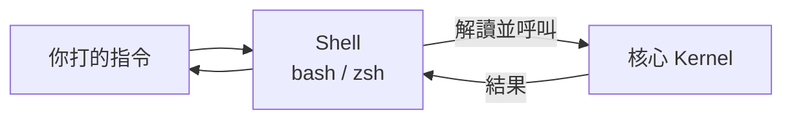
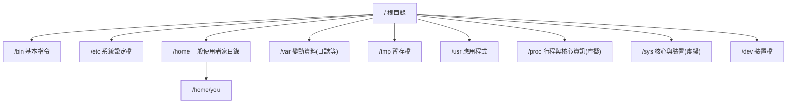
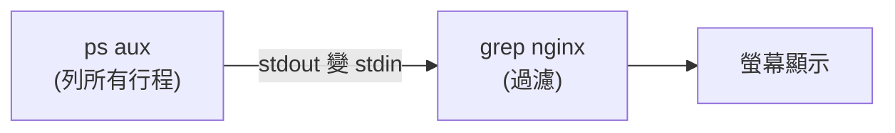

# Linux 基礎 1:Shell、檔案系統與常用指令

> 目標:讓你在 Linux 終端機裡「住得舒服」。這是後面一切的操作基礎 —— `kubectl`、`docker`、`aws` 全都在 Shell 裡跑。

---

## 1. Shell 是什麼?

**Shell(殼層)** 是你和核心 (Kernel) 之間的翻譯官。你打字下指令,Shell 解讀後請核心執行,再把結果顯示給你。



最常見的 Shell 是 **bash**(Bourne Again Shell),較新的系統預設可能是 **zsh**。指令用法大同小異。

```bash
echo $SHELL    # 看你現在用哪個 shell,例如 /bin/bash
echo $0        # 同上,當前 shell
```

> 💡 **提示字元 (Prompt)**:`$` 代表一般使用者,`#` 代表 root(超級使用者)。看到 `#` 就要小心,你有最高權限。

---

## 2. 檔案系統階層 (Filesystem Hierarchy)

Linux 的檔案系統是一棵**從根目錄 `/` 開始的樹**,沒有 Windows 的 `C:`、`D:` 槽概念。所有東西(包含硬碟、USB)都「掛載 (mount)」到這棵樹的某個位置。



| 目錄 | 用途 | 跟 K8s/容器的關聯 |
|------|------|-------------------|
| `/etc` | 設定檔(設定都放這) | 容器映像檔裡也有 `/etc`;K8s 的 ConfigMap 常掛載到這 |
| `/var` | 變動資料,如 `/var/log` 日誌 | 容器日誌、容器執行時資料 (`/var/lib/docker`) |
| `/proc` | **虛擬檔案系統**,每個行程的資訊在這 | 理解命名空間時超重要(見第 4 章) |
| `/sys` | **虛擬檔案系統**,核心與 cgroup 資訊 | cgroup 限制就寫在 `/sys/fs/cgroup` |
| `/dev` | 裝置檔(磁碟、終端機…) | 「一切皆檔案」的體現 |
| `/tmp` | 暫存,重開機通常清空 | — |

> 🔑 `/proc` 和 `/sys` 不是真的存在磁碟上的檔案,而是核心「即時生成」的視窗。你 `cat` 它們時,看到的是核心當下的狀態。這對理解容器原理非常關鍵。

### 絕對路徑 vs 相對路徑

```bash
/home/you/notes.txt    # 絕對路徑:從根目錄 / 開始,永遠明確
notes.txt              # 相對路徑:相對於「目前所在目錄」
../config              # .. 代表上一層目錄
./script.sh            # . 代表目前目錄
~                      # 代表你的家目錄 /home/you
```

---

## 3. 必學的核心指令

### 移動與查看

```bash
pwd                 # print working directory:我現在在哪
ls                  # 列出目前目錄內容
ls -l               # 詳細列表(權限、擁有者、大小、時間)
ls -la              # 連隱藏檔(. 開頭)一起列
ls -lh              # 大小用人類易讀格式(K/M/G)
cd /etc             # 切換到 /etc
cd ~                # 回家目錄
cd -                # 回到上一個目錄
tree                # 樹狀顯示(可能需 apt install tree)
```

### 檔案與目錄操作

```bash
mkdir myproject              # 建目錄
mkdir -p a/b/c               # -p:連同中間層一起建
touch file.txt               # 建空檔(或更新時間戳)
cp source.txt dest.txt       # 複製檔案
cp -r dir1 dir2              # -r:遞迴複製整個目錄
mv old.txt new.txt           # 移動或改名
rm file.txt                  # 刪檔
rm -r dir/                   # 刪目錄(遞迴)
rm -rf dir/                  # 強制遞迴刪(⚠️ 危險,不會問你)
```

> ⚠️ **`rm -rf` 沒有資源回收桶。** 刪掉就沒了。特別小心 `rm -rf /` 或變數沒設好時的 `rm -rf $VAR/`。

### 看檔案內容

```bash
cat file.txt          # 整個印出來
less file.txt         # 分頁瀏覽(q 離開,/ 搜尋,上下鍵捲動)
head -n 20 file.txt   # 前 20 行
tail -n 20 file.txt   # 後 20 行
tail -f app.log       # -f:持續追蹤新增內容(看即時日誌神器)
wc -l file.txt        # 算行數
```

> 💡 `tail -f` 你之後會在看容器日誌時天天用到(`kubectl logs -f` 就是這個概念)。

---

## 4. 搜尋:find 與 grep(超重要)

### grep:在內容裡找文字

```bash
grep "error" app.log              # 找含 error 的行
grep -i "error" app.log           # -i:不分大小寫
grep -r "TODO" ./src              # -r:遞迴搜整個目錄
grep -n "error" app.log           # -n:顯示行號
grep -v "debug" app.log           # -v:反向,排除含 debug 的行
grep -c "error" app.log           # -c:只算數量
```

### find:依條件找檔案

```bash
find . -name "*.yaml"             # 在目前目錄(含子目錄)找所有 .yaml
find /etc -name "*.conf"          # 找設定檔
find . -type d -name "logs"       # -type d:只找目錄
find . -mtime -1                  # 最近 1 天內修改過的
find . -size +100M                # 大於 100MB 的檔案
```

---

## 5. I/O 重導向與管線(Linux 哲學的精華)

這是 Linux 最強大的概念之一,務必搞懂。每個行程預設有三個資料流:

| 名稱 | 代號 | 說明 |
|------|------|------|
| 標準輸入 (stdin) | `0` | 預設來自鍵盤 |
| 標準輸出 (stdout) | `1` | 預設印到螢幕 |
| 標準錯誤 (stderr) | `2` | 錯誤訊息,預設也印到螢幕,但與 stdout 分流 |

### 重導向 (Redirection)

```bash
echo "hello" > file.txt      # > 把 stdout 寫入檔案(覆蓋)
echo "world" >> file.txt     # >> 附加到檔案結尾(不覆蓋)
command < input.txt          # < 把檔案當 stdin 餵進去
command 2> error.log         # 2> 把 stderr 導到檔案
command > out.log 2>&1        # stdout 和 stderr 都導到 out.log
command > /dev/null 2>&1      # 丟棄所有輸出(/dev/null 是黑洞)
```

### 管線 (Pipe) `|`:把上一個指令的輸出,當作下一個的輸入

```bash
# 找出 nginx 相關的行程
ps aux | grep nginx

# 算出目前有幾個 .yaml 檔
ls *.yaml | wc -l

# 看日誌裡 error 出現最多的前 10 種
grep "error" app.log | sort | uniq -c | sort -rn | head -10
```



> 🔑 **Linux 哲學**:每個工具只做好一件事,再用管線把它們串起來組合出強大功能。這個「組合小工具」的思維,你在 K8s 排錯時會反覆用到(`kubectl get pods | grep ...`)。

### 常搭配管線的工具

```bash
sort            # 排序
uniq -c         # 去除重複並計數(需先 sort)
cut -d: -f1     # 以 : 分隔,取第 1 欄(例如解析 /etc/passwd)
awk '{print $1}'  # 取第 1 欄(更強大的文字處理)
sed 's/old/new/g' # 文字取代
xargs           # 把 stdin 變成下一個指令的參數
```

---

## 6. 環境變數 (Environment Variables)

環境變數是「行程執行時帶在身上的設定」。容器與 K8s 大量用環境變數傳設定。

```bash
echo $HOME            # 顯示某個變數
echo $PATH            # PATH:系統去哪些目錄找可執行檔
export MY_VAR="hello" # 設定環境變數(子行程會繼承)
env                   # 列出所有環境變數
MY_VAR=hi command     # 只在這次執行時設定變數
```

> 💡 **`PATH` 很重要**:當你打 `kubectl`,系統會依序在 `$PATH` 列出的目錄裡找這個執行檔。找不到就會說 `command not found`。

---

## 7. 取得說明

```bash
man ls          # 完整手冊(q 離開)
ls --help       # 快速說明
tldr ls         # 簡明範例(需安裝 tldr,推薦)
which kubectl   # 這個指令的執行檔在哪
type cd         # 這是指令、別名還是 shell 內建?
```

---

## 動手練習

1. **檔案系統探索**:用 `cd`、`ls -la`、`pwd` 逛一圈 `/`、`/etc`、`/var/log`、`/proc`。打開 `/proc/cpuinfo` 和 `/proc/meminfo` 看看(`cat`),這些是核心即時生成的。
2. **建立練習區**:`mkdir -p ~/linux-practice/{a,b,c}`,在裡面建幾個檔案,練習 `cp`、`mv`、`rm`。
3. **管線挑戰**:用一行指令,找出 `/etc/passwd` 裡所有使用者名稱(提示:`cut -d: -f1 /etc/passwd`),並用 `wc -l` 數出系統有幾個使用者。
4. **日誌過濾**:`dmesg`(核心訊息)用管線接 `grep` 和 `tail`,找出最近的訊息。
5. **重導向練習**:把 `ls -la /etc` 的結果存到 `~/etc-list.txt`,再用 `wc -l` 數有幾行。把一個會出錯的指令(如 `ls /not-exist`)的錯誤訊息導到 `error.log`。

---

## 本節檢核點

- [ ] 能說出 `/etc`、`/var`、`/proc`、`/sys`、`/dev` 各放什麼。
- [ ] 理解 `/proc` 與 `/sys` 是核心即時生成的虛擬檔案系統。
- [ ] 熟練 `cd`、`ls`、`cp`、`mv`、`rm`、`mkdir`、`cat`、`less`、`tail -f`。
- [ ] 會用 `grep` 與 `find` 搜尋內容與檔案。
- [ ] 理解 stdin/stdout/stderr 與 `>`、`>>`、`2>`、`2>&1`、`|` 的用法。
- [ ] 能用管線把多個指令組合起來解決問題。
- [ ] 理解環境變數與 `$PATH` 的作用。

➡️ 下一節:[行程管理](./02-process-management.md)
