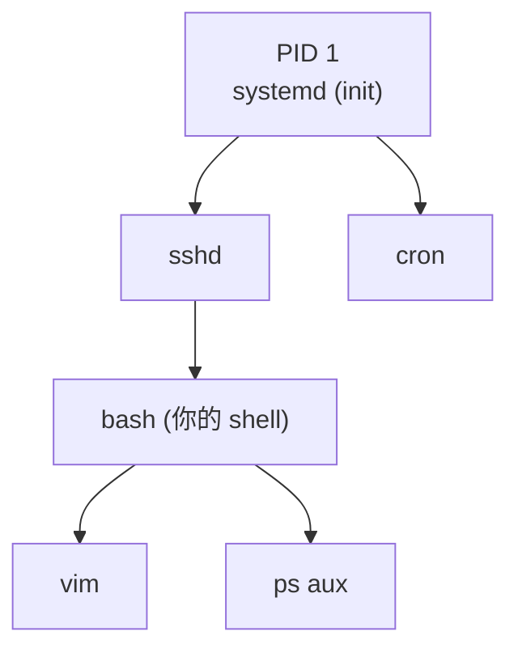

# Linux 基礎 2:行程 (Process) 管理

> 目標:徹底理解「行程」。**這是理解容器最關鍵的一塊** —— 因為容器本質上就是「一個或一群被特殊隔離的行程」。

---

## 1. 什麼是行程 (Process)?

**程式 (Program)** 是躺在磁碟上的一個檔案(例如 `/usr/bin/nginx`)。
**行程 (Process)** 是這個程式被載入記憶體、**正在執行**的一個實例。

> 比喻:食譜是「程式」,你照著食譜實際在廚房做菜的這次行動是「行程」。同一份食譜可以同時有很多人各自在做(同一個程式可以有很多行程)。

每個行程都有:

| 屬性 | 說明 |
|------|------|
| **PID** (Process ID) | 行程的唯一編號 |
| **PPID** (Parent PID) | 父行程的 PID(行程是由其他行程「生」出來的) |
| **UID/GID** | 以哪個使用者/群組身分執行(決定權限) |
| 狀態 | 執行中 (R)、睡眠 (S)、停止 (T)、殭屍 (Z) 等 |
| 環境變數、開啟的檔案、記憶體空間… | 各自獨立 |

---

## 2. 行程樹:一切始於 PID 1

Linux 開機後,核心啟動的**第一個行程 PID 1**(現代系統通常是 `systemd`)。之後所有行程都是它的子孫,形成一棵樹。



```bash
pstree           # 用樹狀圖看所有行程
pstree -p        # 連 PID 一起顯示
```

> 🔑 **這個 PID 1 觀念對容器超級重要!** 在一個容器裡,你的主程式(例如 nginx)會變成那個容器內的 **PID 1**。容器內看到的行程,跟主機看到的是「不同的視角」—— 這正是命名空間 (Namespace) 的魔法(第 4 章詳述)。

---

## 3. 查看行程:ps、top、htop

### ps:某一瞬間的快照

```bash
ps aux            # 最常用:列出所有使用者的所有行程
ps aux | grep nginx   # 找特定行程
ps -ef            # 另一種常見格式(顯示 PPID)
ps -ef --forest   # 用樹狀顯示父子關係
```

`ps aux` 的欄位解讀:

| 欄位 | 意義 |
|------|------|
| USER | 哪個使用者跑的 |
| PID | 行程編號 |
| %CPU / %MEM | CPU 與記憶體使用率 |
| VSZ / RSS | 虛擬 / 實際記憶體用量 |
| STAT | 狀態(R 執行、S 睡眠、Z 殭屍…) |
| START | 啟動時間 |
| COMMAND | 執行的指令 |

### top / htop:即時動態監控

```bash
top              # 即時刷新的行程監控(q 離開)
htop             # 更友善的彩色版(需安裝,強烈推薦)
```

> 💡 看一台機器「忙不忙」,先看 top 的 **load average**(負載平均)與 CPU/記憶體使用率。之後排查 K8s 節點問題時也是同樣思路。

---

## 4. 前景、背景與作業控制

```bash
sleep 100              # 前景執行,佔住終端機
sleep 100 &            # 加 & 丟到背景執行
jobs                   # 看目前 shell 的背景作業
fg %1                  # 把背景作業 1 拉回前景
bg %1                  # 讓停住的作業在背景繼續
# Ctrl + Z             # 把前景行程「暫停」並丟到背景
# Ctrl + C             # 送出中斷訊號,通常會終止前景行程
```

`nohup` 與 `&` 讓行程在你登出後繼續跑:

```bash
nohup ./long-task.sh > out.log 2>&1 &   # 登出也不會被殺掉
```

---

## 5. 訊號 (Signal):與行程溝通的方式

**訊號**是核心或其他行程「通知」某個行程的機制。你按 `Ctrl+C` 其實就是送了一個訊號。

| 訊號 | 編號 | 意義 | 能否被忽略/攔截 |
|------|------|------|------|
| `SIGTERM` | 15 | **禮貌地請你結束**(預設) | 可以,程式可做收尾(優雅關閉) |
| `SIGKILL` | 9 | **強制立刻砍掉** | ❌ 不能被攔截,核心直接終結 |
| `SIGINT` | 2 | 中斷(你按 Ctrl+C) | 可以 |
| `SIGHUP` | 1 | 終端機關閉 / 請重載設定 | 可以 |
| `SIGSTOP` | 19 | 暫停(你按 Ctrl+Z) | ❌ 不能被攔截 |

```bash
kill 1234            # 預設送 SIGTERM(15),請 PID 1234 優雅結束
kill -9 1234         # 送 SIGKILL,強制砍掉(最後手段)
kill -SIGTERM 1234   # 明確指定訊號
killall nginx        # 依名稱砍掉所有 nginx 行程
pkill -f "my-script" # 依指令內容比對來砍
```

> 🔑 **這跟 K8s 關係很大!** 當 K8s 要關閉一個 Pod 時,它會先送 **SIGTERM** 給容器(給它時間優雅關閉,例如把連線處理完、存檔),等待一段寬限期 (`terminationGracePeriodSeconds`,預設 30 秒)後,若還沒結束才送 **SIGKILL** 強制終止。理解 SIGTERM/SIGKILL,你就懂了 Pod 的「優雅關閉 (Graceful Shutdown)」。

---

## 6. /proc:行程的真實面貌

每個行程在 `/proc/<PID>/` 下都有一個「資料夾」,裡面是核心即時生成的行程資訊。

```bash
ls /proc/1/             # PID 1 的所有資訊
cat /proc/1/status      # 狀態、記憶體、UID...
cat /proc/1/cmdline     # 啟動指令
ls -l /proc/1/fd/       # 它開啟的所有檔案描述符
ls -l /proc/1/ns/       # ⭐ 它所屬的命名空間!(第 4 章關鍵)
cat /proc/1/cgroup      # ⭐ 它所屬的 cgroup!(資源限制)
```

> 🔑 **先記住這兩行**:`/proc/<PID>/ns/` 和 `/proc/<PID>/cgroup`。
> 容器的隔離 (namespace) 與限制 (cgroup),全都能在這裡「看到證據」。第 4 章我們會用它親手驗證「容器就是行程」。

---

## 7. 資源觀察

```bash
free -h          # 記憶體使用情況(人類易讀)
df -h            # 磁碟空間使用情況
du -sh ./*       # 目前目錄下各項目佔多少空間
uptime           # 系統運行多久 + 負載平均
vmstat 1         # 每秒刷新的系統資源統計
```

---

## 動手練習

1. **看行程樹**:執行 `pstree -p`,找出 PID 1 是誰。再開一個新的 shell,用 `ps -ef --forest` 觀察你的 bash 與其子行程的父子關係。
2. **背景作業**:執行 `sleep 300 &`,用 `jobs` 和 `ps aux | grep sleep` 觀察它。再用 `kill` 把它結束掉。
3. **體驗訊號差異**:
   ```bash
   sleep 1000 &           # 背景執行,記下它的 PID
   kill <PID>             # 送 SIGTERM,觀察它消失
   sleep 1000 &
   kill -9 <PID>          # 送 SIGKILL,比較差別
   ```
4. **探索 /proc**:挑一個正在跑的行程(例如你的 shell,`echo $$` 可看自己的 PID),`cat /proc/$$/status`、`ls -l /proc/$$/ns/`,看看它屬於哪些命名空間(先有印象,第 4 章會深入)。
5. **監控**:開 `htop`(或 `top`),找出最吃 CPU 和記憶體的行程。

---

## 本節檢核點

- [ ] 能用自己的話分辨「程式」與「行程」。
- [ ] 理解 PID / PPID 與行程樹,知道 PID 1 是 init(systemd)。
- [ ] **理解「容器內的主程式是該容器的 PID 1」這個伏筆。**
- [ ] 會用 `ps aux`、`top`/`htop` 查看與監控行程。
- [ ] 理解前景/背景、`&`、`Ctrl+C`、`Ctrl+Z`、`jobs`、`fg`/`bg`。
- [ ] **能清楚說明 SIGTERM vs SIGKILL 的差別,並連結到 K8s 的優雅關閉。**
- [ ] 知道 `/proc/<PID>/ns/` 與 `/proc/<PID>/cgroup` 的存在與意義。

➡️ 下一節:[使用者與權限](./03-users-permissions.md)
