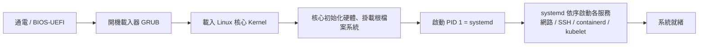

# Linux 基礎 5:服務管理 (systemd)、日誌與套件

> 目標:會管理背景服務、看系統日誌、安裝軟體。這些是維運 K8s 節點與排錯的日常技能。

---

## 1. systemd:現代 Linux 的「總管」

還記得 PID 1 嗎?在大多數現代發行版(Ubuntu、Debian、RHEL),PID 1 就是 **systemd**。它負責:

- 開機後**啟動所有系統服務**(網路、SSH、Docker、kubelet…)
- **管理服務的生命週期**(啟動、停止、重啟、開機自動啟動)
- 收集**日誌**(透過 journald)

> 🔑 **與 K8s 的連結**:在 EKS 或自建叢集的節點上,**`kubelet`(K8s 在每個節點上的代理人)和 `containerd`(容器執行時)都是被 systemd 管理的服務**。節點出問題時,你常常要 `systemctl status kubelet`、`journalctl -u kubelet` 來排查。所以這節是真實維運技能。

### systemctl:管理服務的指令

```bash
systemctl status nginx        # 看服務狀態(running? 失敗?最近日誌)
sudo systemctl start nginx    # 啟動
sudo systemctl stop nginx     # 停止
sudo systemctl restart nginx  # 重啟
sudo systemctl reload nginx   # 重載設定(不中斷服務,若支援)
sudo systemctl enable nginx   # 設定開機自動啟動
sudo systemctl disable nginx  # 取消開機啟動
systemctl is-active nginx     # 只問:現在在跑嗎?
systemctl list-units --type=service   # 列出所有服務
```

`systemctl status` 的輸出解讀:

```
● nginx.service - A high performance web server
     Loaded: loaded (/lib/systemd/system/nginx.service; enabled; ...)   ← enabled = 開機會啟動
     Active: active (running) since ...                                  ← 現在的狀態
   Main PID: 1234 (nginx)                                                ← 主行程 PID
        ...最近幾行日誌...
```

> 💡 排錯口訣:服務不正常,先 `systemctl status <服務>` 看狀態與最後幾行日誌,再 `journalctl -u <服務>` 看完整日誌。

---

## 2. 日誌:journalctl 與 /var/log

### journalctl:查 systemd 收集的日誌

```bash
journalctl                       # 所有日誌(q 離開)
journalctl -u kubelet            # 只看 kubelet 這個服務的日誌 ⭐
journalctl -u kubelet -f         # -f:即時追蹤(像 tail -f)
journalctl -u docker --since "10 min ago"   # 最近 10 分鐘
journalctl -p err                # 只看錯誤等級以上
journalctl -b                    # 這次開機以來的日誌
journalctl --since "2026-06-24 10:00" --until "2026-06-24 11:00"
```

### 傳統日誌檔:/var/log

不是所有東西都走 journald,很多服務仍寫到 `/var/log`:

```bash
ls /var/log/
tail -f /var/log/syslog          # 系統綜合日誌(Debian/Ubuntu)
sudo tail -f /var/log/auth.log   # 登入/sudo 紀錄
dmesg                            # 核心訊息(OOM Kill、硬體、網路)
dmesg -w                         # 持續追蹤核心訊息
```

> 🔑 **與容器/K8s 的連結**:
> - 容器的標準輸出 (stdout/stderr) 會被收集成日誌 —— 這正是 `docker logs` 和 `kubectl logs` 的來源。
> - 節點記憶體爆掉時,`dmesg` 會看到 `Out of memory: Killed process ...`,對應到 K8s 的 **OOMKilled**。
> - 在 K8s,集中式日誌通常交給 Fluent Bit / Loki / CloudWatch 等,但底層收集的就是這些。

---

## 3. 套件管理 (Package Management)

不同發行版用不同的套件管理器:

| 發行版家族 | 套件管理器 | 安裝指令範例 |
|------------|-----------|--------------|
| Debian / Ubuntu | `apt` (.deb) | `sudo apt install nginx` |
| RHEL / Fedora / Amazon Linux | `dnf` / `yum` (.rpm) | `sudo dnf install nginx` |
| Alpine(容器常用) | `apk` | `apk add nginx` |

> 💡 **Alpine 與容器**:很多容器映像檔基於 **Alpine Linux**,因為它非常小(約 5MB)。所以你寫 Dockerfile 時常會看到 `apk add`。知道這點有助於看懂別人的 Dockerfile。

### apt 常用指令(Ubuntu/Debian)

```bash
sudo apt update                  # 更新「可安裝清單」(不是升級軟體)
sudo apt upgrade                 # 升級已安裝的軟體
sudo apt install <套件>          # 安裝
sudo apt remove <套件>           # 移除
sudo apt search <關鍵字>         # 搜尋
apt list --installed             # 已安裝清單
dpkg -L <套件>                   # 這個套件裝了哪些檔案
```

> ⚠️ `apt update` 和 `apt upgrade` 是兩件事:`update` 只更新「目錄/清單」,`upgrade` 才真的升級軟體。容易搞混。

---

## 4. 開機流程(觀念概覽)

知道機器從通電到能用,中間發生什麼,有助於排查「節點起不來」的問題:



> 在 EKS 的節點上,這個流程的最後一步就是 kubelet 啟動、向 K8s control plane 註冊自己,節點才會在 `kubectl get nodes` 變成 `Ready`。

---

## 5. 其他實用維運指令

```bash
# 系統資訊
uname -r                 # 核心版本(eBPF 很在意這個!)
hostnamectl              # 主機名與系統資訊
date / timedatectl       # 時間與時區
uptime                   # 開機多久、負載

# 網路(詳見 03-networking 章節)
ip addr                  # 看網路介面與 IP
ss -tlnp                 # 看哪些連接埠在監聽

# 磁碟與掛載
df -h                    # 磁碟空間
lsblk                    # 區塊裝置(硬碟、分割區)
mount                    # 目前掛載
```

---

## 動手練習

1. **管理一個服務**:安裝並操作一個服務(例如 `sudo apt install nginx`),依序執行 `systemctl status`、`start`、`stop`、`enable`、`disable`,觀察狀態變化。用瀏覽器或 `curl localhost` 確認 nginx 有沒有在跑。
2. **看服務日誌**:`journalctl -u nginx -f`,另開一個終端機 `curl localhost`,觀察日誌即時跳出來。
3. **核心訊息**:執行 `dmesg | tail -20`,看看你的核心最近說了什麼。記下你的核心版本 `uname -r`(eBPF 章節要用)。
4. **套件探索**:用 `apt search` 找一個工具(例如 `htop`),裝起來,再用 `dpkg -L htop` 看它裝了哪些檔案。
5. **連結 K8s(思考)**:如果某台 K8s 節點變成 `NotReady`,你會先用哪兩個指令排查?(提示:`systemctl status kubelet`、`journalctl -u kubelet`。)

---

## 本節檢核點

- [ ] 理解 systemd 是 PID 1,負責啟動與管理所有服務。
- [ ] 熟練 `systemctl status/start/stop/restart/enable`。
- [ ] **知道 kubelet、containerd 在節點上是 systemd 服務**,會用 `journalctl -u <服務>` 排查。
- [ ] 會用 `journalctl` 與 `/var/log`、`dmesg` 看日誌。
- [ ] 理解 `dmesg` 的 OOM 訊息對應 K8s 的 OOMKilled。
- [ ] 知道 apt / dnf / apk 的差異,理解 Alpine 為何常用於容器。
- [ ] 對開機流程有概觀,知道節點 `Ready` 的最後一步是 kubelet 註冊。

---

🎉 **恭喜!你完成了 Linux 基礎章節。**

你現在應該能用一句話回答「容器是什麼」、看懂行程與權限、會管理服務與日誌。這些是學 K8s、EKS、eBPF 最重要的地基。

➡️ 回到 [Linux 基礎總覽](./README.md) 檢視總檢核點,或前往 [容器與 Docker](../02-container-docker/)。
