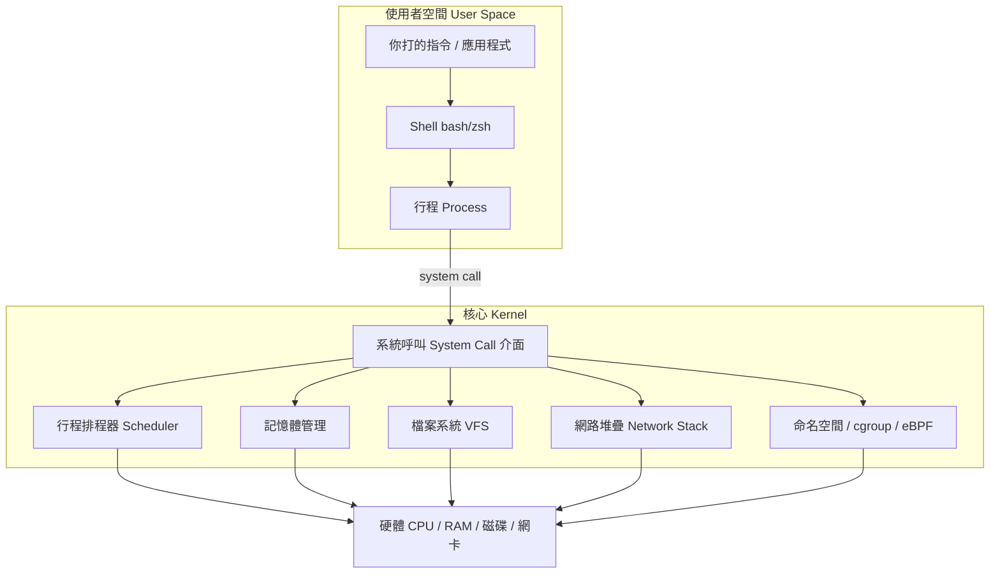

# Linux 基礎(學習計畫的地基)

> **為什麼 Linux 是地基中的地基?**
>
> - **容器 (Container)** 不是輕量級虛擬機,而是「**被 Linux 核心隔離起來的一個普通行程 (Process)**」。隔離靠的是 Linux 的命名空間 (Namespace) 與控制群組 (cgroup)。
> - **Kubernetes** 排程、調度、限制的對象,本質上就是這些行程與它們的資源。
> - **eBPF** 更是直接在 **Linux 核心 (Kernel)** 裡執行程式。
>
> 所以:**你對 Linux 理解多深,決定了你對 K8s 與 eBPF 能理解多深。** 這一章請務必紮實地讀完並動手做。

---

## 這一章怎麼讀?

這一章拆成幾個檔案,建議**照順序**讀。前三個是「會用 Linux」,第四個(命名空間與 cgroup)是「理解容器原理」的關鍵,務必讀懂。

| # | 檔案 | 主題 | 重要性 |
|---|------|------|--------|
| 1 | [`01-shell-filesystem.md`](./01-shell-filesystem.md) | Shell、檔案系統、常用指令、I/O 重導向與管線 | ⭐⭐⭐ |
| 2 | [`02-process-management.md`](./02-process-management.md) | 行程 (Process)、訊號 (Signal)、前景/背景、`/proc` | ⭐⭐⭐ |
| 3 | [`03-users-permissions.md`](./03-users-permissions.md) | 使用者、群組、檔案權限、`sudo`、特殊權限 | ⭐⭐⭐ |
| 4 | [`04-namespaces-cgroups.md`](./04-namespaces-cgroups.md) | **命名空間 (Namespace) 與控制群組 (cgroup) —— 容器的真正原理** | ⭐⭐⭐⭐⭐ |
| 5 | [`05-systemd-logs-package.md`](./05-systemd-logs-package.md) | 服務管理 (systemd)、日誌、套件管理、開機流程 | ⭐⭐ |

> 第 4 章是這整章的**靈魂**。讀完它,你會徹底搞懂「容器到底是什麼」,之後學 Docker 和 K8s 會有種「原來如此」的通透感。

---

## 心智模型:Linux 是什麼?

在開始之前,先建立一張全局地圖。一個 Linux 系統可以這樣理解:



**幾個關鍵觀念,先有印象,後面章節會展開:**

| 概念 | 一句話說明 |
|------|-----------|
| 核心 (Kernel) | 作業系統的核心,管理硬體、行程、記憶體、檔案、網路。你的程式不能直接碰硬體。 |
| 使用者空間 (User Space) | 你的程式跑的地方。要用硬體資源,得「拜託」核心。 |
| 系統呼叫 (System Call) | 使用者空間請求核心服務的唯一窗口(例如開檔、建立行程、收送網路封包)。 |
| 行程 (Process) | 一個正在執行的程式實例。容器本質上就是一群被隔離的行程。 |
| 一切皆檔案 (Everything is a file) | 在 Linux 裡,裝置、行程資訊、網路設定…大多透過「檔案」這個統一介面操作。 |

> 🔑 **記住這條線**:你的應用程式 → 透過**系統呼叫**請求 → **核心**幫你做事。
> Docker 用核心功能把行程「關進小房間」(命名空間)、「限制食量」(cgroup);eBPF 則是在核心這條路上「裝監視器或攔截器」。整個雲原生世界都建立在這條線上。

---

## 環境準備

你需要一個可以動手的 Linux 環境,任選其一:

| 選項 | 適合對象 | 說明 |
|------|----------|------|
| **原生 Linux**(Ubuntu/Fedora) | 已有 Linux 機器 | 最直接。 |
| **WSL2**(Windows) | Windows 使用者 | `wsl --install`,體驗接近原生,推薦。 |
| **虛擬機 (VM)** | Mac/Windows | VirtualBox / UTM 裝一台 Ubuntu。 |
| **雲端機器** | 想練雲端 | AWS EC2 開一台 t3.micro(注意成本)。 |

> ⚠️ **注意**:macOS 的終端機雖然也是 Unix,但**不是 Linux**,命名空間 / cgroup / eBPF 這些核心功能都沒有。學這章請務必用**真正的 Linux**(WSL2 或 VM 都可以)。

驗證你在 Linux 上:

```bash
uname -a          # 印出核心資訊,應看到 "Linux"
cat /etc/os-release   # 看發行版(Ubuntu / Debian / Fedora...)
```

---

## 本章總檢核點

讀完整個 Linux 基礎章節,你應該要能:

- [ ] 自在地用 Shell 操作檔案、目錄,理解絕對/相對路徑與檔案系統階層。
- [ ] 熟練使用管線 (`|`) 與 I/O 重導向 (`>`, `>>`, `<`, `2>`) 組合指令。
- [ ] 查看、過濾、終止行程,理解訊號 (Signal) 與 `kill` 的意義。
- [ ] 看懂並修改檔案權限 (`rwx`)、擁有者與群組,理解 `sudo` 的角色。
- [ ] **用自己的話解釋「容器就是被命名空間隔離 + 被 cgroup 限制資源的行程」**,並能用 `unshare` / `nsenter` 手動體驗。
- [ ] 用 `systemctl` 管理服務、用 `journalctl` 看日誌。

全部打勾後,就可以前往 [容器與 Docker](../02-container-docker/) —— 屆時你會發現 Docker 做的事,你大致都已經懂原理了。
