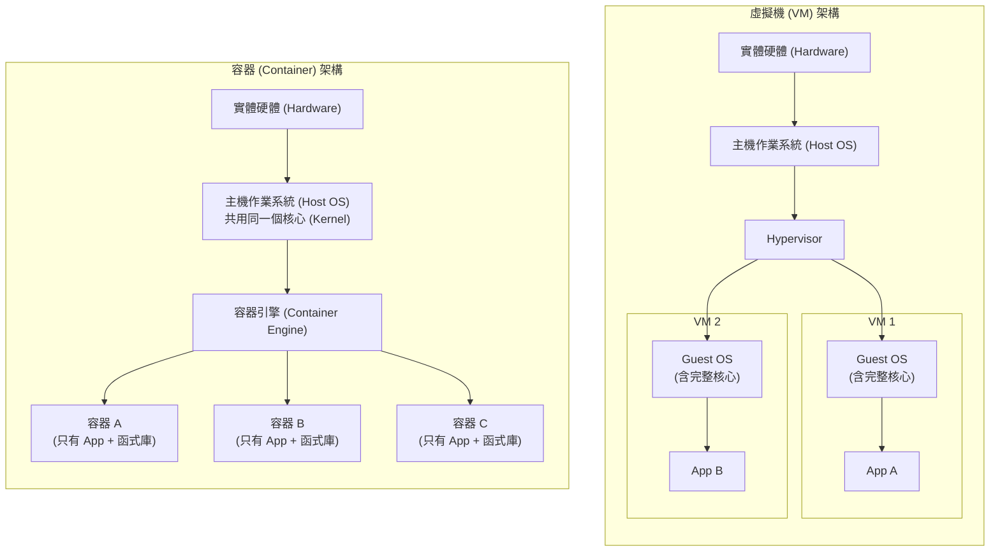
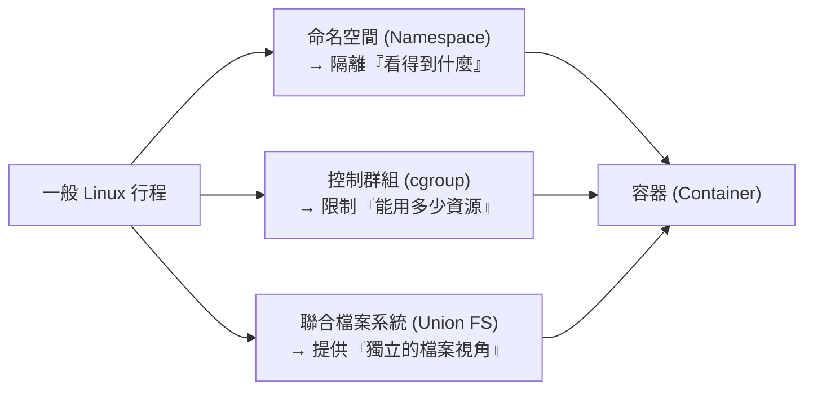
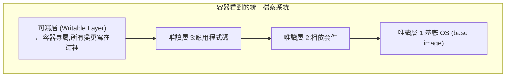
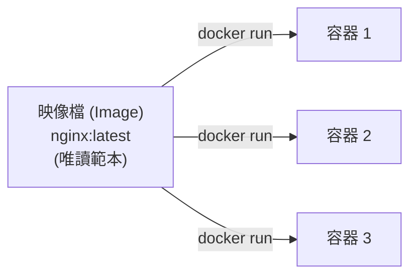
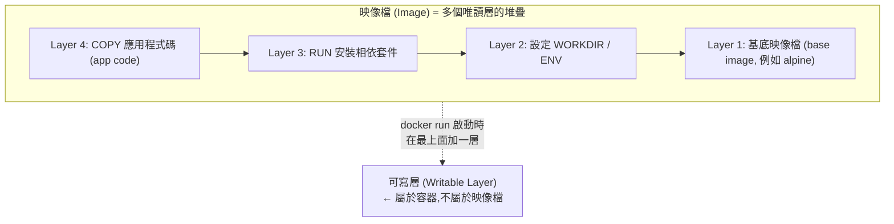
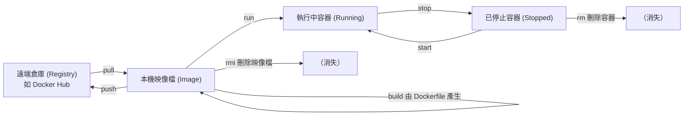
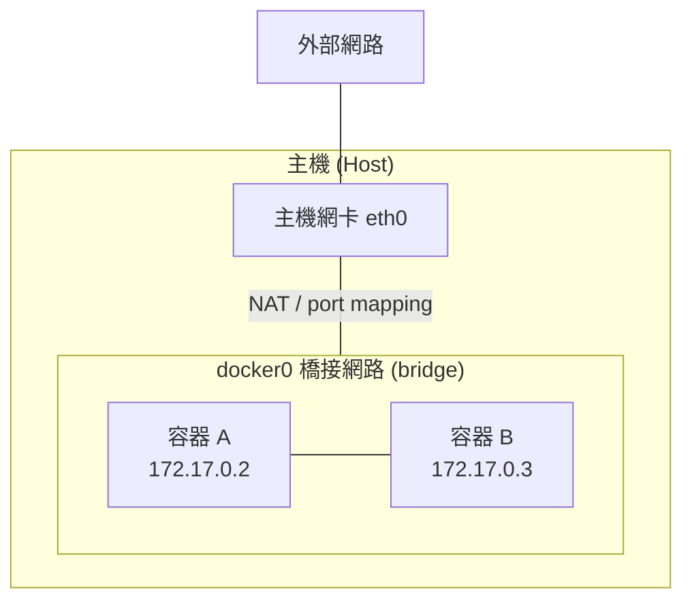
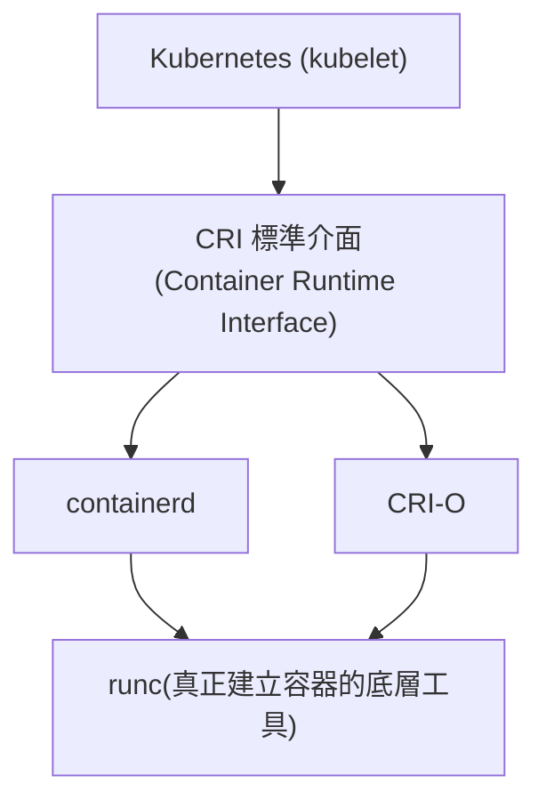
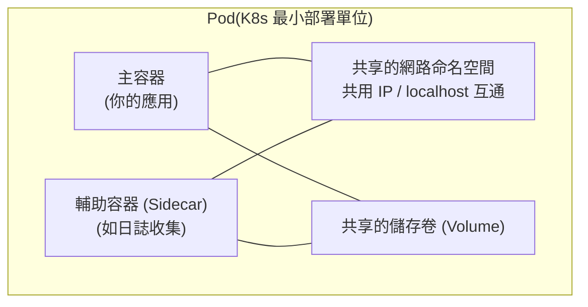

# 容器與 Docker 基礎

> 本章定位:這是學習 Kubernetes 前的**前置基礎**。我們的目標不是背指令,而是建立正確的心智模型 (Mental Model)——先把「容器到底是什麼」想清楚,後面學 K8s、CRI、甚至 eBPF 才不會卡住。

---

## 目錄

1. [為什麼需要容器](#1-為什麼需要容器)
2. [容器的底層原理](#2-容器的底層原理)
3. [映像檔 vs 容器](#3-映像檔-image-vs-容器-container)
4. [Docker 核心指令](#4-docker-核心指令)
5. [Dockerfile](#5-dockerfile)
6. [容器網路](#6-容器網路-container-networking)
7. [資料持久化](#7-資料持久化)
8. [Docker Compose 簡介](#8-docker-compose-簡介)
9. [與 Kubernetes 的銜接](#9-與-kubernetes-的銜接)

---

## 1. 為什麼需要容器

### 1.1 「在我電腦上可以跑」這個經典問題

幾乎每位工程師都遇過這樣的對話:

> 開發者:「奇怪,這個功能在我電腦上明明跑得好好的啊。」
> 維運人員:「但部署到正式環境就壞了,你的環境跟伺服器不一樣。」

問題的根源在於**環境差異 (Environment Drift)**。一個應用程式 (Application) 要正常執行,通常依賴一大堆「環境條件」:

- 程式語言的執行時 (Runtime) 版本(例如 Node.js 18 vs 20、Python 3.9 vs 3.12)
- 系統函式庫 (System Library)(例如 `glibc`、`openssl` 的版本)
- 環境變數 (Environment Variable)、設定檔 (Config File)
- 作業系統 (OS) 本身的差異

只要其中一項在「開發機」和「正式機」不一致,程式就可能爆掉。傳統解法是寫一份冗長的「部署文件」,要維運人員手動把環境調整成一模一樣——這既容易出錯,又難以重現。

**容器 (Container) 的核心價值,就是把「應用程式」連同它「執行所需的完整環境」打包成一個可攜帶 (Portable) 的單位。** 一次打包,到處執行 (Build once, run anywhere)。打包後的成品就是**映像檔 (Image)**,它在你的筆電、同事的桌機、雲端伺服器上,跑起來的內容完全一致。

### 1.2 虛擬機 (VM) vs 容器 (Container)

在容器流行之前,解決環境隔離問題的主流方案是**虛擬機 (Virtual Machine, VM)**。要理解容器的價值,必須先看懂它跟 VM 的差別。

**虛擬機 (VM)** 的做法是:透過一層 **Hypervisor**(例如 VMware、KVM、Hyper-V),在實體硬體之上虛擬出一整套「假的硬體」,然後在上面安裝一個**完整的客體作業系統 (Guest OS)**。每台 VM 都有自己的核心 (Kernel)。

**容器 (Container)** 的做法是:**所有容器共用主機 (Host) 的同一個 Linux 核心 (Kernel)**,只是透過核心提供的隔離機制,讓每個容器「以為」自己獨佔整個系統。容器內**沒有自己的核心**。



兩者的關鍵差異整理如下:

| 比較項目 | 虛擬機 (VM) | 容器 (Container) |
| --- | --- | --- |
| 隔離層級 | 硬體層虛擬化 | 作業系統層虛擬化 |
| 核心 (Kernel) | 每台 VM 有獨立核心 | 共用主機核心,容器內無核心 |
| 啟動時間 | 數十秒到數分鐘 | 毫秒到數秒 |
| 體積大小 | 數 GB(含整套 OS) | 數 MB 到數百 MB |
| 資源開銷 | 高(要跑完整 Guest OS) | 低(只跑應用程式行程) |
| 隔離強度 | 強(硬體級隔離) | 較弱(共用核心,靠核心機制隔離) |
| 密度 (Density) | 一台主機跑數台到數十台 | 一台主機可跑數百個 |

### 1.3 一句話結論

VM 虛擬化的是「硬體」,容器虛擬化的是「作業系統」。容器之所以又快又輕,正是因為它**省掉了 Guest OS 這一整層**——但代價是隔離強度不如 VM,而且容器只能跑與主機核心相容的系統(在 Linux 主機上只能跑 Linux 容器)。

> 補充:在 macOS / Windows 上使用 Docker,其實底層偷偷跑了一台 Linux VM,容器再跑在那台 VM 裡。所以「容器共用主機核心」這句話,嚴格來說是「共用那台 Linux VM 的核心」。

### 動手練習

1. 回想你過去遇過的一次「在我電腦上可以跑」的 bug,試著寫下當時的環境差異是什麼(版本?函式庫?設定?)。
2. 用一句話跟同事解釋「VM 和容器最大的差別」,看對方能不能聽懂。
3. 思考題:既然容器這麼輕,為什麼有些情境(例如強隔離的多租戶環境)還是會選擇 VM?

---

## 2. 容器的底層原理

這一節是**整本筆記最重要的觀念**,請務必看懂。

### 2.1 容器不是「輕量級 VM」,而是「被隔離的行程」

很多人(包括以前的我)會把容器想成「一台縮小版的虛擬機」。**這是錯的,而且這個誤解會讓你之後完全看不懂 K8s 的很多設計。**

正確的理解是:

> **一個容器,本質上就是一個或一組在主機上正常執行的 Linux 行程 (Process),只是這些行程被核心 (Kernel) 的隔離機制「關進了一個封閉的盒子」,讓它們看不到盒子外面的東西。**

我們可以實際驗證這件事。在主機上執行一個容器,然後從**主機**用 `ps` 去看,你會發現容器裡的行程,就是主機上一個真實存在的行程:

```bash
# 在主機上啟動一個 nginx 容器(背景執行)
docker run -d --name demo nginx

# 在主機(不是容器內!)上找這個 nginx 行程
ps aux | grep nginx
# 你會看到 nginx 的 master/worker 行程,就跑在主機的行程清單裡,
# 跟其他主機行程平起平坐,只是它被「隔離」了
```

這就是容器與 VM 最根本的差異:VM 裡的行程,在主機上是看不到的(它們屬於 Guest OS);而容器裡的行程,**就是主機上的行程**。

那麼,核心是用哪些技術把行程「關進盒子」的?主要靠三大支柱:**命名空間 (Namespace)**、**控制群組 (cgroup)**、**聯合檔案系統 (Union Filesystem)**。



### 2.2 命名空間 (Namespace):隔離「看得到什麼」

**命名空間 (Namespace)** 是 Linux 核心的功能,負責隔離「行程能看見的系統資源」。它讓容器內的行程以為自己擁有獨立的一套系統視角,實際上是跟主機共用核心的。

Linux 主要有這幾種命名空間:

| 命名空間類型 | 隔離的內容 | 效果舉例 |
| --- | --- | --- |
| **PID** | 行程編號 (Process ID) | 容器內第一個行程的 PID 是 1,看不到主機其他行程 |
| **NET** | 網路堆疊 | 容器有自己的網路介面、IP、路由表、連接埠 |
| **MNT** | 掛載點 (Mount Point) | 容器有自己的檔案系統視圖 |
| **UTS** | 主機名稱 (Hostname) | 容器可以有跟主機不同的 hostname |
| **IPC** | 行程間通訊 (Inter-Process Communication) | 容器內的共享記憶體、訊息佇列獨立 |
| **USER** | 使用者與群組 ID | 容器內的 root 可映射成主機的非特權使用者 |

我們可以親手感受 PID 命名空間的隔離效果:

```bash
# 進入容器內部,執行 ps 看行程
docker run --rm -it alpine sh
# 在容器內輸入:
ps aux
# 你會發現容器裡只看得到自己的幾個行程,而且 sh 的 PID 是 1
# 完全看不到主機上那成千上百個行程——這就是 PID 命名空間在隔離
```

> **為什麼這對 K8s 很重要?** 後面你會學到 Pod。一個 Pod 裡的多個容器之所以能「共享網路、用 localhost 互相溝通」,正是因為它們**共用同一組 NET 命名空間**。理解 Namespace,你就能秒懂 Pod 的設計。

### 2.3 控制群組 (cgroup):限制「能用多少資源」

Namespace 解決了「看得到什麼」,但還有一個問題:如果某個容器拼命吃 CPU 和記憶體,會不會把整台主機拖垮、影響其他容器?

這就是**控制群組 (cgroup, Control Group)** 的工作。cgroup 是 Linux 核心的功能,負責**限制、統計、隔離一組行程的資源使用量**,包含:

- CPU(可用幾核、權重)
- 記憶體 (Memory)(上限,超過就 OOM Kill)
- 磁碟 I/O 頻寬
- 網路頻寬

```bash
# 啟動一個容器,並限制它最多只能用 0.5 顆 CPU 與 256MB 記憶體
docker run -d --name limited \
  --cpus="0.5" \
  --memory="256m" \
  nginx

# 即時觀察容器的資源使用狀況
docker stats limited
# 你會看到 MEM USAGE / LIMIT 那欄,上限就是被 cgroup 鎖在 256MB
```

> **為什麼這對 K8s 很重要?** K8s 裡的 `resources.requests` 和 `resources.limits`,底層就是透過 cgroup 來實作的。你在 YAML 裡寫的 CPU/記憶體限制,最終會變成 cgroup 的設定。

### 2.4 聯合檔案系統 (Union Filesystem):提供「獨立的檔案視角」

最後一塊拼圖是檔案系統。容器需要有自己的檔案系統(自己的 `/`、`/usr`、`/etc`...),但我們不希望每個容器都複製一整份檔案,那太浪費空間了。

**聯合檔案系統 (Union Filesystem)**(常見實作是 **OverlayFS**)的做法是:**把多個唯讀層 (Read-only Layer) 疊在一起,再在最上面蓋一層可寫層 (Writable Layer),向上呈現成一個統一的檔案系統。**

- **唯讀層**:來自映像檔 (Image),可以被多個容器共用,不會被修改。
- **可寫層**:每個容器獨有,所有對檔案的「修改、新增、刪除」都發生在這一層。

當你在容器內修改一個來自唯讀層的檔案時,系統會先把它**複製到可寫層再修改**——這個機制叫**寫入時複製 (Copy-on-Write, CoW)**。原始的唯讀層始終保持乾淨。



這帶來兩個重要結論:

1. **容器是短暫的 (Ephemeral)**:容器停止並刪除後,可寫層也跟著消失。所以**容器內產生的資料不會自動保留**——這也是為什麼我們需要「資料持久化」(第 7 節)。
2. **節省空間又快速**:十個容器都基於同一個 `nginx` 映像檔,它們**共用同一份唯讀層**,只各自有一份很小的可寫層。

### 動手練習

1. 執行 `docker run --rm -it alpine sh`,在容器內跑 `hostname`、`ps aux`、`ip addr`(可能要先 `apk add iproute2`),感受 UTS、PID、NET 命名空間的隔離。
2. 用 `--memory="50m"` 啟動容器,在裡面嘗試配置大量記憶體,觀察 cgroup 觸發 OOM Kill。
3. 啟動兩個基於同一映像檔的容器,在其中一個建立檔案,確認另一個容器看不到(驗證可寫層是各自獨立的)。
4. 用一句話向別人說明:「容器不是輕量級 VM,而是 ___」。

---

## 3. 映像檔 (Image) vs 容器 (Container)

### 3.1 兩者的關係:類別與實例

這是初學者最容易搞混的一組概念,但用程式設計的比喻就很清楚:

- **映像檔 (Image)** 就像**類別 (Class)** 或一個**範本 (Template)**:它是靜態的、唯讀的打包檔,定義了「裡面有什麼」。
- **容器 (Container)** 就像**實例 (Instance)** 或一個**執行中的行程**:它是由映像檔啟動起來的、動態的、可寫的執行單位。

**一個映像檔可以啟動出多個容器**,就像一個類別可以 `new` 出多個物件。



### 3.2 映像檔的分層 (Layer) 結構

承接第 2.4 節:映像檔本身就是**由一層層唯讀層 (Layer) 堆疊而成**。每一層代表一次檔案系統的變更。通常映像檔是透過 Dockerfile 建置出來的,**Dockerfile 裡的每一個指令,大致對應映像檔的一層**。



**唯讀層**屬於映像檔,可被多個容器共享;**可寫層**只在啟動成容器時才加上,屬於該容器。

分層帶來的好處:

- **層快取 (Layer Cache)**:建置映像檔時,沒變動的層可以直接重用,大幅加速建置。
- **節省傳輸與儲存**:推送 (push) / 拉取 (pull) 映像檔時,已存在的層不需要重複傳輸。

```bash
# 查看一個映像檔是由哪些層、用哪些指令堆出來的
docker history nginx:latest
# 每一列就是一層,可以看到對應的指令與該層的大小
```

### 動手練習

1. `docker pull nginx` 然後 `docker history nginx`,觀察它由幾層構成。
2. 同一個映像檔啟動 3 個容器(`docker run -d nginx` 三次),用 `docker ps` 確認它們共用同一個 Image ID,但有各自的 Container ID。
3. 思考:為什麼修改容器內的檔案,不會影響到映像檔本身?

---

## 4. Docker 核心指令

掌握以下指令,日常九成的操作都搞定了。先看一張「容器生命週期」的全貌圖:



### 4.1 `docker run`:啟動容器

`run` 是最核心的指令:從映像檔建立並啟動一個容器。

```bash
# 最基本:前景執行,結束後容器停止
docker run nginx

# 常用組合:背景執行 (-d)、命名 (--name)、連接埠映射 (-p)
docker run -d --name web -p 8080:80 nginx
#   -d           ：detached,背景執行
#   --name web   ：把容器命名為 web,方便之後操作
#   -p 8080:80   ：把主機的 8080 連接埠,映射到容器內的 80 連接埠

# 互動式進入容器(常用來除錯或探索)
docker run -it --rm alpine sh
#   -it    ：互動式 + 配置終端機 (interactive + tty)
#   --rm   ：容器一結束就自動刪除,不留垃圾
#   sh     ：要在容器內執行的指令

# 傳入環境變數 (Environment Variable)
docker run -d -e MYSQL_ROOT_PASSWORD=secret mysql:8
```

### 4.2 `docker ps`:列出容器

```bash
# 列出「執行中」的容器
docker ps

# 列出所有容器(含已停止的)
docker ps -a

# 只印出容器 ID(常搭配腳本批次操作)
docker ps -aq
```

### 4.3 `docker exec`:在執行中的容器內執行指令

```bash
# 進入一個正在執行的容器,開一個互動式 shell(超常用!)
docker exec -it web sh
# 進去後就像登入一台機器,可以看設定、看 log、除錯

# 不進去,直接在容器內跑一條指令
docker exec web ls /etc/nginx
```

### 4.4 `docker logs`:查看容器的輸出日誌

```bash
# 查看容器的標準輸出 / 標準錯誤 (stdout / stderr)
docker logs web

# 持續跟蹤最新日誌(像 tail -f),除錯神器
docker logs -f web

# 只看最後 100 行,並加上時間戳記
docker logs --tail 100 -t web
```

### 4.5 `docker images` / `pull`:管理映像檔

```bash
# 列出本機所有映像檔
docker images

# 從遠端倉庫 (Registry) 拉取映像檔到本機
docker pull redis:7
#   redis 是映像檔名稱,7 是標籤 (Tag,通常代表版本)
#   不指定標籤時,預設 (default) 為 latest
```

### 4.6 `docker build`:建置映像檔

```bash
# 依據當前目錄的 Dockerfile 建置映像檔,並打上標籤
docker build -t myapp:1.0 .
#   -t myapp:1.0 ：tag,映像檔名稱:版本
#   .            ：建置情境 (build context),通常是當前目錄
```

(Dockerfile 的細節見第 5 節)

### 4.7 `docker stop` / `rm` / `rmi`:停止與清理

```bash
# 停止容器(送出 SIGTERM,優雅關閉)
docker stop web

# 刪除「已停止」的容器
docker rm web

# 強制刪除執行中的容器(先停再刪)
docker rm -f web

# 刪除映像檔(該映像檔不能還有容器在用)
docker rmi nginx:latest

# 清理所有已停止的容器、未使用的網路與映像檔(釋放空間,小心使用)
docker system prune
```

### 4.8 常用指令速查表

| 指令 | 用途 |
| --- | --- |
| `docker run` | 從映像檔建立並啟動容器 |
| `docker ps` / `ps -a` | 列出執行中 / 全部容器 |
| `docker exec -it` | 進入執行中的容器執行指令 |
| `docker logs -f` | 查看 / 跟蹤容器日誌 |
| `docker images` | 列出本機映像檔 |
| `docker pull` / `push` | 拉取 / 推送映像檔 |
| `docker build` | 由 Dockerfile 建置映像檔 |
| `docker stop` / `start` | 停止 / 啟動容器 |
| `docker rm` / `rmi` | 刪除容器 / 映像檔 |
| `docker inspect` | 查看容器或映像檔的詳細設定 (JSON) |
| `docker stats` | 即時查看資源使用量 |

### 動手練習

1. 啟動一個 `nginx` 容器並映射到主機 8080 連接埠,用瀏覽器或 `curl localhost:8080` 確認可連線。
2. 用 `docker exec -it` 進入該容器,找到 nginx 的設定檔位置。
3. 用 `docker logs -f` 觀察日誌,同時不斷 `curl` 該服務,看日誌即時跳動。
4. 完整走一遍生命週期:`run` → `ps` → `stop` → `ps -a` → `rm` → `ps -a`,確認每一步的狀態變化。

---

## 5. Dockerfile

**Dockerfile** 是一份**文字檔**,用來「描述如何一步步建置出一個映像檔」。它讓映像檔的建置變得可重現、可版控、可審查。

### 5.1 一份基礎 Dockerfile 逐行解析

以下是一個 Node.js 應用程式的範例:

```dockerfile
# FROM:指定基底映像檔 (base image),所有 Dockerfile 的第一行
#       這裡用官方的 node 18 的精簡版 (alpine 體積小)
FROM node:18-alpine

# WORKDIR:設定後續指令的「工作目錄」,不存在會自動建立
#          之後的 COPY、RUN 都相對於這個目錄
WORKDIR /app

# COPY:把建置情境(主機)的檔案,複製進映像檔
#       先只複製套件清單,是為了善用「層快取」(見 5.3)
COPY package.json package-lock.json ./

# RUN:在「建置階段」執行指令,結果會被固化成新的一層
#      這裡安裝相依套件
RUN npm install --production

# 再把其餘原始碼複製進去
COPY . .

# ENV:設定環境變數,容器執行時可讀到
ENV NODE_ENV=production

# EXPOSE:宣告容器會監聽的連接埠(僅為文件用途,不會真的開埠)
EXPOSE 3000

# CMD:容器「啟動時」預設執行的指令(整個容器只能有一個生效的 CMD)
CMD ["node", "server.js"]
```

### 5.2 常見指令對照表

| 指令 | 作用 | 執行時機 |
| --- | --- | --- |
| `FROM` | 指定基底映像檔 | 建置時 |
| `RUN` | 執行指令(如安裝套件),產生新的一層 | 建置時 |
| `COPY` | 從主機複製檔案進映像檔 | 建置時 |
| `ADD` | 類似 COPY,額外支援解壓縮與 URL(建議優先用 COPY) | 建置時 |
| `WORKDIR` | 設定工作目錄 | 建置時 |
| `ENV` | 設定環境變數 | 建置 + 執行時 |
| `EXPOSE` | 宣告監聽連接埠(僅文件用途) | 文件 |
| `CMD` | 容器啟動的預設指令(可被 `docker run` 後接的指令覆寫) | 執行時 |
| `ENTRYPOINT` | 容器啟動的進入點(較不易被覆寫) | 執行時 |

### 5.3 `CMD` vs `ENTRYPOINT`:常見困惑點

這兩個都跟「容器啟動時跑什麼」有關,差別在於**可覆寫性**:

- `CMD`:提供**預設指令**。當你 `docker run myimage echo hello` 時,後面的 `echo hello` 會**整個覆蓋掉** CMD。
- `ENTRYPOINT`:定義**固定的進入點**。`docker run` 後接的內容,會被當成**參數附加**到 ENTRYPOINT 後面,而不是覆蓋。

常見的搭配模式是「ENTRYPOINT 定主程式,CMD 給預設參數」:

```dockerfile
ENTRYPOINT ["ping"]
CMD ["localhost"]
# docker run myimage            → 執行 ping localhost
# docker run myimage google.com → 執行 ping google.com(localhost 被覆寫)
```

### 5.4 多階段建置 (Multi-stage Build)

很多應用程式「建置時」需要一大堆工具(編譯器、開發相依套件),但「執行時」根本用不到。如果把這些都包進最終映像檔,體積會非常臃腫。

**多階段建置 (Multi-stage Build)** 讓你在同一份 Dockerfile 裡定義多個階段:在前面的階段做編譯,只把**最終產物**複製到最後一個乾淨的階段,前面的工具全部丟掉。

```dockerfile
# ---------- 階段一:建置 (builder) ----------
# 用完整的 Go 環境來編譯,這個階段很肥沒關係
FROM golang:1.22 AS builder
WORKDIR /src
COPY . .
# 編譯出一個靜態執行檔
RUN CGO_ENABLED=0 go build -o /app/server .

# ---------- 階段二:執行 (final) ----------
# 用極小的基底映像檔,只放執行檔
FROM alpine:3.19
WORKDIR /app
# 只從 builder 階段「複製編譯好的執行檔」過來,丟掉整個 Go 工具鏈
COPY --from=builder /app/server .
EXPOSE 8080
CMD ["./server"]
```

效果:最終映像檔可能從數百 MB 縮小到僅僅十幾 MB,因為它**完全不含 Go 編譯器**。

### 5.5 映像檔最佳化:層快取與減少體積

理解「分層」後,就能寫出更高效的 Dockerfile。幾個關鍵原則:

**(1) 善用層快取:把「不常變動」的指令放前面**

Docker 建置時是「一層層往下」的;只要某一層的指令或輸入沒變,就直接用快取。一旦某層變了,**它之後的所有層都要重建**。

```dockerfile
# 好的寫法:先複製套件清單、裝套件(這層很少變)
COPY package.json package-lock.json ./
RUN npm install
# 再複製常常變動的原始碼
COPY . .
# 這樣只改原始碼時,npm install 那層仍命中快取,建置飛快
```

如果反過來先 `COPY . .` 再 `npm install`,那麼**每改一行程式碼,都會害 npm install 重新跑一次**,非常慢。

**(2) 合併 RUN 指令,減少層數與殘留**

```dockerfile
# 不佳:多層,且 apt 快取殘留在映像檔裡變大
RUN apt-get update
RUN apt-get install -y curl
# 較佳:合併成一層,並在同一層清掉快取
RUN apt-get update && \
    apt-get install -y curl && \
    rm -rf /var/lib/apt/lists/*
```

**(3) 選用精簡基底映像檔**:優先考慮 `alpine`、`slim`、`distroless` 等小體積版本。

**(4) 善用 `.dockerignore`**:類似 `.gitignore`,把 `node_modules`、`.git`、log 等不需要的東西排除在建置情境之外,避免被複製進映像檔。

### 動手練習

1. 寫一個最簡單的 Dockerfile(可以用 `python:3.12-slim` 跑一支 `print("hello")` 的腳本),`docker build` 並 `docker run`。
2. 故意把 `COPY . .` 放在 `RUN pip install` 之前,改一行程式碼重建,觀察 install 那層是否被迫重跑;再調換順序,比較建置速度。
3. 把一個應用改寫成多階段建置,用 `docker images` 比較前後的映像檔體積。

---

## 6. 容器網路 (Container Networking)

容器要對外提供服務、容器之間要互相溝通,都靠網路。Docker 提供幾種網路模式 (Network Driver),最常見的是 `bridge`、`host`、`none`。

### 6.1 三種基本網路模式

| 模式 | 說明 | 使用情境 |
| --- | --- | --- |
| `bridge`(預設) | 容器接到一個虛擬橋接網路,有獨立 IP,透過 NAT 與外界溝通 | 絕大多數情況 |
| `host` | 容器直接使用主機的網路堆疊,沒有隔離,效能最好但無隔離 | 對網路效能極度敏感時 |
| `none` | 容器完全沒有網路 | 需要完全網路隔離的任務 |



### 6.2 連接埠映射 (Port Mapping)

在預設的 bridge 模式下,容器有自己的內部 IP,**外界無法直接連進去**。要讓外部存取容器內的服務,必須做**連接埠映射 (Port Mapping)**,把主機的某個連接埠「轉發」到容器內的連接埠。

```bash
# -p 主機埠:容器埠
docker run -d -p 8080:80 nginx
# 外界連 主機:8080 → 會被轉發到 容器內的 80 埠
```

### 6.3 容器間通訊:自訂網路 + 服務名稱解析

預設的 bridge 網路下,容器之間只能靠 IP 溝通,但容器 IP 會變動,很不方便。最佳實務是**建立一個自訂網路 (User-defined Network)**,Docker 會在其中提供**內建 DNS**,讓容器可以**直接用容器名稱當主機名稱**互相連線。

```bash
# 建立一個自訂橋接網路
docker network create myapp-net

# 把兩個容器都接到同一個網路
docker run -d --name backend  --network myapp-net my-backend
docker run -d --name frontend --network myapp-net my-frontend

# 現在 frontend 容器內,可以直接用 http://backend:3000 連到後端!
# 不需要知道 backend 的 IP,Docker 內建 DNS 會幫忙解析「backend」這個名稱
```

> **為什麼這對 K8s 很重要?** K8s 的 **Service** 提供的「用名稱找到服務、IP 變動也不怕」的能力,本質上是同一個思路的放大版(服務發現 Service Discovery)。先在 Docker 體會這個概念,學 K8s Service 會非常順。

### 動手練習

1. 建立自訂網路,起一個 `nginx`(命名 `web`)和一個 `alpine`(命名 `client`)在同一網路,從 `client` 內 `ping web` 與 `wget -qO- web`,確認能用名稱連到。
2. 比較:不指定網路(預設 bridge)時,能不能用名稱互連?(答案:不行,只能用 IP)
3. 用 `docker network inspect myapp-net` 觀察哪些容器接在這個網路、各自的 IP。

---

## 7. 資料持久化

### 7.1 為什麼需要持久化

回顧第 2.4 節:容器的可寫層在**容器被刪除時就消失**。也就是說,資料庫容器裡存的資料、應用程式產生的檔案,只要容器一刪,**全部不見**。

為了讓資料「活得比容器久」,Docker 提供兩種主要機制:**卷 (Volume)** 和**綁定掛載 (Bind Mount)**。

### 7.2 卷 (Volume) vs 綁定掛載 (Bind Mount)

| 比較 | 卷 (Volume) | 綁定掛載 (Bind Mount) |
| --- | --- | --- |
| 存放位置 | 由 Docker 管理(在主機特定目錄,使用者不需要管路徑) | 主機上你指定的任意路徑 |
| 管理方式 | 用 `docker volume` 指令管理 | 直接對應主機檔案系統 |
| 可攜性 | 高,與主機目錄結構解耦 | 低,綁死在特定主機路徑 |
| 典型用途 | 資料庫資料、需要持久保存的正式資料 | 開發時把原始碼即時掛進容器、共用設定檔 |

```bash
# === 卷 (Volume):推薦用於正式資料 ===
# 建立一個具名卷
docker volume create db-data
# 把卷掛載到容器內的指定路徑
docker run -d --name db \
  -v db-data:/var/lib/postgresql/data \
  postgres:16
# 就算刪掉 db 容器再重建,只要掛回 db-data,資料都還在

# === 綁定掛載 (Bind Mount):常用於開發 ===
# 把主機的當前目錄,直接掛進容器,改原始碼即時生效
docker run -d --name dev \
  -v "$(pwd)":/app \
  node:18-alpine
```

> **為什麼這對 K8s 很重要?** K8s 把這個概念抽象成 **Volume / PersistentVolume (PV) / PersistentVolumeClaim (PVC)** 一整套系統,用來處理「容器是短暫的,但資料要長存」的問題。它要解決的本質問題,跟這裡完全一樣。

### 動手練習

1. 用具名卷啟動一個資料庫容器,寫入一些資料,刪掉容器後用同一個卷重新啟動,確認資料還在。
2. 用綁定掛載把一個本機目錄掛進容器,在主機端修改檔案,進容器確認變更立即可見。
3. `docker volume ls` 與 `docker volume inspect`,看看卷實際存在主機的哪裡。

---

## 8. Docker Compose 簡介

### 8.1 為什麼需要 Compose

真實的應用通常**不只一個容器**。例如一個典型的 Web 系統可能包含:

- **前端 (Frontend)**:提供使用者介面
- **後端 (Backend)**:提供 API
- **資料庫 (Database)**:儲存資料

如果用 `docker run` 一個個手動啟動、還要建網路、設掛載、注意啟動順序——指令會又長又難維護。

**Docker Compose** 讓你用一份 **YAML 檔案**,**宣告式 (Declarative)** 地描述「我要哪些容器、它們怎麼設定、怎麼連在一起」,然後一個指令全部拉起來。

### 8.2 一個三層式範例

`docker-compose.yml`:

```yaml
# Compose 檔案,定義一個「前端 + 後端 + 資料庫」的應用
services:

  # 前端服務
  frontend:
    build: ./frontend          # 用 ./frontend 目錄下的 Dockerfile 建置
    ports:
      - "8080:80"              # 主機 8080 → 容器 80
    depends_on:
      - backend                # 宣告相依:backend 先啟動

  # 後端服務
  backend:
    build: ./backend
    environment:               # 注入環境變數,告訴後端怎麼連資料庫
      DB_HOST: database        # 注意!直接用服務名稱 database 當主機名
      DB_USER: app
      DB_PASSWORD: secret
    depends_on:
      - database

  # 資料庫服務
  database:
    image: postgres:16         # 直接用現成映像檔,不用自己建
    environment:
      POSTGRES_USER: app
      POSTGRES_PASSWORD: secret
    volumes:
      - db-data:/var/lib/postgresql/data   # 用卷持久化資料庫

# 宣告具名卷
volumes:
  db-data:
```

常用指令:

```bash
# 在 docker-compose.yml 所在目錄,一鍵啟動全部服務(背景)
docker compose up -d

# 查看所有服務狀態
docker compose ps

# 查看某個服務的日誌
docker compose logs -f backend

# 一鍵停止並移除全部容器與網路
docker compose down
```

注意範例中,`backend` 連資料庫時直接寫 `DB_HOST: database`——這正是第 6.3 節「自訂網路 + 名稱解析」的應用。Compose 會自動幫所有服務建立一個共用網路,服務之間直接用**服務名稱**互連。

### 8.3 Compose 的天花板:這正是 K8s 要解決的問題

Compose 已經幫我們做到了「多容器編排 (Orchestration) 的宣告式描述」,非常方便。但它有一個根本的限制:

> **Docker Compose 只能在「單一台主機」上運作。**

它沒辦法回答這些問題:

- 如果這台主機掛了,我的服務怎麼自動轉移到別台機器?(高可用性 High Availability)
- 流量暴增時,怎麼自動把後端從 3 個複本擴展到 30 個,並分散到多台機器?(自動擴展 Auto-scaling)
- 某個容器當掉了,誰來自動把它重啟、確保「永遠有 N 個複本在跑」?(自我修復 Self-healing)
- 怎麼在不中斷服務的情況下滾動更新版本?(滾動更新 Rolling Update)

這些「**跨多台機器、自動化管理大量容器**」的問題,正是 **Kubernetes** 誕生要解決的。你可以把 K8s 粗略理解成「**跨整個叢集 (Cluster) 的、生產等級的、會自我修復與擴展的 Docker Compose**」。

### 動手練習

1. 把一個前端、後端、資料庫的小專案寫成 `docker-compose.yml`,用 `docker compose up -d` 一鍵啟動。
2. `docker compose down` 之後再 `up`,觀察資料庫的資料是否因為用了卷而保留。
3. 條列出 3 個 Compose 做不到、但你覺得正式環境會需要的能力。

---

## 9. 與 Kubernetes 的銜接

恭喜你走到這裡!最後我們把容器基礎和即將要學的 Kubernetes 連起來。

### 9.1 K8s 為什麼不直接用 Docker?CRI 與 containerd

很多人有個誤解:「K8s 就是拿來管 Docker 的」。早期確實如此,但現在**K8s 已經不直接依賴 Docker** 了。原因是:

1. **K8s 需要的只是「能跑容器的東西」**,不需要 Docker 那一整套面向開發者的工具(CLI、build、Compose...)。Docker 對 K8s 來說太肥了。
2. 為了不被綁死在單一容器工具上,K8s 定義了一個標準介面:**容器執行時介面 (Container Runtime Interface, CRI)**。任何實作了 CRI 的容器執行時 (Container Runtime),K8s 都能用。



關鍵角色:

- **containerd**:目前 K8s 最主流的容器執行時。其實它早就是 Docker 內部用來實際管理容器的核心元件——K8s 只是「跳過 Docker 外層,直接用裡面的 containerd」。
- **runc**:更底層,真正去呼叫 Linux 核心的 Namespace / cgroup 來建立容器的工具。

> 重點觀念:**你用 Docker 建置出來的映像檔,在 K8s 上一樣能跑。** 因為映像檔遵循 **OCI (Open Container Initiative)** 標準,跟用哪個執行時無關。所以「K8s 不用 Docker」**完全不影響**你前面學的映像檔知識。

### 9.2 Pod 與容器的關係(預告)

在 K8s 裡,**你不會直接部署「容器」,而是部署「Pod」。**

**Pod** 是 K8s 裡最小的部署單位,它是「**一個或多個關係緊密的容器的集合**」。同一個 Pod 內的容器:

- **共享網路命名空間 (NET Namespace)**:它們有相同的 IP,彼此可以用 `localhost` 直接溝通。
- **可以共享儲存卷 (Volume)**。

還記得第 2.2 節的 Namespace 嗎?Pod 內多個容器能共享網路,**底層機制正是共用同一組 NET 命名空間**——你在第 2 節打下的基礎,在這裡直接派上用場。



為什麼要有 Pod 這層,而不是直接管容器?因為很多時候,幾個容器是「**必須綁在一起、同生共死、共享資源**」的(例如主應用 + 一個負責收集日誌的輔助容器)。Pod 就是用來表達這種「緊密耦合」關係的單位。這些之後在 K8s 章節會深入展開。

### 9.3 從容器到 K8s 的觀念對照

| 你在 Docker 學到的 | 對應到 Kubernetes 的概念 |
| --- | --- |
| 容器 (Container) | Pod 裡的容器 |
| `docker run` 一個容器 | 由 Deployment 管理的 Pod |
| `-p` 連接埠映射 / 自訂網路名稱解析 | Service(服務發現與負載分流) |
| 卷 (Volume) / 綁定掛載 | Volume / PV / PVC |
| 環境變數 `-e` | ConfigMap / Secret |
| `docker-compose.yml` (單機編排) | K8s 資源 YAML(叢集編排) |
| cgroup 資源限制 (`--cpus` / `--memory`) | resources.requests / limits |

### 動手練習

1. 用自己的話解釋:「為什麼 K8s 不直接用 Docker,卻還能跑 Docker 建的映像檔?」
2. 把第 8 節那份 `docker-compose.yml` 攤開,對照 9.3 的表格,想想每個服務、每個設定,將來大概會對應到哪些 K8s 概念。
3. 預習思考:如果一個 Pod 裡有兩個容器,它們要怎麼互相連線?(提示:回顧第 2.2 與 9.2 節)

---

## 本章檢核點 (Checklist)

讀完本章,你應該能夠做到以下這些事。請逐項自我檢核:

- [ ] 能說明「在我電腦上可以跑」問題的本質,以及容器如何解決它
- [ ] 能清楚分辨虛擬機 (VM) 與容器 (Container) 的差異,並說出「VM 虛擬化硬體、容器虛擬化作業系統」
- [ ] 能用一句話講出容器的本質:**被隔離的行程,而不是輕量級 VM**
- [ ] 能說明命名空間 (Namespace)、控制群組 (cgroup)、聯合檔案系統 (Union Filesystem) 各自負責什麼
- [ ] 能解釋為什麼「容器是短暫的 (Ephemeral)」,以及可寫層與唯讀層的關係
- [ ] 能分辨映像檔 (Image) 與容器 (Container) 的關係(範本 vs 實例)
- [ ] 能說明映像檔的分層 (Layer) 結構與層快取的好處
- [ ] 能熟練使用 `run / ps / exec / logs / images / pull / build / rm / rmi` 等核心指令
- [ ] 能看懂並撰寫一份基本的 Dockerfile,說明 `CMD` 與 `ENTRYPOINT` 的差別
- [ ] 能用多階段建置 (Multi-stage Build) 縮小映像檔體積,並運用層快取最佳化建置
- [ ] 能說明 bridge / host / none 三種網路模式,並做連接埠映射 (Port Mapping)
- [ ] 能用自訂網路讓容器以「名稱」互相連線
- [ ] 能分辨卷 (Volume) 與綁定掛載 (Bind Mount),並說出各自適用情境
- [ ] 能用 Docker Compose 撰寫前端 + 後端 + 資料庫的多容器設定
- [ ] 能說明 Compose 的限制(只能單機),並理解這正是 K8s 要解決的問題
- [ ] 能說明 K8s 為何透過 CRI 使用 containerd,而非直接綁定 Docker
- [ ] 能初步說明 Pod 與容器的關係,以及 Pod 內容器如何共享網路

---

> 下一站:有了這些容器基礎,接下來就可以正式進入 Kubernetes 的世界,從 Pod、Deployment、Service 開始建立你的第一個叢集。
