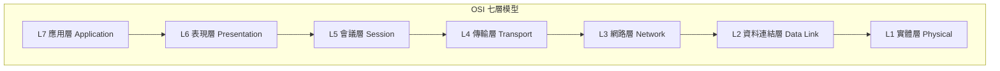
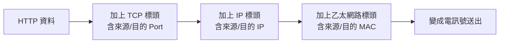
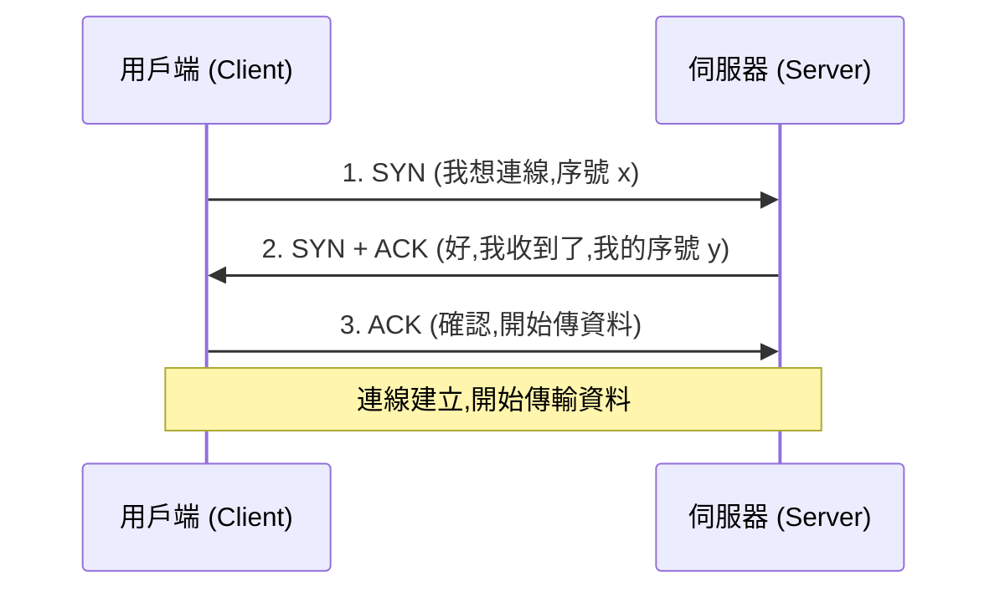
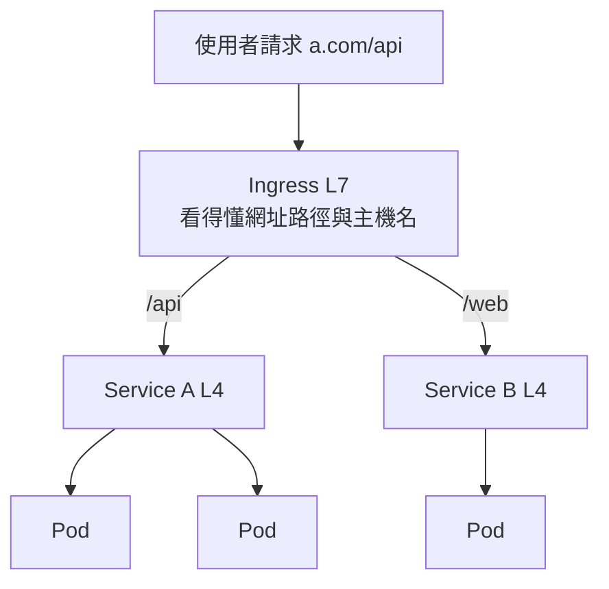
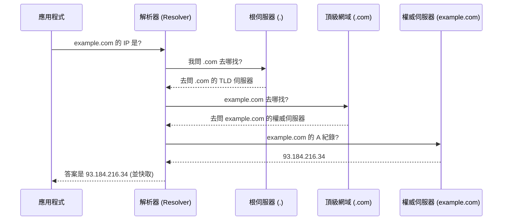
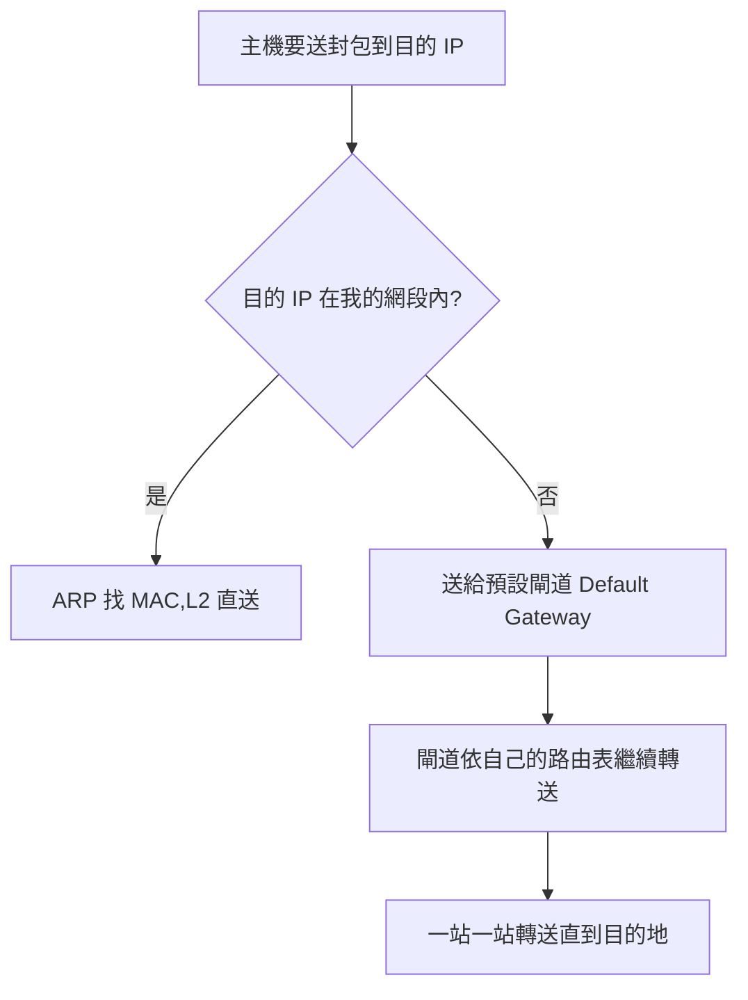
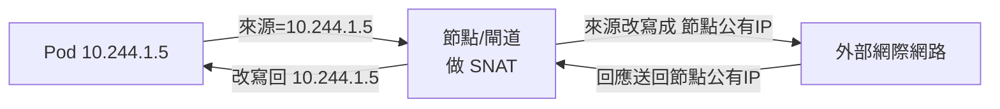
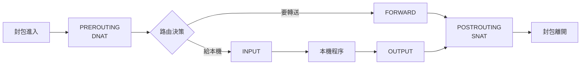
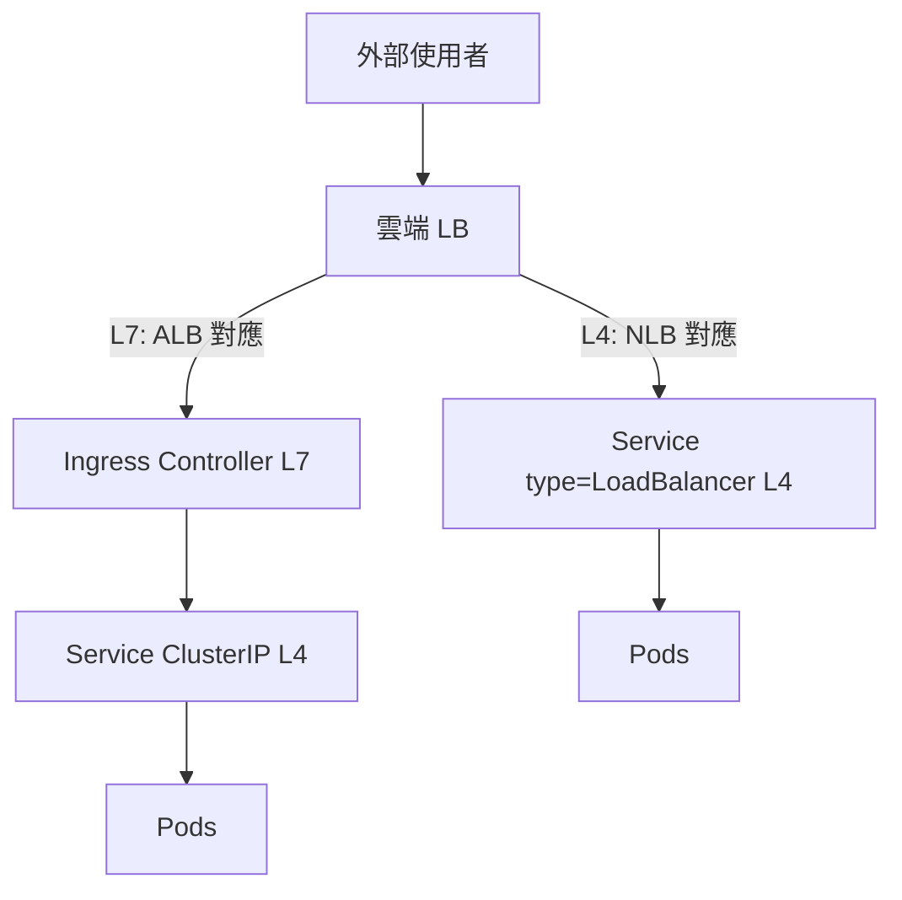
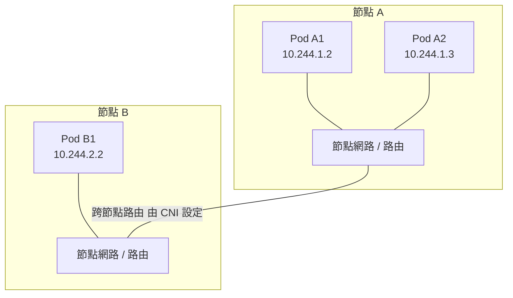

# 網路基礎 (Networking Fundamentals)

> 本章定位:在學習 Kubernetes / EKS / eBPF 之前,先把網路的核心觀念與直覺建立起來。
> 我們的目標不是「背指令」,而是理解「為什麼網路要這樣設計」,這樣之後看 Pod 網路、CNI、kube-proxy、Service Mesh 時才不會迷路。

當你日後排查「Pod 連不到 Service」「DNS 解析失敗」「LoadBalancer 沒流量進來」這類問題時,真正派得上用場的不是 K8s 指令,而是你對封包 (Packet) 在網路上如何移動的理解。所以這一章值得你慢慢讀。

---

## 0. 為什麼學 K8s 要先學網路?

Kubernetes 本質上是一套「在許多台機器上,自動安排容器,並讓它們彼此能透過網路溝通」的系統。它幾乎所有的核心抽象都跟網路有關:

| K8s 概念 | 背後其實是什麼網路技術 |
| --- | --- |
| Pod 有自己的 IP | 虛擬網路介面 + 路由 (Routing) |
| Service (ClusterIP) | 第四層負載平衡 (L4 Load Balancing) + 網路位址轉譯 (NAT) |
| Service 怎麼導流 | iptables / IPVS / eBPF 規則 |
| Ingress | 第七層 (L7) 反向代理 |
| DNS 名稱解析 | CoreDNS,本質是一台 DNS 伺服器 |
| NetworkPolicy | 防火牆規則 (Firewall Rules) |

換句話說,K8s 沒有發明新的網路,它只是把傳統網路技術「自動化、宣告式化」。所以先懂底層,K8s 的一切才會變得理所當然。

---

## 1. OSI 七層與 TCP/IP 模型 (OSI Model & TCP/IP Model)

### 1.1 兩種分層模型的對照

網路為了「分工」與「解耦」,把通訊拆成好幾層。每一層只需要關心自己的工作,並信任下一層會把資料送出去。這就像寄信:你只管寫信封 (應用層),郵差怎麼開車送 (實體層) 你不用管。



| OSI 層 | TCP/IP 模型 | 代表協定 / 物件 | 你會在 K8s 哪裡遇到 |
| --- | --- | --- | --- |
| L7 應用層 (Application) | 應用層 | HTTP, gRPC, DNS, TLS | Ingress、Service Mesh、CoreDNS |
| L6 表現層 (Presentation) | 應用層 | TLS 加解密、編碼 | TLS termination |
| L5 會議層 (Session) | 應用層 | 連線狀態管理 | 多半被合併 |
| **L4 傳輸層 (Transport)** | 傳輸層 | TCP, UDP、連接埠 (Port) | **Service (ClusterIP/NodePort)** |
| **L3 網路層 (Network)** | 網際網路層 | IP, ICMP, 路由 | **Pod IP、CNI、路由表** |
| **L2 資料連結層 (Data Link)** | 連結層 | MAC, ARP, 乙太網路 | bridge、veth pair |
| L1 實體層 (Physical) | 連結層 | 網路線、電訊號 | 雲端的底層網路 |

### 1.2 實務上你最常碰的是 L2 / L3 / L4 / L7

不要被七層嚇到。在 K8s 與雲原生的世界,99% 的時間你只需要掌握這四層:

- **L2 (資料連結層)**:同一個網段 (Subnet) 內,靠 MAC 位址 與 ARP 找到對方。K8s 的 Pod 透過 veth pair 接到節點的虛擬橋接器,就是 L2 的事。
- **L3 (網路層)**:不同網段之間,靠 IP 位址 與路由 (Routing) 轉送封包。**「每個 Pod 一個 IP」就是 L3 的設計**。
- **L4 (傳輸層)**:用連接埠 (Port) 區分同一台主機上的不同服務,TCP 保證可靠、UDP 追求快。**K8s Service 工作在這層**。
- **L7 (應用層)**:看得懂 HTTP 的網址、Header、Cookie。**K8s Ingress 工作在這層**。

> 直覺記法:**層數越高,越「懂」應用內容;層數越低,越「只管搬運」。**
> L3 只看得到「IP 對 IP」;L7 看得到「使用者要存取 `/api/login`」。

### 1.3 封裝 (Encapsulation):資料是怎麼一層層包起來的

當你用瀏覽器送出一個 HTTP 請求,資料會由上往下「一層包一層」,每層加上自己的標頭 (Header):



接收端則反過來「一層層拆開」。理解這個「洋蔥結構」很重要 —— 當你之後用 `tcpdump` 抓封包時,看到的就是這些一層層的標頭。

### 動手練習:觀察你機器上的網路分層

```bash
# 查看本機的網路介面 (L2/L3 資訊:MAC 位址與 IP 位址)
ip addr show

# 查看路由表 (L3:封包要往哪個網段送)
ip route show

# 查看目前監聽中的連接埠 (L4:哪些服務正在等連線)
ss -tlnp

# 用 curl 觀察一次完整的 L7 (HTTP) 請求與回應標頭
curl -v https://example.com
```

---

## 2. IP 位址、子網路與 CIDR (IP Address, Subnet & CIDR)

### 2.1 IP 位址是什麼

IPv4 位址 是一個 32 位元的數字,習慣寫成四段十進位 (點分十進位),例如 `192.168.1.10`。每段 0~255,佔 8 位元 (1 byte),四段共 32 位元。

```
192      .   168     .   1        .   10
11000000 . 10101000 . 00000001 . 00001010   <- 二進位實際長相
```

一個 IP 位址在邏輯上分成兩部分:

- **網路部分 (Network)**:決定你在「哪個社區 (網段)」。
- **主機部分 (Host)**:決定你是「社區裡的哪一戶」。

到底前面幾位元是網路、後面幾位元是主機?這就是子網路遮罩 (Subnet Mask) 要回答的。

### 2.2 子網路遮罩 (Subnet Mask) 與 CIDR

子網路遮罩用來「切」出網路部分。它也是 32 位元,規則是:**前面連續的 1 對應網路部分,後面連續的 0 對應主機部分。**

| 表示法 | 子網路遮罩 | CIDR | 可用主機數 (大約) |
| --- | --- | --- | --- |
| Class C 等級 | 255.255.255.0 | /24 | 256 - 2 = 254 |
| 半個 C | 255.255.255.128 | /25 | 128 - 2 = 126 |
| Class B 等級 | 255.255.0.0 | /16 | 65536 - 2 |
| 單一主機 | 255.255.255.255 | /32 | 1 |

**CIDR (Classless Inter-Domain Routing,無類別域間路由)** 就是「斜線記法」,例如 `192.168.1.0/24`,斜線後的數字代表「網路部分佔幾個位元」。`/24` 代表前 24 位元是網路,剩下 8 位元 (256 個位址) 是主機。

> 你之後設定 K8s 叢集時,會看到 `--pod-network-cidr=10.244.0.0/16` 或 `--service-cidr=10.96.0.0/12`,現在你就知道這是在「規劃 Pod 與 Service 各自能用的 IP 範圍」。

### 2.3 網段切割 (Subnetting) 的計算直覺

關鍵公式:

- 主機位元數 = 32 − CIDR 前綴
- 可容納的位址總數 = 2^(主機位元數)
- 可用主機數 = 位址總數 − 2(扣掉「網路位址」與「廣播位址」)

範例:`10.0.0.0/24`
- 主機位元 = 32 − 24 = 8
- 位址總數 = 2^8 = 256(`10.0.0.0` ~ `10.0.0.255`)
- 網路位址 = `10.0.0.0`(代表整個網段)
- 廣播位址 = `10.0.0.255`(送給網段內全部主機)
- 可用主機 = `10.0.0.1` ~ `10.0.0.254`,共 254 個

> **為什麼 K8s 要關心這個?** 因為「每個 Pod 一個 IP」,如果你的 Pod CIDR 切太小,Pod 數量一多就會「IP 用完」,Pod 卡在 `ContainerCreating`。網段規劃是叢集容量規劃的一部分。

### 2.4 私有網段 (Private IP Ranges)

有三段 IP 是 RFC 1918 保留給「私有網路」用的,它們不會出現在公網上,可以在你家、公司、雲端 VPC 內自由使用:

| CIDR | 範圍 | 常見用途 |
| --- | --- | --- |
| `10.0.0.0/8` | 10.0.0.0 ~ 10.255.255.255 | 雲端 VPC、K8s Pod/Service 網段最常用 |
| `172.16.0.0/12` | 172.16.0.0 ~ 172.31.255.255 | Docker 預設 bridge (`172.17.0.0/16`) |
| `192.168.0.0/16` | 192.168.0.0 ~ 192.168.255.255 | 家用 / 小型辦公室路由器 |

另外 `127.0.0.0/8`(`127.0.0.1` localhost)是回送位址 (Loopback),永遠指向自己。**在 K8s 中,同一個 Pod 內的多個容器共享網路命名空間,所以它們之間可以用 `localhost` 互通** —— 這是個非常重要的設計,後面會再提。

### 動手練習:計算與觀察網段

```bash
# 查看自己 IP 與所屬網段 (看 inet 後面的 /xx 就是 CIDR)
ip -4 addr show

# 用 ipcalc 計算網段資訊 (若沒安裝:sudo apt install ipcalc)
ipcalc 10.0.0.0/24
# 觀察輸出的 Network / Broadcast / HostMin / HostMax

# 自己心算驗證:10.244.5.0/24 這個網段
#   - 網路位址?廣播位址?可用主機數?
```

---

## 3. L4 (TCP/UDP) vs L7 (HTTP)

### 3.1 連接埠 (Port):同一個 IP 上的「房間號碼」

IP 位址 帶你到「正確的主機」,但一台主機上可能同時跑著 Web 伺服器、資料庫、SSH……要怎麼區分?答案是連接埠 (Port),一個 16 位元的數字 (0~65535)。

- IP + Port 合起來,才能唯一定位「某主機上的某個服務」,這個組合叫 **Socket**。
- 常見的「公認埠 (Well-known Ports)」:HTTP=80、HTTPS=443、SSH=22、DNS=53。

### 3.2 TCP vs UDP

| 特性 | TCP (傳輸控制協定) | UDP (使用者資料報協定) |
| --- | --- | --- |
| 連線 | 連線導向 (先交握) | 無連線 (直接送) |
| 可靠性 | 保證送達、會重傳、有順序 | 不保證、不重傳 |
| 速度/開銷 | 較慢、開銷大 | 較快、開銷小 |
| 適用情境 | HTTP、資料庫、SSH | DNS 查詢、即時影音、遊戲 |

### 3.3 三向交握 (Three-way Handshake)

TCP 在傳資料前,必須先「握手三次」確認雙方都準備好:



> 為什麼要懂這個?當你 `telnet` 或 `curl` 一個服務「卡住沒回應」,問題往往就出在三向交握 —— 可能是防火牆規則 (iptables) 把 SYN 丟掉了,或目的 Port 根本沒人監聽。理解交握能讓你精準判斷「卡在哪一步」。

### 3.4 為什麼 K8s Service 是 L4,而 Ingress 是 L7?

這是本章最重要的觀念之一,請務必弄懂:

- **Service (ClusterIP / NodePort / LoadBalancer) 工作在 L4。**
  它只認得「IP + Port」與「TCP/UDP」。它把進來的封包,依照規則轉送 (NAT) 到後端某個 Pod 的 IP+Port。**它看不懂 HTTP 的網址路徑**。你給它一個 TCP 連線,它就幫你導到某個 Pod,如此而已。
  → 優點:快、通用 (任何 TCP/UDP 協定都能轉,不限 HTTP)。

- **Ingress 工作在 L7。**
  它看得懂 HTTP,所以可以根據「網址路徑 (`/api` vs `/web`)」或「主機名稱 (`a.example.com` vs `b.example.com`)」做不同的導流,還能處理 TLS 終結、HTTP 標頭改寫。
  → 優點:聰明、能做應用層路由;代價:只懂 HTTP/HTTPS,開銷較大。



一句話總結:**Ingress 負責「聰明地分流到正確的 Service」,Service 負責「把流量公平地分給後端 Pod」。** 兩者是上下游關係,不是二選一。

### 動手練習:觀察 L4 與 L7

```bash
# 觀察三向交握 (抓本機對 443 的 TCP 封包,看 SYN/ACK 旗標)
sudo tcpdump -i any -n 'tcp port 443 and tcp[tcpflags] & (tcp-syn|tcp-ack) != 0'
# 開另一個終端機執行 curl https://example.com,回來看 tcpdump 輸出

# 看 L4:目前有哪些已建立的 TCP 連線 (State=ESTAB)
ss -tnp

# 看 L7:用 curl 取得 HTTP 應用層的完整互動 (狀態碼、標頭)
curl -sv https://example.com -o /dev/null
```

---

## 4. DNS 解析流程 (DNS Resolution)

### 4.1 為什麼需要 DNS

人記得住 `google.com`,記不住 `142.250.x.x`。DNS (Domain Name System,網域名稱系統) 就是「網路的電話簿」,負責把好記的網域名稱翻譯成 IP 位址。

### 4.2 一次查詢的旅程



重點觀念:
- **快取 (Cache) 無所不在**:解析器、作業系統、瀏覽器都會快取,所以多數查詢不會真的跑完整趟。這也是為什麼「改了 DNS 要等 TTL 過期才生效」。
- **常見紀錄類型**:`A`(域名→IPv4)、`AAAA`(→IPv6)、`CNAME`(別名)、`SRV`(服務位置)。

### 4.3 預告:K8s 內部 DNS 與 CoreDNS

在 Kubernetes 裡,每個 Service 都會自動得到一個 DNS 名稱,例如:

```
my-service.my-namespace.svc.cluster.local
```

負責回答這些「叢集內部域名」的,就是跑在叢集裡的 **CoreDNS**(一台 DNS 伺服器,本身也是用 Pod 跑的)。當你的 Pod 想連 `my-service`,它會:

1. 向 CoreDNS 查詢 `my-service...svc.cluster.local`
2. CoreDNS 回傳該 Service 的 ClusterIP
3. Pod 把封包送往 ClusterIP,接著就交給 L4 (Service) 與 NAT/iptables 接手

> 所以日後遇到「Pod 連不到別的服務」,第一個要懷疑的往往就是 **DNS**。你會非常頻繁地在 Pod 裡執行 `nslookup` / `dig` 來除錯。本章先把 DNS 流程記熟,K8s 的 Service Discovery 就只是「把這套搬進叢集」。

### 動手練習:解析 DNS

```bash
# 用 dig 查 A 紀錄,觀察 ANSWER SECTION 與 TTL
dig example.com

# 只看最後答案 (簡潔輸出)
dig +short example.com

# 追蹤完整遞迴過程:根 -> TLD -> 權威 (理解上面那張圖)
dig +trace example.com

# 查 CNAME / MX 等不同紀錄
dig www.github.com CNAME
dig gmail.com MX

# 查看本機用哪台 DNS 伺服器
cat /etc/resolv.conf
```

---

## 5. 路由與預設閘道 (Routing & Default Gateway)

### 5.1 封包要怎麼決定往哪走?

當主機要送一個封包,它會問自己一個關鍵問題:

> **「目的 IP 跟我在同一個網段嗎?」**

- **在同一個網段** → 直接透過 L2 (ARP 找到對方 MAC) 送過去,不需要路由器。
- **不在同一個網段** → 我自己到不了,只好把封包交給「預設閘道 (Default Gateway)」,請它幫忙轉送。

預設閘道 (Default Gateway) 通常就是你的路由器,它連著外面更大的網路,知道怎麼把封包往外送。



### 5.2 路由表 (Routing Table)

每台主機都有一張路由表,記錄「要去某個網段,該往哪個介面/下一跳 (next hop) 送」。它是「由上往下、最精確 (最長前綴) 優先」比對的。

```bash
# 查看路由表
ip route show
# 典型輸出解讀:
# default via 192.168.1.1 dev eth0    <- 預設路由:不認得的目的地都丟給 192.168.1.1
# 192.168.1.0/24 dev eth0 ...          <- 直連網段:這段我自己就能送達
# 10.244.0.0/24 dev cni0 ...           <- (K8s 節點上常見) 本機 Pod 網段走 cni0
```

> **K8s 的伏筆**:節點上會有一堆「往各個 Pod 網段的路由」。CNI 外掛 (如 Calico、Flannel) 的核心工作之一,就是在每個節點上「設定正確的路由,讓 A 節點的 Pod 封包能找到 B 節點的 Pod」。所以看懂 `ip route`,就看懂了一半的 CNI。

### 動手練習:追蹤封包的路徑

```bash
# 查路由表:封包去 8.8.8.8 會走哪條路由?
ip route get 8.8.8.8

# 看封包實際經過哪些路由器 (每一跳 hop)
traceroute 8.8.8.8      # 或 tracepath 8.8.8.8

# 觀察 ARP 表 (本網段內 IP 對 MAC 的對應)
ip neigh show

# 找出你的預設閘道是誰
ip route | grep default
```

---

## 6. NAT 與連接埠轉發 (NAT & Port Forwarding)

### 6.1 NAT 解決什麼問題?

私有網段 (如 `10.0.0.0/8`) 的 IP 不能在公網上路由。那一台私有 IP 的 Pod 要怎麼連到外面的 `8.8.8.8`?答案是 **網路位址轉譯 (NAT, Network Address Translation)**。

NAT 由閘道 (路由器 / K8s 節點) 執行:它在封包出去時,把「私有來源 IP」改寫成「自己的公有 IP」,並記住這個對應關係;回應封包回來時,再改寫回原本的私有 IP,送回正確的內部主機。



- **SNAT (來源 NAT)**:改寫「來源位址」。Pod 連外用的就是這種 —— 對外界而言,所有 Pod 看起來都像是「節點」在連線。
- **DNAT (目的 NAT)**:改寫「目的位址」。**這正是 K8s Service 的核心** —— 你連 ClusterIP,iptables 用 DNAT 把目的改寫成某個實際 Pod 的 IP。

### 6.2 連接埠轉發 (Port Forwarding)

連接埠轉發是 DNAT 的一種:「把送到 `閘道IP:8080` 的流量,轉送到 `內部IP:80`」。

你一定用過它:
- Docker 的 `-p 8080:80`,就是把主機的 8080 埠轉發到容器的 80 埠。
- K8s 的 **NodePort** Service,就是「把每個節點的某個高位埠 (如 30080),DNAT 轉發到後端 Pod」。
- `kubectl port-forward`,則是建立一條從你本機到 Pod 的通道。

> **觀念串接**:Service(ClusterIP)= 對內的 DNAT 負載平衡;NodePort = 對外開一個節點埠做轉發;Pod 連外 = SNAT。整個 K8s 的網路,大量建立在 NAT 之上。

### 動手練習:觀察 NAT

```bash
# 查看 NAT 表的規則 (需 root;Docker/K8s 節點上會看到大量規則)
sudo iptables -t nat -L -n -v

# 觀察 conntrack 連線追蹤表 (NAT 靠它記住對應關係)
# 需安裝 conntrack-tools
sudo conntrack -L 2>/dev/null | head

# 在有 Docker 的機器上,跑一個含 port forwarding 的容器再回頭看 nat 表
# docker run -d -p 8080:80 nginx
# sudo iptables -t nat -L DOCKER -n
```

---

## 7. iptables / netfilter 基礎

> 這一節非常重要。理解 iptables,你才會懂 **kube-proxy 在做什麼**,以及為什麼 **eBPF (如 Cilium) 要取代 iptables**。

### 7.1 netfilter 是引擎,iptables 是設定工具

- **netfilter** 是 Linux 核心裡的封包處理框架,它在封包進出的幾個「掛勾點 (hook)」上,讓你決定封包要放行、丟棄、還是改寫。
- **iptables** 是你用來「設定 netfilter 規則」的使用者空間工具。

它的結構是三層:**表 (Table) → 鏈 (Chain) → 規則 (Rule)**。

### 7.2 表 (Table):依「目的」分類規則

| 表 (Table) | 用途 |
| --- | --- |
| `filter` | 過濾:放行 (ACCEPT) 或丟棄 (DROP),是防火牆的核心 |
| `nat` | 位址轉譯:做 SNAT / DNAT(K8s Service 主要用這張) |
| `mangle` | 改寫封包標頭欄位 (如 TTL、TOS) |
| `raw` | 連線追蹤前的特殊處理 |

### 7.3 鏈 (Chain):依「封包經過的時機」分類

鏈對應 netfilter 的掛勾點,代表「封包旅程中的某個時間點」:

| 鏈 (Chain) | 觸發時機 |
| --- | --- |
| `PREROUTING` | 封包剛進來、還沒做路由決策前(DNAT 在這裡) |
| `INPUT` | 封包目的是「本機」 |
| `FORWARD` | 封包「路過」本機,要轉送出去 |
| `OUTPUT` | 本機自己產生的封包 |
| `POSTROUTING` | 封包即將離開、路由決策後(SNAT 在這裡) |



### 7.4 規則 (Rule):條件 + 動作

每條鏈裡有一串規則,由上往下比對。每條規則是「**符合某條件 → 執行某動作**」,動作 (target) 常見有:`ACCEPT`(放行)、`DROP`(丟棄)、`DNAT`/`SNAT`(改寫)、`RETURN`(跳出)、或跳到「自訂鏈」。

```bash
# 例:把送到 10.96.0.1:443 的封包,DNAT 改送到某個 Pod (這就是 Service 的本質)
# iptables -t nat -A PREROUTING -d 10.96.0.1 -p tcp --dport 443 -j DNAT --to 10.244.1.5:6443
```

### 7.5 為什麼這對 K8s / eBPF 這麼重要?

**傳統 kube-proxy 的 iptables 模式**,做的事就是:把「Service → 後端 Pod」的對應,翻譯成一大堆 iptables 的 nat 規則(用 DNAT 做負載平衡,隨機挑一個 Pod)。

問題來了:
- 規則是**線性比對**的,Service 與 Pod 一多(成千上萬條規則),封包要從頭比對到尾,效能與更新延遲都會惡化。
- 規則更新要整批重寫,大叢集下會卡頓。

**這就是 eBPF (如 Cilium)、或 IPVS 模式想解決的事:**
- IPVS 用核心內的雜湊表 (hash table) 做查找,從「線性」變「常數時間」。
- **eBPF** 更進一步,把封包處理邏輯「直接編譯成程式,掛在核心的網路路徑上」,可以在很早的階段就做完轉送決策,繞過冗長的 iptables 鏈,效能與可觀測性都大幅提升。

> 所以當你聽到「Cilium 用 eBPF 取代 kube-proxy / iptables」,現在你能理解它的動機:**不是 iptables 不能用,而是在大規模、高動態的叢集下,線性規則鏈成了瓶頸。**

### 動手練習:閱讀 iptables 規則

```bash
# 列出 filter 表的所有鏈與規則 (-n 不做 DNS 反解,快很多)
sudo iptables -L -n -v

# 專看 nat 表 (在 K8s 節點上,這裡會看到 KUBE-SERVICES 等自訂鏈)
sudo iptables -t nat -L -n -v

# 列出所有自訂鏈名稱
sudo iptables -t nat -S | head

# (進階) 在 minikube/kind 節點上找找 K8s 產生的鏈
sudo iptables -t nat -L KUBE-SERVICES -n 2>/dev/null | head
```

---

## 8. 負載平衡 (Load Balancing)

### 8.1 為什麼需要負載平衡

一個服務若只有一個後端,它會是單點故障,也撐不了大流量。負載平衡 (Load Balancing) 把進來的流量「分散」到多個後端,提供擴展性與高可用。

### 8.2 L4 負載平衡 vs L7 負載平衡

| 面向 | L4 負載平衡 | L7 負載平衡 |
| --- | --- | --- |
| 依據 | IP + Port (TCP/UDP) | HTTP 內容 (網址、Header、Cookie) |
| 懂應用內容嗎? | 不懂,只搬 TCP/UDP | 懂,可依路徑/主機名分流 |
| 能做的事 | 連線層級分流 | 路徑路由、TLS 終結、重試、改寫標頭 |
| 開銷 | 低、快 | 高、功能多 |
| K8s 對應 | **Service** | **Ingress / Gateway API** |
| 雲端對應 | NLB (Network LB) | ALB (Application LB) |

直覺:**L4 像郵局只看地址轉信,不拆信;L7 像秘書會拆信讀內容,再決定轉給哪個部門。**

### 8.3 對應到 K8s 與雲端



- **Service (ClusterIP)**:叢集內部的 L4 負載平衡(靠 iptables/IPVS/eBPF 把流量分到後端 Pod)。
- **Service (type=LoadBalancer)**:向雲端要一個 L4 負載平衡器 (如 AWS NLB),把外部流量導進來。
- **Ingress**:叢集邊緣的 L7 反向代理,依 HTTP 規則分流到不同 Service;在雲上常對應 ALB。

> EKS 的伏筆:AWS Load Balancer Controller 會根據你的 Service / Ingress,自動去 AWS 開 NLB (L4) 或 ALB (L7)。理解 L4/L7 的差別,你才知道「什麼情況該用哪一種,以及為什麼」。

### 動手練習:理解負載平衡行為

```bash
# 模擬:用 curl 連續打同一個服務,觀察回應是否來自不同後端 (若後端會回主機名)
for i in $(seq 1 10); do curl -s http://localhost:8080/ ; echo; done

# 在 K8s 節點上,觀察一個 ClusterIP 背後對應到幾個 Pod (DNAT 的負載平衡規則)
# sudo iptables -t nat -L KUBE-SVC-XXXX -n
```

---

## 9. 與 K8s 網路模型的銜接 (Bridging to the K8s Network Model)

恭喜你撐到這裡。現在把前面所有觀念串成一張 K8s 網路的全景圖。

### 9.1 K8s 網路的四大基本要求

Kubernetes 對網路只提出幾條「規則」,不規定怎麼實作(實作交給 CNI):

1. **每個 Pod 有自己獨立的 IP**(L3 設計)。
2. **同節點 / 跨節點的 Pod 彼此可直接用 IP 互通,過程中不需 NAT**。
3. **節點上的 agent (如 kubelet) 能和該節點上的 Pod 互通**。
4. 同一個 Pod 內的容器共享網路命名空間,彼此用 `localhost` 溝通(還記得 §2.4 嗎?)。

### 9.2 為什麼要「每個 Pod 一個 IP」?

傳統做法是「容器共用主機 IP,靠不同 Port 區分」,但這會帶來 Port 衝突、應用要關心自己被映射到哪個 Port 等麻煩。

K8s 選擇 **「IP-per-Pod」**:每個 Pod 都像一台獨立的小主機,有自己完整的 IP 與 Port 空間。好處是:

- 應用程式可以用「它原本習慣的 Port」(例如就是 80),不必擔心衝突。
- Pod 之間溝通的心智模型,跟「兩台機器用 IP 溝通」一模一樣,簡單直覺。

代價是:你需要一個夠大的 Pod 網段 (還記得 §2.3 的網段規劃嗎?),以及一套機制讓這些 Pod IP「在叢集裡到處都路由得到」——這套機制就是 CNI。

### 9.3 CNI:把這些網路規則「實作出來」的外掛

**CNI (Container Network Interface)** 是 K8s 與網路外掛之間的標準介面。當一個 Pod 被建立,CNI 外掛 (Calico / Cilium / Flannel / VPC CNI…) 負責:

- 幫 Pod 建立網路介面 (通常是一對 veth pair,一端在 Pod 內,一端接到節點)。
- 從 Pod 網段分配一個 IP 給它。
- **設定路由 (§5) 與必要的 NAT / iptables / eBPF 規則 (§6, §7)**,讓這個 Pod 的封包能正確進出,並能找到其他節點的 Pod。



### 9.4 一條請求的完整旅程(把全章串起來)

當叢集內一個 Pod 想存取 `my-service`:

1. **DNS (§4)**:向 CoreDNS 查 `my-service...svc.cluster.local` → 得到 ClusterIP。
2. **L4 + DNAT (§3, §6, §7)**:封包送往 ClusterIP,被 iptables/IPVS/eBPF 用 DNAT 改寫目的,負載平衡 (§8) 選中某個後端 Pod IP。
3. **路由 (§5)**:依路由表把封包送到目標 Pod(可能跨節點,由 CNI 設定的路由完成)。
4. **回程**:conntrack 記得對應關係,回應封包循原路改寫回來。

> 你會發現:K8s 網路沒有黑魔法,它就是把你這一章學到的 **DNS、L4、NAT、iptables、路由、負載平衡** 自動化地組裝起來。當你日後 debug,就是回到這幾層逐一檢查。

### 動手練習:預習 K8s 網路觀察(若已有 minikube / kind)

```bash
# 查看每個 Pod 的 IP (印證「IP-per-Pod」)
kubectl get pods -o wide

# 查看 Service 的 ClusterIP 與對應的後端 Endpoints
kubectl get svc
kubectl get endpoints

# 進到 Pod 裡,觀察它眼中的網路 (它有自己的 IP 與 localhost)
kubectl run netshoot --rm -it --image=nicolaka/netshoot -- bash
#   進去後可玩:ip addr / ip route / dig kubernetes.default / curl <service>
```

---

## 本章檢核點 (Checklist)

讀完並動手後,確認你能對自己回答以下問題:

- [ ] 我能說出 L2 / L3 / L4 / L7 各自負責什麼,並各舉一個 K8s 對應物。
- [ ] 我理解封裝 (Encapsulation),知道封包是一層層包標頭。
- [ ] 給我一個 CIDR(如 `10.244.0.0/24`),我能算出網路位址、廣播位址與可用主機數。
- [ ] 我能背出三段私有網段 (Private IP),並知道 `localhost` / loopback 的意義。
- [ ] 我能解釋 TCP 三向交握 (Three-way Handshake) 的三個步驟。
- [ ] 我能說清楚「為什麼 Service 是 L4、Ingress 是 L7」,以及它們的上下游關係。
- [ ] 我能描述一次 DNS 解析的流程,並知道 CoreDNS 在 K8s 扮演的角色。
- [ ] 我能解釋封包遇到「同網段 vs 跨網段」時的不同處理,以及預設閘道 (Default Gateway) 的作用。
- [ ] 我能區分 SNAT 與 DNAT,並指出 K8s 哪裡用到它們。
- [ ] 我能說出 iptables 的「表 (Table) / 鏈 (Chain) / 規則 (Rule)」結構,以及 PREROUTING/POSTROUTING 與 DNAT/SNAT 的關係。
- [ ] 我能解釋為什麼大規模叢集下 iptables 模式的 kube-proxy 會有效能瓶頸,以及 IPVS / eBPF 想解決什麼。
- [ ] 我能區分 L4 與 L7 負載平衡,並對應到 Service、Ingress、NLB、ALB。
- [ ] 我能說明 K8s「IP-per-Pod」的設計理念,以及 CNI 的職責。
- [ ] 我能用 `ip addr` / `ip route` / `ss` / `dig` / `tcpdump` / `iptables` 做基本觀察與除錯。

---

> **下一站**:有了這些網路直覺,接下來就能進入 Kubernetes 的 Pod 網路、Service、Ingress 與 CNI 的實作細節。你會發現,你已經懂了一大半。
