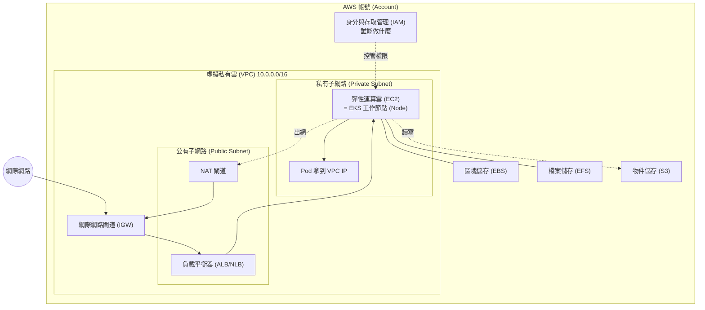
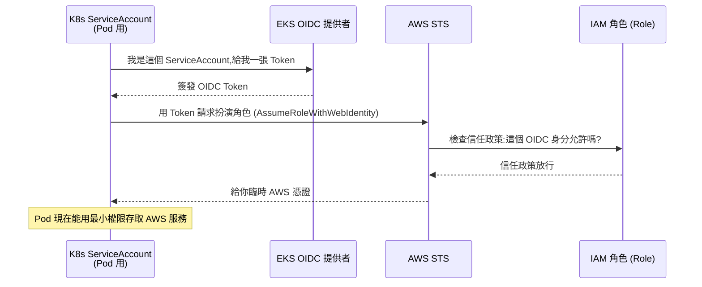
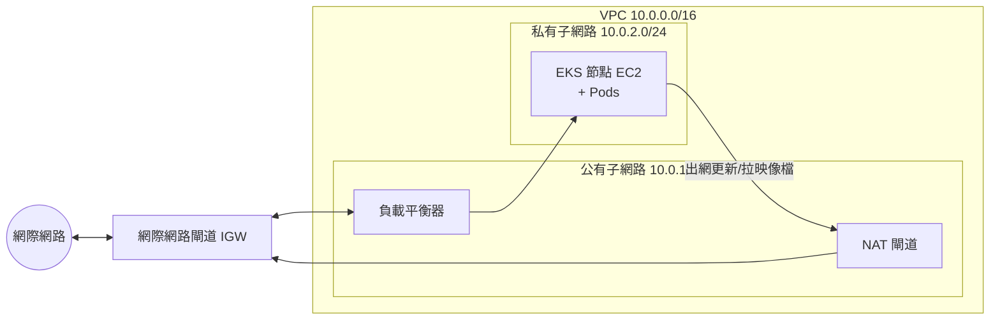
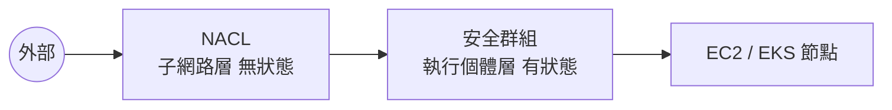
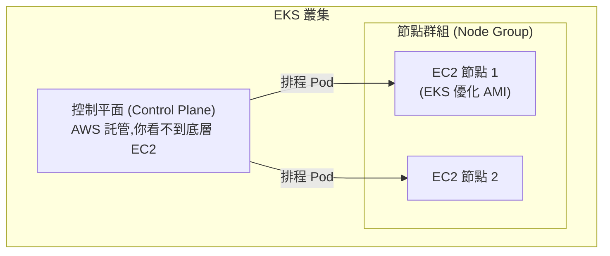
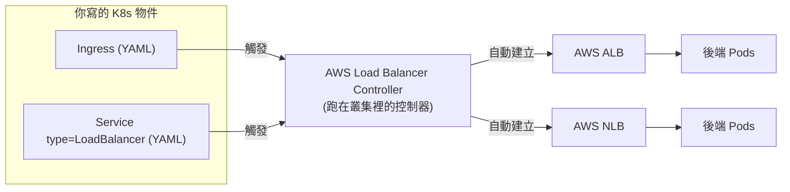
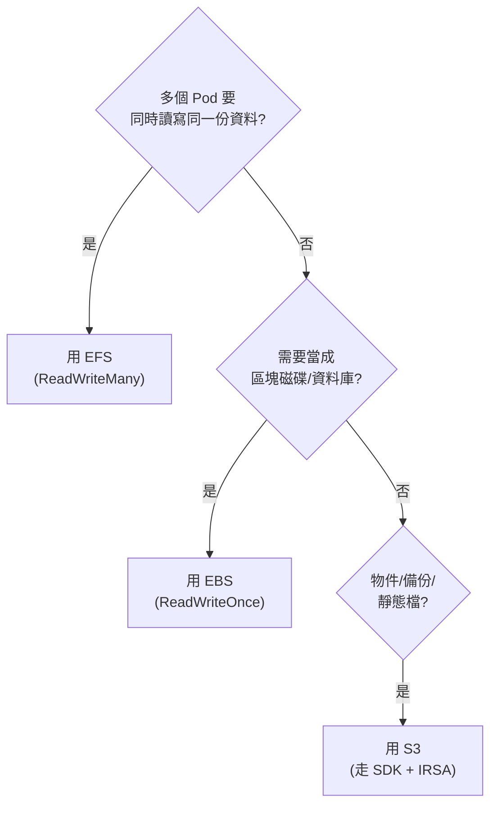

# AWS 基礎(為 EKS 鋪路)

> 本章定位:**學 Amazon EKS 之前,最低限度需要的 AWS 知識**。
>
> 我們不打算把這裡寫成完整的 AWS 教學,而是聚焦在「之後玩 EKS 一定會碰到」的服務與觀念。每講一個服務,都會回頭點出:**這對 EKS 為什麼重要?**
>
> 適合對象:已經懂一點 Kubernetes(K8s)基本觀念,接下來想把叢集架在 AWS 上的人。

---

## 目錄

1. [AWS 帳號、計費與成本告警(最重要,先做)](#1-aws-帳號計費與成本告警最重要先做)
2. [身分與存取管理 (IAM)](#2-身分與存取管理-iam)
3. [虛擬私有雲 (VPC)](#3-虛擬私有雲-vpc)
4. [安全群組 (Security Group) vs 網路 ACL (NACL)](#4-安全群組-security-group-vs-網路-acl-nacl)
5. [彈性運算雲 (EC2)](#5-彈性運算雲-ec2)
6. [彈性負載平衡 (ELB / ALB / NLB)](#6-彈性負載平衡-elb--alb--nlb)
7. [儲存:EBS vs EFS vs S3](#7-儲存ebs-vs-efs-vs-s3)
8. [AWS CLI 與認證設定、eksctl 預告](#8-aws-cli-與認證設定eksctl-預告)
9. [與 EKS 的銜接:每個服務在 EKS 裡扮演什麼角色](#9-與-eks-的銜接每個服務在-eks-裡扮演什麼角色)
10. [本章檢核點 (Checklist)](#10-本章檢核點-checklist)

---

## 0. 先建立一張全景圖

在跳進細節之前,先看一張圖。把它記在腦海裡,後面每一節都是在補完這張圖的某個角落。



重點先記住:**EKS 不是憑空存在,它是「站在 IAM + VPC + EC2 + ELB + 儲存」這些基礎服務的肩膀上**。理解這些,EKS 就只剩 K8s 本身的部分要學了。

---

## 1. AWS 帳號、計費與成本告警(最重要,先做)

### 1.1 帳號與計費觀念

AWS 採**用多少付多少 (Pay-as-you-go)** 的計費模式。沒有按月固定費率,你開了什麼資源、用了多久、傳輸多少流量,就付多少錢。

幾個關鍵觀念:

| 觀念 | 說明 | 對 EKS 的影響 |
|------|------|---------------|
| 地區 (Region) | 例如 `ap-northeast-1`(東京)、`us-east-1`(維吉尼亞北部)。資源大多綁定地區。 | EKS 叢集屬於某個地區,跨地區流量要收費。 |
| 可用區 (Availability Zone, AZ) | 一個地區內多個獨立機房,例如 `ap-northeast-1a`、`1c`、`1d`。 | EKS 節點通常跨多個 AZ 部署以求高可用。 |
| 隨需 (On-Demand) | 開機就計費,關機即停。最有彈性但單價最高。 | 學習階段建議用這個,玩完馬上關。 |
| 預留 / Savings Plans | 承諾一段期間換折扣。 | 正式環境降低成本用,學習階段不需要。 |
| 資料傳輸 (Data Transfer) | **進 AWS 通常免費,出 AWS 與跨 AZ 要收費**。 | EKS 跨 AZ 的 Pod 通訊、NAT 出網都會產生費用。 |

> 一個常見的「帳單地雷」:**NAT 閘道**與**彈性 IP (Elastic IP)** 即使你沒在用,只要存在就持續收費。這在第 3 節會再提醒。

### 1.2 免費方案 (Free Tier)

AWS 免費方案分三種,務必分清楚:

| 類型 | 意思 | 例子 |
|------|------|------|
| 12 個月免費 | 新帳號起算 12 個月內免費 | EC2 `t2.micro`/`t3.micro` 每月 750 小時、EBS 30 GB |
| 永久免費 (Always Free) | 永遠有一定額度 | Lambda 每月 100 萬次請求、DynamoDB 25 GB |
| 試用 (Trials) | 短期試用 | 某些服務啟用後 N 天 |

> **殘酷的真相:EKS 本身不在免費方案內。** EKS 控制平面 (Control Plane) 每個叢集每小時約 0.10 美元(約一個月 70 多美元),再加上工作節點的 EC2、負載平衡器、NAT 閘道、EBS……所以**學習時務必「用完即拆」**,本章最後與每節的「動手練習」都會強調清理。

### 1.3 成本告警設定(請務必先做這一步!)

在動任何資源之前,**先設好成本告警**,這是保護荷包最重要的一步。我們用兩層防護:

1. **預算 (Budgets)**:設一個月度預算(例如 10 美元),超過門檻就寄信通知你。
2. **CloudWatch 帳單告警**:當預估帳單超過門檻時觸發。

#### 用主控台設定預算(最簡單)

`帳單與成本管理 (Billing and Cost Management)` → `預算 (Budgets)` → `建立預算 (Create budget)` → 選「成本預算 (Cost budget)」→ 設定金額與 Email 通知。建議設定:

- 當「實際花費」達到預算的 80% → 寄信
- 當「預估花費」達到預算的 100% → 寄信

#### 用 AWS CLI 設定預算

```bash
# 先準備一個 budget.json(月預算 10 美元)
cat > budget.json <<'EOF'
{
  "BudgetName": "monthly-learning-budget",
  "BudgetLimit": { "Amount": "10", "Unit": "USD" },
  "TimeUnit": "MONTHLY",
  "BudgetType": "COST"
}
EOF

# 再準備通知設定:超過 80% 預估就寄信(把信箱換成你的)
cat > notifications.json <<'EOF'
[
  {
    "Notification": {
      "NotificationType": "FORECASTED",
      "ComparisonOperator": "GREATER_THAN",
      "Threshold": 80,
      "ThresholdType": "PERCENTAGE"
    },
    "Subscribers": [
      { "SubscriptionType": "EMAIL", "Address": "you@example.com" }
    ]
  }
]
EOF

# 取得自己的帳號 ID(後面很多指令會用到)
ACCOUNT_ID=$(aws sts get-caller-identity --query Account --output text)
echo "我的帳號 ID 是:$ACCOUNT_ID"

# 建立預算
aws budgets create-budget \
  --account-id "$ACCOUNT_ID" \
  --budget file://budget.json \
  --notifications-with-subscribers file://notifications.json
```

> **提醒:** 成本資料有延遲(通常數小時到一天),不要以為「告警還沒響就代表沒花錢」。告警是最後一道防線,真正省錢靠「用完就拆」。

### 動手練習 1

- [ ] 建立 AWS 帳號(若還沒有),並啟用多因素驗證 (MFA) 保護根使用者 (Root User)。
- [ ] 設定一個 10 美元的月度預算,通知寄到你自己的信箱。
- [ ] 到「帳單儀表板 (Billing Dashboard)」看一下目前的花費(此時應該接近 0)。

---

## 2. 身分與存取管理 (IAM)

IAM 回答一個問題:**「誰 (Who) 可以對哪個資源 (What) 做哪些操作 (Action)?」**

> 為什麼這對 EKS 超級重要?因為 EKS 有兩層權限:
> 1. **AWS 層**:誰能建立/刪除叢集、節點能不能呼叫其他 AWS 服務 → 由 IAM 管。
> 2. **K8s 層**:叢集內誰能 `kubectl get pods` → 由 K8s RBAC 管。
>
> 而 EKS 的招牌功能 **IRSA(IAM Roles for Service Accounts)** 正是把這兩層接起來的橋,核心就是本節要講的「角色 (Role)」與「信任關係 (Trust Relationship)」。

### 2.1 四個核心概念

| 概念 | 是什麼 | 類比 |
|------|--------|------|
| 使用者 (User) | 一個長期的人類或程式身分,有自己的密碼/金鑰 | 員工的員工證 |
| 群組 (Group) | 一群使用者的集合,方便統一給權限 | 部門 |
| 角色 (Role) | **可被「臨時扮演 (Assume)」的身分,沒有長期憑證** | 臨時通行證 / 訪客證 |
| 政策 (Policy) | 描述「允許/拒絕哪些操作」的 JSON 文件 | 門禁規則表 |

### 2.2 政策 (Policy) 長什麼樣

政策是一份 JSON,核心是 `Effect`(允許/拒絕)、`Action`(可做的操作)、`Resource`(對哪個資源)。

```json
{
  "Version": "2012-10-17",
  "Statement": [
    {
      "Sid": "AllowReadS3Bucket",
      "Effect": "Allow",
      "Action": ["s3:GetObject", "s3:ListBucket"],
      "Resource": [
        "arn:aws:s3:::my-eks-app-bucket",
        "arn:aws:s3:::my-eks-app-bucket/*"
      ]
    }
  ]
}
```

### 2.3 最小權限原則 (Principle of Least Privilege)

**只給「完成工作所需的最小權限」,不多給一分。** 這是雲端安全的鐵律。

- 不要為了省事就掛 `AdministratorAccess`。
- 不要用根使用者 (Root User) 做日常操作,根使用者只用來建立第一個 IAM 管理者。
- 在 EKS 裡,這代表:每個應用程式 Pod 只拿到它真正需要的 AWS 權限(例如只能讀某個 S3 儲存桶),而不是整個節點上的所有 Pod 共用一把超大鑰匙。

### 2.4 角色 (Role) 與信任關係 (Trust Relationship)(IRSA 的核心)

這是本節最重要、也最容易被初學者跳過的部分,請慢慢看。

**角色 (Role)** 與使用者 (User) 最大的差別:角色**沒有長期密碼或金鑰**,它是「給別人臨時扮演的身分」。要扮演角色,得先通過角色的**信任政策 (Trust Policy)** 這一關。

一個角色有兩份政策:

| 政策 | 回答的問題 | 又叫 |
|------|-----------|------|
| 信任政策 (Trust Policy) | **「誰可以扮演我?」** | 信任關係 (Trust Relationship) |
| 權限政策 (Permission Policy) | 「扮演我之後能做什麼?」 | 一般政策 |

信任政策範例(允許 EC2 服務扮演這個角色):

```json
{
  "Version": "2012-10-17",
  "Statement": [
    {
      "Effect": "Allow",
      "Principal": { "Service": "ec2.amazonaws.com" },
      "Action": "sts:AssumeRole"
    }
  ]
}
```

`Principal` 就是「誰」。它可以是某個 AWS 服務(像上面的 EC2)、某個帳號、某個使用者,**也可以是一個 OIDC 身分提供者 (OIDC Provider)** —— 這正是 IRSA 的關鍵。

#### IRSA 的脈絡(現在只要看懂大方向)



一句話總結:**IRSA = 讓「K8s 的 ServiceAccount」能扮演「IAM 角色」,靠的就是角色的信任政策信任 EKS 的 OIDC 提供者。** 這就是為什麼你必須先搞懂「角色」與「信任關係」。

> 沒有 IRSA 之前,人們把權限掛在 EC2 節點上(節點 IAM 角色),結果節點上**所有 Pod 共用同一份權限**,違反最小權限原則。IRSA 讓權限「細到單一 Pod」。

### 2.5 IAM 常用 CLI

```bash
# 看自己現在是誰(排錯第一步)
aws sts get-caller-identity

# 建立一個群組,並掛上唯讀政策
aws iam create-group --group-name learners
aws iam attach-group-policy \
  --group-name learners \
  --policy-arn arn:aws:iam::aws:policy/ReadOnlyAccess

# 建立使用者並加入群組
aws iam create-user --user-name alice
aws iam add-user-to-group --user-name alice --group-name learners

# 列出帳號內的所有角色
aws iam list-roles --query "Roles[].RoleName" --output table
```

### 動手練習 2

- [ ] 用 `aws sts get-caller-identity` 確認你目前的身分。
- [ ] 建立一個 IAM 群組、掛上 `ReadOnlyAccess`,再建一個使用者加入該群組。
- [ ] 打開任一個 AWS 受管角色(例如 EC2 預設角色),在主控台找到它的「信任關係 (Trust relationships)」分頁,讀懂 `Principal` 是誰。
- [ ] 練習完記得刪除剛才建立的測試使用者與群組。

---

## 3. 虛擬私有雲 (VPC)

VPC 是你在 AWS 上的**私有網路空間**,像是你自己租下的一整棟大樓的網路。EKS 叢集就跑在某個 VPC 裡。

> 為什麼這對 EKS 重要?因為 **EKS 預設使用 AWS VPC CNI 外掛**,它會讓**每個 Pod 直接拿到一個 VPC 內的真實 IP**(而不是另外疊一層 Overlay 網路)。要理解「Pod 為何能拿到 VPC IP」、為何子網路 IP 數量會限制 Pod 數量,就得先懂 VPC。

### 3.1 組成元件

| 元件 | 說明 |
|------|------|
| VPC | 一段 CIDR 網段,例如 `10.0.0.0/16`(約 6.5 萬個 IP) |
| 子網路 (Subnet) | VPC 切出來的小網段,**每個子網路綁定一個 AZ**,例如 `10.0.1.0/24` |
| 公有子網路 (Public Subnet) | 路由表有指向網際網路閘道 (IGW),裡面的資源可以有公網 IP |
| 私有子網路 (Private Subnet) | 沒有直接通往 IGW,要出網得經過 NAT 閘道 |
| 路由表 (Route Table) | 決定「某個目的地的流量往哪走」,子網路靠它區分公有/私有 |
| 網際網路閘道 (Internet Gateway, IGW) | VPC 通往網際網路的大門,**雙向** |
| NAT 閘道 (NAT Gateway) | 讓私有子網路的資源能「出去」連網際網路,但外面**進不來**(單向出) |

### 3.2 公有 vs 私有子網路的差別,只在「路由表」

很多人以為子網路天生分公有私有,其實**差別只在它關聯的路由表怎麼設**:

- 公有子網路的路由表有一條:`0.0.0.0/0 → IGW`
- 私有子網路的路由表有一條:`0.0.0.0/0 → NAT 閘道`(或根本沒有對外路由)



### 3.3 典型 EKS 網路擺法

業界常見做法:

- **公有子網路**:放對外的負載平衡器 (ALB/NLB)、NAT 閘道。
- **私有子網路**:放 EKS 工作節點與 Pod。節點不直接暴露在公網,出網拉映像檔/更新時走 NAT。

這樣外部流量由負載平衡器接,再導入私有子網路裡的 Pod,既能對外服務又不把節點直接曝險。

### 3.4 Pod 為何能拿到 VPC IP(VPC CNI 脈絡)

EKS 節點是一台 EC2,它的網路卡(彈性網路介面 (ENI))可以掛上多個**次要私有 IP**。AWS VPC CNI 外掛做的事就是:從節點所在子網路的 IP 池,**撥幾個 IP 給節點上的 Pod 用**。所以:

- Pod 的 IP 是「真的 VPC IP」,VPC 內其他資源可以直接連到 Pod,不需要 NAT 翻譯。
- **子網路的可用 IP 數量,會限制這個子網路能塞多少 Pod。** 規劃 EKS 時,子網路 CIDR 不要切太小,否則 Pod 排不下。

這就是為什麼 EKS 工程師要懂 VPC:**網路規劃直接決定叢集能長多大。**

### 3.5 成本提醒(很重要)

| 資源 | 計費注意 |
|------|----------|
| VPC、子網路、路由表、IGW | **免費** |
| NAT 閘道 | **按小時 + 按流量計費,即使閒置也收錢!** 學習用完務必刪除 |
| 彈性 IP (Elastic IP) | 未綁定到執行中資源時會收費 |

### 3.6 VPC 相關 CLI(示意)

```bash
# 建立一個 VPC(網段 10.0.0.0/16)
aws ec2 create-vpc --cidr-block 10.0.0.0/16 \
  --tag-specifications 'ResourceType=vpc,Tags=[{Key=Name,Value=eks-learning-vpc}]'

# 在某個 AZ 建立一個子網路
aws ec2 create-subnet \
  --vpc-id vpc-xxxxxxxx \
  --cidr-block 10.0.1.0/24 \
  --availability-zone ap-northeast-1a

# 查看目前帳號的所有 VPC
aws ec2 describe-vpcs --query "Vpcs[].{ID:VpcId,CIDR:CidrBlock}" --output table
```

> 實務上,EKS 的 VPC 很少用手刻,通常交給 `eksctl` 或 Terraform 自動建好。但**手刻一次能讓你真正理解每個元件**,強烈建議練一遍再交給工具。

### 動手練習 3

- [ ] 用主控台或 CLI 建立一個 VPC,切一個公有子網路與一個私有子網路。
- [ ] 替公有子網路掛上 IGW 與路由 `0.0.0.0/0 → IGW`。
- [ ] (選做)建立 NAT 閘道讓私有子網路能出網,**做完馬上刪掉以免收費**。
- [ ] 把這次建立的 VPC 與所有附屬資源清理乾淨。

---

## 4. 安全群組 (Security Group) vs 網路 ACL (NACL)

兩者都是防火牆,但層級與行為不同。EKS 裡兩者都會碰到(節點之間、節點與負載平衡器之間的通訊都靠安全群組放行)。

| 比較項 | 安全群組 (Security Group) | 網路 ACL (NACL) |
|--------|---------------------------|------------------|
| 作用層級 | 綁在**執行個體 / 網路卡 (ENI)** 上 | 綁在**子網路 (Subnet)** 上 |
| 狀態 | **有狀態 (Stateful)**:允許進來的流量,回應自動放行 | **無狀態 (Stateless)**:進與出要分別開規則 |
| 規則 | 只有「允許 (Allow)」 | 有「允許」與「拒絕 (Deny)」 |
| 規則評估 | 全部規則一起看,符合任一允許就過 | 依編號**由小到大**逐條評估,先中先決定 |
| 預設 | 預設拒絕所有入站、允許所有出站 | 預設(自訂時)拒絕所有 |

口訣:**安全群組是「貼身保鑣」(綁在執行個體),NACL 是「社區大門警衛」(綁在子網路)。** 一般日常九成以上靠安全群組,NACL 通常維持寬鬆預設即可。



> 對 EKS 的意義:當你發現「Pod 連不到資料庫」或「負載平衡器健康檢查失敗」,**第一個要查的就是安全群組有沒有放行對應的連接埠**。這是 EKS 上最常見的踩坑點之一。

### 安全群組 CLI 範例

```bash
# 建立一個安全群組
aws ec2 create-security-group \
  --group-name eks-node-sg \
  --description "安全群組 給 EKS 節點用" \
  --vpc-id vpc-xxxxxxxx

# 放行從特定來源進來的 TCP 443(HTTPS)
aws ec2 authorize-security-group-ingress \
  --group-id sg-xxxxxxxx \
  --protocol tcp --port 443 \
  --cidr 10.0.0.0/16   # 只允許 VPC 內部來源,別隨手開 0.0.0.0/0
```

### 動手練習 4

- [ ] 建立一個安全群組,只放行你自己 IP 的 SSH(連接埠 22)。
- [ ] 找出你 VPC 的預設 NACL,觀察它的入站/出站規則。
- [ ] 寫一句話解釋:為什麼安全群組允許入站後,出站回應不用另外開,而 NACL 要?

---

## 5. 彈性運算雲 (EC2)

EC2 就是 AWS 上的**虛擬機 (VM)**。**EKS 的工作節點 (Node),本質上就是一台 EC2。** 懂 EC2,等於懂了一半的 EKS 節點。

### 5.1 核心元素

| 元素 | 說明 | 與 EKS 的關係 |
|------|------|---------------|
| 執行個體類型 (Instance Type) | 規格,例如 `t3.medium`(2 vCPU / 4 GB)、`m5.large`。`t` 系列偏省錢、`m` 系列均衡、`c` 系列重運算。 | 節點規格決定每個節點能跑多少 Pod、以及成本。 |
| Amazon 機器映像檔 (AMI) | 開機用的作業系統映像 | EKS 有專用的 **EKS 優化 AMI**,已裝好 kubelet、容器執行環境等 |
| 金鑰對 (Key Pair) | SSH 登入用的公私鑰 | 偵錯節點時 SSH 進去要用;但實務上盡量少直接登節點 |
| 使用者資料 (User Data) | 開機時自動執行的腳本 | EKS 節點開機時用它把自己「註冊」進叢集 |
| 彈性網路介面 (ENI) | 虛擬網路卡 | VPC CNI 靠 ENI 上的次要 IP 撥給 Pod(見第 3 節) |

### 5.2 EC2 與 EKS 節點的關係



兩件事先記住:

1. **控制平面是 AWS 託管的**,你不用、也不能管理它底下的 EC2,只付託管費。
2. **工作節點是你的 EC2**(透過「節點群組 Node Group」或更省心的「Fargate」管理)。用 `eksctl` 或受管節點群組 (Managed Node Group) 時,AWS 幫你把這些 EC2 自動開好、註冊進叢集、隨負載擴縮。

### 5.3 EC2 CLI 範例(含清理)

```bash
# 建立金鑰對並存成 .pem(妥善保管,別外流)
aws ec2 create-key-pair --key-name my-key \
  --query 'KeyMaterial' --output text > my-key.pem
chmod 400 my-key.pem

# 開一台免費方案的 t3.micro(AMI ID 請換成你地區的 Amazon Linux)
aws ec2 run-instances \
  --image-id ami-xxxxxxxx \
  --instance-type t3.micro \
  --key-name my-key \
  --count 1

# 列出執行中的執行個體
aws ec2 describe-instances \
  --query "Reservations[].Instances[].{ID:InstanceId,State:State.Name,Type:InstanceType}" \
  --output table

# 玩完一定要關!終止(terminate)執行個體以停止計費
aws ec2 terminate-instances --instance-ids i-xxxxxxxx
```

> **成本提醒:** EC2 只要在執行 (running) 就計費。學習練習結束後,務必 `terminate`(終止)而不只是 `stop`(停止)——雖然停止後不收運算費,但掛在上面的 EBS 仍會收儲存費。

### 動手練習 5

- [ ] 建立一個金鑰對,開一台 `t3.micro`(免費方案內),SSH 進去看看。
- [ ] 查一下 `t3.medium` 與 `m5.large` 的規格與大致單價差異。
- [ ] **終止 (terminate) 你開的執行個體**,並確認沒有殘留的 EBS 卷。

---

## 6. 彈性負載平衡 (ELB / ALB / NLB)

負載平衡器把外部流量分散到後端多個目標(在 EKS 裡就是多個 Pod/節點)。這是 K8s 的 `Service` 與 `Ingress` 在 AWS 上的實際載體。

### 6.1 三種負載平衡器

| 類型 | 工作層級 | 適合 | 對應 K8s |
|------|----------|------|----------|
| 應用程式負載平衡器 (ALB) | 第 7 層 (HTTP/HTTPS) | 依路徑/主機名稱分流、需要 TLS、WebSocket | **Ingress** |
| 網路負載平衡器 (NLB) | 第 4 層 (TCP/UDP) | 高效能、低延遲、固定 IP | **Service type=LoadBalancer** |
| 傳統負載平衡器 (CLB) | 舊版 | 不建議新專案使用 | (淘汰中) |

### 6.2 與 K8s Service / Ingress 的對應(AWS Load Balancer Controller 預告)

在 EKS 裡,你**不會手動去主控台建負載平衡器**。你只要寫 K8s 的 YAML,一個叫 **AWS Load Balancer Controller** 的元件會幫你自動建立對應的 ALB/NLB:



對照記憶:

- 寫 **Ingress** → 控制器幫你開 **ALB**(七層,做路徑分流、TLS)。
- 寫 **Service `type=LoadBalancer`** → 控制器幫你開 **NLB**(四層)。

> 這就是 K8s「宣告式」威力的展現:你描述「我要什麼」,控制器把 AWS 資源調成那個樣子。而這個控制器要能呼叫 AWS API 建負載平衡器,它的權限正是靠第 2 節的 **IRSA** 來授予——你看,前面的觀念在這裡全部串起來了。

### 6.3 成本提醒

負載平衡器**按小時 + 按處理量計費**,即使後面沒什麼流量也收基本費。學習時測完記得把對應的 Service/Ingress 刪掉(連帶會把 AWS 上的負載平衡器一起回收)。

### 動手練習 6

- [ ] 在主控台看一下 ALB 與 NLB 的建立畫面(先別真的建),理解它們要綁子網路、安全群組、目標群組。
- [ ] 用一句話說明:為什麼 HTTP 路徑分流(`/api` → A 服務,`/web` → B 服務)要用 ALB 而不是 NLB?
- [ ] (進階,等學到 EKS 再做)記下「Ingress→ALB、Service LB→NLB」這條對應。

---

## 7. 儲存:EBS vs EFS vs S3

EKS 的 Pod 常需要持久化資料。AWS 三大儲存對應到 K8s 不同的儲存場景,各自有 **CSI 驅動 (CSI Driver)** 把它接進叢集。

| 儲存 | 類型 | 特性 | 典型用途 | K8s 接法 |
|------|------|------|----------|----------|
| EBS(彈性區塊儲存) | 區塊 (Block) | **只能掛在單一 AZ 的單一節點**,像一顆硬碟 | 資料庫、需要高效能單機磁碟的應用 | `ReadWriteOnce` PVC,搭 **EBS CSI Driver** |
| EFS(彈性檔案系統) | 檔案 (NFS) | **可跨 AZ、多節點同時掛載讀寫** | 多個 Pod 共享檔案、共用設定 | `ReadWriteMany` PVC,搭 **EFS CSI Driver** |
| S3(簡單儲存服務) | 物件 (Object) | 無限容量、HTTP API 存取,**不是檔案系統** | 備份、靜態檔、資料湖、映像/影片 | 應用程式用 SDK 直接讀寫(權限走 IRSA) |

### 7.1 怎麼選



### 7.2 與 EKS 的銜接(CSI Driver 預告)

K8s 用 **持久卷宣告 (PersistentVolumeClaim, PVC)** 來要求儲存。CSI(容器儲存介面)驅動是把 AWS 儲存接進 K8s 的「翻譯官」:

- 你建立一個用 `gp3` StorageClass 的 PVC → **EBS CSI Driver** 自動去 AWS 開一顆 EBS 卷並掛給 Pod。
- 你用 EFS 的 StorageClass → **EFS CSI Driver** 把 EFS 掛進來,多個 Pod 可共享。
- S3 通常不走 PVC,而是應用程式用 AWS SDK 直接存取,**權限同樣靠 IRSA**(第 2 節)精準授予。

> 重點:**EBS 綁單一 AZ** 這件事在 EKS 排程上很關鍵——用了 EBS 的 Pod 一旦重新排程,只能排到同一個 AZ 的節點,否則掛不上磁碟。這常是「Pod 卡在 Pending」的原因。

### 7.3 S3 CLI 範例(含清理)

```bash
# 建立一個 S3 儲存桶(名稱需全球唯一)
aws s3 mb s3://my-eks-learning-bucket-breeze-2026

# 上傳一個檔案
echo "hello eks" > hello.txt
aws s3 cp hello.txt s3://my-eks-learning-bucket-breeze-2026/

# 列出內容
aws s3 ls s3://my-eks-learning-bucket-breeze-2026/

# 清理:刪光內容並移除儲存桶(避免持續儲存費)
aws s3 rb s3://my-eks-learning-bucket-breeze-2026 --force
```

### 動手練習 7

- [ ] 建一個 S3 儲存桶、上傳一個檔案、再清理掉。
- [ ] 寫下 EBS / EFS / S3 各自的存取模式(`ReadWriteOnce` / `ReadWriteMany` / SDK)。
- [ ] 解釋:為什麼用 EBS 的 StatefulSet 跨 AZ 重排程會出問題?

---

## 8. AWS CLI 與認證設定、eksctl 預告

### 8.1 安裝與設定 AWS CLI

```bash
# 確認版本(建議 v2)
aws --version

# 設定認證(會問四個問題)
aws configure
# AWS Access Key ID     : 你的存取金鑰 ID
# AWS Secret Access Key : 你的秘密金鑰
# Default region name   : 例如 ap-northeast-1
# Default output format : json
```

設定完成後,憑證會存在 `~/.aws/credentials`,組態存在 `~/.aws/config`。

### 8.2 多組身分用「設定檔 (Profile)」

```bash
# 建立一個名為 eks-lab 的設定檔
aws configure --profile eks-lab

# 使用特定設定檔執行指令
aws sts get-caller-identity --profile eks-lab

# 或用環境變數切換預設設定檔
export AWS_PROFILE=eks-lab
```

> 安全提醒:**不要把存取金鑰寫進程式碼或推上 Git。** 機器上盡量用短期憑證或 IAM 角色。這正是 IRSA 在叢集裡解決的問題——讓 Pod 拿短期憑證,不必塞長期金鑰。

### 8.3 驗證設定是否成功

```bash
# 這個指令成功回傳你的帳號/使用者,就代表認證 OK
aws sts get-caller-identity
```

### 8.4 eksctl 預告

`eksctl` 是建立 EKS 叢集最省事的官方社群工具。**現在不用裝,先知道它存在**,並理解它幫你做了什麼:

```bash
# (預告,之後章節才會真的跑)
# 一行指令建立一個完整 EKS 叢集
eksctl create cluster \
  --name demo \
  --region ap-northeast-1 \
  --nodes 2 \
  --node-type t3.medium
```

這一行背後,`eksctl` 會自動幫你:

1. 建好 **VPC**、公有/私有**子網路**、路由表、IGW、NAT(第 3 節)
2. 建好各種 **IAM 角色**與信任關係(第 2 節)
3. 開好 **EC2 工作節點**並註冊進叢集(第 5 節)
4. 設定好**安全群組**讓元件互通(第 4 節)

> 看出來了嗎?**`eksctl` 一行指令,等於把本章前八節的東西全部自動化做掉。** 但正因為它把這些藏起來了,你更需要先懂這些基礎,將來出問題才有能力 debug。

### 動手練習 8

- [ ] 安裝 AWS CLI v2,執行 `aws configure` 設好你的學習帳號。
- [ ] 用 `aws sts get-caller-identity` 驗證認證成功。
- [ ] 建立一個額外的設定檔 (profile),練習用 `--profile` 切換。
- [ ] (只看不裝)上網查 `eksctl` 官方文件,瀏覽一遍 `create cluster` 的選項。

---

## 9. 與 EKS 的銜接:每個服務在 EKS 裡扮演什麼角色

把整章收束成一張對照表。當你之後真的開始建 EKS 叢集時,回頭看這張表,每個 AWS 名詞都會「對得上號」:

| AWS 服務 / 概念 | 在 EKS 裡扮演的角色 |
|-----------------|---------------------|
| 身分與存取管理 (IAM) | 控管「誰能管叢集」、「節點/Pod 能存取哪些 AWS 服務」。**IRSA** 讓單一 Pod 拿到最小權限。 |
| IAM 角色 + 信任關係 | IRSA 的核心:讓 K8s ServiceAccount 能扮演 IAM 角色去呼叫 AWS API。 |
| 虛擬私有雲 (VPC) | 叢集的網路家;VPC CNI 讓**每個 Pod 拿到真實 VPC IP**。 |
| 子網路 (Subnet) | 公有放負載平衡器/NAT,私有放節點與 Pod;子網路 IP 數量限制 Pod 數量。 |
| 路由表 / IGW / NAT | 決定流量進出;節點靠 NAT 出網拉映像檔、更新。 |
| 安全群組 (Security Group) | 放行節點之間、節點與負載平衡器之間的通訊。連不通時第一個查它。 |
| 彈性運算雲 (EC2) | **就是 EKS 的工作節點**;節點群組幫你自動開關、擴縮。 |
| 負載平衡 (ALB/NLB) | K8s `Ingress`→ALB、`Service type=LoadBalancer`→NLB,由 AWS Load Balancer Controller 自動建立。 |
| EBS / EFS / S3 | Pod 的持久化儲存,透過 CSI Driver(EBS/EFS)或 SDK+IRSA(S3)接入。 |
| AWS CLI / eksctl | 你操作與建立叢集的工具;`eksctl` 把上述全部自動化。 |

一句話總結整章:

> **EKS = K8s 控制平面(AWS 託管)+ 你的 EC2 節點,跑在你的 VPC 裡,用 IAM 控管權限,靠 ELB 對外服務,用 EBS/EFS/S3 存資料。** 把這句話拆開,就是本章的每一節。

---

## 10. 本章檢核點 (Checklist)

讀完並動手做完本章,你應該能勾選以下每一項:

### 計費與成本

- [ ] 我已設定月度預算與成本告警,信會寄到我的信箱。
- [ ] 我知道 EKS 控制平面、NAT 閘道、負載平衡器、EBS 都會持續計費,且「用完即拆」。
- [ ] 我能分辨 Free Tier 的「12 個月免費」「永久免費」「試用」三種。

### 身分與存取管理 (IAM)

- [ ] 我能說明使用者 (User)、群組 (Group)、角色 (Role)、政策 (Policy) 的差別。
- [ ] 我理解最小權限原則,且不會用根使用者 (Root User) 做日常操作。
- [ ] 我能解釋「信任關係 (Trust Relationship)」是什麼,以及它在 IRSA 裡的作用。

### 網路 (VPC)

- [ ] 我能畫出 VPC、公有/私有子網路、路由表、IGW、NAT 的關係圖。
- [ ] 我理解公有 vs 私有子網路的差別「只在路由表」。
- [ ] 我能解釋為什麼 EKS 的 Pod 會拿到 VPC IP,以及子網路 IP 數量為何限制 Pod 數量。

### 防火牆

- [ ] 我能說明安全群組 (Security Group, 有狀態, 綁執行個體) 與 NACL (無狀態, 綁子網路) 的差別。

### 運算 (EC2)

- [ ] 我知道 EKS 工作節點就是 EC2,並認得執行個體類型、AMI、金鑰對。
- [ ] 我練習過開一台 EC2 並**正確終止 (terminate)** 它。

### 負載平衡

- [ ] 我能把 K8s `Ingress`→ALB、`Service type=LoadBalancer`→NLB 對應起來。
- [ ] 我知道 AWS Load Balancer Controller 會自動建立這些負載平衡器,且其權限靠 IRSA。

### 儲存

- [ ] 我能分辨 EBS(區塊, 單 AZ)、EFS(檔案, 跨 AZ 共享)、S3(物件)的差異。
- [ ] 我知道它們分別透過 EBS/EFS CSI Driver 或 SDK+IRSA 接入 EKS。

### 工具與認證

- [ ] 我已設好 AWS CLI,`aws sts get-caller-identity` 能成功回傳身分。
- [ ] 我知道 `eksctl` 會把本章所有基礎自動化建立,並理解為何仍要懂底層。

### 總清理(離開前務必檢查)

- [ ] 我已刪除所有測試用的 EC2、NAT 閘道、彈性 IP、負載平衡器、S3 儲存桶。
- [ ] 我到帳單儀表板確認過沒有預期外的資源在計費。

---

> 下一步:有了這些基礎,就可以進入 **EKS 章節**,用 `eksctl` 建立你的第一個叢集了。屆時你會發現,所謂「學 EKS」,有一大半其實是在用你本章學到的 AWS 知識。
