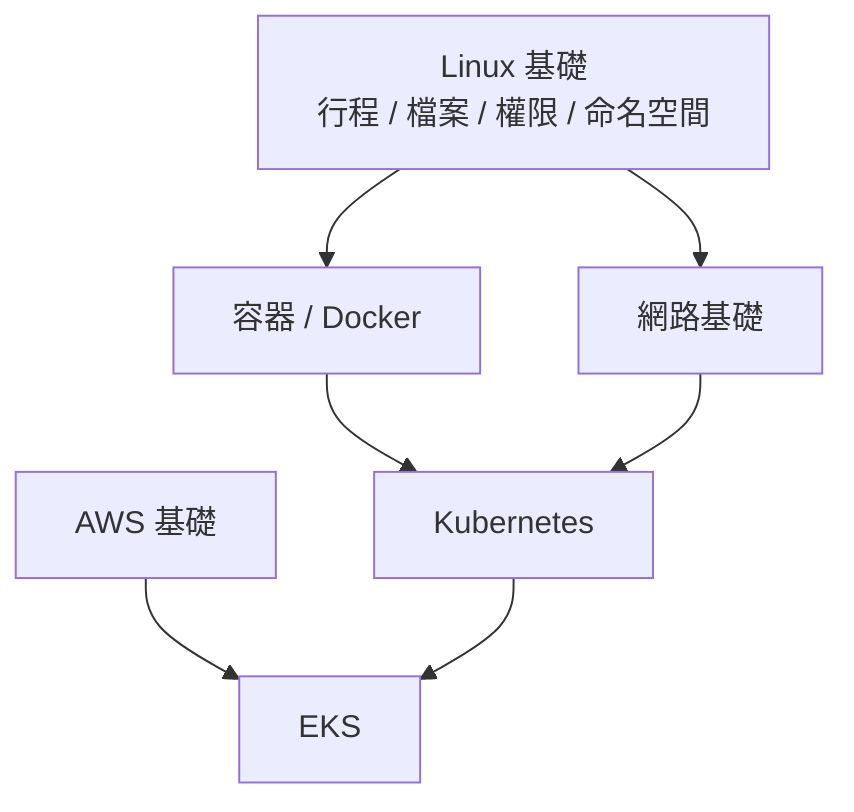

# 階段 0:前置基礎 (Prerequisites)

> **千萬別跳過這一章。** 很多人學 Kubernetes 學得很痛苦,根本原因是 Linux、容器、網路的基礎沒打好。K8s 的每一個觀念,幾乎都是這些基礎的延伸。

---

## 這一章要學什麼?

| 子章節 | 目錄 | 為什麼重要 |
|--------|------|-----------|
| **1. Linux 基礎** | [`01-linux-basics/`](./01-linux-basics/) | 容器就是「被隔離的 Linux 行程」;eBPF 直接在核心運作。**這是地基中的地基。** |
| **2. 容器與 Docker** | [`02-container-docker/`](./02-container-docker/) | K8s 管理的就是容器。不懂容器學 K8s = 空中樓閣。 |
| **3. 網路基礎** | [`03-networking/`](./03-networking/) | K8s 最難的部分就是網路(Service、Ingress、CNI)。 |
| **4. AWS 基礎** | [`04-aws-basics/`](./04-aws-basics/) | EKS 是跑在 AWS 上的,需要 IAM / VPC 等概念。 |

---

## 建議學習順序

1. **Linux 基礎**(最優先,務必扎實)→
2. **網路基礎**(可與 Linux 交錯學,兩者互補)→
3. **容器與 Docker**(用到 Linux 命名空間與網路觀念)→
4. **AWS 基礎**(這個可以晚一點,等快進入 EKS 階段再補也行)

> 💡 **給時間有限的人**:Linux + 容器 + 網路是進入 K8s 的「最低門檻」,一定要先完成。AWS 基礎可以等學完 K8s 核心、要進 EKS 前再讀。

---

## 本階段總檢核點

讀完這一章,你應該要能夠:

- [ ] 用指令在 Linux 裡操作檔案、查看與管理行程 (Process)、設定權限。
- [ ] 解釋什麼是命名空間 (Namespace) 與控制群組 (cgroup),以及它們如何構成「容器」。
- [ ] 用 Docker 建置映像檔、執行容器、處理網路與資料持久化。
- [ ] 看懂 IP / 子網路 / 路由 / NAT / DNS / iptables 的基本運作。
- [ ] (進 EKS 前)理解 AWS 的 IAM、VPC、子網路、安全群組概念。

全部打勾後,就可以前往 [階段 1:Kubernetes](../01-kubernetes/) 了 🚀
