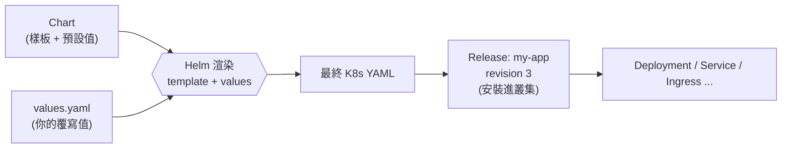
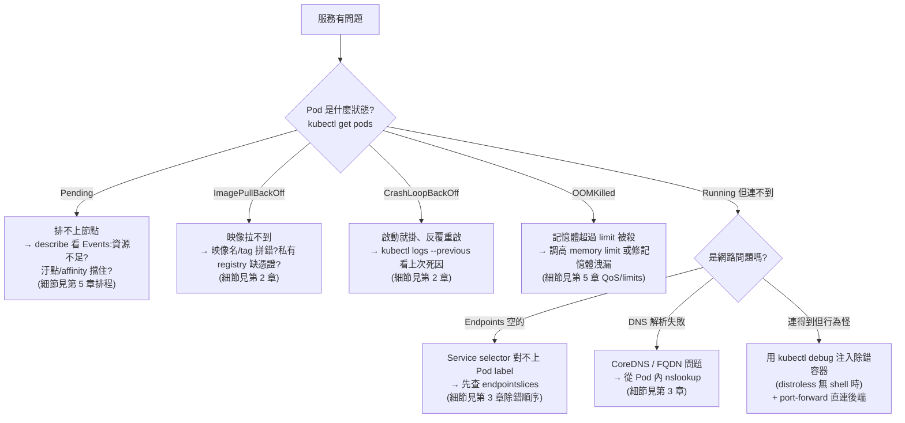
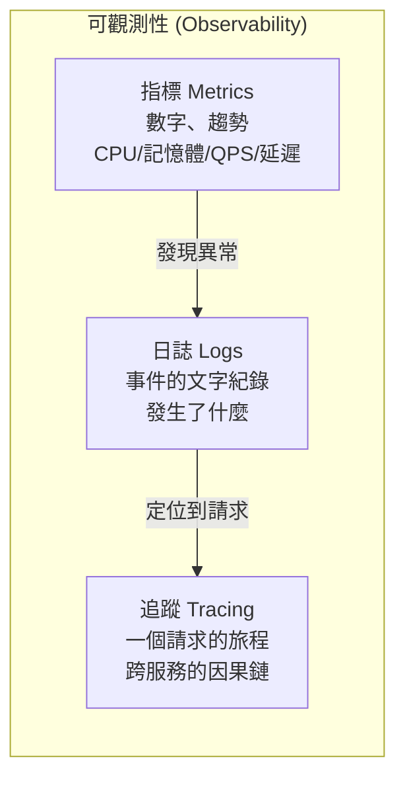
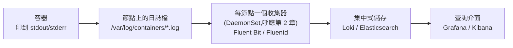

# 08 - 套件管理、進階除錯與可觀測性 (Helm, Debugging & Observability)

> 目標:跳出「手寫一堆 YAML」的階段,學會用套件管理 (package management) 打包與部署應用;在容器沒有 shell 也能除錯;並建立可觀測性 (Observability) 的全貌——當系統出狀況時,你知道該去哪裡看。讀完你要能用 Helm 安裝/升級/回滾、用 `kubectl debug` 注入除錯容器、講清楚指標/日誌/追蹤三本柱該用什麼工具。

---

## 1. 為什麼需要套件管理 (Package Management)

到這裡你已經會寫 Deployment、Service、Ingress、ConfigMap、Secret、HPA……一個真實應用的 YAML 加起來很容易破十個檔案。問題隨之而來:

- **多環境重複 (duplication across environments)**:`dev`、`staging`、`prod` 通常只差幾個值(副本數、映像版本、資源大小、網域),卻要把整套 YAML 複製貼上三份。改一個共同欄位要同步改三個地方,很容易漏。
- **版本與發布 (versioning & release)**:你怎麼知道 prod 現在跑的是「哪一版的這整組設定」?手動 `kubectl apply` 沒有「這是第幾版發布」的概念,升壞了也沒有乾淨的一鍵回滾(rollback)——`kubectl rollout undo`(第 2 章)只回滾單一 Deployment,不是「整組應用」。
- **參數化 (parameterization)**:同一套設定要能依環境帶入不同的值,而不是寫死。
- **分享與重用 (sharing & reuse)**:想裝一個別人寫好的 Redis / PostgreSQL / Prometheus,不該自己從零拼 YAML。

這就帶出兩條主流路線,本章會講清楚兩者的取捨:

| 路線 | 核心做法 | 一句話定位 |
|------|---------|-----------|
| **Helm** | 樣板 (template) + 變數 (values) | K8s 的**套件管理器**,類似 `apt` / `npm` / `brew` |
| **Kustomize** | 無樣板 (template-free) 的疊加 (overlay) | 用「基底 + 差異補丁」組裝 YAML,`kubectl` 內建 |

> 心法:**Helm 解決「打包、分發、版本化發布」**;**Kustomize 解決「同一套基底如何衍生出多環境變體」**。兩者不是互斥,實務上常常 Helm 產出基底、再用 Kustomize 做最後微調。

---

## 2. Helm:K8s 的套件管理器

把 Helm 想成 K8s 世界的 `apt` 或 `npm`:你不會手刻一個資料庫的所有 YAML,而是 `helm install` 一個現成的**套件 (package)**。這個套件在 Helm 裡叫 **Chart**。

### 2.1 三個核心概念:Chart / Values / Release

| 概念 | 類比 | 是什麼 |
|------|------|--------|
| **Chart** | `npm` 套件、`.deb` 檔 | 一個打包好的應用範本,內含 YAML 樣板與預設值 |
| **Values** | 安裝時的參數設定 | 餵給 Chart 的變數(副本數、映像、網域……),覆寫預設 |
| **Release** | 「已安裝的實例」 | Chart + 一組 Values 實際裝進叢集後的一個**具名、有版本**的部署 |

關鍵在於 **Chart 是樣板,Release 是實例**:同一個 Chart 可以用不同的 Values 在叢集裡裝成多個 Release(例如 `redis-cache` 和 `redis-session` 兩個 Release 都來自同一個 redis Chart)。而每個 Release 都有**版本號 (revision)**,這就是「整組應用一鍵回滾」的基礎。



### 2.2 常用指令

```bash
# --- 取得 Chart:加入 repo(Chart 的來源,類似 apt 的軟體源)---
helm repo add bitnami https://charts.bitnami.com/bitnami   # 加入一個常用的 Chart repo
helm repo update                                           # 更新本機快取的 repo 索引
helm search repo redis                                     # 在已加入的 repo 裡搜尋 redis

# --- 安裝:把 Chart 裝成一個 Release ---
helm install my-redis bitnami/redis                        # Release 名叫 my-redis
helm install my-redis bitnami/redis -n data --create-namespace  # 裝到 data 命名空間
helm install my-redis bitnami/redis --set architecture=standalone  # 用 --set 覆寫單一值

# --- 查看 ---
helm list                          # 列出目前命名空間的所有 Release(加 -A 看全叢集)
helm status my-redis               # 看某個 Release 的狀態與提示
helm get values my-redis           # 看這個 Release 實際生效的覆寫值
helm history my-redis              # 看 Release 的版本歷史(revision 1, 2, 3...)

# --- 升級:改版本或改設定,會產生新的 revision ---
helm upgrade my-redis bitnami/redis --set replica.replicaCount=3   # 改副本數
helm upgrade --install my-redis bitnami/redis -f my-values.yaml    # 沒裝就裝、有裝就升(冪等,CI 常用)

# --- 回滾:整組應用退回上一個 revision(對比第 2 章只能回滾單一 Deployment)---
helm rollback my-redis            # 回到上一版
helm rollback my-redis 1          # 回到指定的 revision 1

# --- 移除 ---
helm uninstall my-redis           # 移除整個 Release(連帶清掉它建立的所有資源)

# --- 不安裝、只「乾跑」看會產生什麼 YAML(超重要的除錯/審查手段)---
helm template my-redis bitnami/redis -f my-values.yaml    # 把樣板渲染成最終 YAML 印出來,不碰叢集
helm install my-redis bitnami/redis --dry-run --debug     # 模擬安裝,印出將套用的內容
```

> **`helm template` 與 `--dry-run` 是你最好的朋友**:在真的動叢集之前,先把「樣板 + values」渲染出來看一眼最終 YAML。很多「為什麼這個值沒生效」的問題,印出來看就一目了然。

### 2.3 values.yaml 覆寫概念

Chart 自帶一份 `values.yaml` 當**預設值**。你不該去改 Chart 本身,而是**另外提供一份自己的 values 來覆寫 (override)**。覆寫是「深層合併 (deep merge)」:你只寫想改的欄位,其餘沿用預設。

```yaml
# my-values.yaml — 只寫「我要改的」,其餘用 Chart 預設
replicaCount: 3                 # 覆寫副本數

image:
  repository: my-app
  tag: "1.4.2"                  # 永遠釘版本,別用 latest(呼應第 2 章)

resources:                      # 覆寫資源設定(呼應第 5 章 requests/limits)
  requests:
    cpu: "250m"
    memory: "256Mi"
  limits:
    cpu: "500m"
    memory: "512Mi"

ingress:
  enabled: true
  hosts:
    - host: app.example.com     # 不同環境帶不同網域,就是靠這層
```

```bash
# 套用自己的 values(-f 可疊多個,後面的覆蓋前面的;--set 又再覆蓋 -f)
helm upgrade --install my-app ./my-app-chart \
  -f values-common.yaml \      # 共同設定
  -f values-prod.yaml \        # 環境差異(prod)
  --set image.tag=1.4.3        # 臨時覆寫(優先序最高)
```

> **覆寫優先序(由低到高)**:Chart 預設 `values.yaml` → 你 `-f` 帶的檔(多個依序疊加)→ `--set` 命令列參數。這正好對應「多環境」需求:一份共同 values + 各環境一份差異 values,就能乾淨地養出 dev/staging/prod。

### 2.4 一個最小 Chart 結構

`helm create my-app` 會生出完整骨架,但最小可動的 Chart 只需要這幾樣:

```
my-app/
├── Chart.yaml          # 套件的「身分證」:名稱、版本、描述
├── values.yaml         # 預設值(使用者會覆寫這些)
└── templates/          # K8s YAML 樣板,裡面用 {{ }} 插入 values
    ├── deployment.yaml
    └── service.yaml
```

```yaml
# Chart.yaml — Chart 的中繼資料
apiVersion: v2
name: my-app
description: 我的第一個 Chart
version: 0.1.0          # Chart 本身的版本(改 Chart 結構時遞增)
appVersion: "1.4.2"     # 內含應用的版本(僅作標示)
```

```yaml
# templates/deployment.yaml — 樣板:用 {{ .Values.xxx }} 把 values 插進來
apiVersion: apps/v1
kind: Deployment
metadata:
  name: {{ .Release.Name }}-app        # .Release.Name 是安裝時的 Release 名
spec:
  replicas: {{ .Values.replicaCount }} # 從 values.yaml / 覆寫值取得
  selector:
    matchLabels:
      app: {{ .Release.Name }}
  template:
    metadata:
      labels:
        app: {{ .Release.Name }}
    spec:
      containers:
        - name: app
          image: "{{ .Values.image.repository }}:{{ .Values.image.tag }}"
```

> **設計理念**:Helm 把「不變的結構 (templates)」和「會變的值 (values)」分開。結構寫一次,值依環境抽換。這就是它能同時解決「重複」「參數化」「版本化發布」三個痛點的原因。

---

## 3. Kustomize:無樣板的疊加

Helm 用「樣板 + 變數」;**Kustomize 走完全不同的哲學:不用樣板 (template-free)**。你寫的永遠是「真正合法、能直接 `kubectl apply` 的 YAML」,然後用**補丁 (patch)** 在上面疊加差異。

### 3.1 base + overlays 心智模型

```
my-app/
├── base/                       # 基底:共同、完整的 YAML
│   ├── deployment.yaml
│   ├── service.yaml
│   └── kustomization.yaml      # 宣告 base 包含哪些檔
└── overlays/
    ├── dev/
    │   └── kustomization.yaml  # 引用 base,套上 dev 的差異補丁
    └── prod/
        ├── kustomization.yaml  # 引用 base,套上 prod 的差異補丁
        └── replicas-patch.yaml # 例如 prod 改成 5 副本
```

```yaml
# base/kustomization.yaml — 宣告基底由哪些資源組成
apiVersion: kustomize.config.k8s.io/v1beta1
kind: Kustomization
resources:
  - deployment.yaml
  - service.yaml
```

```yaml
# overlays/prod/kustomization.yaml — 站在 base 之上做差異
apiVersion: kustomize.config.k8s.io/v1beta1
kind: Kustomization
resources:
  - ../../base                 # 引用基底
namePrefix: prod-             # 所有資源名稱加上 prod- 前綴
images:
  - name: my-app
    newTag: "1.4.2"           # prod 用這個映像版本
patches:
  - path: replicas-patch.yaml # 套用副本數補丁
```

```yaml
# overlays/prod/replicas-patch.yaml — 只描述「要改的那塊」
apiVersion: apps/v1
kind: Deployment
metadata:
  name: my-app
spec:
  replicas: 5                  # prod 改成 5 副本
```

### 3.2 `kubectl apply -k` 內建支援

Kustomize 已內建在 `kubectl` 裡,不必額外安裝:

```bash
kubectl kustomize overlays/prod      # 先把疊加後的最終 YAML 渲染印出來(等同 helm template)
kubectl apply -k overlays/prod       # 直接套用 prod overlay(-k 就是走 kustomize)
kubectl delete -k overlays/prod      # 對應的刪除
```

> **為什麼有人偏好 Kustomize?** 因為它沒有樣板語言——你看到的每個檔案都是合法 K8s YAML,IDE 能驗證、肉眼好讀,不會掉進 Helm `{{ }}` 樣板的轉義地獄。代價是它不擅長「高度動態、需要邏輯判斷」的場景。

### 3.3 Helm vs Kustomize:何時用哪個

| 面向 | Helm | Kustomize |
|------|------|-----------|
| 機制 | 樣板 (template) + values | 無樣板,base + overlay 疊加 |
| 學習曲線 | 要學樣板語法 (`{{ }}`、函式) | 平緩,都是純 YAML |
| 參數化能力 | 強(可帶邏輯、迴圈、條件) | 弱(只能補丁式覆寫) |
| 版本化發布/回滾 | **內建**(Release revision、`helm rollback`) | 無(交給 Git / GitOps) |
| 安裝第三方套件 | **生態強**(現成 Chart 多到爆) | 不適合,沒有「套件市集」概念 |
| 工具依賴 | 要裝 `helm` | `kubectl` 內建 |
| 適用 | 打包分發應用、裝別人的東西 | 自家應用的多環境組裝 |

> **實務取捨**:裝「別人寫好的東西」(Prometheus、cert-manager、資料庫)→ 幾乎一定用 **Helm**。組裝「自家應用」跨多環境、且已經有 GitOps 管版本 → **Kustomize** 更乾淨。兩者也能合用:`helm template` 先渲染,再用 Kustomize 疊環境差異。

---

## 4. 進階除錯 (Advanced Debugging)

第 2 章已經建立了除錯基本功:`kubectl logs`、`describe`、`exec`、`get events`,以及常見 Pod 狀態表。這一節補上**更進階、更棘手場景**的武器,不重複前面已有的內容。

### 4.1 `kubectl debug` 與臨時容器 (Ephemeral Containers)

**為什麼需要?** 第 2 章教你 `kubectl exec -it <pod> -- sh` 進容器除錯。但正式環境的映像為了縮小體積與攻擊面,常用 **distroless** 或 scratch 基底——**裡面根本沒有 shell、沒有 `curl`、沒有 `ps`**。`kubectl exec` 進不去,因為沒有 `sh` 可執行。

解法是**臨時容器 (Ephemeral Container)**:在「已經在跑的 Pod」裡**臨時插入一個帶有除錯工具的容器**,它和目標容器共享同一個 Pod(共享網路、可看到彼此的行程),但不影響原容器。`kubectl debug` 就是做這件事的指令。

```bash
# 在已存在的 Pod 裡注入一個臨時除錯容器(用滿載工具的映像)
kubectl debug -it my-pod --image=busybox --target=my-app
#   -it           互動式進去
#   --image       除錯容器用什麼映像(busybox / nicolaka/netshoot 等)
#   --target      要「附身」到 Pod 裡哪個容器(共享其行程命名空間,能看到它的 process)

# 網路除錯神器映像:netshoot 內含 curl/dig/tcpdump/nc...
kubectl debug -it my-pod --image=nicolaka/netshoot --target=my-app
#   進去後就能對 localhost 打 curl、解 DNS、抓封包,診斷「容器本身沒工具」的服務

# 複製一份 Pod 來改造除錯(不動原 Pod):換個進入點、改成有 shell 的映像
kubectl debug my-pod -it --image=ubuntu --share-processes --copy-to=my-pod-debug
#   --copy-to        複製成新 Pod 來搞,原 Pod 保持原樣(適合不想干擾線上流量時)
#   --share-processes 讓除錯容器看得到原容器的行程
```

> **臨時容器的特性**:它沒有資源保證、不會重啟、不能設探針——它就是個「臨時診斷工具」,診斷完 Pod 重建就消失。這也是為什麼它和正常容器分開(放在 `ephemeralContainers` 欄位),不會污染 Pod 的正式規格。

**進節點除錯**:有時問題不在 Pod 而在節點本身(磁碟滿了、kubelet 異常、核心日誌)。`kubectl debug node/<node>` 會起一個能存取該節點檔案系統與命名空間的特權容器:

```bash
kubectl debug node/worker-1 -it --image=ubuntu
#   進去後,節點的根檔案系統會掛在 /host 底下
#   chroot /host 就能像 SSH 進節點一樣操作(看 /var/log、檢查 disk、跑 crictl 等)
```

### 4.2 其他進階用法:cp / port-forward / events / describe

```bash
# kubectl cp:在本機與容器之間複製檔案(撈日誌檔、塞測試資料、取 heap dump)
kubectl cp my-pod:/var/log/app.log ./app.log          # 從容器撈出檔案到本機
kubectl cp ./fixture.json my-pod:/tmp/fixture.json     # 把本機檔案塞進容器
kubectl cp my-pod:/data ./data -c sidecar              # 多容器 Pod 用 -c 指定容器

# kubectl port-forward:把本機埠轉發到 Pod/Service,繞過 Service/Ingress 直接戳後端
kubectl port-forward pod/my-pod 8080:80                # 本機 8080 → Pod 的 80
kubectl port-forward svc/my-svc 5432:5432              # 直連資料庫 Service 做查詢
#   用途:本機用瀏覽器/工具直接連叢集內部服務,診斷「是應用問題還是 Service/Ingress 問題」

# kubectl get events --sort-by:事件預設不照時間排,排錯時務必排序(第 6 節詳述)
kubectl get events --sort-by=.lastTimestamp            # 依時間排序,最新的在最後
kubectl get events --sort-by=.lastTimestamp -A         # 全叢集
kubectl get events --field-selector type=Warning       # 只看 Warning 等級的事件
kubectl get events --field-selector involvedObject.name=my-pod  # 只看某個物件的事件

# kubectl describe 進階:不只 Pod,任何資源都能 describe,Events 區塊是金礦
kubectl describe pod my-pod                             # 底部 Events 列出排程/拉映像/探針失敗原因
kubectl describe node worker-1                          # 看節點容量、汙點、已配置資源、壓力狀態
```

### 4.3 常見故障決策樹

把第 2、3 章的零散除錯知識收束成一張流程圖。**注意:這張圖只做「分流定位」,實際每個分支的細部指令請回對應章節**——不在這裡重寫。



> 排錯心法:**先用 `kubectl get pods` 定位「卡在哪個階段」,再決定往哪查。** 大多數問題在 `kubectl describe` 的 Events 區塊或 `kubectl logs --previous` 裡就有答案——這兩個是進階手段(debug/port-forward)之前的第一站。

---

## 5. 可觀測性 (Observability) 三本柱

當系統在正式環境出狀況,你不能每次都 `kubectl exec` 進去翻——你需要**系統性地觀察**它。可觀測性建立在三本柱 (three pillars) 上:



直覺區分:**指標告訴你「有沒有問題、嚴不嚴重」(是什麼);日誌告訴你「發生了什麼細節」(為什麼);追蹤告訴你「這個慢請求卡在哪一段」(在哪裡)。**

### 5.1 指標 (Metrics):metrics-server vs Prometheus + Grafana

第 5 章裝過 **metrics-server**,讓 `kubectl top` 和 HPA 能運作。但它的定位很有限,別把它當監控系統:

| 面向 | metrics-server | Prometheus + Grafana |
|------|---------------|----------------------|
| 用途 | 餵給 HPA / `kubectl top` 的**即時**資源用量 | 完整的監控與告警系統 |
| 保存 | **不存歷史**(只有當下) | 時序資料庫,可查過去趨勢 |
| 指標範圍 | 只有 CPU / 記憶體 | 任意自訂指標(QPS、延遲、佇列長度…) |
| 查詢 | 無查詢語言 | PromQL 強大查詢 |
| 視覺化 / 告警 | 無 | Grafana 儀表板 + Alertmanager 告警 |

> 簡單說:**metrics-server 是給叢集內部機制(HPA)用的「即時體溫計」;Prometheus + Grafana 才是給人看的「監控中心」。** Prometheus 主動「抓取 (scrape)」各服務暴露的 `/metrics` 端點,存成時序資料;Grafana 把它畫成儀表板;Alertmanager 在指標越線時通知你。正式環境兩者通常用 **kube-prometheus-stack** 這個 Helm Chart 一次裝齊(呼應第 2 節:裝別人的東西就用 Helm)。

### 5.2 日誌 (Logs):從 stdout 到集中式收集

回想 Linux 章的觀念:程式把訊息寫到**標準輸出 (stdout)** 與**標準錯誤 (stderr)**。K8s 的日誌哲學就建立在這上面:

**容器化應用不該自己寫日誌檔,而是直接印到 stdout/stderr。** 為什麼?因為容器是用過即丟的(第 2 章),寫進容器內的檔案會隨 Pod 消失。印到 stdout 後,容器執行環境會幫你接住。

日誌的流動路徑:



- `kubectl logs`(第 2 章)讀的就是**節點上那份檔案**——所以 Pod 一被刪,日誌也就沒了。這正是需要**集中式收集 (centralized logging)** 的原因。
- **收集器用 DaemonSet 部署**(每個節點一個,第 2 章),讀取該節點所有容器的日誌檔,轉送到集中儲存。
- 常見組合:**Fluent Bit / Fluentd**(收集)+ **Loki** 或 **Elasticsearch**(儲存)+ **Grafana / Kibana**(查詢)。後者就是常聽到的 **EFK**(Elasticsearch + Fluentd + Kibana)堆疊。

> **設計理念**:把「產生日誌」和「收集/儲存日誌」徹底解耦。應用只管印到 stdout,完全不需要知道日誌最後去哪——換收集方案完全不必改應用。這和 K8s 一貫的解耦哲學一致。

### 5.3 追蹤 (Tracing):OpenTelemetry / Jaeger(點到為止)

在微服務架構下,一個使用者請求可能穿過十幾個服務。當它變慢,指標只告訴你「整體變慢」、日誌散落在各服務裡——你需要**分散式追蹤 (distributed tracing)** 把「同一個請求」在各服務的足跡串成一條時間軸,看出**到底卡在哪一段**。

- **OpenTelemetry (OTel)**:目前的業界標準,提供統一的 SDK 與協定來產生追蹤(以及指標、日誌)資料,不綁特定後端。
- **Jaeger**:常見的追蹤資料後端與視覺化介面,把一個請求畫成跨服務的「瀑布圖 (waterfall)」。

> 追蹤需要**應用程式碼配合**(植入 instrumentation 產生 trace context 並跨服務傳遞),不像指標/日誌那樣幾乎免費。學習階段知道「它解決跨服務因果定位」即可,真正導入是進階主題。

### 5.4 「我想看什麼 → 用什麼工具」對照

| 我想看 / 我想知道 | 屬於哪根柱 | 用什麼工具 |
|-------------------|-----------|-----------|
| 這個 Pod 現在吃多少 CPU/記憶體? | 指標(即時) | `kubectl top`(metrics-server) |
| 過去一小時延遲/QPS 的趨勢? | 指標(歷史) | Prometheus + Grafana |
| 指標越線時通知我 | 指標(告警) | Alertmanager |
| 某個容器剛剛印了什麼? | 日誌(即時) | `kubectl logs`(含 `--previous`) |
| 跨多個 Pod / 已消失 Pod 的日誌 | 日誌(集中) | Loki / EFK + Grafana / Kibana |
| 一個慢請求到底卡在哪個服務? | 追蹤 | OpenTelemetry + Jaeger |
| 叢集剛剛發生了什麼操作事件? | (事件,見下節) | `kubectl get events` |

---

## 6. Kubernetes 事件 (Events) 在排錯的角色

**事件 (Event)** 是 K8s 自己產生的、關於「叢集裡發生了什麼」的紀錄:Scheduler 把 Pod 排到哪、kubelet 拉映像成功/失敗、探針失敗、Pod 被 OOMKilled、HPA 擴縮……它們是介於「指標」和「日誌」之間的第四類訊號,專門記錄**控制平面對你的物件做了什麼**。

排錯時事件常常是**最快給出答案**的地方——比翻日誌還快:

```bash
kubectl describe pod my-pod                      # 物件層級:底部 Events 區塊就是它的相關事件
kubectl get events --sort-by=.lastTimestamp      # 叢集層級:務必排序(預設不照時間,很難讀)
kubectl get events --field-selector type=Warning # 只看警告,排錯時先看這個
kubectl events --for pod/my-pod --watch          # 新版指令:即時盯著某物件的事件流
```

> **兩個關鍵注意事項**:
> 1. **事件預設只保留約 1 小時**(存在 etcd,會過期被清掉)。所以事件是「現場急救」用的,不是長期稽核紀錄——要長期留存得靠日誌系統收走。
> 2. **事件預設不照時間排序**,`--sort-by=.lastTimestamp` 幾乎是必加的。這是第 2 章那條指令背後的原因。

把事件放進前面的對照表:當你問「叢集剛剛對我的 Pod 做了什麼決定/動作」,第一個該看的就是事件,而不是應用日誌。

---

## 7. 結語:邁向 Production 與進階階段的橋樑

這一章的三組能力——**套件管理、進階除錯、可觀測性**——正是從「能把東西跑起來」邁向「能在正式環境長期穩定運維」的分水嶺:

- **Helm / Kustomize** 把「一堆手寫 YAML」變成**可版本化、可重複、可多環境**的部署單位。這直接通往下一階段的 **GitOps**(用 Argo CD / Flux 把「叢集該長什麼樣」宣告在 Git 裡,自動同步)——而 GitOps 的部署單位,正是 Helm Chart 或 Kustomize overlay。
- **`kubectl debug` / 臨時容器**讓你在最嚴苛(distroless、無 shell)的正式環境也能診斷問題。
- **可觀測性三本柱**是正式環境的眼睛。當你之後接觸 **CRD / Operator**(把運維知識寫成程式自動管理應用),這些 Operator 本身也會暴露指標、產生事件——你今天學的觀察方法,屆時照樣適用。

換句話說:你已經會「蓋房子」(前七章),這一章開始學「交屋後怎麼長期住得安心」。下一階段的 GitOps 與 Operator,就是把這份運維能力進一步自動化。

---

## 動手練習

1. `helm repo add bitnami ...` 後 `helm install` 一個 Redis,用 `helm list`、`helm status`、`helm get values` 觀察 Release;再 `helm upgrade --set` 改副本數,`helm history` 看 revision 增加,最後 `helm rollback` 退回。
2. 用 `helm create my-app` 生一個 Chart,改 `values.yaml` 的副本數與映像,用 `helm template` 把渲染結果印出來核對,再 `helm install --dry-run --debug` 模擬安裝。
3. 用 Kustomize 寫一個 `base` + `overlays/dev` + `overlays/prod`,prod 改成 5 副本、加 `prod-` 前綴,用 `kubectl kustomize overlays/prod` 看疊加結果,再 `kubectl apply -k`。
4. 部署一個 distroless 映像的應用(故意沒有 shell),先試 `kubectl exec` 確認進不去,再用 `kubectl debug --image=nicolaka/netshoot --target=...` 注入除錯容器,從裡面 `curl localhost`。
5. 用 `kubectl debug node/<node>` 進到某個節點,`chroot /host` 後查看 `/var/log` 與磁碟使用量。
6. 故意做出每種故障各一(Pending / ImagePullBackOff / CrashLoopBackOff / OOMKilled / Service selector 打錯),對照第 4.3 的決策樹,練習用 `kubectl get pods` + `describe` Events + `logs --previous` 定位。
7. 用 `kubectl get events --sort-by=.lastTimestamp` 與 `--field-selector type=Warning` 觀察上面練習產生的事件,體會事件比日誌更快指出原因。
8. (進階)用 Helm 裝 `kube-prometheus-stack`,`kubectl port-forward` 進 Grafana,看內建的叢集儀表板。

---

## 本章檢核點 (Checklist)

- [ ] 能說出手寫 YAML 在多環境、版本化、重複上的痛點,以及 Helm 與 Kustomize 各自的定位
- [ ] 能解釋 Chart / Values / Release 的關係,以及「Chart 是樣板、Release 是有版本的實例」
- [ ] 會用 `helm repo add` / `install` / `upgrade` / `rollback` / `uninstall` 管理一個 Release
- [ ] 會用 `helm template` 與 `--dry-run` 在動叢集前先檢視最終 YAML
- [ ] 理解 values 覆寫的深層合併與優先序(預設 → `-f` → `--set`),並用它養多環境
- [ ] 能說出最小 Chart 結構(Chart.yaml / values.yaml / templates/)各自的角色
- [ ] 能解釋 Kustomize base + overlay 的無樣板疊加,並用 `kubectl apply -k` 套用
- [ ] 能用對照表說明何時選 Helm、何時選 Kustomize
- [ ] 知道為什麼 distroless 容器無法 `exec`,並會用 `kubectl debug` 注入臨時容器除錯
- [ ] 會用 `kubectl debug node/<node>` 進節點除錯
- [ ] 會用 `kubectl cp` / `port-forward` / `get events --sort-by` 等進階除錯手段
- [ ] 能照故障決策樹分流定位 Pending / ImagePullBackOff / CrashLoopBackOff / OOMKilled / 連不到
- [ ] 能說明可觀測性三本柱(指標 / 日誌 / 追蹤)各自回答什麼問題
- [ ] 能區分 metrics-server 與 Prometheus + Grafana 的定位差異
- [ ] 理解容器日誌「印到 stdout → 節點 → DaemonSet 收集器 → 集中儲存」的流動與解耦理念
- [ ] 知道 OpenTelemetry / Jaeger 解決跨服務追蹤,且需應用配合
- [ ] 理解 Kubernetes 事件的角色、只保留約 1 小時、預設不照時間排序

> 下一階段:把這些能力組裝起來邁向正式環境——GitOps(Argo CD / Flux)、CRD 與 Operator,以及多叢集與供應鏈安全。回到 [README.md](./README.md) 對照整體檢核點,確認核心都已穩固再往上爬。
