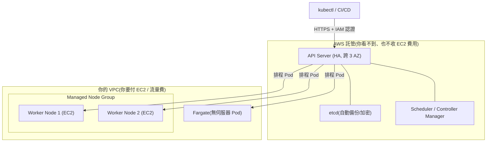
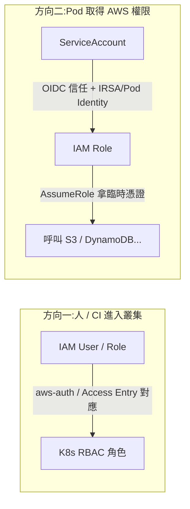
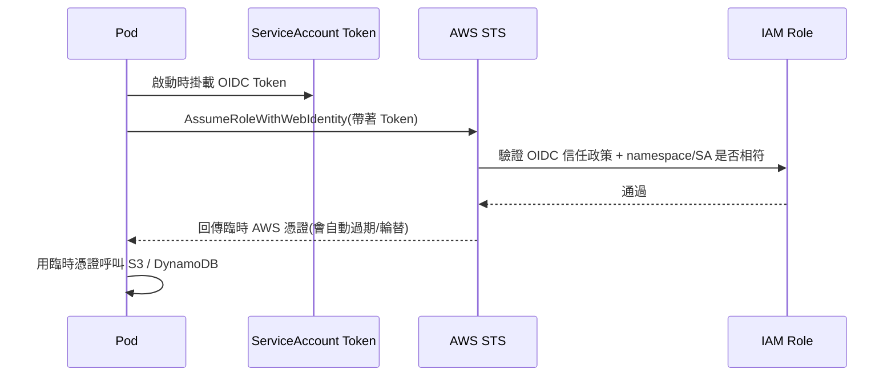
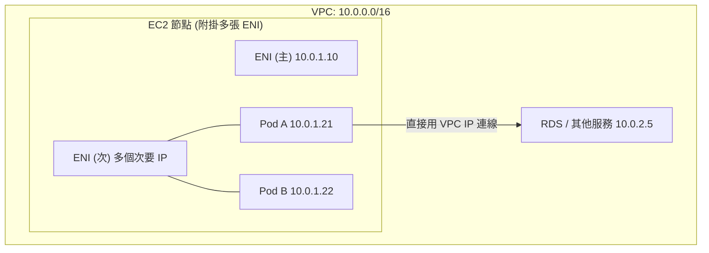
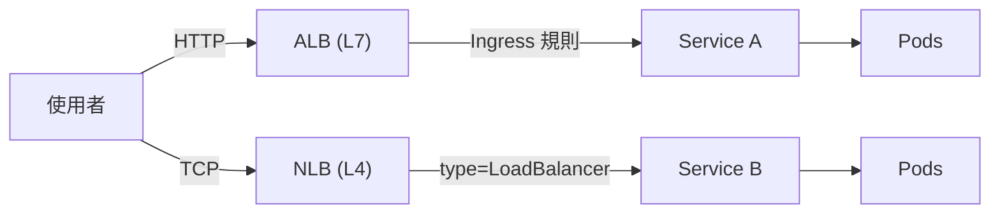
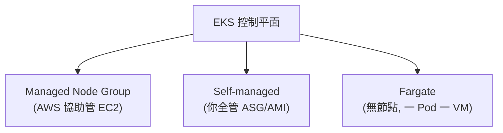
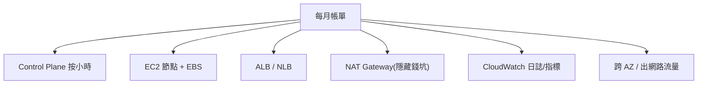

# EKS (Amazon Elastic Kubernetes Service) 完整教材

> 本章定位:你已經掌握 Kubernetes (K8s) 的核心觀念(Pod、Deployment、Service、Namespace、RBAC…)。這一章專注在「K8s 跑在 AWS 上的託管版本」,以及它與各種 AWS 服務的整合點。我們會反覆對照「自建 K8s」與「EKS」的差異,讓你知道哪些事 AWS 幫你扛了、哪些事你還是得自己管。
>
> 全章特別強調 **成本控制 (Cost Control)**:EKS 的 control plane 是「按小時收費」的,節點 (Node) 也要錢,**練習做完一定要刪叢集**。

---

## 目錄

1. [EKS 是什麼](#1-eks-是什麼)
2. [建立第一個叢集](#2-建立第一個叢集)
3. [IAM 與 K8s 的整合(本章最核心)](#3-iam-與-k8s-的整合本章最核心)
4. [網路:VPC CNI 與 Pod 網路](#4-網路vpc-cni-與-pod-網路)
5. [負載平衡與 Ingress](#5-負載平衡與-ingress)
6. [儲存:EBS 與 EFS CSI Driver](#6-儲存ebs-與-efs-csi-driver)
7. [節點管理](#7-節點管理)
8. [可觀測性與維運](#8-可觀測性與維運)
9. [成本與清理(務必精讀)](#9-成本與清理務必精讀)
10. [本章檢核點 (Checklist)](#10-本章檢核點-checklist)

---

## 1. EKS 是什麼

**Amazon EKS (Elastic Kubernetes Service)** 是 AWS 提供的「託管式 Kubernetes」服務。它最關鍵的賣點是:**AWS 幫你管理整個控制平面 (Control Plane)**,你只需要負責工作節點 (Worker Node) 與上面跑的應用。

### 1.1 責任分工:誰管什麼

在自建 K8s(例如用 kubeadm 自己架)時,你要自己負責:API Server、etcd、Scheduler、Controller Manager 的高可用 (HA)、備份、升級、憑證輪替…這些都是「凌晨被 call 起來」的常見來源。EKS 把這一整塊接走了。

| 元件 / 工作 | 自建 K8s (Self-managed) | EKS |
|---|---|---|
| API Server | 你自己架、自己做 HA | **AWS 託管**(跨 3 個可用區) |
| etcd(資料庫) | 你自己架、自己備份 | **AWS 託管**(自動備份、加密) |
| Scheduler / Controller Manager | 你自己跑 | **AWS 託管** |
| Control Plane 升級 | 你自己做、風險自負 | 你按一下,AWS 執行 |
| 工作節點 (Worker Node) | 你自己管 | **你自己管**(但有 Managed Node Group 協助) |
| CNI / Ingress / 儲存外掛 | 你自己裝 | 你自己裝(但 AWS 有官方外掛) |
| 作業系統修補 (OS Patching) | 你自己做 | Node 上你自己做(或用 Bottlerocket/Fargate) |

> 重點觀念:**EKS 不是「全託管」,是「控制平面託管」。** 資料平面 (Data Plane,也就是節點與應用) 大部分還是你的責任。

### 1.2 與 GKE / AKS 的定位

| 項目 | EKS (AWS) | GKE (Google) | AKS (Azure) |
|---|---|---|---|
| Control Plane 收費 | **按小時收費**(約 $0.10/hr,標準支援) | Autopilot/Standard 各有計價,有一個免費叢集額度 | 標準層免費,進階 SLA 收費 |
| 預設體驗 | 偏「組裝」,彈性高、要自己接很多東西 | 偏「開箱即用」,自動化程度公認最高 | 介於兩者之間 |
| 與雲整合 | IAM、VPC、ALB/NLB、EBS/EFS… | IAM、VPC、Cloud LB… | Entra ID、VNet… |

> 簡單記:**GKE 最「自動」,EKS 最「可組裝」也最貼近 AWS 生態。** 如果你的公司重度使用 AWS,EKS 的整合(IAM、VPC、ALB)是最大價值。

### 1.3 架構總覽圖



### 動手練習 1

1. 用一句話向同事解釋:「EKS 幫我管什麼?我還要管什麼?」
2. 列出三件「自建 K8s 要做、但 EKS 幫你做掉」的工作。
3. 思考:你的團隊選 EKS 而非 GKE 的理由會是什麼?(提示:現有 AWS 投資、IAM、VPC)

---

## 2. 建立第一個叢集

建立 EKS 叢集主流有三種方式:**eksctl**(最快上手)、**Terraform**(IaC、團隊正式環境推薦)、**AWS Console / CLI**(手動,不建議生產用)。本章以 eksctl 入門,並簡述 Terraform。

### 2.1 前置準備

```bash
# 1. 安裝 AWS CLI 並設定憑證(需要有權限的 IAM 使用者/角色)
aws configure
aws sts get-caller-identity   # 確認你是誰、在哪個帳號

# 2. 安裝 eksctl(官方 EKS 建叢集工具)
#    macOS: brew install eksctl
#    Linux: 參考官方 release 下載 binary
eksctl version

# 3. 安裝 kubectl(版本要與叢集 K8s 版本相近)
kubectl version --client
```

> 成本提醒:**從你建立叢集那一刻起,control plane 就開始按小時計費。** 所以「建好 → 練習 → 立刻刪掉」是練習的標準節奏。

### 2.2 eksctl 快速建立叢集

最簡單的一行指令(背後其實做了非常多事:建 VPC、子網路、IAM 角色、Node Group…):

```bash
# 用 eksctl 建立一個叢集(會自動建立一整套 VPC 與節點)
eksctl create cluster \
  --name my-first-eks \           # 叢集名稱
  --region ap-northeast-1 \       # 東京區(離台灣近、延遲低)
  --version 1.30 \                # K8s 版本
  --nodegroup-name ng-default \   # 節點群組名稱
  --node-type t3.medium \         # 節點機型(練習用小一點,省錢)
  --nodes 2 \                     # 想要的節點數
  --nodes-min 1 --nodes-max 3 \   # 自動擴縮的上下限
  --managed                       # 使用 Managed Node Group(推薦)
```

> 這個指令通常要跑 **15~20 分鐘**(它在背後用 CloudFormation 建一堆資源)。完成後 eksctl 會自動幫你寫好 `~/.kube/config`。

更專業的做法是用 **設定檔 (Config File)**,讓建叢集這件事可以版本控管:

```yaml
# cluster.yaml — 用 eksctl 的宣告式設定檔建立叢集
apiVersion: eksctl.io/v1alpha5
kind: ClusterConfig

metadata:
  name: my-first-eks
  region: ap-northeast-1
  version: "1.30"

# 啟用 OIDC(IRSA 一定需要,後面第 3 章會用到)
iam:
  withOIDC: true

managedNodeGroups:
  - name: ng-default
    instanceType: t3.medium
    desiredCapacity: 2
    minSize: 1
    maxSize: 3
    volumeSize: 20            # 每個節點的 EBS 磁碟大小 (GiB)
    privateNetworking: true   # 節點放在私有子網路(較安全)

# 啟用控制平面日誌(送到 CloudWatch,注意:會產生費用)
cloudWatch:
  clusterLogging:
    enableTypes: ["api", "audit", "authenticator"]
```

```bash
# 用設定檔建立
eksctl create cluster -f cluster.yaml

# 驗證
kubectl get nodes              # 應看到節點 Ready
kubectl get pods -A            # 看系統 Pod(coredns、aws-node、kube-proxy)
```

### 2.3 Terraform 方式(簡述)

正式環境通常用 **Terraform** 搭配官方的 `terraform-aws-modules/eks/aws` 模組,這樣叢集設定就是程式碼、可審查、可重複建立。

```hcl
# main.tf — 用官方 EKS module 建立(節錄,實務上還要先建 VPC module)
module "eks" {
  source  = "terraform-aws-modules/eks/aws"
  version = "~> 20.0"

  cluster_name    = "my-first-eks"
  cluster_version = "1.30"

  vpc_id     = module.vpc.vpc_id                 # 來自 vpc module
  subnet_ids = module.vpc.private_subnets

  # 用新的 Access Entries 管理權限(取代 aws-auth,第 3 章說明)
  enable_cluster_creator_admin_permissions = true

  eks_managed_node_groups = {
    default = {
      instance_types = ["t3.medium"]
      min_size       = 1
      max_size       = 3
      desired_size   = 2
    }
  }
}
```

```bash
terraform init
terraform plan      # 先看會建立什麼(很重要,確認不會超預算)
terraform apply
# 練習完務必:terraform destroy
```

> **eksctl vs Terraform 怎麼選?**
> - 學習、快速 demo、想最快看到結果 → **eksctl**
> - 團隊協作、正式環境、要 code review 與狀態管理 → **Terraform**

### 動手練習 2

1. 用 `eksctl create cluster -f cluster.yaml` 建一個叢集。
2. `kubectl get nodes -o wide`,觀察節點的「INTERNAL-IP」是不是 VPC 內的私有 IP。
3. 到 AWS Console 的 CloudFormation,看看 eksctl 幫你建了哪些 Stack(你會嚇一跳它建了多少東西)。
4. **練習結束別忘了刪**(指令見第 9 章),不然會持續扣費。

---

## 3. IAM 與 K8s 的整合(本章最核心)

這一章是 EKS **最容易卡關**、也最重要的部分。原因是:EKS 同時存在「兩套權限系統」,而它們本來互不相識:

- **AWS IAM**:決定「你這個 AWS 身份能不能呼叫 AWS API」(例如能不能 `eks:DescribeCluster`、能不能讀 S3)。
- **Kubernetes RBAC**:決定「你這個 K8s 使用者能不能 `kubectl get pods`」。

EKS 要做的事,就是把這兩套接起來。會分成兩個方向來談:
- **方向一(人 → 叢集)**:我的 IAM 身份,如何對應到 K8s 裡的角色?→ aws-auth / Access Entries
- **方向二(Pod → AWS)**:叢集裡的 Pod,如何安全地取得 AWS 權限去呼叫 AWS API?→ IRSA / Pod Identity



### 3.1 方向一:人如何進入叢集(aws-auth → Access Entries)

當你執行 `kubectl get pods` 時,kubectl 會用 AWS 的 IAM 身份去向 EKS API Server 認證。EKS 需要知道:「這個 IAM 身份對應到 K8s 裡的哪個使用者 / 群組?」

**舊做法:`aws-auth` ConfigMap**

過去這個對應關係存在 `kube-system` 命名空間的一個叫 `aws-auth` 的 ConfigMap 裡:

```yaml
# aws-auth ConfigMap(舊做法,容易手殘改壞、改錯就全員鎖在外面)
apiVersion: v1
kind: ConfigMap
metadata:
  name: aws-auth
  namespace: kube-system
data:
  mapRoles: |
    - rolearn: arn:aws:iam::111122223333:role/eks-node-role
      username: system:node:{{EC2PrivateDNSName}}
      groups:
        - system:bootstrappers
        - system:nodes
  mapUsers: |
    - userarn: arn:aws:iam::111122223333:user/alice
      username: alice
      groups:
        - system:masters       # 給 alice 等同 cluster-admin
```

> aws-auth 的痛點:它是一個 ConfigMap,**改錯一個字、所有人都進不去叢集**,而且沒有 IAM 層級的稽核。

**新做法(推薦):Access Entries + Access Policies**

AWS 後來推出 **存取項目 (Access Entries)**,直接用 AWS API / Console 管理「IAM 身份 → K8s 權限」的對應,不再需要手改 ConfigMap:

```bash
# 用 Access Entry 把一個 IAM 角色加入叢集,並賦予叢集管理員權限
aws eks create-access-entry \
  --cluster-name my-first-eks \
  --principal-arn arn:aws:iam::111122223333:role/DevOpsRole

aws eks associate-access-policy \
  --cluster-name my-first-eks \
  --principal-arn arn:aws:iam::111122223333:role/DevOpsRole \
  --policy-arn arn:aws:eks::aws:cluster-access-policy/AmazonEKSClusterAdminPolicy \
  --access-scope type=cluster
```

| 比較 | aws-auth ConfigMap(舊) | Access Entries(新,推薦) |
|---|---|---|
| 管理介面 | 手改 ConfigMap | AWS API / Console / IaC |
| 改錯的後果 | 可能全員鎖在外 | 較安全、可逐項管理 |
| 稽核 | 弱 | 有 IAM/CloudTrail 紀錄 |
| 預設政策 | 無 | 有 ClusterAdmin / Admin / View 等內建政策 |

### 3.2 方向二:Pod 如何取得 AWS 權限(IRSA)

這是面試與實戰都超高頻的主題。

**問題情境**:你有個 Pod 要去讀 S3。怎麼給它 AWS 權限?

- ❌ **錯誤做法**:把 AWS Access Key 寫在環境變數 / Secret 裡。金鑰會外洩、不會輪替、權限太大。
- ❌ **次佳做法**:用節點的 IAM 角色 (Instance Profile)。問題是**同一節點上所有 Pod 共用同一組權限**,違反最小權限原則。
- ✅ **正解:IRSA (IAM Roles for Service Accounts)**。讓「**每一個 ServiceAccount**」對應到「**一個 IAM 角色**」,Pod 用這個 SA 就只拿到它該有的權限。

**原理:OIDC + ServiceAccount Token**

1. EKS 叢集會有一個 **OIDC 提供者 (OIDC Provider)** 的 URL。
2. 你在 IAM 建立一個角色,它的「信任政策 (Trust Policy)」寫明:**「我信任這個叢集的 OIDC,而且只信任 `namespace:serviceaccount` 是某某的請求」**。
3. 當 Pod 啟動,K8s 會把一個「**有時效的 OIDC Token**(Projected ServiceAccount Token)」掛載進 Pod。
4. AWS SDK 自動拿這個 Token 去 STS `AssumeRoleWithWebIdentity`,換到一組**臨時、會自動輪替**的 AWS 憑證。



**用 eksctl 一鍵設定 IRSA**:

```bash
# 1. 確認叢集已啟用 OIDC(cluster.yaml 裡 withOIDC: true,或手動關聯)
eksctl utils associate-iam-oidc-provider \
  --cluster my-first-eks --approve

# 2. 建一個 ServiceAccount,並綁定一個有 S3 唯讀權限的 IAM 角色
eksctl create iamserviceaccount \
  --cluster my-first-eks \
  --namespace default \
  --name s3-reader \
  --attach-policy-arn arn:aws:iam::aws:policy/AmazonS3ReadOnlyAccess \
  --approve
```

上面這個指令會幫你:建好 IAM 角色 + 信任政策、建好 K8s ServiceAccount,並在 SA 上加好註解 (annotation):

```yaml
# 產生出來的 ServiceAccount 長這樣(關鍵是 annotation)
apiVersion: v1
kind: ServiceAccount
metadata:
  name: s3-reader
  namespace: default
  annotations:
    # 這行 annotation 就是 IRSA 的核心:把 SA 綁到某個 IAM 角色
    eks.amazonaws.com/role-arn: arn:aws:iam::111122223333:role/eksctl-...-s3-reader
```

接著只要讓 Pod 使用這個 SA,它就自動有 S3 唯讀權限:

```yaml
apiVersion: v1
kind: Pod
metadata:
  name: test-s3
spec:
  serviceAccountName: s3-reader   # 用這個 SA → 自動取得對應 IAM 角色權限
  containers:
    - name: app
      image: amazon/aws-cli
      command: ["sleep", "3600"]
```

```bash
# 驗證:進到 Pod 裡執行,應該能成功(因為 SA 綁了 S3 唯讀角色)
kubectl exec -it test-s3 -- aws s3 ls
```

### 3.3 EKS Pod Identity(更新、更簡單的做法)

AWS 後來又推出 **EKS Pod Identity**,目標是把 IRSA 弄得更簡單。差異在於:

- **IRSA**:每個叢集要設一個 OIDC 提供者;IAM 角色信任政策綁定該叢集的 OIDC。跨叢集要重設。
- **Pod Identity**:裝一個 **Pod Identity Agent 外掛**,用一條 `CreatePodIdentityAssociation` 把「叢集 + namespace + SA」對應到「IAM 角色」,**不需要管 OIDC**,且同一個角色可重複用在多個叢集。

```bash
# 1. 安裝 Pod Identity Agent 外掛
eksctl create addon --name eks-pod-identity-agent --cluster my-first-eks

# 2. 建立關聯(把 namespace/SA 綁到一個 IAM 角色)
aws eks create-pod-identity-association \
  --cluster-name my-first-eks \
  --namespace default \
  --service-account s3-reader \
  --role-arn arn:aws:iam::111122223333:role/my-s3-role
```

| 比較 | IRSA | Pod Identity |
|---|---|---|
| 是否需要 OIDC | 需要(每叢集一個) | 不需要 |
| 信任政策複雜度 | 較複雜(綁 OIDC + SA) | 較簡單(統一信任 EKS 服務) |
| 跨叢集重用角色 | 不易 | 容易 |
| 推出時間 | 較早、生態成熟 | 較新,逐漸成為推薦 |

> 實務建議:新叢集若工具鏈支援,優先評估 **Pod Identity**;但 IRSA 仍最廣泛、相容性最好,務必兩者都理解原理。

### 動手練習 3

1. 為叢集啟用 OIDC,並用 `eksctl create iamserviceaccount` 建一個有 S3 唯讀權限的 SA。
2. 跑一個 Pod 用這個 SA,在裡面執行 `aws s3 ls` 確認成功。
3. 把 `serviceAccountName` 拿掉再跑一次,觀察 `aws s3 ls` 是否失敗(理解「沒綁 SA = 沒權限」)。
4. 加分:改用 Pod Identity 達成同樣效果,比較兩者設定步驟差異。

---

## 4. 網路:VPC CNI 與 Pod 網路

### 4.1 VPC CNI 外掛的原理

EKS 預設使用 **Amazon VPC CNI** 外掛(那個跑在每個節點上的 `aws-node` DaemonSet)。它最大的特色是:

> **每個 Pod 直接拿一個「VPC 內的真實 IP」**,而不是像 Flannel/Calico Overlay 那樣另外包一層虛擬網路。

這代表 Pod 在 VPC 裡就像一台「一等公民」的網路裝置,**VPC 內其他資源(RDS、其他 EC2)可以直接用 Security Group 與 Pod 通訊**,延遲低、沒有額外封裝開銷。



### 4.2 IP 耗盡 (IP Exhaustion) 問題

VPC CNI 的代價是:**Pod 會吃掉 VPC 子網路的 IP**。常見踩雷:

- 子網路 CIDR 開太小(例如 `/24` 只有 ~250 個 IP),Pod 一多就分不到 IP,新 Pod 卡在 `ContainerCreating`。
- 每種機型能掛的 ENI 數量與每張 ENI 的 IP 數有上限,等於限制了**每個節點能跑的 Pod 數量上限**。

**緩解手段**:

| 手段 | 說明 |
|---|---|
| 子網路給大一點 | 規劃時就用大 CIDR(例如 `/19`、`/18`)避免之後痛苦 |
| Prefix Delegation | 開啟後一張 ENI 一次配發一段 `/28` 前綴,大幅提高單節點 Pod 密度 |
| 自訂網路 (Custom Networking) | 把 Pod IP 放到另一段次要 CIDR,節省主子網路 IP |

```bash
# 開啟 Prefix Delegation(提高每節點可容納的 Pod 數)
kubectl set env daemonset aws-node -n kube-system \
  ENABLE_PREFIX_DELEGATION=true
```

> 與自建 K8s 的差異:自建常用 Overlay CNI(Pod IP 是虛擬的、不佔實體網段),不會有 VPC IP 耗盡問題,但失去「Pod 直接被 Security Group 管控」的好處。**這是 EKS 很典型的取捨。**

### 4.3 Pod 專屬 Security Group (Security Group for Pods)

因為 Pod 拿的是 VPC 真實 IP,EKS 支援把 **Security Group 直接套用到特定 Pod**,做到 Pod 等級的網路隔離(例如:只有貼了某標籤的 Pod 才能連到 RDS)。

```yaml
# SecurityGroupPolicy:讓符合條件的 Pod 套用指定的 Security Group
apiVersion: vpcresources.k8s.aws/v1beta1
kind: SecurityGroupPolicy
metadata:
  name: db-access
  namespace: default
spec:
  podSelector:
    matchLabels:
      app: needs-db        # 只有貼這個標籤的 Pod 會套用
  securityGroups:
    groupIds:
      - sg-0123456789abcdef0
```

### 動手練習 4

1. `kubectl get pods -A -o wide`,確認 Pod 的 IP 確實落在你的 VPC 子網路 CIDR 內。
2. 查你的節點機型「每節點最大 Pod 數」是多少(可用 `kubectl get node -o yaml` 看 `pods` capacity)。
3. 開啟 Prefix Delegation,觀察單節點可容納 Pod 數的變化。
4. 思考:如果一個子網路只有 250 個 IP,你能跑多少 Pod?(把節點、其他資源也算進去)

---

## 5. 負載平衡與 Ingress

EKS 上對外暴露服務,核心是 **AWS Load Balancer Controller**(AWS 官方控制器,要自己裝)。它監看 K8s 的 Service 與 Ingress 資源,自動去 AWS 建立對應的負載平衡器。

### 5.1 三種對應關係

| K8s 資源 | 產生的 AWS 資源 | 用途 |
|---|---|---|
| `Service type=LoadBalancer` | **NLB (Network Load Balancer)**,L4 | TCP/UDP 直接轉發,效能高 |
| `Ingress` | **ALB (Application Load Balancer)**,L7 | HTTP 路由、路徑/網域分流、TLS |
| `Service type=ClusterIP` | (無外部 LB) | 叢集內部通訊 |



### 5.2 安裝 AWS Load Balancer Controller

它需要 IAM 權限(所以要先用 IRSA 給它一個 SA),這正好複習第 3 章:

```bash
# 1. 建立給 controller 用的 ServiceAccount(IRSA),賦予建立 ALB/NLB 的權限
eksctl create iamserviceaccount \
  --cluster my-first-eks \
  --namespace kube-system \
  --name aws-load-balancer-controller \
  --attach-policy-arn arn:aws:iam::111122223333:policy/AWSLoadBalancerControllerIAMPolicy \
  --approve

# 2. 用 Helm 安裝 controller
helm repo add eks https://aws.github.io/eks-charts
helm install aws-load-balancer-controller eks/aws-load-balancer-controller \
  -n kube-system \
  --set clusterName=my-first-eks \
  --set serviceAccount.create=false \
  --set serviceAccount.name=aws-load-balancer-controller
```

### 5.3 Ingress 範例(產生 ALB)

```yaml
apiVersion: networking.k8s.io/v1
kind: Ingress
metadata:
  name: web-ingress
  annotations:
    kubernetes.io/ingress.class: alb
    alb.ingress.kubernetes.io/scheme: internet-facing   # 對外
    alb.ingress.kubernetes.io/target-type: ip           # 直接打到 Pod IP
spec:
  rules:
    - http:
        paths:
          - path: /
            pathType: Prefix
            backend:
              service:
                name: web-svc
                port:
                  number: 80
```

```yaml
# Service type=LoadBalancer 範例(產生 NLB)
apiVersion: v1
kind: Service
metadata:
  name: tcp-svc
  annotations:
    service.beta.kubernetes.io/aws-load-balancer-type: external
    service.beta.kubernetes.io/aws-load-balancer-nlb-target-type: ip
spec:
  type: LoadBalancer
  selector:
    app: my-app
  ports:
    - port: 80
      targetPort: 8080
```

> 成本提醒:**每一個 ALB / NLB 都是按小時 + 流量計費的獨立資源。** 你建了 Ingress 卻忘了它會生出 ALB,刪叢集時若 controller 沒先清乾淨,**ALB 可能會殘留繼續扣費**。刪叢集前先 `kubectl delete ingress,svc --all -A`,確認 LB 被回收(見第 9 章)。

### 動手練習 5

1. 安裝 AWS Load Balancer Controller。
2. 部署一個簡單的 nginx Deployment + Service,套用上面的 Ingress,等幾分鐘後到 EC2 主控台看是否生出一個 ALB。
3. 用 ALB 的 DNS 名稱在瀏覽器打開你的服務。
4. **練習後務必刪掉 Ingress/Service**,確認 ALB 被回收(否則持續扣費)。

---

## 6. 儲存:EBS 與 EFS CSI Driver

K8s 的 PersistentVolume (PV) 在 EKS 上要靠 **CSI Driver (Container Storage Interface)** 去對接 AWS 的儲存服務。兩個主角:

| Driver | 對應 AWS 服務 | 特性 | 適用 |
|---|---|---|---|
| **EBS CSI Driver** | EBS 區塊儲存 | 單一 AZ、**ReadWriteOnce**(一次一個節點掛載) | 資料庫、需要區塊裝置的應用 |
| **EFS CSI Driver** | EFS 網路檔案系統 | 跨 AZ、**ReadWriteMany**(多 Pod 共享) | 共享檔案、多副本讀寫同一份資料 |

> 關鍵差異:**EBS 不能跨 AZ**。如果 Pod 因為排程跑到別的 AZ,它就掛不到原本那顆 EBS。EFS 沒這問題,但它是檔案系統、不是區塊裝置。

### 6.1 安裝 EBS CSI Driver(用 EKS Addon)

```bash
# 1. 給 driver 用的 IRSA 角色(它要有建立/掛載 EBS 的權限)
eksctl create iamserviceaccount \
  --cluster my-first-eks --namespace kube-system \
  --name ebs-csi-controller-sa \
  --attach-policy-arn arn:aws:iam::aws:policy/service-role/AmazonEBSCSIDriverPolicy \
  --approve

# 2. 以 EKS Addon 方式安裝(由 AWS 託管、好升級)
eksctl create addon --name aws-ebs-csi-driver --cluster my-first-eks
```

### 6.2 StorageClass 與 PVC

```yaml
# StorageClass:定義「動態建立」EBS 的規格
apiVersion: storage.k8s.io/v1
kind: StorageClass
metadata:
  name: ebs-gp3
provisioner: ebs.csi.aws.com
volumeBindingMode: WaitForFirstConsumer   # 等 Pod 排到哪個 AZ 再建 EBS(避免跨 AZ 問題)
parameters:
  type: gp3          # gp3 比 gp2 通常更划算
  encrypted: "true"
---
# PVC:跟 StorageClass 要一塊 10Gi 的 EBS
apiVersion: v1
kind: PersistentVolumeClaim
metadata:
  name: data-pvc
spec:
  accessModes: ["ReadWriteOnce"]
  storageClassName: ebs-gp3
  resources:
    requests:
      storage: 10Gi
```

> `WaitForFirstConsumer` 這個設定很重要:它讓 EBS 直到「Pod 被排到某個 AZ」之後才建立,確保 EBS 跟 Pod 在**同一個 AZ**,避免掛載失敗。

### 6.3 EFS(多 Pod 共享)

```yaml
# 使用 EFS 的 StorageClass(需先建好 EFS 與 mount target)
apiVersion: storage.k8s.io/v1
kind: StorageClass
metadata:
  name: efs-sc
provisioner: efs.csi.aws.com
parameters:
  provisioningMode: efs-ap
  fileSystemId: fs-0123456789abcdef0   # 你的 EFS ID
```

### 動手練習 6

1. 安裝 EBS CSI Driver,建立上面的 StorageClass 與 PVC。
2. 跑一個掛載這個 PVC 的 Pod,寫一個檔案進去,刪掉 Pod 再起一個新的,確認資料還在(持久化成立)。
3. 到 EC2 主控台的「磁碟區 (Volumes)」確認 EBS 真的被建出來。
4. **練習後刪掉 PVC**,確認 EBS 也一併被刪(否則殘留的 EBS 會持續扣費)。

---

## 7. 節點管理

工作節點 (Worker Node) 是你自己的責任。EKS 提供三種運算模式:

| 模式 | 你管什麼 | 適合 |
|---|---|---|
| **Managed Node Group(託管節點群組)** | AWS 幫你管 EC2 生命週期、升級流程;你選機型/數量 | 大多數情境的**首選** |
| **Self-managed(自管節點)** | 你自己管 ASG、AMI、升級 | 需要高度客製(特殊 AMI、GPU 調校) |
| **Fargate(無伺服器)** | **不用管任何節點**,一個 Pod 一個微型 VM | 短任務、不想管節點、安全隔離需求高 |



### 7.1 Fargate(無伺服器)

Fargate 讓你**完全不管節點**:你定義一個 Fargate Profile(指定哪些 namespace/標籤的 Pod 跑在 Fargate),符合的 Pod 就由 AWS 在背後配一個專屬的微型運算單元執行,按 Pod 的 CPU/記憶體用量計費。

```bash
# 建立 Fargate Profile:讓 default 命名空間的 Pod 跑在 Fargate
eksctl create fargateprofile \
  --cluster my-first-eks \
  --name fp-default \
  --namespace default
```

> Fargate 取捨:省去管節點、隔離性好,但**不能用 DaemonSet、不能掛 EBS、每 Pod 啟動較慢、單價通常較高**。適合事件型/批次型工作負載。

### 7.2 自動擴縮:Cluster Autoscaler vs Karpenter

當 Pod 因為「沒有節點可排」而卡在 Pending,需要自動加節點。兩種主流方案:

| 項目 | Cluster Autoscaler (CA) | Karpenter |
|---|---|---|
| 運作方式 | 調整既有 **Node Group / ASG** 的數量 | **直接、即時**幫你挑機型、開 EC2,不綁固定 Node Group |
| 機型彈性 | 受限於你預先定義的 Node Group 機型 | 自動從眾多機型挑最划算的(含 Spot) |
| 擴容速度 | 較慢(走 ASG) | 較快、更省成本 |
| 複雜度 | 成熟、單純 | 較新、設定彈性大,AWS 力推 |

```yaml
# Karpenter NodePool 範例(節錄):讓它自動挑便宜機型、優先用 Spot
apiVersion: karpenter.sh/v1
kind: NodePool
metadata:
  name: default
spec:
  template:
    spec:
      requirements:
        - key: karpenter.sh/capacity-type
          operator: In
          values: ["spot", "on-demand"]   # 優先 Spot 省錢
  limits:
    cpu: "100"      # 設上限,避免失控擴容把帳單炸掉
  disruption:
    consolidationPolicy: WhenEmptyOrUnderutilized   # 自動把低使用率節點收掉省錢
```

> 成本觀點:**Karpenter 的 `consolidation`(整併)會主動把閒置/低使用率節點收掉**,是很有效的省錢機制。設 `limits` 上限可避免擴容失控。

### 動手練習 7

1. 用 `eksctl create nodegroup` 額外加一個 Spot 機型的 Node Group,觀察 Spot 與 On-Demand 的價差。
2. 建一個 Fargate Profile,把一個 Pod 跑上去,`kubectl get node` 看它跑在一個 `fargate-...` 的節點上。
3. 部署一個故意要很多資源的 Deployment,觀察自動擴縮是否加節點(若已裝 CA/Karpenter)。
4. **清理**:刪掉額外的 Node Group 與 Fargate Profile。

---

## 8. 可觀測性與維運

### 8.1 日誌與監控

| 工具 | 用途 |
|---|---|
| **Control Plane Logging** | 把 API Server / audit / authenticator 日誌送 CloudWatch(會收費) |
| **CloudWatch Container Insights** | 收集節點/Pod 的 CPU、記憶體、網路等指標與日誌 |
| **CloudWatch / 自架 Prometheus + Grafana** | 指標監控(自架更彈性,Container Insights 較省事) |

```bash
# 用 EKS Addon 安裝 CloudWatch Observability(含 Container Insights)
eksctl create addon --name amazon-cloudwatch-observability --cluster my-first-eks
```

> 成本提醒:**Container Insights 與 Control Plane Logging 都會產生 CloudWatch 費用**(日誌儲存 + 指標)。練習環境可只開最小集合,或練完關掉。

### 8.2 升級策略 (Upgrade Strategy)

EKS 升級分兩步,**順序很重要**:

1. **先升 Control Plane**:`eksctl upgrade cluster --name ... --version 1.31 --approve`(一次只能升一個小版本,例如 1.30 → 1.31,不能跳版)。
2. **再升 Node Group / 外掛**:讓節點的 kubelet 版本追上,並升級 VPC CNI、CoreDNS、kube-proxy 等 Addon。

```bash
# 升級控制平面(一次升一個 minor 版本)
eksctl upgrade cluster --name my-first-eks --version 1.31 --approve

# 升級託管節點群組(會以滾動方式替換節點)
eksctl upgrade nodegroup --cluster my-first-eks --name ng-default --kubernetes-version 1.31

# 升級核心 Addon
eksctl update addon --name vpc-cni --cluster my-first-eks
eksctl update addon --name coredns --cluster my-first-eks
eksctl update addon --name kube-proxy --cluster my-first-eks
```

> 與自建 K8s 的差異:控制平面升級在 EKS 是「按一下」,但**節點升級、外掛相容性、API 棄用 (Deprecated API) 檢查仍是你的責任**。升級前務必看 K8s 版本的 deprecation 公告,並用 `kubectl` 確認沒有用到被移除的 API。

### 動手練習 8

1. 啟用 Container Insights,到 CloudWatch 看叢集的 CPU/記憶體圖表。
2. 查目前叢集版本 `kubectl version`,規劃一次「升一個 minor 版本」的步驟(先 control plane、再 node)。
3. 查一下你目前 K8s 版本有哪些即將被棄用的 API。
4. 練習後若開了 Container Insights,記得關掉以省 CloudWatch 費用。

---

## 9. 成本與清理(務必精讀)

這一節是整章最重要的「保命符」。**EKS 不像跑個 Pod 那麼便宜,它有一堆「即使你沒在用也持續扣費」的資源。**

### 9.1 會持續產生費用的資源清單

| 資源 | 計費方式 | 備註 |
|---|---|---|
| **EKS Control Plane** | **按小時**(約 $0.10/hr/叢集) | 叢集一存在就扣,跟你用不用無關 |
| **Worker Node (EC2)** | 按 EC2 機型小時 + EBS | 節點越多越貴;Spot 較便宜 |
| **Fargate** | 按 Pod 的 vCPU/記憶體 | 跑越久越貴 |
| **ALB / NLB** | 每個 LB 按小時 + 流量 (LCU) | Ingress/Service 殘留會讓 LB 殘留 |
| **EBS 磁碟區** | 按 GB-月 | PVC 沒刪,EBS 可能殘留 |
| **EFS** | 按儲存量 | 同上 |
| **NAT Gateway** | **按小時 + 流量(很容易被忽略的大錢坑)** | 私有子網路對外通常要它 |
| **Elastic IP / 閒置資源** | 部分閒置資源也收費 | |
| **CloudWatch 日誌/指標** | 按量 | Container Insights、Control Plane Logging |
| **資料傳輸 (Data Transfer)** | 跨 AZ / 出網路流量 | 跨 AZ 流量常被低估 |



> 最容易忘記的兩個錢坑:**NAT Gateway** 和 **殘留的 ALB/EBS**。NAT Gateway 即使沒流量也按小時收;殘留的 LB / EBS 在你「以為刪了叢集」之後可能還活著。

### 9.2 預算告警 (Budget Alert) — 練習前就設好

```bash
# 用 AWS Budgets 設一個每月預算上限,超過就寄信告警
# (實務常用 Console 設,以下為示意:準備一個 budget.json 與 notification.json)
aws budgets create-budget \
  --account-id 111122223333 \
  --budget file://budget.json \
  --notifications-with-subscribers file://notification.json
```

```json
// budget.json:每月 30 美金上限的範例
{
  "BudgetName": "eks-learning-monthly",
  "BudgetLimit": { "Amount": "30", "Unit": "USD" },
  "TimeUnit": "MONTHLY",
  "BudgetType": "COST"
}
```

> **強烈建議:在動手做任何 EKS 練習之前,先去設一個低額度的 AWS Budget 告警(例如每月 $10~$30)。** 這樣即使你忘了刪資源,也會在帳單失控前收到信。

### 9.3 標準清理流程(練習結束 SOP)

```bash
# 1. 先刪會生出 AWS LB 的 K8s 資源(讓 controller 回收 ALB/NLB)
kubectl delete ingress --all -A
kubectl delete svc --all-namespaces --field-selector spec.type=LoadBalancer

# 2. 刪掉 PVC(連帶回收動態建立的 EBS)
kubectl delete pvc --all -A

# 3. 刪整個叢集(eksctl 會連 VPC、Node Group、IAM、CloudFormation 一起清)
eksctl delete cluster --name my-first-eks --region ap-northeast-1

# 4. 若用 Terraform 建的,改用:
#    terraform destroy
```

```bash
# 5. 刪完後「人工複查」,確認沒有殘留在扣費:
aws elbv2 describe-load-balancers     # 確認沒殘留 ALB/NLB
aws ec2 describe-volumes --filters Name=status,Values=available  # 沒被使用的 EBS
aws ec2 describe-nat-gateways         # 確認 NAT Gateway 也清掉了
aws ec2 describe-addresses            # 確認沒有閒置的 Elastic IP
```

> 黃金守則:**`eksctl delete cluster` 是練習的最後一個動作。** 但它有時無法清掉「由 controller 動態建立、不在 CloudFormation 裡」的資源(例如 ALB、某些 EBS),所以第 5 步的人工複查不能省。

### 動手練習 9

1. 在做任何練習前,先用 AWS Budgets 設一個 $10/月 的告警。
2. 練習結束,照 9.3 的 SOP 一步步清理。
3. 跑第 5 步的 4 個 `describe` 指令,確認真的沒有殘留資源。
4. 隔天到 Cost Explorer 看一眼,確認費用沒有繼續累積。

---

## 10. 本章檢核點 (Checklist)

讀完並動手做完本章,你應該能勾選以下每一項:

**觀念**
- [ ] 我能解釋 EKS「託管的是控制平面,資料平面還是我的責任」這句話。
- [ ] 我能說出 EKS 與自建 K8s 在「誰管 etcd/API Server」上的差異。
- [ ] 我了解 EKS / GKE / AKS 的大致定位差異。

**建立叢集**
- [ ] 我能用 eksctl(指令或 config file)建立一個叢集。
- [ ] 我知道 Terraform 是正式環境的推薦做法,並理解兩者取捨。
- [ ] 我知道叢集一建立,control plane 就開始按小時計費。

**IAM 整合(最核心)**
- [ ] 我能區分「人進叢集(aws-auth / Access Entries)」與「Pod 取得 AWS 權限(IRSA / Pod Identity)」兩個方向。
- [ ] 我能解釋 IRSA 的原理:OIDC + ServiceAccount Token + AssumeRoleWithWebIdentity。
- [ ] 我知道為什麼不該把 AWS Access Key 塞進 Pod。
- [ ] 我了解 Access Entries 比 aws-auth ConfigMap 安全在哪裡。
- [ ] 我了解 Pod Identity 與 IRSA 的差異(是否需要 OIDC)。

**網路**
- [ ] 我能解釋 VPC CNI 讓 Pod 直接拿 VPC IP 的原理與好處。
- [ ] 我知道 IP 耗盡問題的成因與緩解(大 CIDR、Prefix Delegation)。
- [ ] 我知道 Security Group for Pods 能做 Pod 等級隔離。

**負載平衡 / 儲存**
- [ ] 我知道 Service(LoadBalancer)→ NLB、Ingress → ALB 的對應。
- [ ] 我知道要先裝 AWS Load Balancer Controller 並給它 IRSA。
- [ ] 我知道 EBS(單 AZ、RWO)與 EFS(跨 AZ、RWX)的差異與適用情境。
- [ ] 我知道 StorageClass 用 `WaitForFirstConsumer` 避免跨 AZ 掛載問題。

**節點 / 維運**
- [ ] 我能比較 Managed Node Group、Self-managed、Fargate。
- [ ] 我能說出 Cluster Autoscaler 與 Karpenter 的差異。
- [ ] 我知道升級順序是「先 control plane,再 node 與 addon」,且不能跳版。
- [ ] 我知道 Container Insights / Control Plane Logging 會產生費用。

**成本與清理(保命)**
- [ ] 我在練習前就設好了 AWS Budget 告警。
- [ ] 我能列出至少 5 種會持續扣費的資源(含 NAT Gateway 這個隱藏錢坑)。
- [ ] 我每次練習結束都執行 `eksctl delete cluster`。
- [ ] 我會在刪叢集後人工複查 ALB / EBS / NAT Gateway / EIP 是否殘留。

---

> 結語:EKS 的學習曲線主要不在 K8s 本身(你已經會了),而在「**它與 AWS 的整合點**」——尤其是 IAM 整合(IRSA / Pod Identity)、VPC CNI 網路、以及 LB/儲存的對接。把這些整合點搞懂,你就掌握了 EKS 八成的精髓。最後再說一次:**練完一定要 `eksctl delete cluster`,並設好預算告警。**
