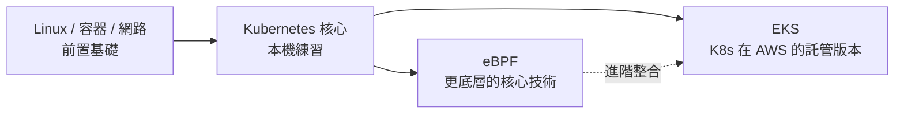
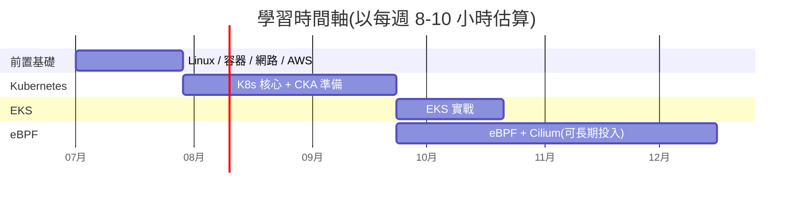

# k8s-learning — Kubernetes / eBPF / EKS 學習筆記庫

> 這個 repo 是一份**結構化、由淺入深**的學習計畫與教材,目標是從零基礎一路學到能在雲端(AWS EKS)上操作 Kubernetes,並理解底層的 eBPF 技術。
>
> 教材以**繁體中文 (zh-TW)** 撰寫,重要元件與技術名詞保留**中英對照**(例如「無狀態部署 (Deployment)」),方便你日後對照官方英文文件。

---

## 為什麼是這個學習順序?

這三項技術有**嚴格的依賴關係**,不能平行學或跳著學:

- **Kubernetes (K8s)** 是地基 —— 一套「管理一大群容器」的系統。
- **EKS** 是 K8s 在 AWS 上的**託管版本**,先懂 K8s 才有意義。
- **eBPF** 是更底層的 **Linux 核心 (Kernel)** 技術,是 K8s 網路與可觀測性的進階主題(例如 Cilium)。
- 而要懂上面任何一個,都得先有 **Linux、容器、網路**的基礎。

> 一句話原則:**動手 > 看影片**。每學一個觀念,就部署它、弄壞它、再修好它。

---

## 學習地圖與目錄

| 階段 | 目錄 | 主題 | 建議時間* |
|------|------|------|-----------|
| **0. 前置基礎** | [`00-prerequisites/`](./00-prerequisites/) | Linux、容器/Docker、網路、AWS 基礎 | 2–4 週 |
| ↳ | [`00-prerequisites/01-linux-basics/`](./00-prerequisites/01-linux-basics/) | **Linux 基礎(重點!)** | — |
| ↳ | [`00-prerequisites/02-container-docker/`](./00-prerequisites/02-container-docker/) | 容器與 Docker | — |
| ↳ | [`00-prerequisites/03-networking/`](./00-prerequisites/03-networking/) | 網路基礎 | — |
| ↳ | [`00-prerequisites/04-aws-basics/`](./00-prerequisites/04-aws-basics/) | AWS 基礎(為 EKS 鋪路) | — |
| **1. Kubernetes** | [`01-kubernetes/`](./01-kubernetes/) | K8s 核心(本機 kind/minikube) | 6–8 週 |
| **2. EKS** | [`02-eks/`](./02-eks/) | Amazon EKS(K8s on AWS) | 2–4 週 |
| **3. eBPF** | [`03-ebpf/`](./03-ebpf/) | eBPF 與 Cilium(進階) | 8–12 週 |
| **附錄** | [`99-resources/`](./99-resources/) | 推薦書籍、課程、認證、工具 | — |

\* 時間僅供參考,依你每週投入時數調整。

---

## 建議的總體時間軸

---

## 如何使用這個 repo

1. **照順序讀**:從 `00-prerequisites/` 開始,每個資料夾都有 `README.md` 作為該章導讀。
2. **邊讀邊做**:每章結尾都有「**動手練習**」和「**本章檢核點 (Checklist)**」。練習做完、檢核點全打勾,才算過關。
3. **把這裡當你的筆記庫**:每學一個主題,就把你自己的 YAML、指令、踩坑筆記 commit 進對應資料夾。這既是複習,也是你的作品集 (portfolio)。
4. **善用中英對照**:看不懂官方英文文件時,回來查對應的中文術語。

---

## 環境需求總覽

| 階段 | 需要的環境 |
|------|------------|
| 前置基礎 | 一台 Linux 機器或 WSL2 / VM、Docker |
| Kubernetes | Docker + `kind` 或 `minikube`(本機,免費) |
| EKS | AWS 帳號(會產生費用,務必設預算告警並用完即刪) |
| eBPF | 較新的 Linux 核心(建議 5.10+,理想 6.x),root 權限 |

---

## 進度追蹤

- [ ] 階段 0:前置基礎
  - [ ] Linux 基礎
  - [ ] 容器與 Docker
  - [ ] 網路基礎
  - [ ] AWS 基礎
- [ ] 階段 1:Kubernetes 核心
- [ ] 階段 2:EKS
- [ ] 階段 3:eBPF

---

## 免責與授權說明

本教材為**原創整理的中文學習筆記**,涵蓋與官方文件相同的觀念,但以自己的話撰寫,並非官方文件的逐字翻譯。學習時請以下列官方來源為最終依據:

- Kubernetes 官方文件:<https://kubernetes.io/zh-cn/docs/>
- AWS EKS 文件:<https://docs.aws.amazon.com/eks/>
- eBPF 官方入口:<https://ebpf.io/>
