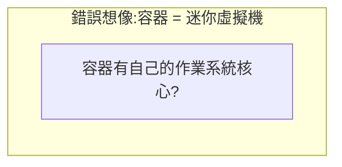
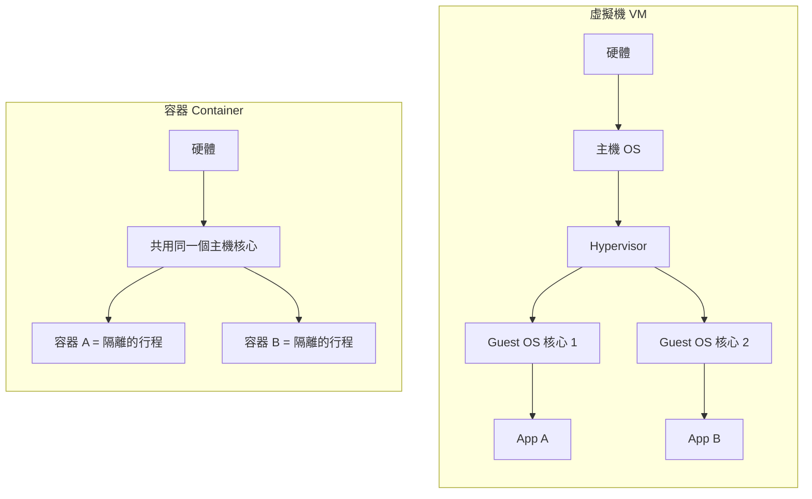
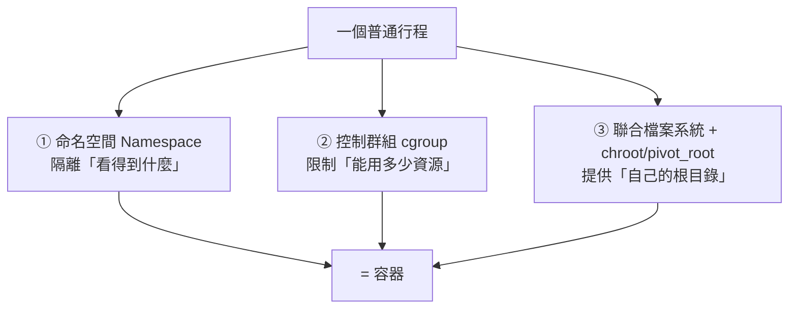
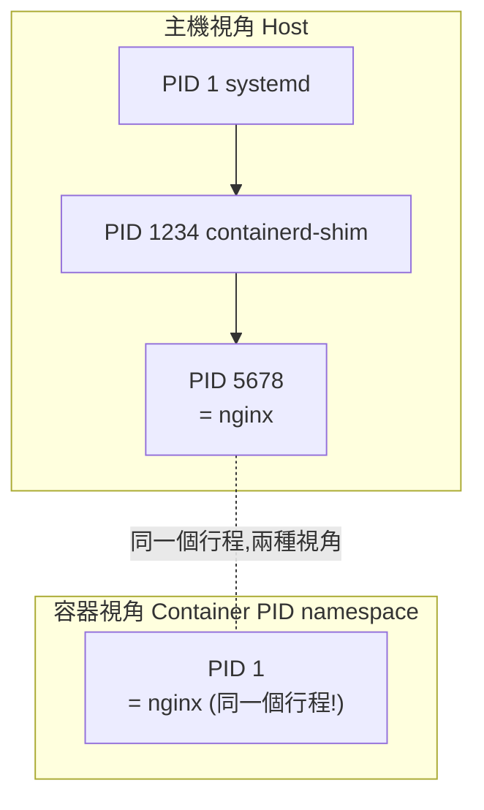
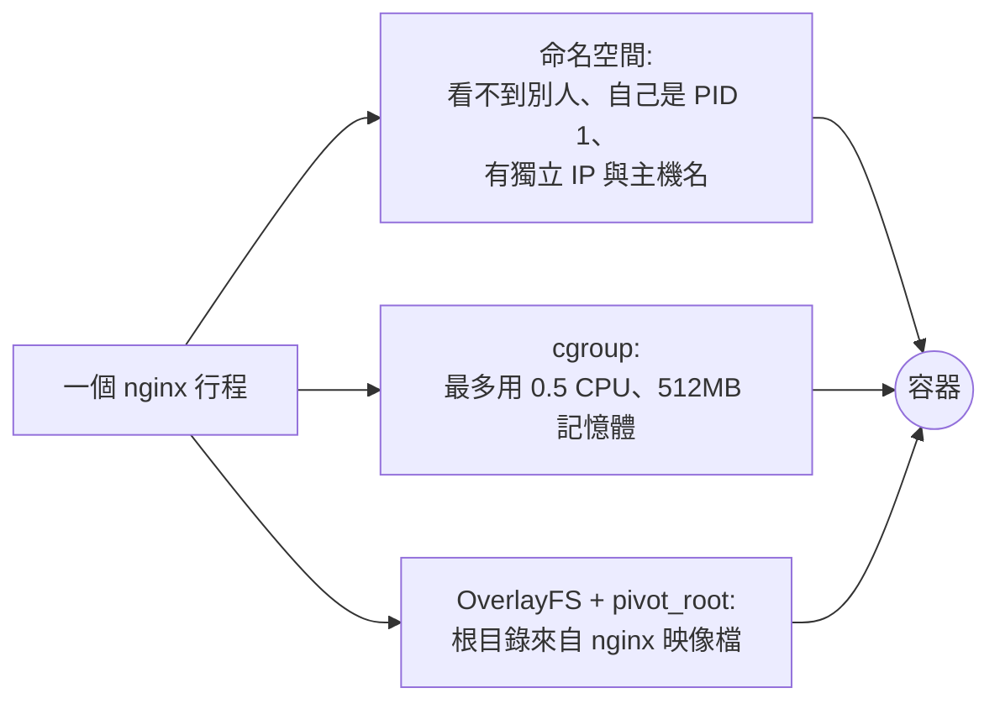

# Linux 基礎 4:命名空間 (Namespace) 與控制群組 (cgroup)

> ⭐⭐⭐⭐⭐ **這是整個 Linux 基礎章節的靈魂。**
>
> 讀完這一節,你會徹底搞懂一句話:
>
> > **「容器」不是輕量級虛擬機,而是「被命名空間 (Namespace) 隔離視野、被控制群組 (cgroup) 限制資源、被聯合檔案系統提供根目錄」的一個普通 Linux 行程 (Process)。**
>
> 之後學 Docker、K8s、eBPF,你會一直回想起這一節。

---

## 1. 先破除一個常見誤解

很多人以為:



**錯!** 容器**沒有**自己的核心。主機上所有容器**共用同一個 Linux 核心 (Kernel)**。

虛擬機 (VM) vs 容器的真正差別:



| | 虛擬機 (VM) | 容器 (Container) |
|---|------------|------------------|
| 隔離層級 | 硬體虛擬化,各有完整 OS 核心 | 共用主機核心,只隔離「視野」 |
| 啟動速度 | 數十秒(要開機 OS) | 毫秒~秒(只是啟動行程) |
| 資源開銷 | 大(每台都跑一份 OS) | 小(就是個行程) |
| 本質 | 一台虛擬電腦 | 一個被隔離的行程 |

**那核心是怎麼讓「同一台機器上的行程」彼此看不到、互不干擾的?** 答案就是接下來的兩大主角。

---

## 2. 容器的三大支柱



| 支柱 | 負責 | 一句話 |
|------|------|--------|
| **命名空間 (Namespace)** | **隔離視野** | 讓行程「以為自己獨佔系統」(看不到別人的行程、網路、檔案掛載…) |
| **控制群組 (cgroup)** | **限制資源** | 限制行程能用多少 CPU、記憶體、I/O |
| **聯合檔案系統 (Union FS)** | **提供根目錄** | 讓行程有自己的 `/`(來自映像檔的分層),互不污染 |

下面逐一拆解。

---

## 3. 命名空間 (Namespace):隔離「看得到什麼」

命名空間是 Linux 核心的功能,它把某種「系統資源」**包裝起來**,讓命名空間裡的行程**以為那是全世界**,看不到外面,也看不到其他命名空間。

Linux 主要有這幾種命名空間:

| 命名空間 | 隔離的東西 | 效果(容器內看到的) |
|----------|-----------|---------------------|
| **PID** | 行程 ID | 容器內主程式是 PID 1,看不到主機其他行程 |
| **Network (net)** | 網路堆疊 | 容器有自己的網卡、IP、路由表、iptables |
| **Mount (mnt)** | 檔案系統掛載點 | 容器有自己的 `/`、`/proc`,看不到主機目錄 |
| **UTS** | 主機名稱 | 容器有自己的 hostname |
| **IPC** | 行程間通訊 | 容器內的共享記憶體、訊號量獨立 |
| **User** | UID/GID 對應 | 容器內的 root (UID 0) 可對應到主機的一般使用者 |
| **Cgroup** | cgroup 根視圖 | 隱藏主機的 cgroup 階層 |
| **Time** | 系統時鐘偏移 | 容器可有不同的開機時間(較新功能) |

### 用「PID 命名空間」徹底理解

這是最直觀的例子。先看一張圖:



**同一個 nginx 行程**:
- 在**主機**眼中,它是 PID `5678`,是 containerd 的子孫。
- 在**容器**自己眼中,它是 PID `1`,看不到主機上任何其他行程。

這就是「隔離視野」—— 行程還是那個行程,只是它的「視角」被命名空間限制了。

### 親手驗證:用 `unshare` 手工造一個「迷你容器」

`unshare` 指令可以讓你建立新的命名空間,不需要 Docker 就能體驗容器原理:

```bash
# 建立一個新的 PID + Mount + UTS 命名空間,並在裡面開一個 bash
sudo unshare --pid --mount --uts --fork --mount-proc bash

# 進去後,試試這些:
hostname mini-container   # 改主機名(UTS 命名空間隔離,不影響主機)
ps aux                    # ⭐ 你會發現:只看得到極少數行程,你的 bash 是 PID 1!
echo $$                   # 印出當前 shell 的 PID,會是 1
exit                      # 離開,回到主機,主機 hostname 沒被改
```

> 🔑 **這就是容器的本質實驗。** 你剛剛沒用 Docker,只用核心的 `unshare`,就做出了一個「行程看不到外面、自己是 PID 1、有獨立主機名」的隔離環境。Docker 做的事,核心層面就是這些(再加上 cgroup、檔案系統、網路設定的自動化)。

### 命名空間「藏在」/proc 裡

還記得上一節的 `/proc/<PID>/ns/` 嗎?每個行程屬於哪些命名空間,都記在這:

```bash
ls -l /proc/$$/ns/
# 你會看到 pid, net, mnt, uts, ipc, user, cgroup... 每個都是一個連結
# 連結後面的數字(inode)就是「命名空間 ID」

# 比較兩個行程是否在同一個網路命名空間:看 net 那個 inode 一不一樣
ls -l /proc/1/ns/net
ls -l /proc/$$/ns/net
```

> 💡 **`nsenter`** 指令可以「鑽進」某個行程的命名空間。排查容器網路問題時,工程師常用 `nsenter` 進到容器的網路命名空間裡跑 `ip`、`tcpdump`。這是進階排錯神技,先有印象。

```bash
# 鑽進 PID 1234 的網路命名空間,執行 ip addr
sudo nsenter --target 1234 --net ip addr
```

---

## 4. 控制群組 (cgroup):限制「能用多少資源」

命名空間管「看得到什麼」,但它**不管「能用多少」**。如果不限制,一個容器可能吃光主機所有 CPU 和記憶體,拖垮其他容器。

**控制群組 (Control Group, cgroup)** 就是核心用來**限制、計量、隔離**一群行程資源用量的機制:

| 資源 | cgroup 能做什麼 |
|------|----------------|
| **CPU** | 限制最多用多少 CPU 時間 / 權重分配 |
| **記憶體 (Memory)** | 設上限,超過就觸發 **OOM Kill**(記憶體不足砍行程) |
| **I/O (Block IO)** | 限制磁碟讀寫頻寬 |
| **PID 數量** | 限制能開幾個行程(防 fork 炸彈) |
| **網路 / 裝置** | 計量與存取控制 |

### 4.1 cgroup 也是「檔案」:一切都在 /sys/fs/cgroup

cgroup v2 把「一個資源群組」表示成 `/sys/fs/cgroup` 底下的**一個目錄**;群組的限制、用量、成員全都是這個目錄裡的**檔案**——用 `cat` 讀、用 `echo >` 寫,不需要任何特殊 API。

```bash
# 看 cgroup 版本與掛載(v2 會看到 cgroup2 這個檔案系統型別)
mount | grep cgroup
ls /sys/fs/cgroup/            # 根 cgroup 的介面檔 + 各子群組目錄

# 看「目前這個 shell」屬於哪個 cgroup(v2 固定是單行 0::/...)
cat /proc/$$/cgroup
# 例如:0::/user.slice/user-1000.slice/session-3.scope
```

每個 cgroup 目錄都有幾個**核心介面檔**:

| 檔案 | 作用 |
|------|------|
| `cgroup.procs` | 這個群組裡有哪些行程(PID);把 PID `echo` 進去 = 把行程「搬進」這個群組 |
| `cgroup.controllers` | 這個群組**可用**哪些控制器(cpu、memory、io、pids…) |
| `cgroup.subtree_control` | 這個群組**下放給子群組**哪些控制器(要控制子群組的資源,得先在這裡開啟) |
| `<資源>.max` / `.current` / `.stat` / `.events` | 各控制器的「上限 / 目前用量 / 統計 / 事件計數」 |

> ⚠️ **v2 的「統一階層」**:cgroup v1 每種資源各有一棵樹(`/sys/fs/cgroup/memory/`、`/cpu/`…);v2 只有**一棵樹**,一個群組同時掌管所有資源。現代發行版(systemd)預設都是 v2,可用 `stat -fc %T /sys/fs/cgroup/` 確認(顯示 `cgroup2fs` 就是 v2)。

各控制器最常用的檔案:

| 控制器 | 設上限 | 看用量 / 統計 |
|--------|--------|--------------|
| **memory** | `memory.max`(硬上限,超過→OOM Kill)、`memory.high`(軟上限,超過→節流回收但不殺) | `memory.current`(目前用量)、`memory.stat`(細項)、`memory.events`(含 `oom_kill` 次數) |
| **cpu** | `cpu.max`(硬上限,格式「配額 週期」微秒)、`cpu.weight`(權重,預設 100) | `cpu.stat`(`usage_usec`、被節流次數 `nr_throttled`、`throttled_usec`) |
| **pids** | `pids.max`(最多幾個行程) | `pids.current`(目前幾個) |
| **io** | `io.max`(每個裝置的 `rbps/wbps/riops/wiops`) | `io.stat`(每裝置讀寫量) |

### 4.2 親手配置限制:逐一舉例

先建立一個群組,並確認 root 已把控制器「下放」給子群組:

```bash
# root cgroup 是否已把控制器下放給子群組?(systemd 系統通常已含 cpu memory pids)
cat /sys/fs/cgroup/cgroup.subtree_control
# 若少了想用的控制器,補開啟(需 root):
echo "+cpu +memory +pids +io" | sudo tee /sys/fs/cgroup/cgroup.subtree_control

# 建立一個叫 demo 的 cgroup(本質就是 mkdir 一個目錄)
sudo mkdir /sys/fs/cgroup/demo
ls /sys/fs/cgroup/demo/       # 目錄一建好,memory.max / cpu.max… 介面檔就自動出現了
```

**① 記憶體上限(`memory.max`)**

```bash
echo "50M" | sudo tee /sys/fs/cgroup/demo/memory.max     # 硬上限 50MB,超過就 OOM Kill
echo "40M" | sudo tee /sys/fs/cgroup/demo/memory.high    # 軟上限:到 40MB 開始節流回收(不殺)

# 把目前 shell 丟進 demo,之後這個 shell 開的程式都受此限制
echo $$ | sudo tee /sys/fs/cgroup/demo/cgroup.procs

# 跑一個吃 100MB 的程式,會在超過 50MB 時被 OOM Kill
stress-ng --vm 1 --vm-bytes 100M --timeout 10s
# 之後 dmesg | tail 會看到 "Memory cgroup out of memory",該行程被砍
```

**② CPU 上限(`cpu.max`)**

`cpu.max` 的格式是「**配額 週期**」(單位微秒):每個「週期」內最多用「配額」這麼多 CPU 時間。

```bash
# 每 100ms 週期最多用 50ms → 等於「半顆 CPU」(0.5 CPU)
echo "50000 100000" | sudo tee /sys/fs/cgroup/demo/cpu.max

# 若只想調「相對權重」(大家都忙時誰分得多)而非硬上限,用 cpu.weight(預設 100)
echo "200" | sudo tee /sys/fs/cgroup/demo/cpu.weight      # 權重加倍
```

**③ 行程數上限(`pids.max`)——防 fork 炸彈**

```bash
echo "20" | sudo tee /sys/fs/cgroup/demo/pids.max         # 這群組最多開 20 個行程
cat /sys/fs/cgroup/demo/pids.current                      # 看目前開了幾個
```

**④ 磁碟 I/O 上限(`io.max`)**

```bash
lsblk                                                     # 先查裝置的「主:次」編號,例如 259:0
# 限制對該裝置的寫入頻寬為 10 MB/s(10*1024*1024 = 10485760)
echo "259:0 wbps=10485760" | sudo tee /sys/fs/cgroup/demo/io.max
```

> 💡 **更省事、也不會跟 systemd 打架的做法**:用 `systemd-run` 一行搞定,它會自動幫你建 cgroup、設好對應的 `.max` 並在結束後清掉:
> ```bash
> # MemoryMax→memory.max;CPUQuota=50%→cpu.max(半顆);TasksMax→pids.max
> sudo systemd-run --scope -p MemoryMax=50M -p CPUQuota=50% -p TasksMax=20 \
>   stress-ng --vm 1 --vm-bytes 100M
> ```

### 4.3 從 /sys/fs/cgroup 查看「現有」限制與實際用量

排查時你常常不是要「設定」,而是要「看某個容器**現在被限多少、用了多少、有沒有被卡**」。步驟是:**先找到它的 cgroup 目錄,再讀裡面的檔案。**

```bash
# 1) 找出容器主行程的 PID(以 Docker 為例)
PID=$(docker inspect -f '{{.State.Pid}}' my-container)

# 2) 看它屬於哪個 cgroup(v2 是單行 0::/...)
cat /proc/$PID/cgroup
# 例如:0::/system.slice/docker-<id>.scope
CG=/sys/fs/cgroup/system.slice/docker-<id>.scope         # 換成上面看到的路徑

# 3) 讀它的限制與用量
cat $CG/memory.max        # 記憶體硬上限(對應 docker --memory / K8s limits.memory)
cat $CG/memory.current    # 目前用了多少記憶體(bytes)
cat $CG/memory.events     # oom_kill 那一行 > 0,代表曾被 OOM 砍過
cat $CG/cpu.max           # CPU 硬上限(配額 週期);"max 100000" 代表沒設限
cat $CG/cpu.stat          # 看 nr_throttled / throttled_usec:被 CPU 限制「節流」幾次
cat $CG/pids.current      # 目前開了幾個行程
```

> 🔑 **`cpu.stat` 的 `nr_throttled` 是排查「服務變慢、但主機 CPU 明明沒滿」的神器**:一個容器只要設了 `cpu.max`,即使主機很閒,它一旦在該週期內用超過配額,就會被**節流 (throttling)** 強制暫停到下個週期,表現成延遲飆高。看到 `nr_throttled` / `throttled_usec` 一直漲,就知道該調高 CPU limit 了。

> 💡 **壓力指標 (PSI)**:每個 cgroup 還有 `cpu.pressure`、`memory.pressure`、`io.pressure`,顯示「因資源不足而**卡住等待**的時間比例」,比單看用量更早發出過載預警。

### 4.4 對應到 K8s:你寫的 resources 就是這些檔案

> 🔑 **這正是 K8s `resources` 的底層!**
> 當你在 K8s 寫:
> ```yaml
> resources:
>   requests:        # 排程用(保證量);CPU 換成 cpu.weight「權重」
>     cpu: "250m"
>     memory: "256Mi"
>   limits:          # 硬上限,由 cgroup 強制執行
>     cpu: "500m"     # → cpu.max = "50000 100000"(半顆 CPU)
>     memory: "512Mi" # → memory.max = 536870912(bytes)
> ```
> kubelet 把 `limits.memory` 翻成 `memory.max`、`limits.cpu` 翻成 `cpu.max`、`requests.cpu` 翻成 `cpu.weight`。容器記憶體超過 `memory.max` 就被 **OOMKilled**(`kubectl describe pod` 看得到那個字);CPU 超過 `cpu.max` 則被**節流**(反映在 `cpu.stat` 的 `nr_throttled`)。
>
> 在節點上甚至能直接讀某個 Pod 的 cgroup(systemd cgroup driver 下,依 QoS 分屬不同 slice):
> ```bash
> # BestEffort / Burstable / Guaranteed 三種 QoS 各在不同子 slice 下
> ls /sys/fs/cgroup/kubepods.slice/
> # 讀某容器的實際上限與是否被節流(路徑裡的 pod<uid> 與容器 id 用 Tab 補全找)
> cat /sys/fs/cgroup/kubepods.slice/.../cri-containerd-<id>.scope/memory.max
> cat /sys/fs/cgroup/kubepods.slice/.../cri-containerd-<id>.scope/cpu.stat
> ```
> **你剛剛親手做的實驗(建 cgroup、寫 `memory.max` / `cpu.max`、讀 `cpu.stat`),就是 kubelet 每天在每個節點上替你做的事。**

---

## 5. 第三支柱:聯合檔案系統與 chroot(簡述)

容器還需要「自己的根目錄 `/`」,不能直接用主機的。這靠兩件事:

1. **聯合檔案系統 (Union Filesystem,如 OverlayFS)**:把映像檔的多個唯讀層 (Layer) + 一個可寫層「疊」成一個檔案系統。這就是為什麼 Docker 映像檔可以分層、共用、快取。
2. **`chroot` / `pivot_root`**:把行程的根目錄 `/` 切換到那個疊出來的檔案系統,於是容器內看到的 `/` 是映像檔的內容,而非主機的。

> 這部分在 [容器與 Docker](../02-container-docker/) 章節會詳細展開(映像檔分層、OverlayFS)。這裡你只要知道:**它提供了容器的「根檔案系統視野」**,是第三支柱。

---

## 6. 把三者組合起來 = 容器

現在我們可以完整地回答「容器是什麼」:



**Docker / containerd 做的事**,本質上就是「自動幫你呼叫這些核心功能」:建命名空間、設 cgroup、疊好檔案系統、設定網路、然後把你的程式跑起來當 PID 1。

---

## 7. 為什麼這對 K8s 和 eBPF 這麼重要?

| 你之後會學到的東西 | 其實就是這一節的延伸 |
|--------------------|---------------------|
| K8s `resources.limits` 被 OOMKilled | cgroup 的 `memory.max` |
| K8s Pod 內多個容器**共享網路**(同一個 IP) | 它們共用同一個 **network 命名空間** |
| K8s `securityContext.runAsUser` | user 命名空間 / 行程 UID |
| `kubectl exec` 進到容器 | 用 `nsenter` 鑽進容器的命名空間 |
| Pod 之間網路隔離 | 各自獨立的 network 命名空間 + CNI |
| **eBPF 能跨容器觀測整台機器** | 因為所有容器**共用同一個核心**,eBPF 在核心層看得到全部! |

> 🔑 最後這點很關鍵:正因為容器共用核心,**eBPF 程式掛在核心上,就能一次觀測到主機上所有容器的系統呼叫、網路封包**,不需要進到每個容器裡。這就是 Cilium、Falco、Pixie 等工具的威力來源。

---

## 動手練習

1. **手工容器**:用 `sudo unshare --pid --mount --uts --fork --mount-proc bash` 進入隔離環境,執行 `ps aux`(觀察你是 PID 1)、`hostname new-name`(改名不影響主機)。離開後確認主機沒被改。
2. **觀察命名空間**:`ls -l /proc/$$/ns/` 看你的 shell 屬於哪些命名空間。如果你裝了 Docker,跑一個容器,比較容器內行程與主機行程的 `net` 命名空間 inode 是否不同。
3. **cgroup 限制記憶體**:照第 4 節步驟建立一個 50MB 上限的 cgroup,丟一個吃記憶體的程式進去,觀察它被 OOM Kill(`dmesg | tail` 會看到 Out of memory 訊息)。
4. **連結 K8s(概念題,寫下你的答案)**:
   - 為什麼同一個 Pod 裡的兩個容器,可以用 `localhost` 互相連線?(提示:命名空間)
   - 為什麼容器記憶體超標會 OOMKilled,而不是把整台機器搞掛?(提示:cgroup)
5. **(選做)`nsenter`**:若有 Docker,用 `docker inspect` 找出容器主行程的 PID,再用 `sudo nsenter --target <PID> --net ip addr` 看容器的網路設定。

---

## 本節檢核點

- [ ] **能用一句話精準說明「容器是什麼」**(被命名空間隔離 + cgroup 限制 + 自己的根檔案系統的行程)。
- [ ] 理解容器與 VM 的本質差異:**容器共用主機核心,VM 各有核心**。
- [ ] 說得出至少 4 種命名空間(PID、Network、Mount、UTS…)各隔離什麼。
- [ ] 能用 `unshare` 親手體驗 PID/UTS 命名空間隔離。
- [ ] 理解 cgroup 限制 CPU/記憶體,並知道 `/sys/fs/cgroup` 與 `memory.max`。
- [ ] **能把 K8s 的 `resources.limits` 對應到 cgroup、把 Pod 共享網路對應到 network 命名空間。**
- [ ] 理解「因為共用核心,eBPF 才能在核心層觀測所有容器」。

➡️ 下一節:[服務管理、日誌與套件](./05-systemd-logs-package.md)
