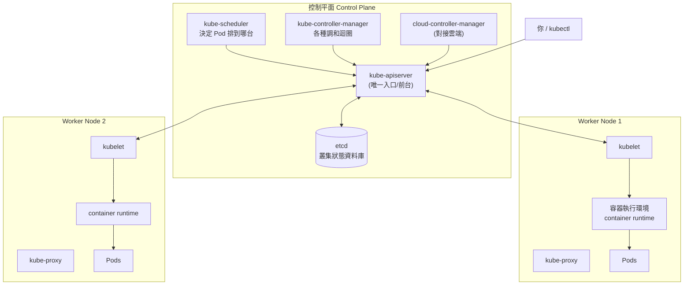
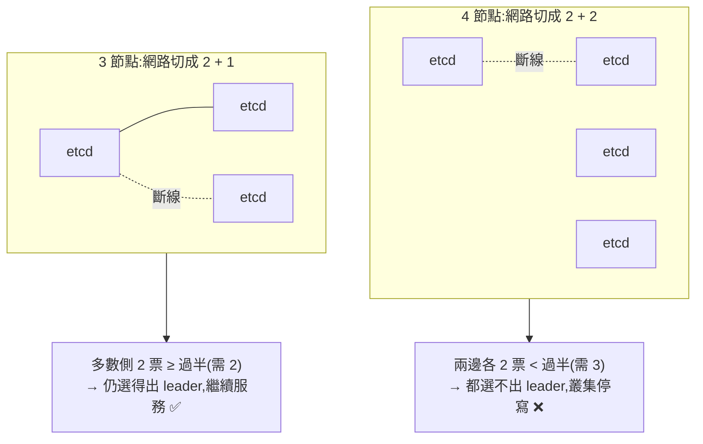
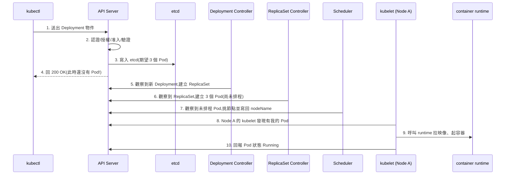

# 01 - Kubernetes 架構與元件 (Architecture & Components)

> 目標:理解 Kubernetes 不是一個程式,而是一群會互相協作的元件。讀完你要能回答:「我下了一個 `kubectl apply`,接下來到底發生了什麼?」

---

## 1. 先建立核心直覺:聲明式 (Declarative) 與調和迴圈 (Reconciliation Loop)

學 K8s 之前先記住一句話:**你描述「想要的狀態」,K8s 負責讓現實逼近它。**

傳統運維是「命令式 (imperative)」:你一步步下指令——啟動這個程式、重啟那個服務。Kubernetes 是「聲明式 (declarative)」:你寫一份 YAML 說「我要 3 個這樣的 Pod」,然後 K8s 內部有一堆控制器 (Controller) 不斷做這件事:

```
觀察現況 (observe) → 比對期望 (diff) → 採取行動拉近差距 (act) → 再觀察 ...
```

這個永不停止的迴圈就是**調和迴圈 (reconciliation loop)**,也叫控制迴圈 (control loop)。這是理解 K8s 一切行為的鑰匙。為什麼刪掉一個 Pod 它會自己長回來?因為某個控制器發現「現況 2 個 ≠ 期望 3 個」,於是補了一個。為什麼這個設計好?因為**它天生自我修復 (self-healing)**——你不需要寫「萬一掛了要重啟」的邏輯,差距出現時控制器自然會去補。

---

## 2. 整體架構鳥瞰

一個叢集 (cluster) 分成兩種角色的節點 (node):

- **控制平面 (Control Plane)**:叢集的大腦,做決策。
- **工作節點 (Worker Node)**:真正跑你的容器 (container) 的地方,執行決策。



關鍵心法:**所有從節點發出的流量都只打向 API Server,彼此不直接溝通。** API Server 是整個系統的中央交換機,etcd 是它背後唯一的真實資料來源 (source of truth)。這種「星狀、以 API Server 為樞紐」的設計讓系統好擴充、好除錯——你要追任何問題,看 API Server 就對了。

> 補充一個常見誤解:這個「樞紐」是單向為主,但不是絕對單向。**API Server 也會反過來主動連線 kubelet**,用於 `kubectl logs`、`kubectl exec`、port-forward 這類需要直連節點的操作,這條連線會終止在 kubelet 的 HTTPS 端點。詳見 [Communication between Nodes and the Control Plane](https://kubernetes.io/docs/concepts/architecture/control-plane-node-communication/#apiserver-to-kubelet)。

---

## 3. 控制平面元件 (Control Plane Components)

### 3.1 kube-apiserver — 唯一的前門

API Server 是叢集的 **REST API 入口**。所有人(你的 kubectl、其他元件、Pod 內的程式)要讀或改叢集狀態,都得透過它。它負責:

- **認證 (Authentication)**:你是誰?
- **授權 (Authorization)**:你能不能做這件事?(這就是 RBAC,見第 5 章)
- **准入控制 (Admission Control)**:這個請求合不合規?要不要改寫?(例如自動注入預設值)
- **驗證與寫入 etcd**:把資源存進唯一的資料庫。

它是**無狀態 (stateless)** 的——狀態全在 etcd,所以 API Server 可以水平擴充多份做高可用 (HA)([Kubernetes Components](https://kubernetes.io/docs/concepts/overview/components/#kube-apiserver))。

### 3.2 etcd — 叢集的記憶

etcd 是一個**分散式鍵值資料庫 (distributed key-value store)**,保存叢集裡每一個物件的完整狀態。它用 Raft 共識演算法保證多副本資料一致([官方元件總覽](https://kubernetes.io/docs/concepts/overview/components/#etcd))。

> 為什麼 etcd 這麼重要?因為**整個叢集的真相都在這裡**。etcd 沒了,叢集就失憶了。正式環境一定要定期備份 etcd(`etcdctl snapshot save`),這也是 CKA 必考題。

```bash
# CKA 經典:備份 etcd(需在 control-plane 節點上、給對憑證)
ETCDCTL_API=3 etcdctl snapshot save /backup/etcd-snapshot.db \
  --endpoints=https://127.0.0.1:2379 \
  --cacert=/etc/kubernetes/pki/etcd/ca.crt \
  --cert=/etc/kubernetes/pki/etcd/server.crt \
  --key=/etc/kubernetes/pki/etcd/server.key
```

#### 💼 面試常考:etcd 有什麼特色?為什麼節點數要是奇數(通常 3 個)?

**Q1:etcd 有哪些特色?**

| 特色 | 說明 |
|------|------|
| **分散式鍵值資料庫** | 資料以 key-value 形式儲存,K8s 把每個物件都存成一筆筆的 key。 |
| **強一致性 (strong consistency)** | 用 **Raft 共識演算法**,任何一筆寫入都要多數節點確認才算成立,讀到的永遠是最新且一致的資料(不是「最終一致」)。 |
| **Watch 機制** | 客戶端可以「訂閱」某個 key 的變化,一有變動立刻被通知。**這正是 K8s 調和迴圈的引擎**——但只有 **API Server** 是 etcd 的客戶端;controller-manager / scheduler / cloud-controller-manager 都是 watch **API Server** 提供的 watch API 來即時反應變化,不會直接碰 etcd([Kubernetes API 概念](https://kubernetes.io/docs/concepts/overview/kubernetes-api/)、[元件總覽:etcd](https://kubernetes.io/docs/concepts/overview/components/#etcd))。 |
| **MVCC + revision** | 每次寫入都有一個遞增的版本號 (revision),支援多版本並行與歷史查詢。 |
| **Lease(租約)/ TTL** | key 可綁定有期限的租約,用來做 leader 選舉、分散式鎖。 |
| **對磁碟延遲敏感** | 每筆寫入要 fsync 落盤並複製給多數節點,**強烈建議用 SSD**;磁碟慢會直接拖垮整個叢集的反應速度。 |

> 一句話總結:etcd = 一個**強一致、可監看 (watchable)、用 Raft 複製**的鍵值資料庫,是整個叢集**唯一的真相來源 (source of truth)**。

**Q2:為什麼 etcd 節點數要是奇數,而且常是 3 個?**(官方建議與容錯對照表見 [Operating etcd clusters for Kubernetes](https://kubernetes.io/docs/tasks/administer-cluster/configure-upgrade-etcd/#example))

核心觀念:Raft 任何決策(寫入、選 leader)都需要 **法定人數 (quorum),也就是「過半」**:

```
quorum(過半) = ⌊N / 2⌋ + 1
可容忍故障數  = N − quorum
```

| 節點數 N | 過半 quorum | 可容忍故障 | 評語 |
|:---:|:---:|:---:|------|
| 1 | 1 | 0 | 單點故障,無容錯 |
| 2 | 2 | **0** | 掛 1 台就湊不到過半,**比 1 台還糟** |
| **3** | 2 | **1** | ✅ 最常見:多 1 台容錯,成本剛好 |
| 4 | 3 | 1 | 多花 1 台,容錯卻跟 3 台一樣,不划算 |
| **5** | 3 | **2** | 容錯 2 台,適合更高可用需求 |

**為什麼偏偏要奇數?兩個理由:**

1. **偶數不會換來更多容錯,只是浪費**:3 台和 4 台都只能容忍 1 台故障,但 4 台每次寫入要多複製一份、更慢,還多一台機器成本。**4 台的容錯 = 3 台,純虧。**
2. **避免腦裂 (split-brain)**:當網路把叢集切成兩半,**偶數**可能切成均等的兩邊(2 比 2),兩邊都湊不到過半 → 誰都選不出 leader → **整個叢集停止寫入**。**奇數**保證切開後一定有一邊是多數,那一邊還能繼續服務。



> **延伸回答(加分):** 那為什麼不乾脆放很多台?因為每筆寫入都要等「過半節點」確認落盤,**節點越多、寫入越慢**。所以實務上落在 **3 或 5** 這個甜蜜點,幾乎不會用到 7 台以上;官方文件甚至建議正式環境用 **5 節點**叢集以容忍 2 台同時故障([Operating etcd clusters for Kubernetes](https://kubernetes.io/docs/tasks/administer-cluster/configure-upgrade-etcd/#example))。另外正式環境會把 etcd 節點**分散在不同可用區 (AZ)**,以容忍單一機房故障。

### 3.3 kube-scheduler — 決定 Pod 落在哪

當你建立一個 Pod,它一開始是「未排程 (unscheduled)」的——還沒指定要跑在哪台節點。Scheduler 的工作就是幫每個新 Pod **挑一台最合適的節點**,然後把決定寫回 API Server(更新 Pod 的 `nodeName` 欄位)。

它怎麼挑?兩階段([kube-scheduler 官方文件](https://kubernetes.io/docs/concepts/scheduling-eviction/kube-scheduler/#kube-scheduler-implementation)):

1. **過濾 (Filtering)**:刷掉不符合條件的節點。例如資源不夠、汙點 (taint) 擋住、節點選擇器 (nodeSelector) 不符。(舊版文件稱此階段為 Predicates,現行文件統一用 Filtering。)
2. **評分 (Scoring)**:對剩下的節點打分,選最高分。例如盡量分散、資源最空閒優先。(舊稱 Priorities,現行文件統一用 Scoring。)

> 重點:**Scheduler 只負責「做決定」,不負責「真的把容器跑起來」。** 它只是把 Pod 跟節點配對。實際啟動容器是 kubelet 的事。第 5 章會深入排程細節。

### 3.4 kube-controller-manager — 一堆調和迴圈的集合

還記得第 1 節的調和迴圈嗎?Controller Manager 就是一個程序,裡面打包了**幾十個內建控制器**,各自盯著一種資源:

| 控制器 | 它在盯什麼 |
|--------|-----------|
| Deployment / ReplicaSet Controller | Pod 數量有沒有等於期望 |
| Node Controller | 節點有沒有掛掉(失聯就標記並驅逐 Pod) |
| Job Controller | 一次性任務有沒有跑完 |
| Endpoints / EndpointSlice Controller | Service 後面該連到哪些 Pod |
| ServiceAccount Controller | 每個 Namespace 有沒有預設的 ServiceAccount |

每個控制器都在跑「觀察 → 比對 → 行動」。把它們集中在一個程序只是為了部署方便,概念上它們是獨立的。

### 3.5 cloud-controller-manager — 對接雲端(選用)

如果叢集跑在雲上(AWS / GCP / Azure),這個元件負責把 K8s 概念翻譯成雲端資源:建立 LoadBalancer、掛載雲端磁碟、管理節點生命週期。本機學習(kind / minikube)通常沒有它。

---

## 4. 工作節點元件 (Node Components)

### 4.1 kubelet — 節點上的執行者

kubelet 是跑在**每一台節點上**的代理程式 (agent)。它的職責很單純但很核心:

- 向 API Server 領取「我這台該跑哪些 Pod」。
- 透過容器執行環境真的把容器啟動起來。
- 持續回報 Pod 與節點的健康狀態給 API Server。
- 執行探針 (Probe) 檢查容器存活與就緒(見第 5 章)。

> kubelet 是「Scheduler 決定」與「容器實際執行」之間的橋。Scheduler 說「Pod X 給節點 A」,節點 A 上的 kubelet 看到後才動手把它跑起來。

### 4.2 容器執行環境 (Container Runtime)

真正負責拉映像 (image)、啟動/停止容器的底層程式。K8s 透過標準介面 **CRI (Container Runtime Interface)** 跟它溝通,所以可以換不同實作:

- **containerd**(目前最主流)
- **CRI-O**

> 歷史補充:早期用 Docker,後來 K8s 在 **v1.24** 版正式移除了 Docker 的相容墊片 (dockershim)(v1.20 開始預告棄用),現在直接用 containerd 或 CRI-O。映像格式還是相容的,所以對你寫 YAML 沒影響。詳見 [Dockershim removal FAQ](https://kubernetes.io/dockershim/)。

### 4.3 kube-proxy — 讓 Service 的虛擬 IP 能通

kube-proxy 也跑在每台節點上,負責實作 **Service 的網路規則**。當你建立一個 Service,它會有一個虛擬 IP(ClusterIP),kube-proxy 在每台節點上設定 iptables 規則(目前 Linux 上的預設模式;`nftables` 模式已於 **v1.33** 晉升為穩定版,官方鼓勵在較新核心上嘗試,但基於相容性考量 iptables 目前仍是預設;舊有的 `IPVS` 模式已於 **v1.35** 被標示為棄用 (deprecated)),讓送到這個虛擬 IP 的流量被導到後面真正的 Pod([kube-proxy 代理模式](https://kubernetes.io/docs/reference/networking/virtual-ips/#proxy-modes)、[NFTables mode for kube-proxy](https://kubernetes.io/blog/2025/02/28/nftables-kube-proxy/))。第 3 章會詳述。

---

## 5. 完整劇本:一個 `kubectl apply` 發生了什麼?

把上面所有元件串起來。假設你執行:

```bash
kubectl apply -f deployment.yaml   # 內容:要 3 個 nginx Pod
```



幾個常被誤會的重點:

1. **第 4 步 API Server 就回你 OK 了**,但這時候一個 Pod 都還沒起來。`kubectl apply` 成功只代表「期望狀態被記錄了」,不代表「東西跑起來了」。要看實際狀態得 `kubectl get pods -w`。
2. **沒有任何元件直接命令對方**。每一步都是「某元件觀察 API Server 的變化,然後做出反應」。這就是調和迴圈在多個層級疊加運作。
3. **Deployment → ReplicaSet → Pod** 是三層委派,每層各有控制器。第 2 章會講清楚為什麼要這樣分層。

```bash
# 親眼看這個過程
kubectl apply -f deployment.yaml
kubectl get deploy,rs,pods         # 一次看三層:Deployment、ReplicaSet、Pod
kubectl get pods -o wide -w        # -w 持續觀察,看 Pod 從 Pending → Running
kubectl describe pod <pod-name>    # Events 區段是排程與啟動過程的時間軸
```

---

## 6. 物件的共通結構:每個 YAML 都長這樣

K8s 裡所有資源都是「物件 (object)」,都遵循同一套骨架。理解這套骨架,看任何 YAML 都不陌生:

```yaml
apiVersion: apps/v1        # 這個物件屬於哪個 API 群組與版本
kind: Deployment           # 物件類型
metadata:                  # 身分資訊:名字、命名空間、標籤
  name: my-app
  namespace: default
  labels:
    app: my-app
spec:                      # 「期望狀態 (desired state)」——你寫的部分
  replicas: 3
  # ...
status:                    # 「實際狀態 (actual state)」——K8s 自動填,你別手動改
  readyReplicas: 3
```

核心二元對立:**`spec` 是你想要的,`status` 是現在的。** 所有控制器活著就為了讓 `status` 追上 `spec`。

> 善用 `kubectl explain` 自學任何欄位,不用死背:
> ```bash
> kubectl explain deployment.spec.strategy   # 直接從 API 讀欄位文件
> kubectl explain pod --recursive            # 展開整棵欄位樹
> ```

---

## 7. 命名空間 (Namespace) 與標籤 (Label) 先打底

雖然細節在第 5 章,但這兩個概念貫穿全書,先建立印象:

- **Namespace**:叢集內的「邏輯隔離分區」,把資源分組(例如 `dev` / `prod`)。同一個 Namespace 裡名字不能重複,不同 Namespace 可以同名。
- **Label**:貼在物件上的鍵值標籤,例如 `app=nginx`。K8s 大量靠標籤做「選擇 (selecting)」——Service 靠標籤找到要服務的 Pod、Deployment 靠標籤管理它的 Pod。標籤是 K8s 把鬆散物件「綁在一起」的黏著劑。

```bash
kubectl get pods -A                       # -A = 所有命名空間
kubectl get pods -l app=nginx             # 用標籤篩選
kubectl get pods --show-labels            # 看每個 Pod 的標籤
```

---

## 動手練習

1. 用 kind 或 minikube 起一個叢集,執行 `kubectl get nodes -o wide`,辨認出哪個是 control-plane。
2. 執行 `kubectl get pods -n kube-system`,找出 apiserver、etcd、scheduler、controller-manager、coredns、kube-proxy 這些系統 Pod,並用 `kubectl describe` 看其中一個跑在哪台節點。
3. 部署一個簡單的 nginx Deployment(`kubectl create deployment web --image=nginx`),然後用 `kubectl get deploy,rs,pods` 觀察三層結構。
4. 手動刪掉那個 Deployment 底下的一個 Pod(`kubectl delete pod <name>`),再 `kubectl get pods`,觀察它如何自己長回來——這就是調和迴圈。
5. 用 `kubectl describe pod <name>` 看 Events,把它跟第 5 節的劇本對照,找出「Scheduled」與「Started container」兩個事件。

---

## 本章檢核點 (Checklist)

- [ ] 能用自己的話解釋「聲明式」與「調和迴圈」,並舉一個自我修復的例子
- [ ] 能畫出控制平面與工作節點的元件圖,並說明「所有元件只跟 API Server 講話」的意義
- [ ] 能說出 API Server、etcd、Scheduler、Controller Manager 各自的職責
- [ ] (面試)能講出 etcd 的特色(Raft 強一致、watch、唯一真相來源),並用「過半 quorum + 避免腦裂」解釋為什麼節點數要奇數、通常是 3 個
- [ ] 能說出 kubelet、容器執行環境、kube-proxy 各自的職責
- [ ] 能完整講出一個 `kubectl apply` 從送出到 Pod Running 的流程
- [ ] 理解 `kubectl apply` 成功不等於 Pod 已經跑起來,知道要看 `status` 或 `kubectl get pods`
- [ ] 能說出任何 K8s 物件的共通結構(apiVersion / kind / metadata / spec / status),並區分 spec 與 status
- [ ] 知道用 `kubectl explain` 自己查欄位,而不是死背 YAML

> 下一章:[02-pod-workloads.md](./02-pod-workloads.md) — 把應用程式真的跑起來、自動維持、平滑升級。
