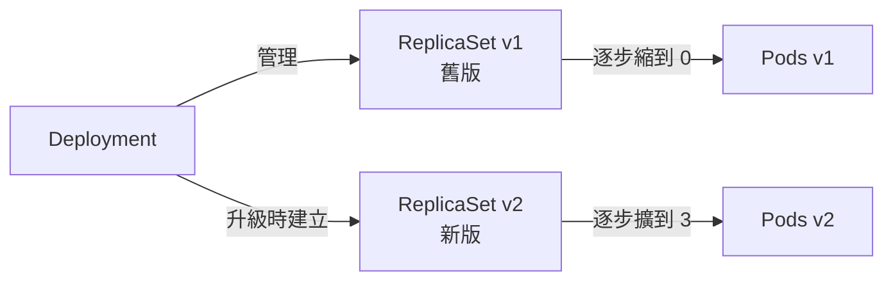

# 02 - Pod 與工作負載 (Pod & Workloads)

> 目標:把應用程式真的跑起來,並理解 K8s 怎麼幫你「維持數量、平滑升級、自我修復」。讀完你要能依場景選對工作負載 (Workload) 類型:Deployment / StatefulSet / DaemonSet / Job / CronJob。

---

## 1. Pod:最小的部署單位

### 1.1 為什麼不是「容器」是「Pod」?

你可能以為 K8s 的最小單位是容器 (container),其實是 **Pod**。一個 Pod 包住**一個或多個容器**,這些容器:

- **共享網路命名空間**:同一個 Pod 裡的容器共用一個 IP,彼此可以用 `localhost` 互通。
- **共享儲存卷 (Volume)**:可以掛同一個 Volume 交換檔案。
- **生死與共**:一起被排程到同一台節點、一起啟動、一起被刪除。

> 為什麼要有 Pod 這層?因為有些容器天生「黏在一起」——例如主應用容器 + 一個負責推送日誌的輔助容器。它們要同生共死、共享資源,但又該是獨立的容器映像。Pod 就是這個「緊密耦合的小團隊」的封裝。
>
> **預設原則:一個 Pod 一個容器。** 官方文件也指出「one-container-per-Pod」是最常見的使用模式,多容器 Pod 屬於進階模式 (sidecar),只在容器真的緊密耦合時才用([Pods 官方文件](https://kubernetes.io/docs/concepts/workloads/pods/#how-pods-manage-multiple-containers))。

```yaml
apiVersion: v1
kind: Pod
metadata:
  name: nginx
  labels:
    app: nginx               # 標籤,之後 Service 靠它找到這個 Pod
spec:
  containers:
    - name: nginx
      image: nginx:1.27       # 永遠釘版本,別用 latest(無法重現、難回滾)
      ports:
        - containerPort: 80
      resources:              # 資源要求與上限(第 5 章詳述,但養成一開始就寫的習慣)
        requests:
          cpu: "100m"
          memory: "128Mi"
        limits:
          cpu: "500m"
          memory: "256Mi"
```

### 1.2 Pod 是「畜牲」不是「寵物」(Cattle, not Pets)

關鍵心態:**Pod 是用過即丟的 (ephemeral)。** 它隨時可能因為節點故障、升級、擴縮而被刪掉重建,而且**重建後的 Pod 是全新的、IP 會變、名字會變**。所以:

- 不要把資料存在 Pod 本機(要持久化請用 Volume,第 4 章)。
- 不要記住某個 Pod 的 IP(要穩定的位址請用 Service,第 3 章)。
- 不要手動建立裸 Pod(naked Pod)來跑正式服務——沒人幫你維持它。掛了就沒了。

這就帶出下一節:你幾乎永遠不該直接寫 Pod,而是寫一個**控制器 (Controller)** 來幫你管 Pod。

### 1.3 init 容器與 sidecar(進階,先有印象)

```yaml
spec:
  initContainers:             # 初始化容器:在主容器前「依序」跑完才放行,常用於等待相依、做遷移
    - name: wait-db
      image: busybox
      command: ['sh', '-c', 'until nc -z db 5432; do sleep 2; done']
  containers:
    - name: app
      image: my-app:1.0
```

---

## 2. 為什麼需要工作負載控制器 (Workload Controllers)

裸 Pod 的問題:**沒人替它負責。** 工作負載控制器幫你做這些事:

- **維持數量**:你說要 3 個,死一個就補一個。
- **滾動升級**:換版本時一個一個換,服務不中斷。
- **回滾**:升壞了一鍵退回上一版。

下面這張表是本章地圖,先看一眼,之後逐一展開:

| 控制器 | 解決什麼問題 | 典型場景 | Pod 是否可互換 |
|--------|-------------|----------|----------------|
| **Deployment** | 維持 N 個無狀態副本 + 升級回滾 | 網頁、API、後端服務 | 是(無身分) |
| **ReplicaSet** | 純粹維持 N 個副本 | 幾乎不直接用,被 Deployment 管理 | 是 |
| **StatefulSet** | 有穩定身分與儲存的副本 | 資料庫、Kafka、需要固定序號 | 否(各有身分) |
| **DaemonSet** | 每個節點剛好跑一份 | 日誌收集器、監控、網路外掛 | 跟著節點走 |
| **Job** | 跑一次性任務直到完成 | 批次處理、資料遷移 | 是 |
| **CronJob** | 定時觸發 Job | 排程備份、報表 | 是 |

---

## 3. ReplicaSet:維持副本數的底層機制

ReplicaSet 的工作只有一件事:**確保指定數量、符合標籤選擇器 (selector) 的 Pod 一直存在。** 多了就刪、少了就補。

```yaml
apiVersion: apps/v1
kind: ReplicaSet
metadata:
  name: web-rs
spec:
  replicas: 3                 # 期望副本數
  selector:
    matchLabels:
      app: web                # 我負責管理「帶這個標籤」的 Pod
  template:                   # Pod 樣板:要補 Pod 時照這個生
    metadata:
      labels:
        app: web              # 必須符合上面的 selector,否則建出來的 Pod 不歸自己管
    spec:
      containers:
        - name: web
          image: nginx:1.27
```

> **你幾乎不會直接寫 ReplicaSet。** 它缺少「升級」能力——改了映像版本,它不會幫你平滑換版。這就是 Deployment 存在的理由:Deployment 管 ReplicaSet,ReplicaSet 管 Pod。

---

## 4. Deployment:無狀態應用的主力

Deployment 是日常用最多的工作負載。它在 ReplicaSet 之上加了**版本管理**:每次你改 Pod 樣板(例如換映像),它會建立一個**新的 ReplicaSet**,然後用策略把流量從舊 RS 平滑轉移到新 RS。



### 4.1 完整範例

```yaml
apiVersion: apps/v1
kind: Deployment
metadata:
  name: web
  labels:
    app: web
spec:
  replicas: 3
  selector:
    matchLabels:
      app: web
  strategy:
    type: RollingUpdate        # 滾動更新(預設),逐步替換不中斷
    rollingUpdate:
      maxUnavailable: 1        # 升級過程最多允許 1 個副本暫時不可用(若省略,預設為 25%)
      maxSurge: 1              # 升級過程最多可額外多開 1 個新副本(若省略,預設為 25%)
  template:
    metadata:
      labels:
        app: web
    spec:
      containers:
        - name: web
          image: nginx:1.27
          ports:
            - containerPort: 80
          readinessProbe:       # 新 Pod「就緒」才導流量進來,是不中斷升級的關鍵
            httpGet:
              path: /
              port: 80
            initialDelaySeconds: 3
            periodSeconds: 5
```

### 4.2 滾動更新 (Rolling Update) 與回滾 (Rollback)

```bash
# 升級:把映像換版本(會觸發滾動更新,建新 ReplicaSet)
kubectl set image deployment/web web=nginx:1.28
kubectl rollout status deployment/web      # 即時觀察升級進度

# 看歷史版本
kubectl rollout history deployment/web

# 升壞了!一鍵回滾到上一版
kubectl rollout undo deployment/web

# 回滾到指定版本
kubectl rollout undo deployment/web --to-revision=2

# 暫停 / 恢復(批次改多個設定時,先暫停避免每改一次就觸發一次更新)
kubectl rollout pause deployment/web
kubectl rollout resume deployment/web
```

> **設計理念**:滾動更新讓服務在升級時始終有可用副本,搭配 readiness 探針確保「只有準備好的新 Pod 才接流量」。`maxUnavailable` 與 `maxSurge` 是你在「升級速度」與「資源/可用性」之間的旋鈕,兩者預設值都是 **25%**([Deployment 官方文件](https://kubernetes.io/docs/concepts/workloads/controllers/deployment/#max-unavailable))。

### 4.3 兩種升級策略比較

| 策略 | 行為 | 優點 | 缺點 |
|------|------|------|------|
| **RollingUpdate**(預設) | 新舊副本並存,逐步替換 | 不中斷、可控 | 升級期間兩版本同時在線 |
| **Recreate** | 先全刪舊的,再起新的 | 不會有兩版本並存 | 中間有停機 (downtime) |

> 如果應用無法接受「新舊版本同時在線」(例如資料庫 schema 不相容),才用 `Recreate`,並接受短暫停機。

```bash
# 擴縮(scale):立即改副本數
kubectl scale deployment/web --replicas=5
```

---

## 5. StatefulSet:有狀態應用的身分管理

Deployment 的 Pod 是**可互換的、匿名的**——叫 `web-7d4f...` 這種隨機名,死了重建換個名也無所謂。但資料庫不行:主從 (primary/replica) 需要固定身分、各自要有自己的持久磁碟、重啟後還要認得回原本的資料。這就是 **StatefulSet** 解決的問題。

StatefulSet 給每個 Pod 三樣 Deployment 給不了的東西:

1. **穩定且可預測的名字**:`web-0`、`web-1`、`web-2`(序號固定,不是亂碼)。
2. **穩定的網路身分**:搭配 Headless Service(第 3 章)讓每個 Pod 有固定 DNS,如 `web-0.web.default.svc.cluster.local`([StatefulSet 官方文件 — Stable Network ID](https://kubernetes.io/docs/concepts/workloads/controllers/statefulset/#stable-network-id))。
3. **穩定的專屬儲存**:每個 Pod 透過 `volumeClaimTemplates` 各自綁定一塊 PVC,`web-0` 永遠拿回自己那塊磁碟。

```yaml
apiVersion: apps/v1
kind: StatefulSet
metadata:
  name: web
spec:
  serviceName: web            # 對應的 Headless Service 名稱(提供穩定 DNS)
  replicas: 3
  selector:
    matchLabels:
      app: web
  template:
    metadata:
      labels:
        app: web
    spec:
      containers:
        - name: web
          image: nginx:1.27
          volumeMounts:
            - name: data
              mountPath: /usr/share/nginx/html
  volumeClaimTemplates:        # 為每個 Pod「各自」產生一塊 PVC(第 4 章)
    - metadata:
        name: data
      spec:
        accessModes: ["ReadWriteOnce"]
        resources:
          requests:
            storage: 1Gi
```

> **有序性 (ordering)**:StatefulSet 預設的 Pod 管理政策是 `OrderedReady`,按序號**依序**建立(web-0 就緒才建 web-1)、**逆序**刪除;若不需要這個保證,可把 `podManagementPolicy` 設成 `Parallel` 平行建立/刪除。這對需要「先起主節點再起從節點」的系統很重要(詳見 [StatefulSet 官方文件 — Pod Management Policies](https://kubernetes.io/docs/concepts/workloads/controllers/statefulset/#pod-management-policies))。

### Deployment vs StatefulSet 對照

| 面向 | Deployment | StatefulSet |
|------|-----------|-------------|
| Pod 名稱 | 隨機後綴 | 固定序號 (web-0, web-1) |
| Pod 身分 | 互換、匿名 | 各有穩定身分 |
| 網路 | 共用 Service,無個別 DNS | Headless Service,每 Pod 固定 DNS |
| 儲存 | 通常共用或無狀態 | 每 Pod 專屬 PVC,重建後認得回去 |
| 建立/刪除 | 同時、無序 | 依序、可控 |
| 適用 | 無狀態服務(web/API) | 有狀態服務(DB、訊息佇列) |

---

## 6. DaemonSet:每個節點一份

有些東西「每台機器都該跑一份」:日誌收集器 (log agent)、監控代理、CNI 網路外掛、節點層級的儲存外掛。**DaemonSet 保證叢集裡每個(符合條件的)節點上剛好有一個這種 Pod**——新節點加入時自動補上,節點移除時自動清掉。

```yaml
apiVersion: apps/v1
kind: DaemonSet
metadata:
  name: log-agent
spec:
  selector:
    matchLabels:
      app: log-agent
  template:
    metadata:
      labels:
        app: log-agent
    spec:
      tolerations:             # 容忍汙點,讓它連 control-plane 節點也能跑(第 5 章)
        - operator: Exists
      containers:
        - name: agent
          image: fluent-bit:latest
          volumeMounts:
            - name: varlog
              mountPath: /var/log
      volumes:
        - name: varlog
          hostPath:             # 直接掛節點本機路徑來讀該節點的日誌
            path: /var/log
```

> **沒有 `replicas` 欄位**——副本數不是你定的,而是「節點數」決定的。這是 DaemonSet 跟其他控制器最直觀的差異。

---

## 7. Job 與 CronJob:批次與排程任務

### 7.1 Job — 跑完就結束的任務

Deployment 跑的是「常駐服務」,Job 跑的是「一次性任務」:資料遷移、批次運算、產報表。Job 會建立 Pod 去執行,**直到成功完成指定次數才算結束**,失敗會依策略重試。

```yaml
apiVersion: batch/v1
kind: Job
metadata:
  name: data-migration
spec:
  completions: 1              # 需要成功完成幾次(預設 1)
  parallelism: 1             # 同時可平行跑幾個 Pod(預設 1)
  backoffLimit: 4            # 失敗重試上限,超過就標記 Job 失敗(若省略,預設為 6)
  template:
    spec:
      restartPolicy: Never    # Job 的 Pod 不能用 Always;通常 Never 或 OnFailure
      containers:
        - name: migrate
          image: my-migrator:1.0
          command: ["./migrate.sh"]
```

> `restartPolicy` 必須是 `Never` 或 `OnFailure`——因為 Job 的語意是「做完就停」,不能用會無限重啟的 `Always`([Job 官方文件 — Pod Template](https://kubernetes.io/docs/concepts/workloads/controllers/job/#pod-template))。

### 7.2 CronJob — 定時觸發 Job

CronJob 就是「Job 的鬧鐘」:按 cron 排程,時間到就建立一個 Job 去跑。典型用途:每日備份、每小時清理、定時報表。

```yaml
apiVersion: batch/v1
kind: CronJob
metadata:
  name: nightly-backup
spec:
  schedule: "0 2 * * *"            # 標準 cron 格式:每天凌晨 2:00
  concurrencyPolicy: Forbid        # 上一次還沒跑完就跳過這次(避免重疊)
  successfulJobsHistoryLimit: 3    # 保留最近 3 個成功的 Job 紀錄
  failedJobsHistoryLimit: 1
  jobTemplate:                     # 時間到就照這個樣板建立 Job
    spec:
      template:
        spec:
          restartPolicy: OnFailure
          containers:
            - name: backup
              image: my-backup:1.0
              command: ["./backup.sh"]
```

| `concurrencyPolicy` | 行為 |
|---------------------|------|
| `Allow`(預設) | 允許多個 Job 同時跑 |
| `Forbid` | 前一個沒跑完就跳過這次觸發 |
| `Replace` | 用新的取代還在跑的舊 Job |

> `successfulJobsHistoryLimit` 預設保留 **3** 筆成功紀錄,`failedJobsHistoryLimit` 預設保留 **1** 筆失敗紀錄([CronJob 官方文件](https://kubernetes.io/docs/concepts/workloads/controllers/cron-jobs/))。

---

## 8. 觀察與除錯常用指令

```bash
kubectl get pods -o wide                    # 看 Pod 跑在哪台、IP 是什麼
kubectl describe pod <name>                 # Events 是除錯第一站(排程失敗、拉映像失敗...)
kubectl logs <pod>                          # 看容器日誌
kubectl logs <pod> -c <container>           # 多容器 Pod 指定容器
kubectl logs <pod> --previous               # 看「上一個」掛掉的容器日誌(查 crash 必備)
kubectl exec -it <pod> -- sh                # 進到容器裡面 debug
kubectl get events --sort-by=.lastTimestamp # 依時間看叢集事件
```

常見 Pod 狀態與意義:

| 狀態 | 通常代表 |
|------|---------|
| `Pending` | 還沒排到節點(資源不足?汙點擋住?) |
| `ContainerCreating` | 正在拉映像或掛載 Volume |
| `ImagePullBackOff` | 映像名稱錯或拉不到(權限/網路) |
| `CrashLoopBackOff` | 容器一直啟動就掛,反覆重啟(看 `logs --previous`) |
| `Running` | 正常運作 |
| `Completed` | Job 類正常結束 |

---

## 動手練習

1. 建立一個 3 副本的 nginx Deployment,刪掉一個 Pod 觀察自動補回。
2. 用 `kubectl set image` 把 nginx 升版,用 `kubectl rollout status` 看滾動過程,再 `kubectl rollout undo` 回滾。
3. 故意把映像設成不存在的版本,觀察 `ImagePullBackOff`,再用 `kubectl rollout undo` 救回來。
4. 寫一個 StatefulSet(3 副本),`kubectl get pods` 確認名字是 web-0/1/2,並用 `kubectl get pvc` 看每個 Pod 各自的 PVC。
5. 寫一個 Job 跑 `echo hello && sleep 5`,觀察它 `Completed`;再寫一個每分鐘觸發的 CronJob,等兩分鐘看它建出兩個 Job。
6. 部署一個 DaemonSet(多節點叢集),確認每個節點都有一份。

---

## 本章檢核點 (Checklist)

- [ ] 能解釋為什麼最小單位是 Pod 而非容器,以及多容器 Pod 的使用時機
- [ ] 理解「Pod 是用過即丟」的心態,知道資料與穩定位址不能依賴 Pod 本身
- [ ] 能說明 Deployment → ReplicaSet → Pod 的三層關係,以及為什麼不直接用 ReplicaSet
- [ ] 能完成滾動更新與回滾,並解釋 maxUnavailable / maxSurge 的作用
- [ ] 能說出 RollingUpdate 與 Recreate 的差異與適用場景
- [ ] 能說明 StatefulSet 提供的三種穩定性(名字、網路、儲存),並對照 Deployment 選對工具
- [ ] 知道 DaemonSet 沒有 replicas、副本數由節點數決定,並舉出典型用途
- [ ] 能寫出 Job 與 CronJob,並說明 restartPolicy 限制與 concurrencyPolicy 的選擇
- [ ] 會用 logs / describe / exec / events 排查 Pending、ImagePullBackOff、CrashLoopBackOff

> 下一章:[03-networking-service.md](./03-networking-service.md) — 一直在變動的 Pod 之間怎麼互相找到對方,外面又怎麼進得來。
