# 03 - 網路與服務 (Networking & Service)

> 目標:理解 Pod 一直在生滅、IP 一直在變的情況下,服務之間怎麼穩定互連、外部流量怎麼進來、名字怎麼解析。讀完你要能選對 Service 類型、用 Ingress 對外、講清楚 CoreDNS 的角色。

---

## 1. 先建立網路心智模型:K8s 的網路三條規則

K8s 對網路有三個基本承諾(由 CNI 網路外掛實作,例如 Calico、Flannel、Cilium):

1. **每個 Pod 有自己的 IP**,而且是叢集內可路由的真實 IP。
2. **Pod 之間可以直接用 IP 互通**,不需要 NAT——不管在不在同一台節點。
3. **節點上的程式也能跟 Pod 用 IP 互通**。

這三條是 [Kubernetes 網路模型](https://kubernetes.io/docs/concepts/services-networking/#the-kubernetes-network-model)的官方定義。

這帶來一個「扁平網路 (flat network)」的直覺:**在叢集內,任何 Pod 都能直接連到任何 Pod 的 IP**,彷彿大家都在同一個區網。

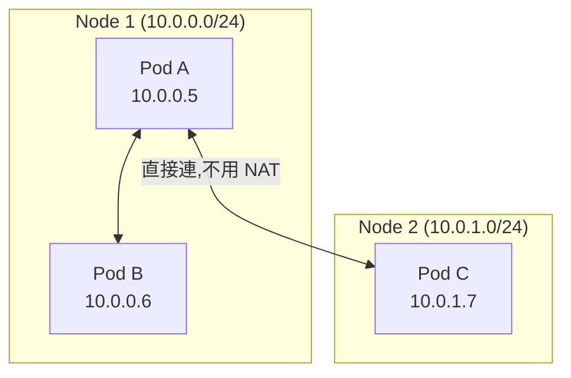

**那為什麼還需要 Service?** 因為 Pod IP 會變。第 2 章說過 Pod 是用過即丟的——升級、擴縮、故障重建,IP 全變。你不能把另一個服務的 Pod IP 寫死在設定裡。你需要一個**穩定的、會自動追蹤後端的入口**。這就是 Service。

---

## 2. Service:給一群 Pod 一個穩定門牌

Service 做兩件事:

1. 提供一個**固定不變的虛擬 IP(ClusterIP)和 DNS 名稱**。
2. 用**標籤選擇器 (label selector)** 自動找到一群符合的 Pod,把進來的流量負載平衡 (load balance) 分給它們。

關鍵:Pod 來來去去,但 Service 的 IP 與名字始終不變。前端只要記得 Service,不用管後面 Pod 怎麼換。

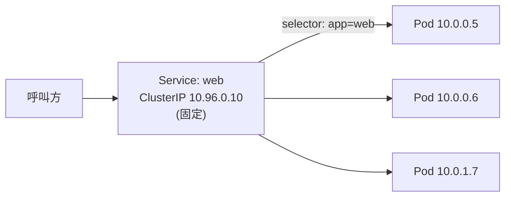

### 2.1 它怎麼知道後面有哪些 Pod?Endpoints / EndpointSlice

Service 並不直接連 Pod。背後有個機制:**EndpointSlice 控制器**持續掃描「符合 selector 且已就緒 (ready) 的 Pod」,把它們的 IP 列成一份清單。Service 的流量就導向這份清單。EndpointSlice 是現行的標準機制,取代舊版的 Endpoints API(舊 API 在大規模叢集下有單一物件被截斷等限制,目前已標示為過時)([EndpointSlices 官方文件](https://kubernetes.io/docs/concepts/services-networking/endpoint-slices/))。

> 這也是為什麼 readiness 探針(第 5 章)很重要:**沒就緒的 Pod 不會被列入 Endpoints,流量不會打到它。** 升級時這保證了「只有準備好的 Pod 才接客」。

```bash
kubectl get endpointslices              # 看 Service 背後實際連到哪些 Pod IP
kubectl describe svc web                 # Endpoints 欄位列出後端 IP
```

### 2.2 kube-proxy 怎麼讓 ClusterIP 通?

ClusterIP 是個**虛擬 IP**,沒有任何網卡真的擁有它。是每台節點上的 **kube-proxy** 設定了封包轉發規則(Linux 預設模式是 iptables;`nftables` 模式已於 **v1.33** 晉升為穩定版,官方鼓勵在較新核心上嘗試,但基於相容性考量 iptables 目前仍是預設;舊有的 `IPVS` 模式已於 **v1.35** 被標示為棄用 (deprecated)):當有封包要送到這個 ClusterIP,就攔截下來、(預設)隨機挑一個後端 Pod IP、改寫目的地。所以負載平衡其實發生在**每台節點的核心網路層**,不是某個集中的代理([Virtual IPs and Service Proxies](https://kubernetes.io/docs/reference/networking/virtual-ips/)、[NFTables mode for kube-proxy](https://kubernetes.io/blog/2025/02/28/nftables-kube-proxy/))。

---

## 3. Service 四種類型

| 類型 | 暴露範圍 | 怎麼存取 | 典型用途 |
|------|---------|---------|---------|
| **ClusterIP**(預設) | 僅叢集內 | 叢集內 IP / DNS | 服務間互連(後端、DB) |
| **NodePort** | 叢集外(透過節點 IP) | `<任一節點IP>:<30000-32767>` | 開發測試、簡單對外 |
| **LoadBalancer** | 叢集外(雲端 LB) | 雲端配發的外部 IP | 正式環境對外服務 |
| **ExternalName** | — | DNS CNAME | 把外部服務包成叢集內名字 |

它們是**層層疊加**的:NodePort 自帶一個 ClusterIP;LoadBalancer 又自帶一個 NodePort 與 ClusterIP。

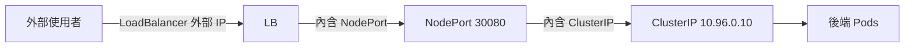

### 3.1 ClusterIP(預設,最常用)

只在叢集內可達:給一群 Pod 一個固定虛擬 IP,**外部完全連不進來**。

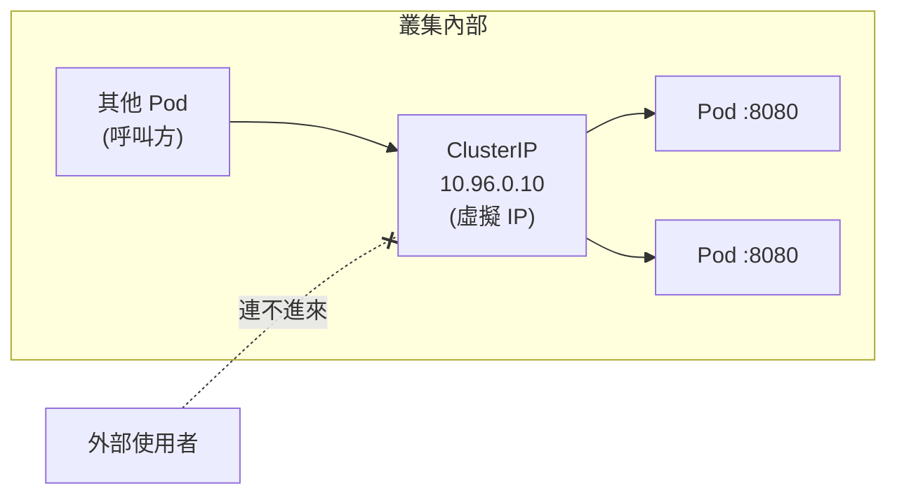

```yaml
apiVersion: v1
kind: Service
metadata:
  name: web
spec:
  type: ClusterIP            # 預設可省略
  selector:
    app: web                 # 把流量導到帶 app=web 標籤的 Pod
  ports:
    - port: 80               # Service 對外的埠(別人連這個)
      targetPort: 8080       # 轉到 Pod 容器的埠
```

### 3.2 NodePort

在「每一台節點」上開一個固定埠(預設範圍 **30000-32767**,可用 kube-apiserver 的 `--service-node-port-range` 調整),外部用任一節點 IP 加這個埠就能進來。**每台節點都監聽同一個埠**,打到哪台都會被轉進內部的 ClusterIP([Service 官方文件 — type: NodePort](https://kubernetes.io/docs/concepts/services-networking/service/#type-nodeport))。

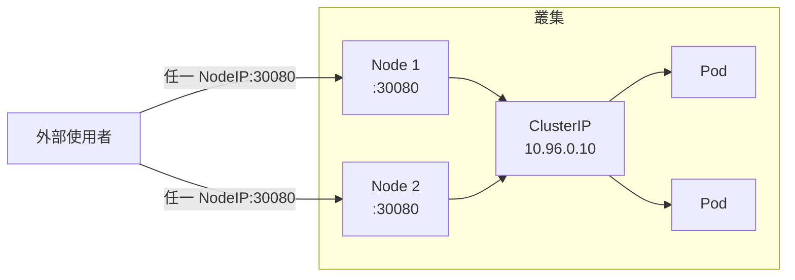

```yaml
apiVersion: v1
kind: Service
metadata:
  name: web
spec:
  type: NodePort
  selector:
    app: web
  ports:
    - port: 80
      targetPort: 8080
      nodePort: 30080        # 不指定會隨機配;範圍 30000-32767
```

> NodePort 適合學習與測試,不適合正式環境:埠號醜、要自己知道節點 IP、沒有 L7 路由。

### 3.3 LoadBalancer

請雲端供應商配一個外部負載平衡器,給你一個對外 IP。本機(kind/minikube)沒有真正的雲端 LB,可以用 `minikube tunnel` 或 MetalLB 模擬。流量路徑是 **雲端 LB → 各節點的 NodePort → ClusterIP → Pod**,層層疊加。

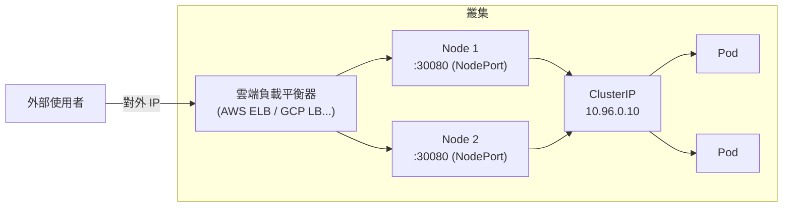

```yaml
apiVersion: v1
kind: Service
metadata:
  name: web
spec:
  type: LoadBalancer
  selector:
    app: web
  ports:
    - port: 80
      targetPort: 8080
```

### 3.4 ExternalName

不選 Pod,而是把一個叢集內名字對應到外部 DNS(回傳 CNAME)。用來把「外部資料庫」包裝成像叢集內服務一樣呼叫。**沒有 selector、沒有 ClusterIP、不做任何代理**——它純粹是 DNS 層的別名。

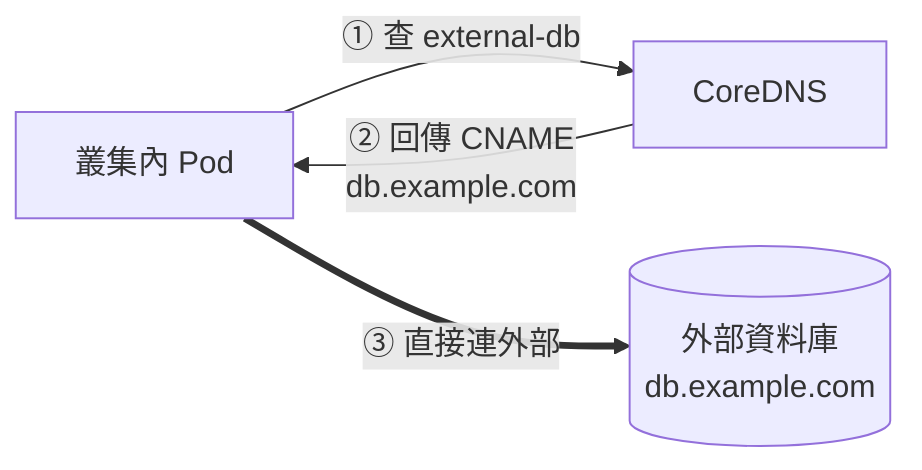

```yaml
apiVersion: v1
kind: Service
metadata:
  name: external-db
spec:
  type: ExternalName
  externalName: db.example.com    # 叢集內連 external-db 會被解析成這個外部域名
```

### 3.5 Headless Service(無頭服務)

特例:把 `clusterIP` 設成 `None`。這時 Service **不分配虛擬 IP、不做負載平衡**,而是讓 DNS 直接回傳「所有後端 Pod 的 IP」。對照前面幾種類型「先連到一個 VIP 再分流」,無頭服務是**把整份 Pod IP 清單交給呼叫方,由呼叫方自己決定連哪個**。第 2 章的 StatefulSet 就靠它給每個 Pod 固定 DNS(`web-0.web...`)([Service 官方文件 — Headless Services](https://kubernetes.io/docs/concepts/services-networking/service/#headless-services))。

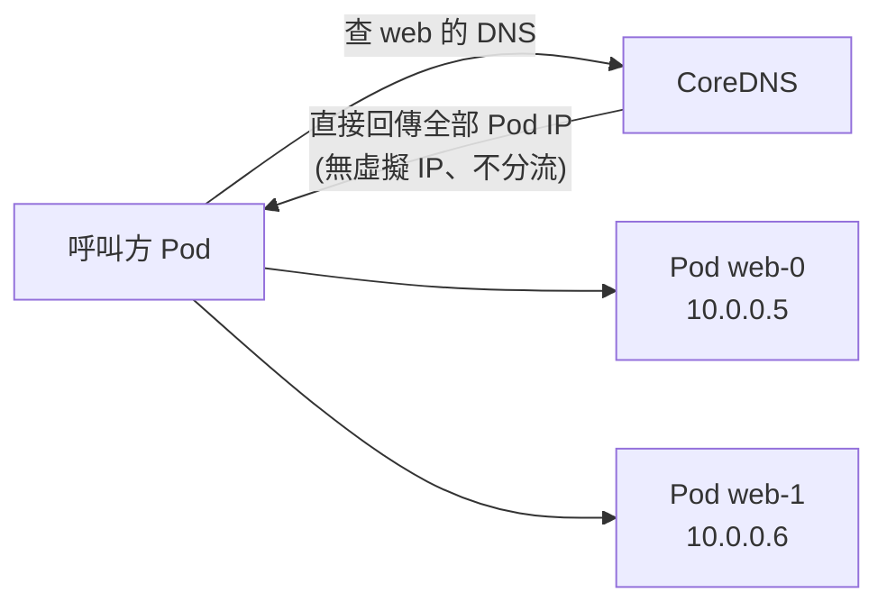

```yaml
apiVersion: v1
kind: Service
metadata:
  name: web
spec:
  clusterIP: None            # 關鍵:無頭
  selector:
    app: web
  ports:
    - port: 80
```

> 用途:當呼叫方需要「自己知道每個後端是誰」(例如資料庫叢集要直連特定節點),而不是被隨機分流。

---

## 4. CoreDNS:叢集內的電話簿

光有固定 IP 還不夠好用——我們希望用**名字**互相呼叫。叢集裡跑著 **CoreDNS**(在 `kube-system` 命名空間),它是叢集的 DNS 伺服器。每個 Service 一建立,CoreDNS 就為它登記一筆 DNS 紀錄。

### 4.1 DNS 命名規則

Service 的完整域名 (FQDN) 格式:

```
<service-name>.<namespace>.svc.cluster.local
```

例如 `default` 命名空間裡的 `web` 服務:`web.default.svc.cluster.local`([DNS for Services and Pods](https://kubernetes.io/docs/concepts/services-networking/dns-pod-service/#services))。

**簡寫規則**(因為 Pod 的 `/etc/resolv.conf` 預設帶有 `search <namespace>.svc.cluster.local svc.cluster.local cluster.local` 這樣的 search domain):

- 同命名空間內:直接用 `web`
- 跨命名空間:用 `web.其他namespace`
- 完整寫法:`web.其他namespace.svc.cluster.local`

```bash
# 在某個 Pod 裡測試 DNS 解析
kubectl run test --rm -it --image=busybox -- sh
# 然後在容器內:
nslookup web                              # 同命名空間
nslookup web.default.svc.cluster.local    # 完整域名
wget -qO- http://web                      # 直接用名字呼叫服務
```

### 4.2 解析流程

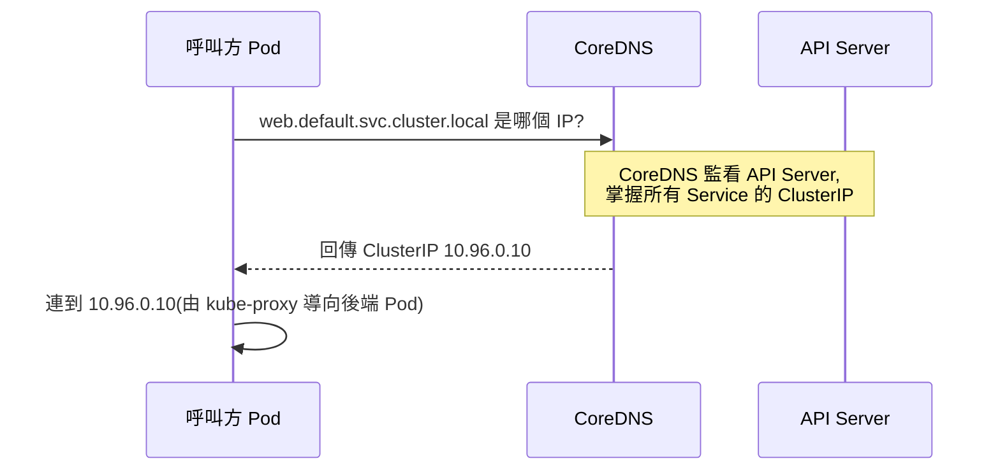

> **設計理念**:DNS 讓服務之間「用名字耦合,不用 IP 耦合」。你的程式碼裡寫 `http://web`,不管 web 服務的 ClusterIP 是多少、後面 Pod 怎麼換,都不用改一行。這是微服務能在 K8s 上鬆耦合運作的基礎。

---

## 5. Ingress:在同一個入口做 L7 路由

問題:如果你有 10 個對外服務,難道要開 10 個 LoadBalancer(10 個外部 IP、10 筆雲端費用)?太貴。而且 Service 是 L4(只認 IP/埠),不會看 HTTP 路徑或網域。

**Ingress** 是一層 **L7(HTTP/HTTPS)路由規則**:用**一個入口**,依「網域 (host)」和「路徑 (path)」把請求分流到不同的後端 Service,還能統一處理 TLS。

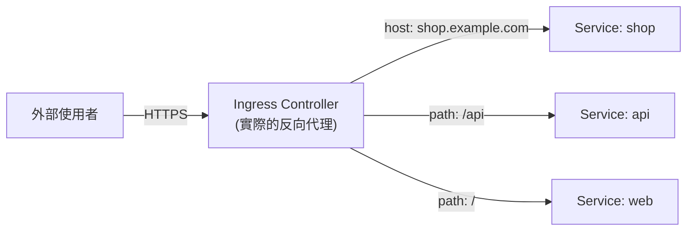

### 5.1 重要區分:Ingress 物件 vs Ingress Controller

- **Ingress 物件**:你寫的 YAML,只是一份「路由規則的宣告」。
- **Ingress Controller**:真正讀這份規則、執行反向代理的程式(例如 ingress-nginx、Traefik)。**叢集預設沒有 Controller,你得自己裝。** 官方文件明確指出:「只建立 Ingress 資源本身沒有任何效果」,必須搭配 Ingress Controller 才會生效([Ingress 官方文件](https://kubernetes.io/docs/concepts/services-networking/ingress/#ingress-controllers))。

```bash
# minikube:啟用內建 ingress-nginx
minikube addons enable ingress

# kind:手動安裝 ingress-nginx
kubectl apply -f https://raw.githubusercontent.com/kubernetes/ingress-nginx/main/deploy/static/provider/kind/deploy.yaml
```

### 5.2 Ingress 範例

```yaml
apiVersion: networking.k8s.io/v1
kind: Ingress
metadata:
  name: app-ingress
  annotations:
    nginx.ingress.kubernetes.io/rewrite-target: /   # Controller 專屬設定常透過 annotation
spec:
  ingressClassName: nginx        # 指定由哪個 Ingress Controller 處理
  tls:
    - hosts:
        - shop.example.com
      secretName: shop-tls       # TLS 憑證存在這個 Secret(第 4 章)
  rules:
    - host: shop.example.com      # 依網域分流
      http:
        paths:
          - path: /api
            pathType: Prefix
            backend:
              service:
                name: api          # /api 開頭 → api 服務
                port:
                  number: 80
          - path: /
            pathType: Prefix
            backend:
              service:
                name: web          # 其餘 → web 服務
                port:
                  number: 80
```

### Service 對外方式比較

| 方式 | 工作層級 | 能依網域/路徑分流 | 對外 IP 數量 | 適用 |
|------|---------|------------------|-------------|------|
| NodePort | L4 | 否 | 用節點 IP | 測試 |
| LoadBalancer | L4 | 否 | 每服務一個 | 單一服務對外、非 HTTP 流量 |
| Ingress | L7 | 是 | 一個共用入口 | 多個 HTTP 服務共用入口 |
| **Gateway API** | L4–L7 | 是(更強大) | 一個共用入口 | 新叢集推薦,取代 Ingress |

---

### 5.3 Gateway API:Ingress 的官方演進版

**Gateway API** 是 Kubernetes SIG Network 推出的新一代進出口流量 (ingress/egress) API。**Gateway API v1.0 於 2023 年 10 月正式宣告 GA(核心資源晉升 v1 穩定版)**,是官方認可的 Ingress 演進路徑。

> **來源**:
> - [Kubernetes 官方文件:Gateway API](https://kubernetes.io/docs/concepts/services-networking/gateway/)
> - [Gateway API 官方文件](https://gateway-api.sigs.k8s.io/)
> - [K8s Blog:Gateway API v1.0 GA 公告](https://kubernetes.io/blog/2023/10/31/gateway-api-ga/)
> - [K8s Blog:Gateway API v1.1 GA 公告](https://kubernetes.io/blog/2024/05/09/gateway-api-v1-1/)
> - [K8s Blog:Gateway API v1.5 公告](https://kubernetes.io/blog/2026/04/21/gateway-api-v1-5/)
> - [Gateway API v1.6.0 Release Notes](https://github.com/kubernetes-sigs/gateway-api/releases/tag/v1.6.0)
>
> **版本進度補充**:API 持續演進中,v1.1(2024 年 5 月)把 GRPCRoute 晉升為 Standard Channel 穩定版;v1.5(2026 年 2 月)新增 `ListenerSet`、`TLSRoute`、CORS filter、client cert 驗證等能力晉升為 Standard Channel;截至 2026 年中最新為 **v1.6.0**(2026 年 6 月),讓 **UDPRoute / TCPRoute 晉升為 GA(`v1` API,取代舊版 `v1alpha2`)**。本節示範的 GatewayClass / Gateway / HTTPRoute / GRPCRoute / ReferenceGrant 在 v1.6 下皆維持穩定、可直接使用。

#### 為什麼 Ingress 不夠用?

| Ingress 的痛點 | 說明 |
|----------------|------|
| **功能受限** | 標準只定義 host/path 路由;Header 路由、流量權重等功能靠各家自訂 annotation,**不可移植** |
| **沒有角色分工** | 一個 Ingress 物件混合了「基礎設施設定」與「應用路由規則」,開發者和平台 Ops 改同一份 YAML |
| **協定支援有限** | 只設計給 HTTP/HTTPS,TCP/UDP/gRPC 沒有標準路徑 |
| **跨命名空間受限** | 無法讓不同 namespace 的路由規則共用同一個 Gateway |

#### 核心設計:三層角色分工 (Role-Oriented)

Gateway API 最大的突破是把「誰管什麼」明確拆成三個角色與三種資源:

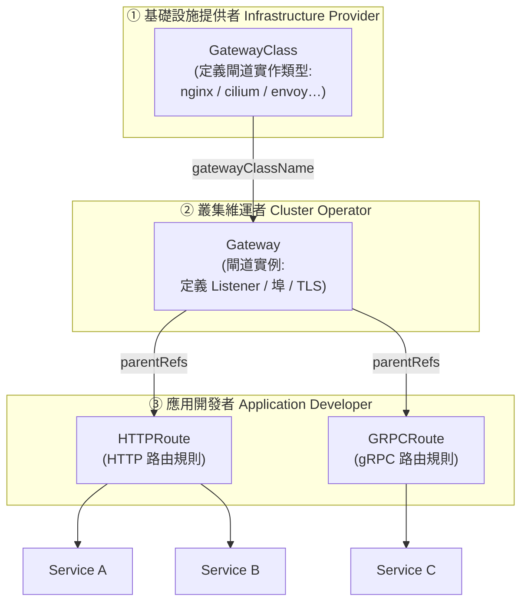

平台團隊控制 Gateway 層(流量入口的設定與安全);應用團隊控制 Route 層(路由規則)——各司其職,不需要互相等待。

#### 穩定版核心資源 (Standard Channel)

| 資源 | API 版本 | 穩定狀態 | 說明 |
|------|---------|---------|------|
| **GatewayClass** | `v1` | ✅ Stable (v1.0.0) | 閘道實作類型,對應一個 controller |
| **Gateway** | `v1` | ✅ Stable (v1.0.0) | 閘道實例,定義 Listener(埠/協定/TLS) |
| **HTTPRoute** | `v1` | ✅ Stable (v1.0.0) | HTTP/HTTPS 路由規則 |
| **GRPCRoute** | `v1` | ✅ Stable (v1.1.0) | gRPC 路由規則 |
| **ReferenceGrant** | `v1beta1` | ✅ Standard Channel | 授權跨命名空間引用 |
| **TLSRoute** | `v1` | ✅ Standard Channel (v1.5.0) | TLS passthrough 路由規則(SNI 層) |
| **ListenerSet** | `v1` | ✅ Standard Channel (v1.5.0) | 讓多個 Listener 掛載到同一 Gateway,支援多租戶 |
| **TCPRoute** | `v1`(取代 `v1alpha2`) | ✅ Stable (v1.6.0) | TCP 四層路由規則 |
| **UDPRoute** | `v1`(取代 `v1alpha2`) | ✅ Stable (v1.6.0) | UDP 四層路由規則 |

> Gateway API 是**獨立的 CRD**,不隨 K8s 版本內建,需額外安裝。TLSRoute、ListenerSet 已於 v1.5 晉升為 Standard Channel;TCPRoute、UDPRoute 已於 v1.6 晉升為 GA([Gateway API v1.5 公告](https://kubernetes.io/blog/2026/04/21/gateway-api-v1-5/)、[Gateway API v1.6.0 Release Notes](https://github.com/kubernetes-sigs/gateway-api/releases/tag/v1.6.0))。安裝時仍需注意 Standard Channel 只包含**穩定版**資源,若要用其他仍在實驗性 (Experimental) Channel 的新特性(例如較新的 GEP 提案),需另外安裝 Experimental Channel 的 CRD,詳見 [Gateway API Releases](https://github.com/kubernetes-sigs/gateway-api/releases)。

#### 安裝 Gateway API CRD

```bash
# 安裝 Standard Channel(穩定版):GatewayClass / Gateway / HTTPRoute / GRPCRoute / ReferenceGrant / TLSRoute / TCPRoute / UDPRoute(v1.6 起)
# 版本請至 https://github.com/kubernetes-sigs/gateway-api/releases 確認最新版
kubectl apply -f https://github.com/kubernetes-sigs/gateway-api/releases/latest/download/standard-install.yaml

# 確認 CRD 安裝成功
kubectl get crd | grep gateway.networking.k8s.io
```

#### 完整 YAML 範例:三層分工實作路由

**第一層:GatewayClass(基礎設施提供者建立,通常已預裝)**

```yaml
# GatewayClass:宣告「使用哪個 controller 實作閘道」
apiVersion: gateway.networking.k8s.io/v1
kind: GatewayClass
metadata:
  name: nginx
spec:
  controllerName: gateway.nginx.org/nginx-gateway-fabric
```

**第二層:Gateway(叢集 Ops 建立)**

```yaml
# Gateway:實際的閘道實例,定義 Listener(對外的埠/協定/TLS)
apiVersion: gateway.networking.k8s.io/v1
kind: Gateway
metadata:
  name: prod-gateway
  namespace: infra          # Gateway 通常放在基礎設施命名空間
spec:
  gatewayClassName: nginx   # 對應哪個 GatewayClass
  listeners:
    - name: http
      port: 80
      protocol: HTTP
      allowedRoutes:
        namespaces:
          from: All         # 允許所有命名空間的 Route 附掛
    - name: https
      port: 443
      protocol: HTTPS
      tls:
        certificateRefs:
          - name: shop-tls  # TLS 憑證 Secret(在 infra 命名空間)
      allowedRoutes:
        namespaces:
          from: Selector
          selector:
            matchLabels:
              gateway-access: "true"  # 只允許貼了此標籤的命名空間
```

**第三層:HTTPRoute(應用開發者建立)**

```yaml
# HTTPRoute:HTTP 路由規則,可和 Gateway 在不同命名空間
apiVersion: gateway.networking.k8s.io/v1
kind: HTTPRoute
metadata:
  name: shop-route
  namespace: shop-ns        # 應用自己的命名空間(與 Gateway 不同!)
spec:
  parentRefs:
    - name: prod-gateway
      namespace: infra      # 附掛到哪個 Gateway
      sectionName: https    # 附掛到哪個 Listener
  hostnames:
    - shop.example.com
  rules:
    # 規則一:依路徑路由
    - matches:
        - path:
            type: PathPrefix
            value: /api
      backendRefs:
        - name: api-svc
          port: 80
    # 規則二:進階功能 — 依 Header 做金絲雀路由(Ingress 標準做不到!)
    - matches:
        - path:
            type: PathPrefix
            value: /
          headers:
            - name: X-Canary
              value: "true"
      backendRefs:
        - name: web-canary
          port: 80
    # 規則三:主路徑,帶流量權重(可做 A/B testing)
    - matches:
        - path:
            type: PathPrefix
            value: /
      backendRefs:
        - name: web-stable     # 90% 流量打到穩定版
          port: 80
          weight: 90
        - name: web-canary     # 10% 流量打到金絲雀版
          port: 80
          weight: 10
```

> 流量權重 (weight) 讓**金絲雀發布 (Canary Deployment)** 和 **藍綠部署 (Blue-Green)** 變得原生可設定,不再需要靠複雜的 annotation 或 Service Mesh。

#### 跨命名空間路由:ReferenceGrant

HTTPRoute 可以附掛到另一個命名空間的 Gateway,但**需要 Gateway 所在命名空間的 ReferenceGrant 授權**,以防止惡意 Route 跨 namespace 「劫持」流量:

```yaml
# ReferenceGrant:允許 shop-ns 命名空間的 Route 引用 infra 命名空間的 Gateway
apiVersion: gateway.networking.k8s.io/v1beta1
kind: ReferenceGrant
metadata:
  name: allow-shop-ns
  namespace: infra          # 在「被引用」的命名空間(Gateway 所在)
spec:
  from:
    - group: gateway.networking.k8s.io
      kind: HTTPRoute
      namespace: shop-ns    # 允許 shop-ns 的 HTTPRoute 引用
  to:
    - group: gateway.networking.k8s.io
      kind: Gateway
      name: prod-gateway
```

#### Gateway API vs Ingress 完整對照

| 特性 | Ingress | Gateway API |
|------|---------|-------------|
| 穩定狀態 (GA) | GA(K8s 1.19) | GA(Gateway API v1.0,2023,獨立於 K8s 版本) |
| 角色分工 | 無(全混在一個物件) | 三層分工(GatewayClass/Gateway/Route) |
| Header 路由 | 不支援(靠 annotation) | ✅ 原生支援 |
| 流量權重分流 | 不支援(靠 annotation) | ✅ 原生支援(weight 欄位) |
| 跨命名空間路由 | 不支援 | ✅ 支援(透過 ReferenceGrant) |
| gRPC | 不支援 | ✅ GRPCRoute(v1.1 穩定) |
| TLS termination | 支援 | ✅ 支援(更細緻的設定) |
| 可移植性 | 差(annotation 各家不同) | 好(標準 API,實作可互換) |
| 目前採用度 | 非常廣泛(成熟生態) | 快速增長,各大實作已支援 |

#### 主流實作 (Implementations)

| 實作 | 說明 |
|------|------|
| **Cilium** | 雲原生 CNI,同時支援 Gateway API(EKS/GKE 常用) |
| **NGINX Gateway Fabric** | NGINX 官方 Gateway API 實作 |
| **Envoy Gateway** | CNCF 專案,以 Envoy 為底層 |
| **Contour** | VMware 維護,以 Envoy 為底層 |
| **Traefik** | 支援 Gateway API(v3+) |
| **AWS Load Balancer Controller** | EKS 官方實作;v3.0.0(2026 GA)起**原生**支援 Gateway API,以 CRD 設定(L7 → ALB、L4 → NLB),不再靠 annotation |

> **實務建議**:新叢集**優先評估 Gateway API**;現有叢集的 Ingress **不需要立刻遷移**(Ingress 不會被棄用),但新功能只會出現在 Gateway API 上。

**動手練習(Gateway API)**:
1. 安裝 Gateway API CRD 與一個實作(如 nginx-gateway-fabric)。
2. 依照三層角色建立 GatewayClass → Gateway → HTTPRoute,把兩個服務路由到同一個 Gateway 的不同路徑。
3. 用 HTTPRoute 的 `weight` 欄位做 9:1 流量分流,體驗金絲雀路由。
4. 嘗試建立跨命名空間的 HTTPRoute + ReferenceGrant,理解為什麼需要授權。

---

## 6. NetworkPolicy:Pod 之間的防火牆(進階)

預設情況下,叢集內**任何 Pod 都能連任何 Pod**(回想第 1 節的扁平網路)。這在正式環境是個安全隱患。**NetworkPolicy** 讓你像防火牆一樣限制「誰能連誰」。

```yaml
apiVersion: networking.k8s.io/v1
kind: NetworkPolicy
metadata:
  name: db-allow-api-only
spec:
  podSelector:
    matchLabels:
      app: db                  # 這條規則套用在 db Pod 上
  policyTypes:
    - Ingress
  ingress:
    - from:
        - podSelector:
            matchLabels:
              app: api          # 只允許帶 app=api 的 Pod 連進來
      ports:
        - protocol: TCP
          port: 5432
```

> 注意:NetworkPolicy 需要 **CNI 外掛支援**(Calico、Cilium 支援;有些簡易 CNI 不支援)。寫了沒效果的話先確認你的 CNI。

---

## 7. 除錯網路問題的順序

```bash
# 1) Service 有沒有正確選到 Pod?Endpoints 是空的代表 selector 沒對上
kubectl get svc web
kubectl get endpointslices -l kubernetes.io/service-name=web
kubectl describe svc web                  # 看 Endpoints 欄位

# 2) DNS 通不通?
kubectl run test --rm -it --image=busybox -- nslookup web

# 3) 從 Pod 內實際連連看
kubectl run test --rm -it --image=busybox -- wget -qO- http://web

# 4) Ingress 有沒有被 Controller 接管?
kubectl get ingress
kubectl describe ingress app-ingress
kubectl get pods -n ingress-nginx          # Controller 在跑嗎
```

> 最常見的坑:**Service 的 selector 跟 Pod 的 label 對不上**,導致 Endpoints 空空如也,連線一直失敗卻沒報錯。永遠先檢查 Endpoints。

---

## 動手練習

1. 部署一個 nginx Deployment(3 副本)加一個 ClusterIP Service,用 `kubectl get endpointslices` 確認三個 Pod IP 都在後端。
2. 起一個臨時 busybox Pod,用 `nslookup` 與 `wget` 透過 Service 名字連到 nginx,體會 DNS 的作用。
3. 把 Service 改成 NodePort,從節點 IP + 埠存取;再試 `minikube tunnel` 或 LoadBalancer。
4. 安裝 Ingress Controller,部署兩個服務(web 與 api),寫一個 Ingress 用路徑 `/` 與 `/api` 分流,用 curl 加 `Host` header 測試。
5. 故意把 Service 的 selector 改錯一個字,觀察 Endpoints 變空、連線失敗,體會這個常見坑。
6. (進階)寫一條 NetworkPolicy 只允許 api 連 db,從別的 Pod 測試是否被擋(需 Calico/Cilium)。

---

## 本章檢核點 (Checklist)

- [ ] 能說明 K8s 扁平網路的三條規則,理解 Pod 之間預設可直連
- [ ] 能解釋為什麼需要 Service(Pod IP 會變)以及 Service 提供的兩件事
- [ ] 理解 Service 透過 selector + Endpoints/EndpointSlice 找到後端,且未就緒 Pod 不列入
- [ ] 能說出 ClusterIP / NodePort / LoadBalancer / ExternalName 的差異與層層疊加關係
- [ ] 知道 Headless Service(clusterIP: None)的用途與 StatefulSet 的關聯
- [ ] 能寫出 Service 的完整 FQDN 並用簡寫做跨/同命名空間呼叫
- [ ] 能解釋 CoreDNS 的角色,以及「用名字耦合不用 IP 耦合」的設計價值
- [ ] 能區分 Ingress 物件與 Ingress Controller,知道沒裝 Controller 規則不生效
- [ ] 能寫一個依 host/path 分流並含 TLS 的 Ingress
- [ ] 理解 Gateway API 三層角色分工(GatewayClass / Gateway / HTTPRoute),能說明它解決了 Ingress 的哪些痛點
- [ ] 能說出 Gateway API 相較 Ingress 的三個核心優勢:Header 路由、流量權重、跨命名空間路由
- [ ] 知道 ReferenceGrant 的用途(跨命名空間路由的授權機制)
- [ ] 會用「先查 Endpoints、再查 DNS、再從 Pod 內實連」的順序除錯網路

> 下一章:[04-config-storage.md](./04-config-storage.md) — 設定、密碼、資料怎麼跟容器解耦並持久化。
