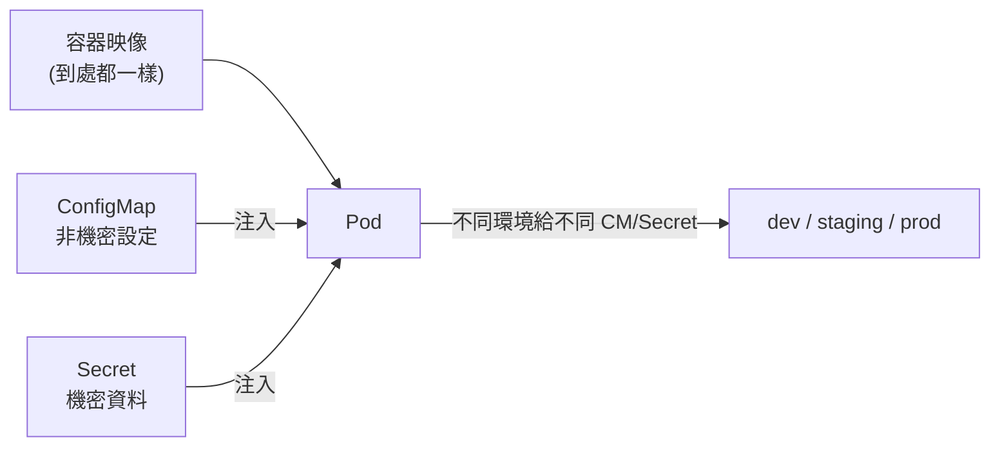
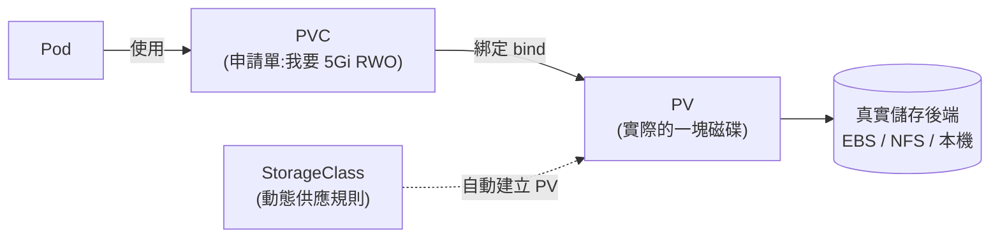

# 04 - 設定與儲存 (Config & Storage)

> 目標:把「設定、密碼、資料」跟容器映像 (image) 解耦,並讓需要保留的資料能在 Pod 生滅之間持久存活。讀完你要能用 ConfigMap / Secret 注入設定,並用 PV / PVC / StorageClass 完成一次動態供應 (dynamic provisioning)。

---

## 1. 核心原則:設定與映像分離 (The Twelve-Factor 直覺)

一個重要的軟體工程原則:**同一份容器映像,應該能跑在 dev、staging、prod 而不必重新打包。** 差別只在「設定」——資料庫位址、功能開關、密碼。

如果你把設定寫死在映像裡,換環境就得重 build,而且密碼會被烤進映像層,任何人拉到映像都看得到。所以 K8s 提供:

- **ConfigMap**:存放**非機密**的設定(URL、開關、設定檔內容)。
- **Secret**:存放**機密**資料(密碼、token、TLS 憑證)。

兩者的注入方式幾乎一樣,差別在於 Secret 多了一些保護處理。



---

## 2. ConfigMap:非機密設定

### 2.1 建立 ConfigMap

```yaml
apiVersion: v1
kind: ConfigMap
metadata:
  name: app-config
data:
  # 兩種風格:單純的鍵值對
  LOG_LEVEL: "info"
  DB_HOST: "db.default.svc.cluster.local"
  # 或整個設定檔(用多行字串)
  app.properties: |
    server.port=8080
    cache.enabled=true
```

```bash
# 也能從檔案或字面值快速建立
kubectl create configmap app-config --from-literal=LOG_LEVEL=info
kubectl create configmap app-config --from-file=app.properties
```

### 2.2 兩種注入方式

**方式一:當作環境變數 (environment variables)**

```yaml
spec:
  containers:
    - name: app
      image: my-app:1.0
      env:
        - name: LOG_LEVEL              # 取單一鍵當環境變數
          valueFrom:
            configMapKeyRef:
              name: app-config
              key: LOG_LEVEL
      envFrom:                          # 或一次把整個 ConfigMap 全變成環境變數
        - configMapRef:
            name: app-config
```

**方式二:掛載成檔案 (volume mount)**

```yaml
spec:
  containers:
    - name: app
      image: my-app:1.0
      volumeMounts:
        - name: config
          mountPath: /etc/config        # ConfigMap 每個鍵變成這目錄下一個檔案
  volumes:
    - name: config
      configMap:
        name: app-config
```

> **環境變數 vs 檔案怎麼選?**
> - 環境變數:簡單的設定值、程式啟動時讀一次就好。**缺點:Pod 啟動後改 ConfigMap,環境變數不會自動更新**(要重啟 Pod)。
> - 檔案掛載:適合整份設定檔。**優點:更新 ConfigMap 後,掛載的檔案會自動同步**(同步延遲取決於 kubelet 的週期同步機制,且若用 `subPath` 掛載則不會收到更新、程式也要支援重讀)([ConfigMap 官方文件 — Mounted ConfigMaps are updated automatically](https://kubernetes.io/docs/concepts/configuration/configmap/#mounted-configmaps-are-updated-automatically))。

---

## 3. Secret:機密資料

Secret 跟 ConfigMap 用法幾乎一樣,但專門放機密。

### 3.1 重要觀念:Secret 預設只是 Base64,不是加密!

很多人誤會 Secret 是「加密的」。**預設情況下,Secret 在 etcd 裡只是 Base64 編碼,任何人 Base64 decode 就能還原。** 官方文件甚至直接寫明:「Kubernetes Secrets 預設以未加密的形式存在 API Server 底層的資料儲存(etcd)中,任何有 API 存取權或 etcd 存取權的人都能讀取或修改」([Secrets 官方文件](https://kubernetes.io/docs/concepts/configuration/secret/#caution))。它的真正保護來自:

1. **存取控制 (RBAC)**:限制誰能讀 Secret(第 5 章)。
2. **靜態加密 (encryption at rest)**:需要另外在 API Server 開啟 `EncryptionConfiguration`,才會真的加密寫進 etcd([Encrypting Confidential Data at Rest](https://kubernetes.io/docs/tasks/administer-cluster/encrypt-data/))。
3. 不會被印在一般的 `kubectl describe` 輸出裡(值會被遮蔽)。

> 結論:Secret 比 ConfigMap「安全一點點」,但別把它當成保險箱。真正的機密管理(如金鑰輪替、外部 Vault 整合)要靠額外工具(External Secrets Operator、Sealed Secrets 等)。

```yaml
apiVersion: v1
kind: Secret
metadata:
  name: db-secret
type: Opaque                    # 一般用途的 Secret
data:
  password: cGFzc3dvcmQxMjM=    # 注意:這裡的值必須是 Base64 編碼後的
```

```bash
# 用指令建立比較不會手動 base64 出錯(--from-literal 會自動編碼)
kubectl create secret generic db-secret --from-literal=password='password123'

# 解碼來看(印證它只是 base64)
kubectl get secret db-secret -o jsonpath='{.data.password}' | base64 -d
```

### 3.2 注入方式(同 ConfigMap)

```yaml
spec:
  containers:
    - name: app
      image: my-app:1.0
      env:
        - name: DB_PASSWORD
          valueFrom:
            secretKeyRef:           # 只差在 secretKeyRef 而非 configMapKeyRef
              name: db-secret
              key: password
```

### 3.3 常見 Secret 類型

| 類型 | 用途 |
|------|------|
| `Opaque` | 任意鍵值(預設) |
| `kubernetes.io/tls` | TLS 憑證 + 私鑰(給 Ingress 用,第 3 章) |
| `kubernetes.io/dockerconfigjson` | 拉私有映像倉庫的認證 |
| `kubernetes.io/service-account-token` | ServiceAccount 的長期 token(第 5 章) |

> **版本提醒**:`kubernetes.io/service-account-token` 這種長期有效的 Secret 屬於**舊機制 (legacy mechanism)**。自 **Kubernetes v1.22** 起,官方建議改用 [TokenRequest API](https://kubernetes.io/docs/reference/kubernetes-api/authentication-resources/token-request-v1/) 取得短期、會自動輪替的 token(例如 `kubectl create token <serviceaccount>`),而不是建立長期不過期的 Secret([Secrets 官方文件 — Service account token Secrets](https://kubernetes.io/docs/concepts/configuration/secret/#service-account-token-secrets))。

```bash
# 建立 TLS Secret 給 Ingress
kubectl create secret tls shop-tls --cert=tls.crt --key=tls.key
```

---

## 4. Volume:容器的檔案系統解決方案

### 4.1 為什麼需要 Volume?

容器的檔案系統是**短暫的**:容器一重啟,寫進去的檔案全沒了。而且第 2 章說過 Pod 隨時會被重建。**Volume** 解決兩件事:

1. **在容器重啟之間保留資料**(掛在 Pod 層級,容器重啟不影響)。
2. **讓同一個 Pod 內的多個容器共享檔案**。

但注意:大多數 Volume 的生命週期還是**綁在 Pod 上**——Pod 刪了,資料還是可能沒了。要真正「跨 Pod 持久」,得用 PV/PVC(下一節)。

### 4.2 常見 Volume 類型

| 類型 | 生命週期 | 用途 |
|------|---------|------|
| `emptyDir` | 跟 Pod 一樣,容器重啟不受影響、Pod 移除才清空 | 同 Pod 容器間共享暫存、快取 |
| `hostPath` | 節點上的路徑 | 讓 Pod 讀節點本機檔案(如日誌),DaemonSet 常用 |
| `configMap` / `secret` | 跟著來源物件 | 把設定/密碼掛成檔案(前面已用過) |
| `persistentVolumeClaim` | 獨立於 Pod | 真正的持久化(下一節重點) |

```yaml
# emptyDir 範例:兩個容器透過暫存目錄共享資料
spec:
  containers:
    - name: writer
      image: busybox
      command: ['sh', '-c', 'echo hi > /shared/msg; sleep 3600']
      volumeMounts:
        - name: scratch
          mountPath: /shared
    - name: reader
      image: busybox
      command: ['sh', '-c', 'cat /shared/msg; sleep 3600']
      volumeMounts:
        - name: scratch
          mountPath: /shared
  volumes:
    - name: scratch
      emptyDir: {}              # Pod 存活期間共享,容器崩潰重啟不受影響;Pod 從節點移除才會被清空
```

> 官方文件明確指出:「容器崩潰不會把 Pod 從節點移除,emptyDir 裡的資料在容器崩潰後依然安全」([Volumes 官方文件 — emptyDir](https://kubernetes.io/docs/concepts/storage/volumes/#emptydir))。

---

## 5. 持久化儲存:PV / PVC / StorageClass 三件套

這是本章最重要、CKA 也最常考的部分。先理解「為什麼要分這麼多層」。

### 5.1 設計理念:供給 (provision) 與消費 (consume) 解耦

K8s 想讓**「需要儲存的人」與「提供儲存的人」分離**:

- **應用開發者**只想說:「我要一塊 5Gi、可讀寫的磁碟」——他不該也不想管底層是 AWS EBS、NFS 還是本機磁碟。
- **叢集管理員 / 雲端**負責提供真正的儲存資源。

於是有三個物件:

| 物件 | 角色 | 誰負責 |
|------|------|--------|
| **PersistentVolume (PV)** | 一塊「實際存在」的儲存資源 | 管理員 / 動態自動建立 |
| **PersistentVolumeClaim (PVC)** | 一張「我要這樣一塊儲存」的申請單 | 應用開發者 |
| **StorageClass (SC)** | 「動態建立 PV 的模板/規則」 | 管理員,定義儲存類型 |



### 5.2 靜態供應 (Static Provisioning):管理員先準備好 PV

管理員手動建立 PV,使用者寫 PVC 來「認領」一塊符合需求的 PV。

```yaml
# 管理員建立 PV(這裡用 hostPath 示範,正式環境會是雲端磁碟/NFS)
apiVersion: v1
kind: PersistentVolume
metadata:
  name: pv-1
spec:
  capacity:
    storage: 5Gi
  accessModes:
    - ReadWriteOnce          # 存取模式,見下表
  persistentVolumeReclaimPolicy: Retain   # PVC 刪除後 PV 與資料怎麼處理
  hostPath:
    path: /mnt/data
---
# 使用者建立 PVC(申請單):K8s 會找一塊符合的 PV 綁定
apiVersion: v1
kind: PersistentVolumeClaim
metadata:
  name: my-pvc
spec:
  accessModes:
    - ReadWriteOnce
  resources:
    requests:
      storage: 5Gi
```

### 5.3 動態供應 (Dynamic Provisioning):用 StorageClass 自動生 PV

靜態供應很麻煩——每塊磁碟都要管理員先手動建 PV。**StorageClass 讓 PV 自動產生**:使用者只要在 PVC 指定 storageClassName,K8s 就依該 SC 的規則(driver、參數)即時建立一塊 PV 並綁定。這是雲端與現代叢集的主流做法([StorageClass 官方文件](https://kubernetes.io/docs/concepts/storage/storage-classes/))。

```yaml
# StorageClass(管理員定義一次,通常叢集已內建一個 default)
apiVersion: storage.k8s.io/v1
kind: StorageClass
metadata:
  name: fast
provisioner: kubernetes.io/aws-ebs    # 由哪個 driver 建立實際儲存
parameters:
  type: gp3
reclaimPolicy: Delete                  # PVC 刪掉時連同 PV 與磁碟一起刪
volumeBindingMode: WaitForFirstConsumer  # 等 Pod 排程後才建磁碟(確保磁碟跟 Pod 同區);若省略,預設為 Immediate(PVC 一建立就立刻供應)
---
# 使用者只要寫 PVC,指定 storageClassName,PV 自動生出來
apiVersion: v1
kind: PersistentVolumeClaim
metadata:
  name: data-pvc
spec:
  accessModes:
    - ReadWriteOnce
  storageClassName: fast               # 指向上面的 StorageClass
  resources:
    requests:
      storage: 10Gi
```

> 在 kind / minikube,通常已內建一個 default StorageClass(`standard` 或 `local-path`),所以你**連 StorageClass 都不用自己寫**,直接建 PVC 就會動態供應。
> ```bash
> kubectl get storageclass        # 看叢集有哪些 SC,哪個是 (default)
> ```

### 5.4 Pod 怎麼用 PVC

```yaml
spec:
  containers:
    - name: app
      image: my-app:1.0
      volumeMounts:
        - name: data
          mountPath: /data           # 容器看到的掛載路徑
  volumes:
    - name: data
      persistentVolumeClaim:
        claimName: data-pvc          # 指向上面建立的 PVC
```

### 5.5 存取模式 (Access Modes)

| 模式 | 縮寫 | 意義 |
|------|------|------|
| ReadWriteOnce | RWO | 單一節點可讀寫(最常見,塊儲存如 EBS) |
| ReadOnlyMany | ROX | 多節點唯讀 |
| ReadWriteMany | RWX | 多節點可讀寫(需 NFS / CephFS 這類共享檔案系統) |
| ReadWriteOncePod | RWOP | 只限單一 Pod(而非單一節點)讀寫,限制更嚴格;僅支援 CSI 卷,已於 **Kubernetes v1.29** 正式 GA |

來源:[Persistent Volumes — Access Modes](https://kubernetes.io/docs/concepts/storage/persistent-volumes/#access-modes)、[ReadWriteOncePod 正式 GA 公告](https://kubernetes.io/blog/2023/12/18/read-write-once-pod-access-mode-ga/)。

> 常見坑:想讓多個 Pod 同時讀寫同一塊磁碟,結果用了只支援 RWO 的儲存(如 EBS)→ 失敗。RWX 需要檔案型儲存(NFS 等)。

### 5.6 回收策略 (Reclaim Policy)

PVC 被刪除後,對應的 PV 與其資料怎麼辦:

| 策略 | 行為 |
|------|------|
| `Retain` | 保留 PV 與資料,需管理員手動清理(避免誤刪資料) |
| `Delete` | 連同底層磁碟一起刪除(動態供應由 StorageClass 建立的 PV,預設策略就是 `Delete`) |

> 另有一個 `Recycle` 策略已被官方文件標示為**已棄用 (deprecated)**,建議改用動態供應取代([Persistent Volumes — Reclaiming](https://kubernetes.io/docs/concepts/storage/persistent-volumes/#reclaiming))。

> 正式環境放重要資料,傾向用 `Retain` 當保險;測試環境用 `Delete` 自動清乾淨。

### 5.7 生命週期狀態

```bash
kubectl get pv                  # 看 PV 狀態:Available / Bound / Released / Failed
kubectl get pvc                 # 看 PVC 狀態:Pending(沒綁到)/ Bound(綁好了)
kubectl describe pvc data-pvc   # PVC 一直 Pending 時看 Events 找原因
```

PV 的這四種 phase(`Available` / `Bound` / `Released` / `Failed`)是官方定義的生命週期狀態([Persistent Volumes — Lifecycle](https://kubernetes.io/docs/concepts/storage/persistent-volumes/#lifecycle-of-a-volume-and-claim))。

> PVC 卡在 `Pending` 的常見原因:沒有符合條件的 PV、也沒有可用的 StorageClass 做動態供應、或 access mode / 容量對不上。

---

## 6. StatefulSet 的 volumeClaimTemplates 回顧

第 2 章的 StatefulSet 用 `volumeClaimTemplates` 為**每個 Pod 各自**產生一塊 PVC(`data-web-0`、`data-web-1`...)。背後就是動態供應在運作——每個序號 Pod 都拿到專屬磁碟,重建後還認得回自己那塊;預設情況下 Pod 被刪除或縮容時,對應的 PVC 並不會被自動刪除(資料保護的設計),需要另外設定 `persistentVolumeClaimRetentionPolicy` 才能改變這個行為([StatefulSet 官方文件 — volumeClaimTemplates](https://kubernetes.io/docs/concepts/workloads/controllers/statefulset/#persistentvolumeclaim-retention))。把第 2 章與本章串起來,你就懂有狀態應用的儲存全貌了。

```bash
kubectl get pvc            # StatefulSet 跑起來後,會看到 data-web-0、data-web-1...
```

---

## 動手練習

1. 建立一個 ConfigMap(含 LOG_LEVEL 與一個 app.properties),分別用「環境變數」和「檔案掛載」兩種方式注入 Pod,進容器 `env` 與 `cat /etc/config/app.properties` 驗證。
2. 用 `kubectl create secret generic` 建一個 Secret,注入成環境變數;再用 `base64 -d` 印證它只是編碼不是加密。
3. 建一個 PVC(不指定 SC,靠叢集 default StorageClass 動態供應),`kubectl get pv,pvc` 觀察 PV 被自動建立並綁定。
4. 寫一個 Pod 掛載這個 PVC,寫一個檔案進去;刪掉 Pod 再用新 Pod 掛同一個 PVC,確認檔案還在——體會「跨 Pod 持久」。
5. 把 reclaimPolicy 設成 Retain,刪掉 PVC,觀察 PV 變成 `Released` 而非消失。
6. 部署第 2 章的 StatefulSet,`kubectl get pvc` 看每個 Pod 各自的 PVC。

---

## 本章檢核點 (Checklist)

- [ ] 能說明「設定與映像分離」的價值,並區分 ConfigMap 與 Secret 的用途
- [ ] 能用環境變數與檔案掛載兩種方式注入 ConfigMap,並說出兩者更新行為的差異
- [ ] 知道 Secret 預設只是 Base64 不是加密,理解其真正保護來自 RBAC 與靜態加密
- [ ] 能說出常見 Secret 類型(Opaque / tls / dockerconfigjson)及用途
- [ ] 能區分 emptyDir / hostPath / configMap / PVC 等 Volume 類型的生命週期
- [ ] 能用自己的話解釋 PV / PVC / StorageClass 的角色與「供給/消費解耦」的設計
- [ ] 能完成一次動態供應:建 PVC → 自動產生 PV → Pod 掛載
- [ ] 能驗證資料跨 Pod 持久(刪 Pod 重建後檔案還在)
- [ ] 理解 access modes(RWO/ROX/RWX/RWOP)與 reclaim policy(Retain/Delete)的差異與選擇
- [ ] 會用 PV/PVC 狀態與 describe Events 排查 PVC Pending 問題

> 下一章:[05-security-scheduling.md](./05-security-scheduling.md) — 誰能做什麼、Pod 該排到哪、資源怎麼控管。
