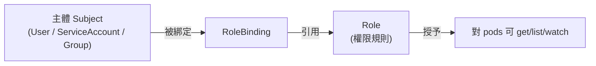
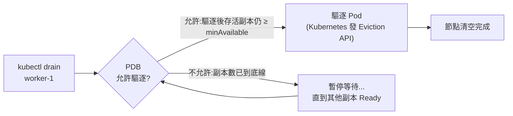
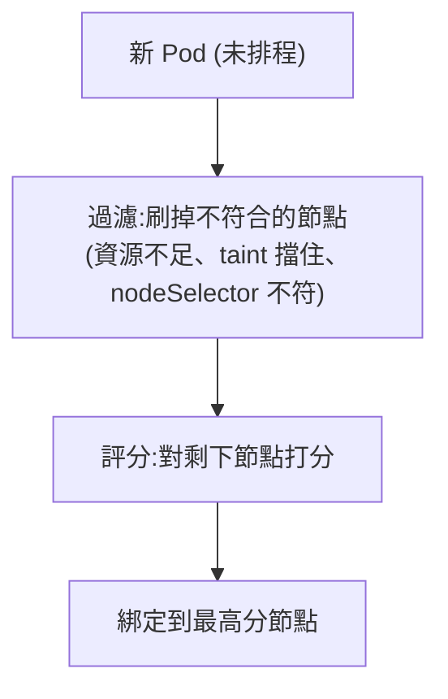

# 05 - 安全與排程 (Security & Scheduling)

> 目標:控制「誰能對叢集做什麼」(身分與授權)、「Pod 該被放到哪台節點」(排程)、以及「資源怎麼配給與自動擴縮」。讀完你要能設定 RBAC、調控資源、配置探針與 HPA、用排程機制把 Pod 放到對的地方。

---

## 第一部分:身分與授權 (Identity & Authorization)

## 1. Namespace:邏輯隔離的分區

第 1 章提過 Namespace 是「叢集內的邏輯分區」。它的價值:

- **資源分組**:把 `dev`、`staging`、`prod`,或不同團隊的資源隔開。
- **名稱作用域**:同一個 Namespace 內名字不能重複,不同 Namespace 可同名。
- **權限與配額的邊界**:RBAC 與資源配額 (ResourceQuota) 常以 Namespace 為單位套用。

```bash
kubectl create namespace dev
kubectl get ns
kubectl get pods -n dev               # -n 指定命名空間
kubectl config set-context --current --namespace=dev   # 設定預設命名空間,省得每次打 -n
```

> 注意:Namespace 是**邏輯**隔離,不是網路或安全的硬牆。預設 Pod 仍可跨 Namespace 互連([沒有 NetworkPolicy 時,Pod 對 ingress/egress 都是「非隔離」狀態,允許所有連線](https://kubernetes.io/docs/concepts/services-networking/network-policies/#the-two-sorts-of-pod-isolation))——要真的隔離網路得用 NetworkPolicy(第 3 章)。

---

## 2. 認證 vs 授權:兩個不同的問題

回到第 1 章:API Server 處理每個請求時會問兩個問題:

1. **認證 (Authentication):你是誰?** — 驗證身分(憑證、token)。
2. **授權 (Authorization):你能做這件事嗎?** — 由 RBAC 決定。

K8s 有兩種「身分」:

| 身分類型 | 給誰用 | 怎麼認證 |
|---------|--------|----------|
| **使用者 (User)** | 真人 / 外部系統 | 憑證、OIDC 等(K8s 本身不存使用者) |
| **ServiceAccount (SA)** | 跑在 Pod 裡的程式 | 自動掛載的 token |

> 關鍵差異:**User 由叢集外部管理**(K8s 沒有「使用者」這個物件);**ServiceAccount 是 K8s 物件**,專給叢集內的工作負載用。

---

## 3. ServiceAccount:給 Pod 的身分

每個 Pod 都會有一個 ServiceAccount(沒指定就用該 Namespace 的 `default`)。它的 token 會被自動掛進 Pod,讓 Pod 內的程式能呼叫 API Server——例如一個需要列出 Pod 的控制器程式。

```yaml
apiVersion: v1
kind: ServiceAccount
metadata:
  name: app-sa
  namespace: dev
---
apiVersion: v1
kind: Pod
metadata:
  name: app
spec:
  serviceAccountName: app-sa          # 指定這個 Pod 用哪個 SA
  containers:
    - name: app
      image: my-app:1.0
```

> 安全建議:**不要讓應用 Pod 用 default SA 並給它過大權限。** 為需要呼叫 API 的應用建專屬 SA,只授予剛好夠用的權限(最小權限原則)。不需要呼叫 API 的 Pod,可關掉自動掛 token(`automountServiceAccountToken: false`)——這是[官方 RBAC Good Practices](https://kubernetes.io/docs/concepts/security/rbac-good-practices/#hardening)明確建議的加固手法。

---

## 4. RBAC:基於角色的存取控制 (Role-Based Access Control)

RBAC 用四種物件,核心是兩兩配對的「角色 + 綁定」:

| 物件 | 作用範圍 | 定義什麼 |
|------|---------|----------|
| **Role** | 單一 Namespace | 一組「可對哪些資源做哪些動作」的權限 |
| **ClusterRole** | 整個叢集 | 同上,但跨 Namespace / 含叢集級資源 |
| **RoleBinding** | 單一 Namespace | 把 Role(或 ClusterRole)綁給某身分 |
| **ClusterRoleBinding** | 整個叢集 | 把 ClusterRole 綁給某身分,全叢集生效 |

心法:**Role 定義「能做什麼」,Binding 定義「誰能做」。** 兩者分開,讓同一組權限可以重複綁給不同身分。



### 4.1 範例:讓某 SA 只能讀 dev 命名空間的 Pod

```yaml
# Role:定義「能做什麼」——只能讀 pods
apiVersion: rbac.authorization.k8s.io/v1
kind: Role
metadata:
  namespace: dev
  name: pod-reader
rules:
  - apiGroups: [""]                  # "" 代表核心 API 群組(Pod 在這裡)
    resources: ["pods"]
    verbs: ["get", "list", "watch"]  # 只允許讀,不能 create/delete
---
# RoleBinding:定義「誰能做」——把上面的 Role 綁給 app-sa
apiVersion: rbac.authorization.k8s.io/v1
kind: RoleBinding
metadata:
  namespace: dev
  name: read-pods
subjects:
  - kind: ServiceAccount
    name: app-sa
    namespace: dev
roleRef:
  kind: Role
  name: pod-reader
  apiGroup: rbac.authorization.k8s.io
```

```bash
# 用 auth can-i 驗證權限(超實用,CKA 必會)
kubectl auth can-i list pods --as=system:serviceaccount:dev:app-sa -n dev   # yes
kubectl auth can-i delete pods --as=system:serviceaccount:dev:app-sa -n dev # no
```

> **Role vs ClusterRole 怎麼選?** 權限只在單一 Namespace → Role。需要跨 Namespace、或操作叢集級資源(nodes、persistentvolumes、namespaces 本身)→ ClusterRole。常見技巧:用 ClusterRole 定義「可重用的權限集」,再用 RoleBinding 把它限縮綁到特定 Namespace。

---

## 第二部分:資源管理與健康 (Resources & Health)

## 5. 資源 requests 與 limits

每個容器可以宣告對 CPU 與記憶體的需求,這是叢集調度與穩定性的基礎。

```yaml
resources:
  requests:                 # 「至少要保留給我」——Scheduler 依此找有空位的節點
    cpu: "250m"             # 250 millicores = 0.25 顆 CPU
    memory: "256Mi"
  limits:                   # 「最多用到這」——超過會被限制
    cpu: "500m"
    memory: "512Mi"
```

兩者的角色完全不同:

- **requests** 影響**排程**:Scheduler 把 requests 加總,確保節點剩餘容量裝得下,才把 Pod 放上去。它是「保證會保留的量」。
- **limits** 影響**執行限制**:
  - **CPU 超過 limit → 被節流 (throttled)**,變慢但不會死。
  - **記憶體超過 limit → 被 OOMKilled**(直接殺掉容器),因為記憶體不可壓縮。

> 這就是為什麼記憶體沒設好很容易看到 `OOMKilled`,而 CPU 不足只是變慢。CKA / 線上除錯常見題。

### 5.1 服務品質等級 (QoS Classes)

K8s 依 requests/limits 設定把 Pod 分成三級,**節點記憶體不足要驅逐 Pod 時,先犧牲低等級的**:

| QoS 等級 | 條件 | 被驅逐優先序 |
|---------|------|-------------|
| **Guaranteed** | 每個容器 requests == limits(CPU 與記憶體都設且相等) | 最後才動(最穩) |
| **Burstable** | 有設 requests,但不滿足 Guaranteed | 中間 |
| **BestEffort** | 完全沒設 requests/limits | 最先被驅逐(最不穩) |

> 重要服務想要最穩,就把 requests 設成等於 limits,進入 Guaranteed 等級。三個等級的判定條件與驅逐順序見[官方文件 Pod Quality of Service Classes](https://kubernetes.io/docs/concepts/workloads/pods/pod-qos/)。

### 5.2 用配額管住整個 Namespace

```yaml
# ResourceQuota:限制整個 dev 命名空間的資源總量上限
apiVersion: v1
kind: ResourceQuota
metadata:
  name: dev-quota
  namespace: dev
spec:
  hard:
    requests.cpu: "4"
    requests.memory: 8Gi
    pods: "20"
---
# LimitRange:為沒寫 requests/limits 的容器自動補上預設值
apiVersion: v1
kind: LimitRange
metadata:
  name: default-limits
  namespace: dev
spec:
  limits:
    - default:               # 預設 limit
        cpu: "500m"
        memory: 256Mi
      defaultRequest:        # 預設 request
        cpu: "100m"
        memory: 128Mi
      type: Container
```

---

## 6. 探針 (Probes):讓 K8s 知道容器的死活與就緒

容器「在跑」不代表「健康」或「能接客」。探針讓 kubelet 主動探測:

| 探針 | 問什麼 | 失敗時 | 用途 |
|------|--------|--------|------|
| **livenessProbe**(存活) | 還活著嗎? | **重啟容器** | 偵測死鎖/卡死,救回卡住的程式 |
| **readinessProbe**(就緒) | 能接流量了嗎? | **從 Service Endpoints 移除**(不殺) | 暫時不可用時先停止導流(回想第 3 章) |
| **startupProbe**(啟動) | 啟動完成了嗎? | 重啟容器 | 給慢啟動的程式緩衝,期間不跑 liveness |

> 三種探針的語意與失敗行為見[官方文件 Container Probes](https://kubernetes.io/docs/concepts/workloads/pods/pod-lifecycle/#types-of-probe)。

```yaml
spec:
  containers:
    - name: app
      image: my-app:1.0
      livenessProbe:
        httpGet:
          path: /healthz
          port: 8080
        initialDelaySeconds: 10     # 啟動後等 10 秒才開始探
        periodSeconds: 10           # 每 10 秒探一次
        failureThreshold: 3          # 連續失敗 3 次才判定不健康
      readinessProbe:
        httpGet:
          path: /ready
          port: 8080
        periodSeconds: 5
      startupProbe:                  # 慢啟動程式:最多給 30*10=300 秒啟動
        httpGet:
          path: /healthz
          port: 8080
        failureThreshold: 30
        periodSeconds: 10
```

> **liveness vs readiness 最關鍵的區別**:liveness 失敗會**重啟**容器(以為它壞了);readiness 失敗只是**暫時不導流量**(它沒壞,只是還沒準備好,例如正在載入快取)。把兩者搞反——例如把「暫時忙碌」當成 liveness 失敗——會導致容器被無謂地一直重啟。
>
> 探針類型除了 `httpGet`,還有 `tcpSocket`(能不能建立 TCP 連線)與 `exec`(執行指令看回傳碼)。

---

## 7. HPA:水平自動擴縮 (Horizontal Pod Autoscaler)

HPA 依據指標(最常見是 CPU 使用率)**自動增減 Deployment 的副本數**。流量高就多開 Pod,流量低就收。

```yaml
apiVersion: autoscaling/v2
kind: HorizontalPodAutoscaler
metadata:
  name: web-hpa
spec:
  scaleTargetRef:               # 要自動擴縮哪個工作負載
    apiVersion: apps/v1
    kind: Deployment
    name: web
  minReplicas: 2                # 至少維持 2 個
  maxReplicas: 10               # 最多開到 10 個
  metrics:
    - type: Resource
      resource:
        name: cpu
        target:
          type: Utilization
          averageUtilization: 70   # 目標:平均 CPU 維持在 requests 的 70%
```

```bash
# HPA 需要 metrics-server 提供指標(minikube 用 addon 啟用)
minikube addons enable metrics-server
kubectl top pods                 # 確認能看到 CPU/記憶體用量(代表 metrics 通了)
kubectl get hpa -w               # 觀察副本數隨負載變化
```

> **前提**:HPA 的 CPU 百分比是相對於 **requests** 算的,所以**容器一定要設 requests**,否則該 Pod 的 CPU 使用率「未定義」,HPA 不會針對這個指標採取任何擴縮動作(見[官方文件](https://kubernetes.io/docs/tasks/run-application/horizontal-pod-autoscale/#algorithm-details))。這把第 5 節與這節串起來了。
>
> 補充:HPA 改「Pod 數量」(水平);VPA 改「單一 Pod 的 requests/limits」(垂直);Cluster Autoscaler 改「節點數量」。三者解決不同層級。

---

## 7.1 In-Place Pod Resize:不重啟容器修改資源(K8s 1.33+ Beta,1.35 Stable)

傳統上改一個容器的 `requests` / `limits` 只有一條路:**刪掉 Pod 再重建**——這對資料庫等有狀態服務極為痛苦。**In-Place Pod Resize** 讓你在不重啟容器的情況下就地調整 CPU / 記憶體配額。

> **版本時間軸**:Alpha(1.27)→ Beta 且預設啟用(1.33)→ **Stable GA(1.35)**。詳見 [Resize CPU and Memory Resources assigned to Containers](https://kubernetes.io/docs/tasks/configure-pod-container/resize-container-resources/)、[Kubernetes v1.33: In-Place Pod Resize (Beta)](https://kubernetes.io/blog/2025/05/16/kubernetes-v1-33-in-place-pod-resize-beta/) 與 [Kubernetes 1.35: In-Place Pod Resize Graduates to Stable](https://kubernetes.io/blog/2025/12/19/kubernetes-v1-35-in-place-pod-resize-ga/)。

```bash
# 就地修改 running Pod 的資源配額(不重啟容器,K8s 1.33+)
kubectl patch pod my-pod --subresource=resize --type=merge \
  -p '{"spec":{"containers":[{"name":"app","resources":{"requests":{"cpu":"500m","memory":"512Mi"},"limits":{"cpu":"1","memory":"1Gi"}}}]}}'

# 觀察 resize 的狀態:Beta(1.33)後改用 Pod conditions,不再是舊的 status.resize 欄位
kubectl describe pod my-pod | grep -A2 PodResize
# 關注兩個 condition:PodResizePending(reason: Deferred / Infeasible)、PodResizeInProgress
```

**控制哪些資源需要重啟**(`resizePolicy`):

```yaml
spec:
  containers:
    - name: app
      image: my-app:1.0
      resizePolicy:
        - resourceName: cpu
          restartPolicy: NotRequired     # CPU 改動直接套用,不重啟(預設)
        - resourceName: memory
          restartPolicy: RestartContainer  # 記憶體改動需要重啟容器(因記憶體不可壓縮)
```

> **與 VPA 的結合**:VPA (Vertical Pod Autoscaler) 分析歷史使用量並建議資源值。傳統 VPA 需要刪 Pod 才能套用建議;In-Place Resize 讓 VPA 可以就地調整,不中斷服務——這是 VPA 真正「無縫」的使用方式。
>
> **與 HPA 的配合**:HPA 控制 Pod **數量**,In-Place Resize 控制每個 Pod 的**資源大小**。兩者都是橫向擴充能力的一部分,但解決不同層次的問題。

```bash
# 驗證:觀察 resize 成功後,容器 CPU 配額是否已改變
kubectl describe pod my-pod | grep -A5 "Requests:"
```

📖 **官方文件**:[Resize CPU and Memory Resources assigned to Containers](https://kubernetes.io/docs/tasks/configure-pod-container/resize-container-resources/)

---

## 7.2 PodDisruptionBudget(PDB):主動中斷保護

> 官方文件:[Disruptions | Kubernetes](https://kubernetes.io/docs/concepts/workloads/pods/disruptions/)

HPA 管「要開幾個 Pod」;**PDB 管「升級/縮容時至少要保留幾個 Pod 不被打斷」**。兩者互補,共同構成高可用防線。

#### 主動中斷 vs 非主動中斷

Kubernetes 把節點下線事件分成兩類:

| 類型 | 範例 | PDB 能保護嗎? |
|------|------|--------------|
| **非主動中斷 (Involuntary Disruption)** | 硬體故障、OOM kill、節點被意外刪除 | **無法**保護(硬體壞了 PDB 擋不住) |
| **主動中斷 (Voluntary Disruption)** | `kubectl drain`、節點升級、Cluster Autoscaler / Karpenter 縮容 | **能保護**:執行者會尊重 PDB 再決定是否繼續 |

PDB 守住的是**主動中斷**那條線——在維護、升級、自動縮容時,確保存活的 Pod 數不低於你設的門檻。

#### 建立 PDB

```yaml
apiVersion: policy/v1
kind: PodDisruptionBudget
metadata:
  name: web-pdb
spec:
  selector:
    matchLabels:
      app: web              # 對應到 Deployment 的 Pod label
  minAvailable: 2           # 無論如何,至少要有 2 個 Pod 在健康狀態
  # 也可以用:
  # maxUnavailable: 1       # 一次最多允許 1 個 Pod 中斷(與 minAvailable 二選一)
```

兩個參數的選擇:

| 參數 | 語意 | 適合場景 |
|------|------|----------|
| `minAvailable: 2` | 存活 Pod 不能少於 2 個 | 有絕對最低服務人數的場景 |
| `minAvailable: "50%"` | 存活 Pod 不能少於當前副本數的 50% | 副本數隨 HPA 變動,百分比更彈性 |
| `maxUnavailable: 1` | 一次最多允許 1 個 Pod 同時不可用 | 想直接控制中斷速度 |

#### kubectl drain 如何與 PDB 互動

```bash
# 節點維護前:標記不可排程並驅逐所有 Pod
kubectl drain worker-1 --ignore-daemonsets --delete-emptydir-data
```



```bash
# 查看 PDB 狀態
kubectl get pdb
# NAME      MIN AVAILABLE   MAX UNAVAILABLE   ALLOWED DISRUPTIONS   AGE
# web-pdb   2               N/A               1                     5m

# ALLOWED DISRUPTIONS = 目前健康 Pod 數 − minAvailable
# 為 0 時,drain / 縮容會卡住等待
```

#### PDB 與 HPA 的組合技與注意事項

```yaml
# 正確組合範例:
# HPA:  minReplicas: 3, maxReplicas: 10
# PDB:  minAvailable: 2  (或 maxUnavailable: 1)
# 效果:流量低時 HPA 最少維持 3 個,縮容/維護時 PDB 保底 2 個不被同時打斷
```

> 注意:`minAvailable` 的值**必須小於 HPA 的 `minReplicas`**(若設成等於或大於,`ALLOWED DISRUPTIONS` 會是 0),否則 Cluster Autoscaler 或 Karpenter 縮容時永遠無法驅逐 Pod,導致節點無法清空的死鎖——叢集升級會卡住。

---

## 第三部分:排程 (Scheduling)

## 8. 排程基礎:Pod 怎麼被放到節點上

回想第 1 章:Scheduler 經過「過濾 → 評分」幫每個 Pod 選節點。下面這些機制讓**你**能介入這個決定。



## 9. 主動「吸引」:nodeSelector 與 Affinity

這類機制是 **Pod 主動表達「我想去哪種節點」**。

### 9.1 nodeSelector:最簡單的硬性指定

```bash
kubectl label nodes worker-1 disktype=ssd     # 先給節點貼標籤
```

```yaml
spec:
  nodeSelector:
    disktype: ssd            # 只排到帶 disktype=ssd 標籤的節點
```

### 9.2 nodeAffinity:更有彈性的節點偏好

nodeSelector 只能「硬性、全等」。Affinity 支援「硬性必須 (required)」與「軟性偏好 (preferred)」、以及更豐富的運算子。

```yaml
spec:
  affinity:
    nodeAffinity:
      requiredDuringSchedulingIgnoredDuringExecution:   # 硬性:不滿足就排不上去
        nodeSelectorTerms:
          - matchExpressions:
              - key: disktype
                operator: In
                values: ["ssd", "nvme"]
      preferredDuringSchedulingIgnoredDuringExecution:  # 軟性:盡量,但不行也接受
        - weight: 50
          preference:
            matchExpressions:
              - key: zone
                operator: In
                values: ["zone-a"]
```

### 9.3 podAffinity / podAntiAffinity:依「其他 Pod」決定位置

- **podAffinity**:想跟某些 Pod 放近一點(例如跟快取放同節點降延遲)。
- **podAntiAffinity**:想跟某些 Pod 分開(例如同一個服務的副本分散到不同節點,避免單點故障)。

```yaml
spec:
  affinity:
    podAntiAffinity:          # 讓同 app 的副本盡量分散到不同節點(高可用)
      preferredDuringSchedulingIgnoredDuringExecution:
        - weight: 100
          podAffinityTerm:
            labelSelector:
              matchLabels:
                app: web
            topologyKey: kubernetes.io/hostname   # 以「節點」為分散單位
```

---

## 10. 主動「排斥」:汙點與容忍 (Taints & Tolerations)

Affinity 是 Pod 挑節點;**Taint 則是節點挑 Pod**——反過來的方向。

- **汙點 (Taint)** 打在**節點**上,意思是「**預設排斥所有 Pod**,除非該 Pod 明確容忍我」。
- **容忍 (Toleration)** 寫在**Pod**上,意思是「我能忍受帶這個汙點的節點」。

> 直覺:Taint 是節點門口貼的「閒人勿入」告示;Toleration 是 Pod 手上的「通行證」。**有通行證不代表一定會進去**(那是 affinity 的事),只代表「不會被這個告示擋住」。

```bash
# 給節點打汙點:effect 有三種
kubectl taint nodes worker-1 dedicated=gpu:NoSchedule
#   NoSchedule        — 不容忍的 Pod 不准排上來(已在上面的不動)
#   PreferNoSchedule  — 盡量別排上來(軟性)
#   NoExecute         — 不容忍的 Pod 連已經在跑的也會被驅逐

# 移除汙點(最後加減號)
kubectl taint nodes worker-1 dedicated=gpu:NoSchedule-
```

```yaml
# Pod 上的容忍:有了這張通行證,才可能被排到帶該汙點的節點
spec:
  tolerations:
    - key: "dedicated"
      operator: "Equal"
      value: "gpu"
      effect: "NoSchedule"
```

**經典用途**:

- **專用節點**:給 GPU 節點打汙點,只有需要 GPU 且帶對應容忍的 Pod 能上去,一般 Pod 不會浪費這些昂貴節點。
- **控制平面節點**:`kubeadm` 建立的 control-plane 節點預設帶汙點 `node-role.kubernetes.io/control-plane:NoSchedule`,所以你的應用 Pod 不會被排到大腦上(見[官方文件 Creating a cluster with kubeadm — Control plane node isolation](https://kubernetes.io/docs/setup/production-environment/tools/kubeadm/create-cluster-kubeadm/#control-plane-node-isolation))。DaemonSet(第 2 章)若要連 control-plane 也跑,就得加容忍。

### Affinity 與 Taint/Toleration 對照

| 機制 | 誰主動 | 語意 | 沒滿足時 |
|------|--------|------|----------|
| nodeSelector / nodeAffinity | Pod 挑節點 | 我「想要」這種節點 | required 排不上;preferred 換別的 |
| Taint / Toleration | 節點拒 Pod | 我「排斥」沒通行證的 Pod | 被擋下 / 被驅逐 |

> 兩者常**搭配使用**:用 Taint 把節點圈起來「保留」,再用 nodeAffinity 把目標 Pod「吸引」過去。只有容忍是不夠的(那只是允許,不保證會去)。

### 其他排程手段(知道即可)

- `nodeName`:直接寫死 Pod 跑哪台,跳過 Scheduler(除錯用,不建議常用)。
- **Topology Spread Constraints**:更精細地控制 Pod 跨可用區/節點的均勻分布。
- **Pod Priority & Preemption**:高優先序 Pod 可在資源不足時擠掉低優先序 Pod。

---

## 動手練習

1. 建 `dev` 命名空間與一個 ServiceAccount,寫 Role + RoleBinding 讓它只能 list pods,用 `kubectl auth can-i ... --as=...` 驗證能讀不能刪。
2. 給一個 Pod 設定 requests==limits 進入 Guaranteed,另一個完全不設進入 BestEffort,用 `kubectl describe pod` 看 QoS Class 欄位。
3. 故意把容器記憶體 limit 設很小並讓它吃記憶體,觀察 `OOMKilled`。
4. 為一個服務設 liveness(指向不存在的路徑)觀察它一直重啟,再修好;設 readiness 觀察未就緒時不被列入 Endpoints。
5. 啟用 metrics-server,對一個 Deployment 設 HPA,用壓力工具灌 CPU,`kubectl get hpa -w` 看副本自動增加再回落。
6. (多節點)給一個節點貼標籤,用 nodeSelector 把 Pod 指過去;再給節點打 `NoSchedule` 汙點,觀察沒容忍的 Pod 變 `Pending`,加上容忍後排上去。

---

## 本章檢核點 (Checklist)

- [ ] 能說明 Namespace 是邏輯隔離,並用它分組資源與設定預設命名空間
- [ ] 能區分認證與授權,以及 User 與 ServiceAccount 的差異
- [ ] 能為應用建專屬 ServiceAccount 並理解最小權限原則
- [ ] 能寫 Role + RoleBinding 限制權限,並用 `kubectl auth can-i` 驗證
- [ ] 能說明 Role 與 ClusterRole / RoleBinding 與 ClusterRoleBinding 的選用時機
- [ ] 能解釋 requests 影響排程、limits 影響執行限制,以及記憶體超限會 OOMKilled
- [ ] 能說出 Guaranteed / Burstable / BestEffort 三種 QoS 與驅逐優先序
- [ ] 能正確配置 liveness / readiness / startup 三種探針並說明失敗後行為差異
- [ ] 能設定 HPA 並理解它依賴 metrics-server 與容器的 requests
- [ ] 能建立 PodDisruptionBudget(PDB),說明 minAvailable / maxUnavailable 的差異,以及它如何讓 kubectl drain 不中斷服務
- [ ] 能用 nodeSelector / nodeAffinity / podAntiAffinity 控制 Pod 落點
- [ ] 能解釋汙點與容忍的方向(節點排斥 Pod),三種 effect 的差異,以及與 affinity 的搭配
- [ ] 理解「容忍只是允許、不保證會去」,需搭配 affinity 才能真正吸引 Pod

> 你已完成 Kubernetes 的核心主線(1–5 章)。接下來三章是緊接其後的深化,建議一併讀完再進入 EKS:
> - 下一章:[06-pod-lifecycle.md](./06-pod-lifecycle.md) — Pod 從生到死的完整生命週期與優雅關閉(接續本章的探針與 OOMKilled)。
> - [07-security-context.md](./07-security-context.md) — 容器安全與加固(本章管「誰能操作叢集」,第 7 章管「容器以什麼身分、能做什麼」)。
> - [08-helm-debug-observability.md](./08-helm-debug-observability.md) — Helm/Kustomize、進階除錯與可觀測性。
>
> 全部走完後,回到 [README.md](./README.md) 對照整體檢核點,就可以挑戰 CKA 或前進 EKS 階段。
