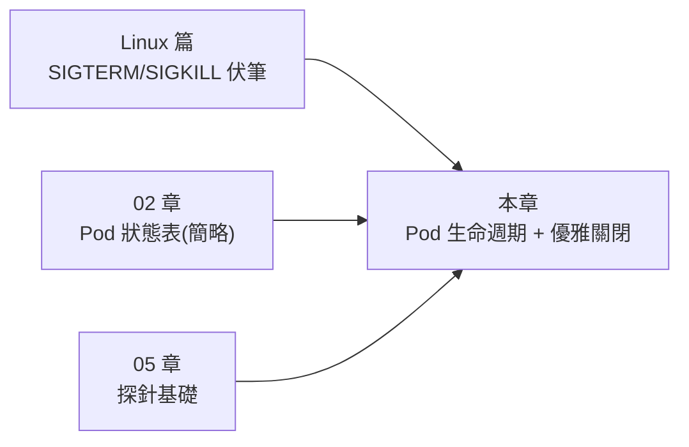
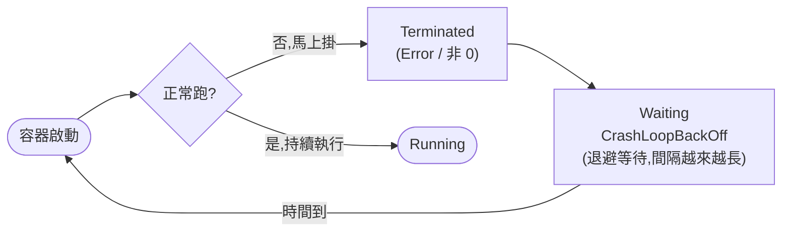
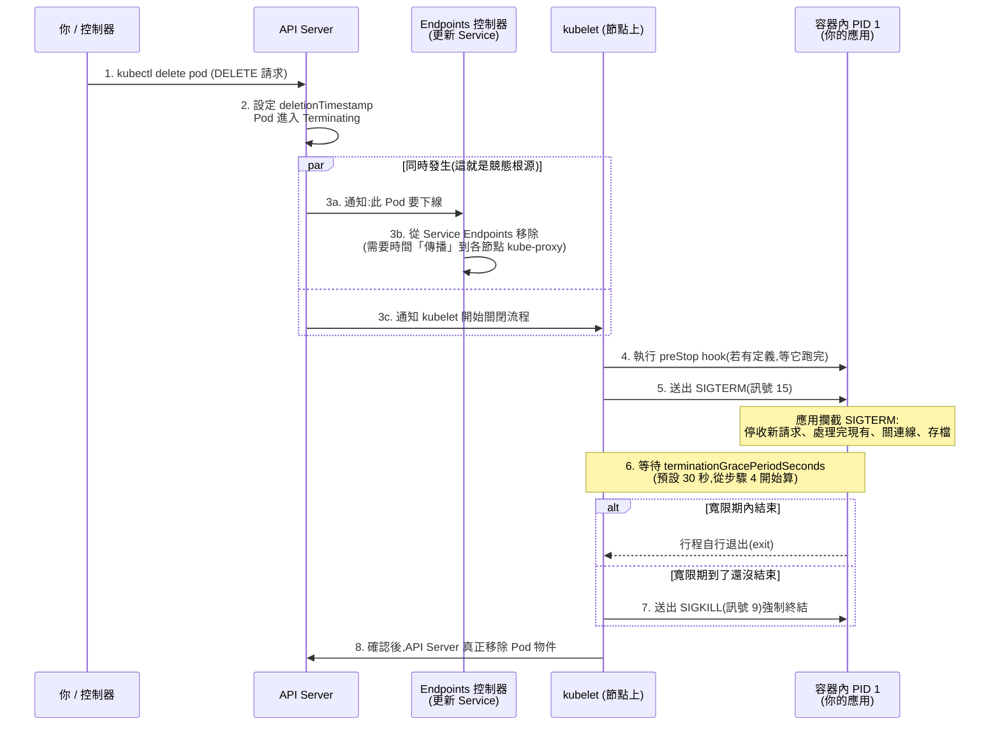
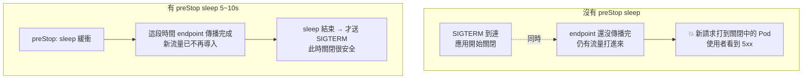

# 06 - Pod 生命週期與優雅關閉 (Pod Lifecycle & Graceful Shutdown)

> 目標:搞懂一個 Pod 從「被建立」到「被刪除」的完整生命旅程,尤其是**被刪除時到底發生了什麼**。讀完你要能回答:CrashLoopBackOff 背後在重試什麼?為什麼很多人在 `preStop` 放一行 `sleep`?應用程式收到 SIGTERM 該怎麼辦?以及原生 sidecar 為什麼比傳統 sidecar 好。

---

## 0. 本章在整本書的位置

第 2 章把 Pod 當「畜牲」用過即丟、列了一張 Pod 狀態表;第 5 章帶你配了探針;Linux 基礎篇則埋了一個伏筆——「K8s 關 Pod 時先送 SIGTERM,等寬限期再送 SIGKILL」。本章把這三條線收攏:**深入 Pod 的生命週期狀態機,並把「優雅關閉」的完整時序講透。**



---

## 1. Pod 階段 (Pod Phase):整個 Pod 的「總結狀態」

`kubectl get pod` 最右邊那欄常常顯示 `Running`、`Pending`、`Completed`……但你要分清楚兩個層次:

- **Pod 階段 (Pod Phase)**:對「整個 Pod」的高層摘要,只有五個固定值,寫在 `status.phase`。
- **容器狀態 (Container State)**:對「Pod 內每個容器」的細節狀態(第 2 節)。

> 為什麼要分兩層?因為一個 Pod 可能有多個容器,「整體進度」與「個別容器死活」是不同的問題。Phase 回答「這個 Pod 大致走到哪了」,容器狀態回答「裡面哪個容器出了什麼事」。除錯時你常常需要從 Phase 往下鑽到容器狀態。

| 階段 (Phase) | 意義 | 轉換時機 |
|--------------|------|----------|
| **Pending**(等待中) | Pod 已被 API Server 接受,但**還沒有所有容器在跑**。可能卡在排程、拉映像、或 init 容器還沒跑完 | 從建立的那一刻起,直到至少一個容器開始執行 |
| **Running**(執行中) | Pod 已綁定節點,**所有容器都已建立**,至少有一個在執行(或正在啟動/重啟) | 容器都起來之後 |
| **Succeeded**(成功) | **所有**容器都正常結束(exit 0),且**不會再重啟** | Job 類型任務做完;`restartPolicy` 非 Always 時容器跑完 |
| **Failed**(失敗) | **所有**容器都終止,且**至少一個**是失敗(非 0 退出或被系統終止),不會再重啟 | 任務失敗且不再重試 |
| **Unknown**(未知) | 通常是**節點失聯**,kubelet 回報不了 Pod 狀態 | 節點當機 / 網路斷,API Server 收不到該節點的心跳 |

> 上述五個值與定義對應 [官方文件 Pod Phase 章節](https://kubernetes.io/docs/concepts/workloads/pods/pod-lifecycle/#pod-phase)。

> 注意 `Succeeded` / `Failed` 是**終態**——Pod 不會再從這裡跑回 `Running`。你在第 2 章表格看到的 `Completed`,其實是 kubectl 對「Phase=Succeeded」的友善顯示。

```bash
# 直接看某個 Pod 的 phase 欄位(別被 kubectl 的友善別名混淆)
kubectl get pod my-pod -o jsonpath='{.status.phase}{"\n"}'

# 一次看一批 Pod 的 phase
kubectl get pods -o custom-columns=NAME:.metadata.name,PHASE:.status.phase
```

> 關於 Pending:第 2 章那張表的 `ImagePullBackOff`、`ContainerCreating` 其實都是 Pod 還在 **Pending** 階段下、容器處於 **Waiting** 狀態時 `kubectl get` 顯示給你的「原因 (reason)」。下一節我們就把這層拆開。

---

## 2. 容器狀態 (Container States):往下鑽一層

每個容器在任一時刻只會處於三種狀態之一,寫在 `status.containerStatuses[].state`:

| 狀態 | 意義 | 常見 reason |
|------|------|-------------|
| **Waiting**(等待中) | 還沒開始跑(正在拉映像、等相依、或剛 crash 正在退避重啟) | `ContainerCreating`、`ImagePullBackOff`、`CrashLoopBackOff` |
| **Running**(執行中) | 正在執行,有記錄 `startedAt` 時間 | — |
| **Terminated**(已終止) | 已結束,有 `exitCode`、`reason`、`startedAt`、`finishedAt` | `Completed`(exit 0)、`Error`、`OOMKilled` |

### 2.1 用 `kubectl describe pod` 讀懂背後的 reason

`kubectl describe pod` 是除錯第一站(第 2 章已強調)。重點看兩個區塊:**每個容器的 `State` / `Last State`**,以及最底下的 **`Events`**。

```bash
kubectl describe pod my-pod
```

一段 CrashLoopBackOff 的容器狀態大概長這樣:

```text
Containers:
  app:
    State:          Waiting
      Reason:       CrashLoopBackOff        # ← 目前在「退避等待」中
    Last State:     Terminated
      Reason:       Error                    # ← 上次是怎麼死的
      Exit Code:    1                        # ← 退出碼 1(程式自己 exit 非 0)
      Started:      ... 
      Finished:     ...
    Restart Count:  5                        # ← 已經重啟 5 次了
```

### 2.2 CrashLoopBackOff 到底是什麼

很多人以為 `CrashLoopBackOff` 是一種錯誤——**不是**,它是一種「**退避策略 (back-off)**」。容器一啟動就掛、kubelet 依 `restartPolicy` 想重啟它,但為了避免「死了又起、起了又死」狂燒資源,kubelet 採用**指數退避**:第一次馬上重啟,之後間隔 10s → 20s → 40s …… 最長到 **5 分鐘**封頂(較新版本可透過 kubelet 的 `crashLoopBackOff.maxContainerRestartPeriod` 設定調整上限)。`CrashLoopBackOff` 就是「正在等下一次重試」這個等待狀態([官方文件](https://kubernetes.io/docs/concepts/workloads/pods/pod-lifecycle/#crashloopbackoff))。



> 除錯心法:看到 CrashLoopBackOff,**不要看「現在」的 log(它正在等待、沒在跑)**,要看上一個死掉的容器:
>
> ```bash
> kubectl logs my-pod --previous     # 看「上一個」掛掉的容器吐了什麼(第 2 章提過,這裡解釋了為什麼必備)
> ```
>
> 再對照 `Exit Code`:`1` / `2` 通常是應用程式自己錯;`137` = 128+9,代表被 **SIGKILL**(常見於 OOMKilled,回想第 5 章記憶體超 limit);`143` = 128+15,代表被 **SIGTERM** 後結束(這兩個編號等等在優雅關閉會再用到)。

---

## 3. restartPolicy:容器掛了要不要重啟

`restartPolicy` 寫在 `spec.restartPolicy`,**作用對象是 Pod 內的容器**,決定容器「終止後」kubelet 要不要把它重新拉起來。它只有三個值:

| restartPolicy | 語意 | 適用工作負載 |
|---------------|------|--------------|
| **Always**(預設) | 容器**不論成功或失敗**都重啟 | 常駐服務:Deployment / StatefulSet / DaemonSet |
| **OnFailure** | 只有**失敗(非 0 退出)**才重啟,成功就結束 | Job / CronJob:要跑到成功為止 |
| **Never** | **永不**重啟,結束就結束 | Job:不想重試、或重試交給上層控制 |

> 為什麼預設是 `Always`?因為大多數 Pod 是常駐服務,你會希望它「永遠活著」,掛了自動拉回。但這也解釋了第 2 章的限制:**Job 的 Pod 不能用 `Always`**——Job 的語意是「做完就停」,用會無限重啟的 Always 邏輯上矛盾,所以只能 `OnFailure` 或 `Never`。這兩段知識在此對上了([官方文件](https://kubernetes.io/docs/concepts/workloads/pods/pod-lifecycle/#restart-policy))。

```yaml
apiVersion: v1
kind: Pod
metadata:
  name: batch-task
spec:
  restartPolicy: OnFailure       # 失敗才重試,成功(exit 0)就讓 Pod 進入 Succeeded
  containers:
    - name: task
      image: busybox
      command: ["sh", "-c", "echo 做事中...; exit 1"]   # 故意失敗來觀察重試
```

> 細節:`restartPolicy` 是**整個 Pod 一個值**,不能單獨針對某個容器設定(唯一例外是第 7 節要講的原生 sidecar,它是用 init 容器層級的 `restartPolicy: Always` 達成的特例)。重啟發生在**原節點、原 Pod 內**(就地重啟,不是換一個新 Pod),所以 Pod IP 不會變。

---

## 4. 容器生命週期掛鉤 (Lifecycle Hooks):postStart 與 preStop

K8s 讓你在容器生命的兩個關鍵時刻插入動作:

| Hook | 觸發時機 | 典型用途 |
|------|----------|----------|
| **postStart** | 容器**建立後**立即執行(與容器主程序**並行**,不保證在主程序前完成) | 暖機、寫旗標檔、初始化(用途不多) |
| **preStop** | 容器**被終止前**執行,**會等它跑完**才送 SIGTERM | 連線排空 (drain)、通知註冊中心下線、收尾 |

兩種 hook 都支援 `exec`(執行指令)、`httpGet`(打一個 HTTP 請求)、`tcpSocket` 三種 handler。

```yaml
spec:
  containers:
    - name: app
      image: my-app:1.0
      lifecycle:
        postStart:
          exec:
            command: ["/bin/sh", "-c", "echo started > /tmp/ready"]   # 容器一起來就做點事
        preStop:
          exec:
            # 經典用法:先睡幾秒(等 endpoint 傳播,見第 5 節),再優雅關閉
            command: ["/bin/sh", "-c", "sleep 5; nginx -s quit"]
```

> **preStop 是優雅關閉的關鍵零件。** 兩個最常見的用途:
>
> 1. **連線排空 (connection drain)**:通知應用「別再收新請求,把手上的處理完」。例如 nginx 的 `nginx -s quit` 是優雅退出(處理完現有連線),而 `nginx -s stop` 是立即停。
> 2. **主動下線通知**:如果你用了外部服務註冊中心(如 Consul / Eureka),在 preStop 主動呼叫 API 把自己標記為下線,讓上游更快停止導流,而不是等健康檢查逾時。
>
> ⚠️ 重要時序:**preStop 跑完之後,K8s 才會送 SIGTERM。** 而且 preStop 的執行時間**算在** `terminationGracePeriodSeconds` 寬限期之內——如果 preStop 自己就跑了 25 秒,留給 SIGTERM 後優雅關閉的時間就只剩 5 秒。這點下一節詳解。

---

## 5. 優雅關閉 (Graceful Shutdown) —— 本章重點

現在把 Linux 基礎篇那個伏筆完整展開。回顧一下:

> SIGTERM(15)是「**禮貌地請你結束**」,程式**可以攔截**並做收尾;SIGKILL(9)是「**強制立刻砍掉**」,**不能被攔截**,核心直接終結行程。

K8s 刪 Pod 時就是先禮貌(SIGTERM)、給時間、再動粗(SIGKILL)。但完整時序比這句話複雜,而且有個常被忽略的**競態問題**,正是「preStop sleep 幾秒」這個怪招的由來。

### 5.1 刪除一個 Pod 的完整時序



逐步說明:

1. **發出刪除**:你 `kubectl delete`、或控制器(滾動更新、縮容、節點驅逐)要刪它。
2. **進入 Terminating**:API Server 在 Pod 上蓋 `deletionTimestamp`,`kubectl get pod` 會看到 `Terminating`。從這刻起寬限期開始倒數。
3. **兩件事同時發生**(關鍵!):
   - **(a) endpoint 移除**:Endpoints/EndpointSlice 控制器把這個 Pod 從對應 Service 移除,接著各節點的 kube-proxy / 負載平衡器更新規則——**但這需要時間「傳播」**。
   - **(b) kubelet 啟動關閉流程**:kubelet 幾乎同時開始對容器執行關閉。
4. **執行 preStop hook**(若有):kubelet 先跑完 preStop,才往下走。
5. **送 SIGTERM**:對容器內的 **PID 1**(回想 Linux 篇:你的主程式就是容器內的 PID 1)送出 SIGTERM。
6. **等待寬限期** `terminationGracePeriodSeconds`([預設 **30 秒**](https://kubernetes.io/docs/concepts/workloads/pods/pod-lifecycle/#pod-termination)):給應用收尾的時間。
7. **逾時送 SIGKILL**:寬限期到了還活著,kubelet 送 SIGKILL 強制終結(對應退出碼 137)。
8. **清除物件**:確認容器都沒了,API Server 才真正刪掉 Pod 物件。

### 5.2 為什麼常見「preStop 放一個 sleep」?

看步驟 3 的競態:**(3a) 把 Pod 從 Service Endpoints 移除** 和 **(3c) kubelet 開始送 SIGTERM** 是**並行**的,而 endpoint 移除的傳播(要更新到每個節點的 kube-proxy)**通常比 kubelet 送 SIGTERM 慢**。

後果:**你的應用已經收到 SIGTERM 開始關閉了,但叢集裡某些 kube-proxy 還沒更新規則,仍在把新流量導過來**——這些新請求打到一個正在關閉的 Pod 上,就變成使用者看到的 5xx 錯誤或連線重置。



**解法**:在 `preStop` 放一個 `sleep`(常見 5～10 秒)。利用「preStop 跑完才送 SIGTERM」的時序,**先卡住一小段時間讓 endpoint 移除傳播完成**,等沒有新流量會進來了,才真正開始關閉。這不是 hack,而是繞過「endpoint 傳播」與「SIGTERM」之間競態的標準做法。

```yaml
spec:
  terminationGracePeriodSeconds: 45        # 寬限期(預設 30),preStop + 收尾都得塞進這 45 秒
  containers:
    - name: web
      image: my-web:1.0
      lifecycle:
        preStop:
          exec:
            # 先睡 10 秒等 endpoint 傳播,期間應用照常服務「已建立」的連線
            command: ["/bin/sh", "-c", "sleep 10"]
```

> ⚠️ 別把寬限期設太小:`terminationGracePeriodSeconds` 必須涵蓋 **preStop 時間 + SIGTERM 後收尾時間**。若你 preStop sleep 10 秒、應用收尾要 20 秒,寬限期至少要 > 30 秒,否則收尾還沒做完就被 SIGKILL 砍了。

### 5.3 應用程式該如何正確處理 SIGTERM

光靠 K8s 是不夠的——**應用程式自己必須攔截 SIGTERM 並優雅退出**,否則收到 SIGTERM 直接死掉(或更糟:預設忽略它,硬撐到被 SIGKILL),優雅關閉就形同虛設。

一個正確處理 SIGTERM 的服務,在收到訊號時應該:

1. **停止接受新請求**(關閉 listener / 標記 readiness 失敗)。
2. **把手上正在處理的請求做完**(等待 in-flight 請求結束)。
3. **關閉資源**:資料庫連線、flush 緩衝、commit 交易、釋放鎖。
4. **正常退出 (exit 0)**。

```yaml
# 一個「演示用」的容器:用 trap 攔截 SIGTERM 並做收尾
spec:
  containers:
    - name: demo
      image: busybox
      command:
        - /bin/sh
        - -c
        - |
          # trap:攔截 SIGTERM(15),收到就執行優雅關閉
          trap 'echo "收到 SIGTERM,開始收尾..."; sleep 3; echo "收尾完成,退出"; exit 0' TERM
          echo "服務啟動,PID=$$"
          # 用 wait 讓 shell 能即時收到訊號(否則 sleep 會擋住訊號處理)
          while true; do sleep 1 & wait $!; done
```

> 🔑 **容器內 PID 1 的陷阱(回扣 Linux 篇)**:Linux 對 PID 1 有特殊待遇——**它預設不會對沒有自訂 handler 的訊號做預設動作**。所以如果你的應用是 PID 1 卻**沒有**註冊 SIGTERM handler,SIGTERM 會被「無視」,Pod 只能硬等到寬限期結束被 SIGKILL,關閉一點都不優雅(還慢 30 秒)。
>
> 另外,如果你用 `sh -c "my-app"` 啟動,shell 會是 PID 1、你的應用是它的子行程,**SIGTERM 送給 shell 而不會自動轉給子行程**——應用根本收不到訊號。解法:用 `exec my-app`(讓應用取代 shell 成為 PID 1),或加一個輕量 init(如 `tini`)當 PID 1 來正確轉發訊號並回收殭屍行程。這正是 Linux 篇「容器內主程式是 PID 1」伏筆的實戰意義。

```bash
# 觀察優雅關閉:一個視窗刪 Pod、另一個視窗看它變 Terminating 與最後的 log
kubectl delete pod demo                    # 觸發優雅關閉流程
kubectl get pod demo -w                     # 觀察 Terminating → 消失
kubectl logs demo                           # (趁還在時)看 trap 印出的收尾訊息

# 想立刻砍掉、不等寬限期(緊急用,等同直接 SIGKILL,不優雅):
kubectl delete pod demo --grace-period=0 --force
```

---

## 6. init 容器 (Init Containers) 深入

第 2 章給過一個「等待 DB」的簡略範例。這裡講清楚它的規則與設計理念。

**init 容器是在所有「主容器」啟動前,依序跑完的一次性容器。** 全部成功後,主容器才會啟動。


### 6.1 init 容器的規則

| 特性 | 行為 | 為什麼這樣設計 |
|------|------|----------------|
| **依序執行** | 一個跑完(成功)才跑下一個,不並行 | 初始化常有先後依賴(先建表才能填資料) |
| **必須成功** | 任一 init 容器失敗,**kubelet 會重複重試該 init 容器**直到成功;但若 Pod 的 `restartPolicy` 是 `Never`,則不重試,整個 Pod 直接判定為 Failed。重試中會看到 Pod 卡在 `Init:Error` / `Init:CrashLoopBackOff` | 前置條件沒滿足,主容器不該啟動 |
| **跑完就退場** | 成功後就終止,**不會**和主容器一起常駐 | 它只做「一次性準備」,不是服務 |
| **看 Pod 階段** | init 期間 Pod 仍是 **Pending**,容器狀態顯示 `Init:0/2` 之類 | 對應第 1 節:還沒有主容器在跑 |

> 上述規則出自[官方文件 Init Containers](https://kubernetes.io/docs/concepts/workloads/pods/init-containers/#detailed-behavior):「the kubelet repeatedly restarts that init container until it succeeds」,例外是 `restartPolicy: Never` 時不重試、直接判定 Pod 失敗。

### 6.2 init 容器 vs 主容器

| 面向 | init 容器 | 主容器 (containers) |
|------|-----------|---------------------|
| 執行方式 | 依序、一個接一個 | (一般容器)並行啟動 |
| 生命週期 | 跑完即退,不常駐 | 常駐(直到 Pod 結束) |
| 探針 | **不支援** liveness/readiness/startup([官方文件](https://kubernetes.io/docs/concepts/workloads/pods/init-containers/#differences-from-regular-containers)) | 支援 |
| 失敗影響 | 卡住整個 Pod 啟動 | 依 restartPolicy 就地重啟 |

### 6.3 典型用途與範例

```yaml
spec:
  initContainers:
    # 用途 1:等待相依服務(第 2 章的例子,這裡放進完整脈絡)
    - name: wait-for-db
      image: busybox
      command: ['sh', '-c', 'until nc -z db 5432; do echo 等 DB...; sleep 2; done']
    # 用途 2:跑資料庫遷移 / schema 初始化(主容器啟動前先把表建好)
    - name: db-migrate
      image: my-migrator:1.0
      command: ['./migrate.sh']
    # 用途 3:設定檔案權限 / 預先下載設定(用共享 Volume 交給主容器)
    - name: fix-permissions
      image: busybox
      command: ['sh', '-c', 'chown -R 1000:1000 /data']
      volumeMounts:
        - name: data
          mountPath: /data
  containers:
    - name: app
      image: my-app:1.0
      volumeMounts:
        - name: data
          mountPath: /data
  volumes:
    - name: data
      emptyDir: {}
```

> **為什麼用 init 容器而不是把這些塞進主容器的啟動腳本?** 三個好處:(1) **關注點分離**——主映像保持乾淨,不用塞一堆等待/遷移工具;(2) **權限隔離**——init 容器可以用較高權限做設定(如 chown),主容器則以低權限執行;(3) **失敗即停**——前置條件沒滿足就直接卡住,不會讓主程式帶著半殘狀態硬啟動。

---

## 7. 原生輔助容器 (Native Sidecar):v1.28 引入、v1.33 GA

第 2 章提過 sidecar 是「黏在主容器旁的輔助容器」(如推送日誌、service mesh 代理)。傳統做法是把 sidecar 當成另一個普通主容器並列在 `containers` 裡——但這有兩個老問題。

### 7.1 傳統 sidecar 的痛點

1. **啟動順序無保證**:`containers` 裡的容器是**並行**啟動的。如果主容器需要 sidecar(如 mesh 代理)先就緒才能連外,可能主容器先起來、卻連不出去而報錯。
2. **關閉順序無保證 + Job 不會結束**:關閉時也是一起收。最有名的坑是 **Job + sidecar**:主任務容器做完了,但 sidecar 是個 `while true` 永遠不退出的常駐程式,於是**整個 Job 永遠不會進入 Succeeded**,一直掛著。

### 7.2 原生 sidecar 怎麼做

K8s [v1.28 以 alpha 引入、v1.29 起 beta 預設啟用、v1.33 GA 穩定](https://kubernetes.io/docs/concepts/workloads/pods/sidecar-containers/)的**原生 sidecar**:把輔助容器寫在 **`initContainers`** 裡,並給它 **`restartPolicy: Always`**。這個特殊組合讓它行為完全不同於一般 init 容器:

```yaml
spec:
  initContainers:
    # 這是「原生 sidecar」:寫在 initContainers,但有 restartPolicy: Always
    - name: log-shipper
      image: fluent-bit:latest
      restartPolicy: Always           # ← 關鍵!這一行讓它變成 sidecar 而非一般 init 容器
      volumeMounts:
        - name: varlog
          mountPath: /var/log
  containers:
    - name: app
      image: my-app:1.0
      volumeMounts:
        - name: varlog
          mountPath: /var/log
  volumes:
    - name: varlog
      emptyDir: {}
```

它的行為:

- **先啟動**:跟一般 init 容器一樣依序,但因為 `restartPolicy: Always`,它**不必「跑完」**——只要它**啟動就緒**(可配 startupProbe),就放行下一個容器/主容器。於是 sidecar 保證在主容器之前就緒。
- **常駐**:整個 Pod 生命期間持續運行(像主容器),而不是跑完就退。
- **後關閉**:Pod 終止時,**主容器先關,sidecar 後關**——確保主容器在關閉過程仍有 sidecar(如日誌/代理)可用。
- **不擋 Job 完成**:當所有「主容器」結束,原生 sidecar 會被自動終止,**Job 能正常進入 Succeeded**——直接解掉 7.1 的第二個坑。

### 7.3 傳統 sidecar vs 原生 sidecar

| 面向 | 傳統 sidecar(放 containers) | 原生 sidecar(initContainers + restartPolicy: Always) |
|------|------------------------------|--------------------------------------------------------|
| 啟動順序 | 與主容器並行,無保證 | **保證先於主容器就緒** |
| 關閉順序 | 一起關,無保證 | **主容器先關、sidecar 後關** |
| 支援探針 | 支援 | 支援(可設 startup/readiness/liveness) |
| 對 Job 的影響 | 會卡住 Job 永不結束 | **不會卡住,Job 正常完成** |
| K8s 版本 | 任何版本 | [v1.28 引入,v1.29 起預設啟用,v1.33 GA](https://kubernetes.io/docs/concepts/workloads/pods/sidecar-containers/) |

> **設計理念**:原生 sidecar 借用 init 容器「有順序、在主容器之前」的特性,再用 `restartPolicy: Always` 賦予它「常駐、生命週期被妥善管理」的能力。一句話:**把 sidecar 的生命週期變得可預測**(先起後關),這正是傳統做法最缺的東西。

---

## 8. 探針補強:補上 05 章較略的部分

第 5 章已詳述 liveness / readiness / startup 三種探針的**行為差異**(liveness 失敗會重啟、readiness 失敗只是不導流量),這裡只補兩塊它略過的細節,主體請回看第 5 章。

### 8.1 三種探測方式:httpGet / tcpSocket / exec

第 5 章主要用 `httpGet`。其實每種探針都可以改用以下任一**探測方式 (handler)**:

| 方式 | 怎麼判定成功 | 適合 |
|------|-------------|------|
| **httpGet** | HTTP 狀態碼落在 200–399 | 有 HTTP 健康端點的服務(最常用) |
| **tcpSocket** | 能建立 TCP 連線即算成功 | 非 HTTP 服務(資料庫、訊息佇列、純 TCP) |
| **exec** | 在容器內執行指令,**退出碼 0** 算成功 | 沒有網路端點、要靠指令自我檢查(如檢查某檔案、跑健檢腳本) |

```yaml
spec:
  containers:
    - name: app
      image: my-app:1.0
      # tcpSocket:只問「這個 port 連得上嗎」(適合資料庫等非 HTTP 服務)
      livenessProbe:
        tcpSocket:
          port: 5432
        periodSeconds: 10
      # exec:跑指令看退出碼(適合用腳本自我檢查的情境)
      readinessProbe:
        exec:
          command: ["sh", "-c", "test -f /tmp/ready"]   # 檔案在就算就緒
        periodSeconds: 5
```

### 8.2 探針參數的調校直覺

第 5 章的範例出現過這些參數,這裡給「該往哪調」的直覺:

| 參數 | 意義 | 調校直覺 |
|------|------|----------|
| `initialDelaySeconds` | 容器啟動後,等多久才開始探 | 設太短會在程式還沒起來時就誤判失敗;慢啟動程式改用 **startupProbe** 更乾淨(見第 5 章) |
| `periodSeconds` | 多久探一次 | 越短反應越快,但對應用造成的探測負擔越大;一般 5～10 秒 |
| `timeoutSeconds` | 單次探測等多久算逾時 | 預設 1 秒常太短,健檢端點若會變慢,適度調高避免假性失敗 |
| `successThreshold` | 連續成功幾次才算「好了」 | readiness 想避免抖動可 > 1;**liveness/startup 只能是 1** |
| `failureThreshold` | 連續失敗幾次才算「壞了」(預設 3) | 調高 = 更寬容、少誤殺;調低 = 更快反應真故障。和 `periodSeconds` 一起決定「多久才判定不健康」 |

> 上表預設值(`timeoutSeconds=1`、`periodSeconds=10`、`successThreshold=1`、`failureThreshold=3`)出自 [Probe 物件的官方欄位定義](https://kubernetes.io/docs/reference/generated/kubernetes-api/v1.33/#probe-v1-core)。

> 一個實用公式:**判定不健康所需時間 ≈ `periodSeconds × failureThreshold`**。例如 `periodSeconds: 10` + `failureThreshold: 3` ⇒ 大約 30 秒持續失敗才會重啟容器。把這個算清楚,就不會把 liveness 設得太敏感而無謂重啟(第 5 章的核心提醒)。

---

## 動手練習

1. **觀察 Phase 與容器狀態**:部署一個正常的 nginx Pod,`kubectl get pod -o jsonpath='{.status.phase}'` 看到 `Running`;再部署一個 `command: ["sh","-c","exit 1"]` 的 Pod,觀察它在 `restartPolicy: Always` 下進入 `CrashLoopBackOff`,用 `kubectl describe pod` 找到 `Last State`、`Exit Code`、`Restart Count`,並用 `kubectl logs --previous` 看上一個容器的輸出。
2. **比較 restartPolicy**:同一個 `exit 1` 的容器,分別用 `Always` / `OnFailure` / `Never` 部署,觀察重啟行為與最終 Pod Phase(Failed vs 持續重啟)。
3. **體驗優雅關閉**:部署第 5.3 節那個用 `trap` 攔 SIGTERM 的 busybox Pod,`kubectl delete pod` 後立刻 `kubectl logs -f`(或刪除前先開著),看到「收到 SIGTERM,開始收尾…」訊息。再用 `--grace-period=0 --force` 刪一次,對比「沒有收尾訊息」(被 SIGKILL)。
4. **preStop sleep 的效果**:給一個 Deployment(背後有 Service)加上 `preStop: sleep 10` 與適當的 `terminationGracePeriodSeconds`,滾動更新時用持續打流量的工具(如 `hey` / `ab`)觀察 5xx 是否減少。
5. **init 容器**:寫一個 Pod,init 容器 `until nc -z myservice 80; do sleep 2; done` 等一個還不存在的 Service,觀察 Pod 卡在 `Init:0/1`(Pending);再建立該 Service,看 Pod 放行進入 Running。
6. **原生 sidecar 解 Job 卡住**:寫一個 Job,主容器 `echo done`,額外放一個 `while true; do sleep 5; done` 的常駐容器。先用「傳統 sidecar」(放 `containers`)觀察 Job 永遠不 Complete;再改成「原生 sidecar」(放 `initContainers` + `restartPolicy: Always`),觀察 Job 正常 `Completed`。
7. **探針方式**:對一個 Pod 分別設 `tcpSocket` 與 `exec` 探針,故意讓 exec 檢查的檔案不存在,觀察 readiness 失敗、Pod 不被列入 Endpoints(回想第 5 章)。

---

## 本章檢核點 (Checklist)

- [ ] 能區分「Pod 階段 (Phase)」與「容器狀態 (Container State)」是兩個不同層次,並說出 Pending/Running/Succeeded/Failed/Unknown 各自的轉換時機
- [ ] 知道 Succeeded/Failed 是終態,且 `Completed` 是 Phase=Succeeded 的友善顯示
- [ ] 能說出容器三狀態 Waiting/Running/Terminated,並用 `kubectl describe pod` 看 reason、Last State、Exit Code
- [ ] 理解 CrashLoopBackOff 是「退避等待」而非錯誤本身,並知道要用 `logs --previous` 查上一個容器
- [ ] 能解釋 restartPolicy 三種值的語意,以及為什麼 Job 不能用 Always
- [ ] 能用 postStart / preStop,並說明 preStop 在連線排空與下線通知的用途
- [ ] **能畫出/說出刪除 Pod 的完整時序:deletionTimestamp → endpoint 移除(並行)→ preStop → SIGTERM → 等寬限期 → SIGKILL**
- [ ] **能解釋「preStop sleep 幾秒」是為了等 endpoint 傳播,繞過競態避免 5xx**
- [ ] 能說明應用程式該如何攔截並處理 SIGTERM,以及容器內 PID 1 / `exec` / tini 的訊號陷阱(回扣 Linux 篇)
- [ ] 理解 `terminationGracePeriodSeconds` 涵蓋 preStop + 收尾,預設 30 秒
- [ ] 能說明 init 容器的依序執行、失敗重試、跑完退場,以及三種典型用途
- [ ] 能說明原生 sidecar(initContainers + restartPolicy: Always)相對傳統 sidecar 的好處:先啟動、後關閉、不卡 Job(v1.28 引入、v1.29 起預設啟用、v1.33 GA)
- [ ] 能補充 exec / tcpSocket 探針方式,並用 `periodSeconds × failureThreshold` 估算判定不健康的時間

> 下一章:回到 [README.md](./README.md) 串起整個 Kubernetes 核心地圖;掌握了生命週期與優雅關閉,你已經能寫出「升級不掉請求、關閉不丟資料」的正式級工作負載了。
