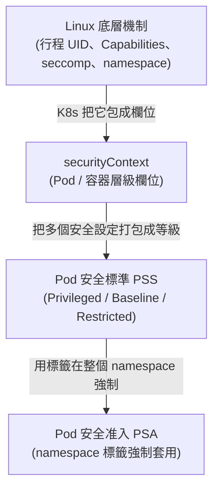
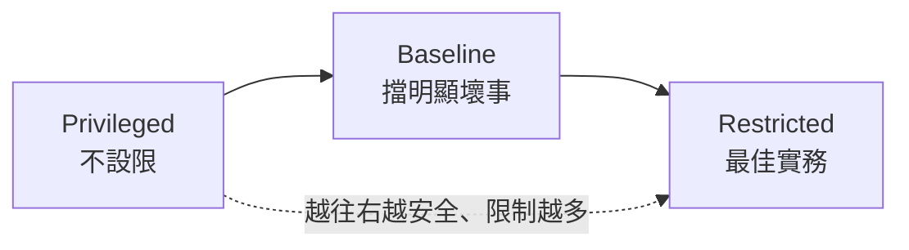
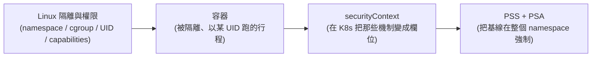

# 07 - 容器安全與加固 (Security Context & Pod Hardening)

> 目標:在 Kubernetes 層面控制「容器以什麼身分執行、能做哪些事」。讀完你要能設定 securityContext 把容器降權、寫出一份「安全基線」Pod、看懂 Pod 安全標準 (PSS) 三個等級,並用 Pod 安全准入 (PSA) 的 namespace 標籤把整批工作負載擋在安全線內。

---

## 0. 開場:把 Linux 那條線接起來

在 Linux 基礎章節我們建立了三個關鍵直覺,現在要把它們在 K8s 層面「收尾」:

1. **容器就是一個普通行程 (process)**——它被命名空間 (Namespace) 隔離視野、被控制群組 (cgroup) 限制資源(回想 [Linux 4](../00-prerequisites/01-linux-basics/04-namespaces-cgroups.md))。
2. **這個行程一定以某個 UID 執行**。預設常常是 **root (UID 0)**,而 root 在容器裡很危險(回想 [Linux 3](../00-prerequisites/01-linux-basics/03-users-permissions.md))。
3. **Linux 能力 (Capabilities)** 把 root 的「全有」拆成幾十個細項,讓我們可以只給「剛好夠用」的權限。

問題是:**這些東西在 Linux 層面是手動的**(你要自己 `unshare`、自己設 UID、自己 drop capability)。在 K8s 裡,你不會手動跑 `unshare`——**你只會寫 YAML**。所以本章的核心就是回答一個問題:

> **「容器以哪個 UID 跑、丟掉哪些能力、能不能提權、根檔案系統能不能寫」——這些在 Linux 是底層機制,在 K8s 全部濃縮成一個欄位:`securityContext`。**

換句話說,這一章就是把「Linux 隔離與權限」那套理論,變成你每天會寫的 Pod 規格。先看一張全景圖:



由下往上:**個別欄位 → 打包成標準 → 整批強制**。我們也照這個順序講。

---

## 第一部分:securityContext —— 單一 Pod/容器的加固

## 1. securityContext 有兩個層級

`securityContext` 可以寫在**兩個地方**,作用範圍不同:

| 位置 | 寫在哪 | 作用範圍 | 典型欄位 |
|------|--------|----------|----------|
| **Pod 層級** | `spec.securityContext` | 套用到 Pod 內**所有**容器 | `runAsNonRoot`、`runAsUser`、`fsGroup`、`seccompProfile` |
| **容器層級** | `spec.containers[].securityContext` | 只套用到**該容器**(會覆蓋 Pod 層級) | `capabilities`、`readOnlyRootFilesystem`、`allowPrivilegeEscalation`、`privileged` |

> 心法:**Pod 層級設「整艘船」的共同基準,容器層級做「單一容器」的微調或覆蓋。** 有些欄位(如 `fsGroup`)只在 Pod 層級有意義;有些(如 `capabilities`、`readOnlyRootFilesystem`)只在容器層級有意義。記不住時就看:這設定是「整個 Pod 共享的東西」(掛載、補充群組)還是「單一容器內的事」(能力、根檔案系統)。

---

## 2. 執行身分:runAsNonRoot / runAsUser / runAsGroup / fsGroup

這組欄位直接對應 Linux 的 UID/GID(回想 [Linux 3](../00-prerequisites/01-linux-basics/03-users-permissions.md):每個行程以某 UID 執行,root 是 UID 0)。

```yaml
apiVersion: v1
kind: Pod
metadata:
  name: id-demo
spec:
  securityContext:                 # Pod 層級:整個 Pod 共用
    runAsNonRoot: true             # 拒絕以 root (UID 0) 啟動;若映像預設是 root,Pod 會啟動失敗
    runAsUser: 1000                # 容器內行程以 UID 1000 執行(對應 Linux 的某個非 root 使用者)
    runAsGroup: 3000               # 主群組 GID 3000
    fsGroup: 2000                  # 掛載的 Volume 內檔案,群組擁有權設成 GID 2000
  containers:
    - name: app
      image: busybox:1.36
      command: ["sh", "-c", "id; ls -l /data; sleep 3600"]
      volumeMounts:
        - name: data
          mountPath: /data
  volumes:
    - name: data
      emptyDir: {}
```

逐欄位解釋「為什麼」:

- **`runAsNonRoot: true`**:這是**最重要的一個開關**。它不指定 UID,只要求「不可以是 0」。如果映像本身打包成以 root 跑(很多公開映像都是),kubelet 會**直接拒絕啟動**並回報錯誤。這逼你把映像或設定改成非 root——這正是 [Linux 3](../00-prerequisites/01-linux-basics/03-users-permissions.md) 末尾留的問題「為什麼讓容器以 root 跑很危險」的 K8s 答案:**容器逃逸時,容器內的 root 很可能就是主機的 root**(除非有 user namespace,見第 9 節)。
- **`runAsUser` / `runAsGroup`**:明確指定 UID/GID。進到容器跑 `id` 就會看到 `uid=1000 gid=3000`——跟你在 Linux 跑 `id` 是同一個東西。
- **`fsGroup`**:這個比較特別。它讓掛載進來的 Volume,其檔案的**群組擁有權**被設成指定 GID,並把該 GID 加進容器行程的**補充群組 (supplementary group)**。

> 🔑 **`fsGroup` 解決的痛點**:你以非 root (UID 1000) 跑容器,但掛進來的 PersistentVolume 裡的檔案屬於 root,結果你的程式**沒權限寫**(回想 rwx 模型:不是擁有者、不在群組,就只剩 others 的權限)。`fsGroup` 讓 K8s 在掛載時把 Volume 內容的群組改成 2000,而你的行程也屬於群組 2000,於是就能讀寫了([官方文件](https://kubernetes.io/docs/tasks/configure-pod-container/security-context/#configure-volume-permission-and-ownership-change-policy-for-pods))。**這就是 Linux 檔案權限 (rwx) 與群組概念在 K8s 儲存上的直接應用。**

```bash
kubectl apply -f id-demo.yaml
kubectl logs id-demo            # 看 id 輸出:uid=1000(non-root)、gid=3000、groups 含 2000
                                # 看 ls -l /data:檔案群組是 2000(fsGroup 生效)
```

---

## 3. 縮小攻擊面:readOnlyRootFilesystem 與 allowPrivilegeEscalation

這兩個是**容器層級**欄位,目的是「就算被攻進來,也讓攻擊者很難施展」。

```yaml
spec:
  containers:
    - name: app
      image: my-app:1.0
      securityContext:
        readOnlyRootFilesystem: true       # 根檔案系統唯讀:攻擊者無法寫入二進位、放後門
        allowPrivilegeEscalation: false    # 禁止行程取得「比父行程更多的權限」
      volumeMounts:
        - name: tmp
          mountPath: /tmp                  # 真的需要可寫的地方,單獨掛一個可寫 Volume
  volumes:
    - name: tmp
      emptyDir: {}
```

- **`readOnlyRootFilesystem: true`**:讓容器的根目錄 `/`(來自映像檔的那層,回想 [Linux 4](../00-prerequisites/01-linux-basics/04-namespaces-cgroups.md) 的 OverlayFS)**唯讀**。為什麼有用?攻擊者拿到 shell 後,常見手段是「下載工具、寫入二進位、改設定、放後門」——根檔案系統唯讀,這些**全部寫不進去**。代價是:應用如果真的要寫檔(暫存、log、快取),你得用 `emptyDir` 或 Volume 把那些路徑單獨掛成可寫(像上面的 `/tmp`)。這是一個非常划算的加固。
- **`allowPrivilegeEscalation: false`**:禁止行程透過 SUID 程式(回想 [Linux 3](../00-prerequisites/01-linux-basics/03-users-permissions.md) 的 SUID:執行時以檔案擁有者身分跑)等手段「取得比啟動它的父行程更多的權限」。設成 `false` 後,核心會設定 [`no_new_privs` 旗標](https://kubernetes.io/docs/tasks/configure-pod-container/security-context/#set-the-security-context-for-a-container),`sudo`、`su`、SUID 的 `ping` 這類提權路徑就被堵死。注意:若容器以 `privileged: true` 執行,或被加上 `CAP_SYS_ADMIN`,`allowPrivilegeEscalation` 實際上一律視為 `true`,無法靠這個欄位擋下。

> 💡 **為什麼這兩個常一起出現**:`runAsNonRoot` 讓你「一開始就不是 root」,但如果允許提權,攻擊者可能想辦法爬回 root;`allowPrivilegeEscalation: false` 把這條爬升路徑封死。兩者搭配,才是完整的「降權且鎖死」。

---

## 4. Capabilities:把 root 拆細,只給剛好夠用的

這一節直接回扣 [Linux 3 第 6 節](../00-prerequisites/01-linux-basics/03-users-permissions.md):Linux 能力 (Capabilities) 把 root 的超能力拆成幾十個細項。

容器執行環境 (container runtime) 預設就會給容器一組能力(即使非 root)。**最佳實務是:先全部丟掉,再精準加回真正需要的。**

```yaml
spec:
  containers:
    - name: web
      image: nginx:1.27
      securityContext:
        capabilities:
          drop: ["ALL"]                       # 先丟掉所有能力(歸零)
          add: ["NET_BIND_SERVICE"]           # 再加回唯一需要的:綁定 1024 以下的特權埠
```

為什麼這樣做?

- **`drop: ["ALL"]`**:歸零。容器多數時候根本用不到那些能力(`CAP_SYS_ADMIN`、`CAP_NET_ADMIN`…),留著只是增加攻擊面。
- **`add: ["NET_BIND_SERVICE"]`**:這個例子是 nginx 想監聽 80 埠。回想 [Linux 3](../00-prerequisites/01-linux-basics/03-users-permissions.md) 那張表:**綁定 1024 以下的特權埠需要 `CAP_NET_BIND_SERVICE`**。一個非 root 行程本來不能綁 80,但只要加回**這一個**能力就行——不需要整個 root,也不需要其他能力。這就是「最小權限原則」在能力層級的體現。

> 注意:YAML 裡寫的能力名稱**不含 `CAP_` 前綴**(寫 `NET_BIND_SERVICE`,不是 `CAP_NET_BIND_SERVICE`),這是 K8s 的慣例,別被它絆到。

常見「需要某個能力」的情境對照:

| 需求 | 要加的能力 | 說明 |
|------|-----------|------|
| 監聽 80 / 443 等特權埠 | `NET_BIND_SERVICE` | 最常見的「我只缺這一個」 |
| 改容器內檔案的擁有者 | `CHOWN`、`FOWNER` | 入口腳本要 `chown` 時 |
| 設定系統時間 | `SYS_TIME` | 極少數情境 |
| (危險)幾乎萬能的系統管理 | `SYS_ADMIN` | 等同半個 root,**盡量避免** |

> 🔑 **回扣 eBPF**:[Linux 3](../00-prerequisites/01-linux-basics/03-users-permissions.md) 提過載入 eBPF 程式需要 `CAP_BPF`。如果你之後要在 K8s 跑 Cilium、Falco 這類 eBPF 工具,它們的 Pod 就會在這裡 `add: ["BPF", ...]`(或更直接地要求較高權限)。你現在就能看懂它們的 YAML 為什麼那樣寫了。

---

## 5. privileged 容器:為什麼它幾乎等於把主機交出去

```yaml
spec:
  containers:
    - name: danger
      image: my-tool:1.0
      securityContext:
        privileged: true        # ⚠️ 危險:幾乎拿掉所有隔離
```

`privileged: true` 是 securityContext 裡**最危險**的設定。它做的事遠超「加幾個能力」:

- 給予**幾乎所有 Linux 能力**。
- 解除裝置存取限制——容器**看得到、碰得到主機的所有裝置**(`/dev`)。
- 大幅削弱 seccomp / AppArmor 等防護:[官方文件明確指出](https://kubernetes.io/docs/concepts/security/linux-kernel-security-constraints/) privileged 容器一律以 `Unconfined` 的 seccomp 執行(無視你設的 profile)、且會忽略套用的 AppArmor profile。

回想 [Linux 4](../00-prerequisites/01-linux-basics/04-namespaces-cgroups.md):容器和主機**共用同一個核心**,隔離靠的是命名空間與能力限制。`privileged` 等於把這些限制大量拿掉,於是**容器逃逸 (container escape)**——從容器裡跳出去控制主機——變得非常容易(例如掛載主機磁碟、寫入主機檔案、載入核心模組)。一旦逃逸,因為共用核心,攻擊者拿到的就是**整台節點**,連帶威脅到節點上**其他所有 Pod**。

> ⚠️ **準則**:正式環境的應用 Pod **永遠不該** `privileged: true`。真正合理的少數例外是「本來就要管理節點」的系統元件(某些 CNI、儲存外掛、節點代理),它們通常以 DaemonSet 部署,且應被嚴格限制在受信任的 namespace。你寫業務應用時,看到自己打算加 `privileged`,先停下來——99% 的情況是有更小的能力可以替代。

---

## 6. seccomp 與 AppArmor:過濾系統呼叫與行為

降權之外,還能限制「容器能對核心發出哪些系統呼叫 (syscall)」。

### 6.1 seccomp

**seccomp (secure computing mode)** 讓核心**過濾系統呼叫**。Linux 有幾百個 syscall,但一般應用其實只用到一小撮。把用不到的擋掉,就算有漏洞也難以利用。

```yaml
spec:
  securityContext:                 # Pod 層級
    seccompProfile:
      type: RuntimeDefault         # 套用容器執行環境提供的「預設安全設定檔」
```

- **`RuntimeDefault`**:用容器執行環境(containerd / CRI-O)內建的預設 profile,它封鎖一批已知危險、一般容器用不到的 syscall。**這幾乎是零成本的加固**,強烈建議所有 Pod 都開。
- 也可以用 `type: Localhost` + `localhostProfile` 指向節點上自訂的 profile,做更嚴格的客製(進階)。

> 為什麼預設不是 `RuntimeDefault`?歷史包袱:K8s 為了相容舊行為,若未額外設定 kubelet 的 `seccompDefault` 設定,Pod 預設的 seccomp 是 [`Unconfined`(不過濾)](https://kubernetes.io/docs/tutorials/security/seccomp/#enable-the-use-of-runtimedefault-as-the-default-seccomp-profile-for-all-workloads)。所以這需要你**主動打開**——而下一節要講的 Restricted 等級,正是會幫你強制要求這件事。另外,`privileged: true` 的容器**無法套用任何 seccomp profile**,一律是 `Unconfined`。

### 6.2 AppArmor(簡介)

**AppArmor** 是另一套 Linux 安全模組,用「設定檔 (profile)」限制程式能做什麼(能讀寫哪些路徑、能用哪些能力)。[v1.30 引入 `appArmorProfile` 欄位、v1.31 起穩定](https://kubernetes.io/docs/tutorials/security/apparmor/)(取代舊版用 annotation 設定的方式),可直接用欄位指定:

```yaml
spec:
  containers:
    - name: app
      image: my-app:1.0
      securityContext:
        appArmorProfile:
          type: RuntimeDefault     # 套用預設 AppArmor profile(節點需支援 AppArmor)
```

> seccomp 與 AppArmor 的差別:**seccomp 過濾「呼叫了哪個 syscall」,AppArmor 限制「對哪些資源做哪些事」**(檔案路徑、能力、網路)。兩者互補,是縱深防禦 (defense in depth) 的不同層次。新手先把 `seccompProfile: RuntimeDefault` 養成習慣即可。

---

## 7. 安全基線 (Security Baseline):一份完整可抄的範例

把上面所有東西收斂成「一份你可以當模板的安全 Pod」。這份範例同時做到:**非 root + 丟光能力 + 唯讀根檔案系統 + 禁止提權 + seccomp RuntimeDefault**。

```yaml
apiVersion: v1
kind: Pod
metadata:
  name: hardened-app
spec:
  securityContext:                       # ── Pod 層級基線 ──
    runAsNonRoot: true                   # 不准以 root 啟動
    runAsUser: 10001                     # 以非 root UID 執行
    runAsGroup: 10001
    fsGroup: 10001                       # 掛載 Volume 的群組擁有權,讓非 root 也能讀寫
    seccompProfile:
      type: RuntimeDefault               # 開啟 syscall 過濾(零成本加固)
  containers:
    - name: app
      image: my-app:1.0
      ports:
        - containerPort: 8080            # 用 >1024 的埠,就不必加 NET_BIND_SERVICE
      securityContext:                   # ── 容器層級基線 ──
        allowPrivilegeEscalation: false  # 封死提權路徑(no_new_privs)
        readOnlyRootFilesystem: true     # 根檔案系統唯讀
        capabilities:
          drop: ["ALL"]                  # 丟掉所有 Linux 能力,一個都不留
      resources:                         # (回想第 5 章)順手設好 requests/limits
        requests: { cpu: "100m", memory: "128Mi" }
        limits:   { cpu: "500m", memory: "256Mi" }
      volumeMounts:
        - name: tmp
          mountPath: /tmp                # 應用需要寫的暫存路徑,單獨掛可寫 Volume
  volumes:
    - name: tmp
      emptyDir: {}
```

> 💡 **設計取捨**:這份基線「預設拒絕,例外才開」。如果應用真的要綁特權埠,就在 `capabilities.add` 補 `NET_BIND_SERVICE`;真的要寫某個目錄,就多掛一個 `emptyDir`。**永遠從最嚴格開始,需要什麼再開一個小口**——而不是反過來「先全開,出事再收」。這跟第 5 章 RBAC 的最小權限原則是同一套哲學。

```bash
kubectl apply -f hardened-app.yaml
kubectl exec -it hardened-app -- sh -c 'id; touch /foo 2>&1 || echo "根檔案系統唯讀,寫入被拒"'
# 預期:id 顯示非 root;在 / 寫檔失敗(因為 readOnlyRootFilesystem)
```

---

## 第二部分:從「單一 Pod」到「整批強制」

上半部都是「**你自願**在某個 Pod 寫好 securityContext」。但現實是:你管的是整個叢集,**不能指望每個開發者都記得加這些欄位**。需要一個機制,在 namespace 層級**強制**所有 Pod 達到某個安全水準。這就是 PSS + PSA。

## 8. Pod 安全標準 (Pod Security Standards, PSS)

PSS 不是某個 YAML 欄位,而是 K8s 官方定義的**三個安全等級**,每一級是「一組 securityContext 規定的集合」。你不用自己一條條挑,直接套等級。

| 等級 | 定位 | 大致要求 | 適用場景 |
|------|------|----------|----------|
| **Privileged**(特權) | **完全不設限** | 什麼都允許,包含 `privileged: true` | 受信任的系統元件、基礎設施 Pod(CNI、儲存)。**業務應用不該用** |
| **Baseline**(基線) | **擋掉已知的明顯壞事** | 禁止 `privileged`、禁止 hostNetwork/hostPID、禁止危險能力等;但**還不要求** non-root | 一般應用的「最低及格線」,遷移成本低 |
| **Restricted**(嚴格) | **目前最佳實務** | Baseline 全部 + **強制** `runAsNonRoot`、`allowPrivilegeEscalation: false`、`capabilities.drop: ["ALL"]`、`seccompProfile` 必須是 `RuntimeDefault` 或 `Localhost` 等 | 正式環境應用的**目標等級** |

> 三個等級的完整規則表見[官方文件 Pod Security Standards](https://kubernetes.io/docs/concepts/security/pod-security-standards/#profile-details)。



> 🔑 **看出來了嗎?** 第 7 節那份「安全基線」範例,要求的東西(non-root、drop ALL、no privilege escalation、seccomp RuntimeDefault)**幾乎就是 Restricted 等級的清單**。所以你已經會手寫一個符合 Restricted 的 Pod 了——接下來只是讓叢集**幫你強制檢查**而已。
>
> 實務建議:**新叢集直接以 Restricted 為目標,Baseline 當作過渡。** 別停在 Privileged。

---

## 9. Pod 安全准入 (Pod Security Admission, PSA):用標籤強制 PSS

PSA 是 K8s 內建的**准入控制器 (admission controller)**:Pod 被建立時,它依 namespace 上的**標籤 (label)** 檢查這個 Pod 符不符合指定的 PSS 等級,不符合就依設定**擋下、警告或記稽核**。

### 9.1 三種模式:enforce / warn / audit

PSA 用標籤設定,格式是 `pod-security.kubernetes.io/<模式>=<等級>`:

| 模式 (mode) | 不符合時會怎樣 | 用途 |
|-------------|----------------|------|
| **enforce** | **直接拒絕**建立(Pod 進不來) | 真正的強制執行 |
| **warn** | 允許建立,但回傳一條**警告**給使用者(kubectl 會印出來) | 提示開發者「你這樣以後會被擋」 |
| **audit** | 允許建立,但在**稽核日誌 (audit log)** 留紀錄 | 事後盤點有多少違規,不打擾使用者 |

每個模式還能各自配一個 `-version` 標籤指定要對齊哪個版本的 PSS(如 `latest` 或 `v1.30`)。三種模式與標籤格式定義見[官方文件 Pod Security Admission](https://kubernetes.io/docs/concepts/security/pod-security-admission/#pod-security-admission-labels-for-namespaces)。

> 💡 **典型上線策略**:同一個 namespace 可以**同時**設三個模式。常見做法是 `enforce=baseline`(先擋住明顯壞的,避免一上來就把大家擋死)搭配 `warn=restricted` + `audit=restricted`(用警告與稽核「預告」更嚴格的等級)。等大家都改好了,再把 `enforce` 升到 `restricted`。**先 warn 再 enforce**,是不弄壞既有部署的安全收緊之道。

### 9.2 怎麼套:給 namespace 貼標籤

```yaml
apiVersion: v1
kind: Namespace
metadata:
  name: prod
  labels:
    # 強制:不符合 restricted 的 Pod 直接被擋下
    pod-security.kubernetes.io/enforce: restricted
    pod-security.kubernetes.io/enforce-version: latest
    # 警告 + 稽核:這裡跟 enforce 同級;若採漸進策略,enforce 可先放 baseline
    pod-security.kubernetes.io/warn: restricted
    pod-security.kubernetes.io/audit: restricted
```

```bash
# 也可以直接用 kubectl label 套到既有 namespace
kubectl label namespace prod \
  pod-security.kubernetes.io/enforce=restricted --overwrite

# 漸進式:先只 warn,不擋(觀察期)
kubectl label namespace prod \
  pod-security.kubernetes.io/warn=restricted --overwrite
```

### 9.3 親手測試:故意部署違規 Pod 看它被擋

這是最有感的驗證——在 `enforce=restricted` 的 namespace 丟一個「什麼安全設定都沒寫」的 Pod:

```bash
kubectl create namespace prod
kubectl label namespace prod pod-security.kubernetes.io/enforce=restricted --overwrite

# 故意部署一個「裸奔」Pod:沒 runAsNonRoot、沒 drop 能力、沒 seccomp
kubectl run bad-pod --image=nginx -n prod
```

預期會被**直接拒絕**,錯誤訊息會明確列出違反了哪些 Restricted 規則,類似:

```
Error from server (Forbidden): pods "bad-pod" is forbidden: violates PodSecurity "restricted:latest":
  allowPrivilegeEscalation != false,
  unrestricted capabilities (... must set capabilities.drop=["ALL"]),
  runAsNonRoot != true,
  seccompProfile (... must be "RuntimeDefault" or "Localhost")
```

> 🔑 **這個錯誤訊息本身就是一份「待辦清單」**——它告訴你要補哪些欄位。把第 7 節那份安全基線的設定加上去,同一個 Pod 就能順利建立。動手做一次,PSS/PSA 就再也不抽象了。

### 9.4 PSA 取代了舊的 PodSecurityPolicy (PSP)

如果你看舊文章,會看到 **PodSecurityPolicy (PSP)**。它是 K8s 早期的 Pod 安全機制,但因為**設計複雜、授權模型反直覺、容易設錯**,已於 **v1.21 棄用、v1.25 正式移除**(官方[移除公告](https://kubernetes.io/docs/reference/access-authn-authz/psp-to-pod-security-standards/)與[遷移指南](https://kubernetes.io/docs/tasks/configure-pod-container/migrate-from-psp/))。Pod Security Admission 已在 [v1.25 成為穩定 (stable) 且預設啟用的內建准入控制器](https://kubernetes.io/docs/concepts/security/pod-security-admission/)。

| | PodSecurityPolicy (PSP，已移除) | Pod Security Admission (PSA,現行) |
|---|------------------------------|----------------------------------|
| 狀態 | v1.25 移除,**別再學新設定** | 內建、預設啟用 |
| 設定方式 | 一堆 PSP 物件 + RBAC 綁定,複雜 | namespace 貼標籤,簡單 |
| 彈性 | 高,但難維護、容易設出漏洞 | 三個標準等級,夠用且不易出錯 |
| 需要更細控制時 | —— | 改用 OPA Gatekeeper / Kyverno 等政策引擎 |

> 結論:**新叢集一律用 PSA。** PSA 刻意做得「簡單但夠用」;若你需要 PSS 三級涵蓋不了的客製規則(例如「只准用公司私有 registry 的映像」),那是 **Kyverno / OPA Gatekeeper** 這類**政策引擎 (policy engine)** 的工作,屬於進階主題。

---

## 第三部分:其他加固方向(點到為止)

securityContext 與 PSA 是主力,但完整的工作負載加固還有幾條線,這裡簡述並連回相關章節。

## 10. 還能再做的幾件事

### 10.1 使用者命名空間 (User Namespace)

回想 [Linux 4](../00-prerequisites/01-linux-basics/04-namespaces-cgroups.md) 那張表:**user 命名空間能把「容器內的 root (UID 0)」對應到「主機上的一個普通非 root 使用者」**。

```yaml
spec:
  hostUsers: false      # 啟用 user namespace:容器內的 root 對應到主機的非特權 UID
  containers:
    - name: app
      image: my-app:1.0
```

> 為什麼重要?即使容器內某行程是 root,只要逃逸出去,在**主機**眼中它只是個沒權限的普通使用者——逃逸的傷害大幅降低。這是 `runAsNonRoot` 之外的**第二道保險**(就算非 root 沒做到,user namespace 還擋一層)。這個功能在 [v1.36 進入 stable 並預設啟用](https://kubernetes.io/docs/concepts/workloads/pods/user-namespaces/);若你的叢集版本較舊,啟用前務必查該版本文件確認支援度與限制(例如某些 Volume 類型、節點 CRI 版本的相容性)。

### 10.2 不要自動掛 ServiceAccount token

回想 [第 5 章](./05-security-scheduling.md):每個 Pod 預設會掛上 ServiceAccount 的 token。**不需要呼叫 API Server 的應用,就別掛**——少一個 token,被攻進來時就少一個可被偷去打 API 的憑證。

```yaml
spec:
  automountServiceAccountToken: false   # 這個 Pod 不需要呼叫 K8s API,就別掛 token
```

### 10.3 映像來源信任與最小基底映像

- **映像來源信任**:只用可信來源的映像,並用 image digest(`@sha256:...`)或簽章驗證 (signature) 確保「跑的就是你審過的那個」。可搭配前面提的政策引擎強制「只准特定 registry」。
- **最小基底映像 (minimal base image)**:用 `distroless`、`alpine` 或 scratch 這類精簡映像。映像裡**東西越少,攻擊面越小**——沒有 shell、沒有套件管理器,攻擊者進來後幾乎無工具可用。這也讓 `readOnlyRootFilesystem` 更容易達成。

> 這幾項屬於供應鏈安全 (supply chain security) 與映像建置的範疇,會在容器 / Docker 與 CI/CD 相關章節展開,這裡先連起來。

---

## 11. 收尾:這條線終於完整了

回到開場那張圖,現在可以把整條安全主線串成一句話:



> **從 Linux 的隔離與權限機制,到「容器只是被隔離、以某 UID 執行的行程」,再到 K8s 用 `securityContext` 把這些機制變成可宣告的欄位,最後用 Pod 安全准入 (PSA) 把安全基線在整個 namespace 強制——這條線到這裡才算完整。** 你在 [Linux 3](../00-prerequisites/01-linux-basics/03-users-permissions.md) 末尾被問「為什麼讓容器以 root 跑很危險」,答案就是這一整章。

---

## 動手練習

1. **非 root 的代價**:拿一個預設以 root 跑的映像(如 `nginx`),設 `runAsNonRoot: true` 部署,觀察 Pod 啟動失敗的錯誤;再改用會以非 root 跑的映像(或加 `runAsUser` 並確認映像支援),讓它起來。
2. **fsGroup 實證**:用第 2 節的 `id-demo`,掛一個 `emptyDir`,分別在「有設 `fsGroup`」與「沒設」兩種情況下,進容器 `ls -l /data` 比較檔案群組擁有權,並試著以非 root 寫入。
3. **唯讀根檔案系統**:部署第 3 節的 Pod,`kubectl exec` 進去試 `touch /test`(預期失敗),再對單獨掛載的 `/tmp` 寫入(預期成功)。
4. **能力最小化**:讓一個非 root 容器嘗試監聽 80 埠(預期失敗),加上 `capabilities.add: ["NET_BIND_SERVICE"]` 後再試(預期成功)。
5. **套用安全基線**:把第 7 節的 `hardened-app` 部署起來,用 `kubectl exec` 驗證身分是非 root、根檔案系統唯讀。
6. **PSA 故意違規**:建立 `prod` namespace 並貼 `enforce=restricted` 標籤,`kubectl run bad-pod --image=nginx -n prod` 觀察被擋;讀懂錯誤訊息列出的缺漏,改成符合 Restricted 的 Pod 規格讓它過。
7. **漸進策略**:把上一題的 namespace 改成 `enforce=baseline` + `warn=restricted`,部署一個只符合 baseline 的 Pod,觀察「能建立、但 kubectl 印出 restricted 警告」的行為。
8. **關掉 SA token**:給一個不需呼叫 API 的 Pod 設 `automountServiceAccountToken: false`,進容器確認 `/var/run/secrets/kubernetes.io/serviceaccount/` 下沒有 token。

---

## 本章檢核點 (Checklist)

- [ ] 能說明 securityContext 的 Pod 層級與容器層級差異,並知道哪些欄位該寫在哪
- [ ] 理解 `runAsNonRoot` / `runAsUser` / `runAsGroup` 對應 Linux 的 UID/GID,以及為什麼容器以 root 跑危險
- [ ] 能解釋 `fsGroup` 如何用 Linux 群組概念解決「非 root 容器寫不了掛載 Volume」的問題
- [ ] 能用 `readOnlyRootFilesystem` 與 `allowPrivilegeEscalation: false` 縮小攻擊面,並理解搭配可寫 Volume 的做法
- [ ] 會用 `capabilities.drop: ["ALL"]` 再 `add` 必要能力(如 `NET_BIND_SERVICE`),理解這對應 Linux Capabilities
- [ ] 能說明 `privileged: true` 為何危險,以及它與容器逃逸、共用核心的關係
- [ ] 知道 `seccompProfile: RuntimeDefault` 是零成本加固,並大致理解 seccomp 與 AppArmor 的差別
- [ ] 能寫出一份「安全基線」Pod(non-root + drop ALL + readonly rootfs + no privilege escalation + seccomp RuntimeDefault)
- [ ] 能說出 PSS 三個等級 Privileged / Baseline / Restricted 的意義與差異
- [ ] 能用 namespace 標籤 (`pod-security.kubernetes.io/enforce|warn|audit`) 套用 PSS,並理解三種模式行為
- [ ] 能故意部署違規 Pod 驗證被 PSA 擋下,並讀懂錯誤訊息修正
- [ ] 知道 PSA 取代了已移除的 PodSecurityPolicy (PSP),更細的需求改用 Kyverno / OPA Gatekeeper
- [ ] 理解其他加固方向:user namespace、不自動掛 SA token、映像來源信任、最小基底映像
- [ ] **能把「Linux 隔離 → 容器 → K8s securityContext → PSA」這條完整安全線講清楚**

> 這一章把第一階段的安全主線補齊了:第 5 章管「誰能操作叢集」(RBAC),這一章管「容器自己以什麼身分、能做什麼」(securityContext / PSA)。回到 [README.md](./README.md) 對照整體檢核點。接下來若要深入,CKS(Certified Kubernetes Security Specialist)正是以本章主題為核心。
