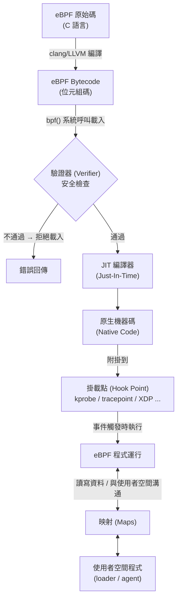
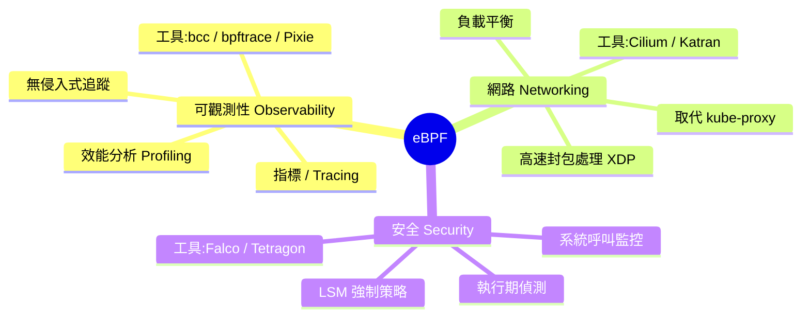
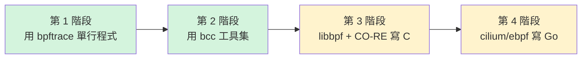
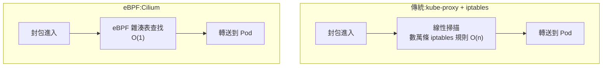

# 03 - eBPF:核心可程式化的雲原生基石

> 這是整個學習計畫**最進階**的章節。閱讀本章前,請確認你已具備:
> - **Linux** 基礎(行程 (Process)、系統呼叫 (System Call)、檔案描述符 (File Descriptor))
> - **容器 (Container)** 基礎(命名空間 (Namespace)、控制群組 (cgroup))
> - **Kubernetes (K8s)** 基礎(Pod、Service、網路策略 (NetworkPolicy)、CNI)
>
> 本章以**建立觀念**為主軸,但同時提供清晰的**實作路徑**,讓你能從「會用工具」一路走到「會寫程式」。

---

## 目錄

1. [為什麼需要 eBPF](#1-為什麼需要-ebpf)
2. [eBPF 運作原理](#2-ebpf-運作原理)
3. [eBPF 的三大應用領域](#3-ebpf-的三大應用領域)
4. [學習路徑(由淺入深)](#4-學習路徑由淺入深)
5. [eBPF 與 Kubernetes](#5-ebpf-與-kubernetes)
6. [環境需求](#6-環境需求)
7. [學習資源](#7-學習資源)
8. [本章檢核點 (Checklist)](#8-本章檢核點-checklist)

---

## 1. 為什麼需要 eBPF

### 1.1 傳統的困境:想在核心做事,代價很高

作業系統分成兩個世界:**使用者空間 (User Space)** 與 **核心空間 (Kernel Space)**。我們平常寫的程式(包含容器裡跑的應用程式)都活在使用者空間,看不到、也碰不到核心內部正在發生的事——封包怎麼轉送、行程怎麼排程、檔案怎麼開啟。

如果你想在**核心 (Kernel)** 層級做事(例如攔截每一個網路封包、監看每一次檔案開啟),傳統上你只有兩條路,而且都很痛:

| 做法 | 優點 | 致命缺點 |
| --- | --- | --- |
| **寫核心模組 (Kernel Module)** | 功能完整、效能高 | 一個 bug 就讓**整台機器當機 (Kernel Panic)**;每次核心升級可能要重編譯;難維護、難審查 |
| **改核心原始碼後重新編譯** | 完全客製 | 要說服整個 Linux 社群接受你的修改,曠日廢時(常以「年」為單位) |
| **在使用者空間用既有介面** | 安全 | 資料要在核心與使用者空間之間反覆複製,**效能差**、且只能拿到核心「願意給」的有限資訊 |

簡單說:**核心很強大,但傳統上「對外封閉」。** 想擴充它的行為,要嘛冒著當機風險,要嘛慢得令人絕望。

### 1.2 eBPF 的破局:核心裡的沙箱

**eBPF (extended Berkeley Packet Filter)** 徹底改變了這個局面。它的核心理念是:

> **讓你在「不改核心原始碼、不裝核心模組」的前提下,安全地把自己的程式「注入」到核心內部執行。**(官方定義見 [ebpf.io:What is eBPF?](https://ebpf.io/what-is-ebpf/))

### 1.3 最好的比喻:核心裡的 JavaScript

理解 eBPF 最快的方式,是拿**瀏覽器與 JavaScript** 來類比:

| 瀏覽器世界 | eBPF 世界 | 共通概念 |
| --- | --- | --- |
| 瀏覽器引擎 (Browser Engine) | Linux 核心 (Kernel) | 龐大、不能隨便改的執行環境 |
| JavaScript | eBPF 程式 | 你寫的、可動態載入的小程式 |
| 網頁事件(點擊、載入) | 核心事件(收封包、開檔案、系統呼叫) | 事件觸發 (Event-driven) |
| JS 沙箱 (Sandbox) | eBPF 驗證器 (Verifier) + 沙箱 | 保證注入的程式不會搞垮宿主 |

就像你不需要為了讓網頁互動而「重新編譯瀏覽器」,你只要寫一段 JavaScript 掛上事件即可;**eBPF 讓你不需要為了擴充核心行為而「重新編譯核心」,你只要寫一段 eBPF 程式掛上掛載點 (Hook Point) 即可。**

而且 eBPF 程式是**安全**的:在它被允許執行前,核心裡的**驗證器 (Verifier)** 會嚴格審查它(下一節詳述),確保它不會無窮迴圈、不會存取非法記憶體、不會搞垮系統。這正是 eBPF 與傳統核心模組最大的差異——**核心模組信任你,eBPF 不信任你,所以它先驗證你。**(詳見核心官方文件 [eBPF Verifier](https://docs.kernel.org/bpf/verifier.html))

### 1.4 為什麼這在雲原生 (Cloud Native) 如此重要

雲原生環境的特徵是:**高度動態、規模龐大、多租戶、強調可觀測性與零信任安全**。

- 一台節點上可能跑著數十甚至上百個 Pod,網路連線瞬息萬變——傳統 `iptables` 規則會膨脹到數萬條,效能崩潰。
- 安全團隊需要即時看到「哪個容器執行了什麼系統呼叫」,但又不能為了監控而拖垮應用程式。
- 平台團隊想要**無侵入式 (Zero-instrumentation)** 的可觀測性:不改一行應用程式碼,就能拿到 HTTP / gRPC / SQL 層級的指標。

eBPF 剛好同時滿足這三點:**它在核心內運作,所以看得到一切;它是事件驅動且 JIT 編譯,所以夠快;它有驗證器把關,所以夠安全。** 這就是為什麼 Cilium、Falco、Pixie、Tetragon 等雲原生明星專案,底層全都是 eBPF。

> **動手練習 1**:用一句話向同事解釋「為什麼不直接寫核心模組就好」。提示:從「當機風險」與「維護成本」兩個角度切入。

---

## 2. eBPF 運作原理

### 2.1 全貌:從原始碼到核心內執行



整個生命週期:**寫 C → 編成位元組碼 → 經 `bpf()` 系統呼叫載入 → 驗證器審查 → JIT 編成原生機器碼 → 掛到掛載點 → 事件發生時執行 → 透過映射與使用者空間交換資料。** 這個流程是 eBPF 子系統的官方總覽,完整定義可參見 [Linux 核心 BPF 文件首頁](https://docs.kernel.org/bpf/)。

### 2.2 程式類型 (Program Types)

eBPF 程式不是萬用的——你寫的程式必須宣告**屬於哪一種類型**,類型決定了:它能掛在哪種掛載點、能呼叫哪些**輔助函式 (Helper Functions)**、能拿到什麼樣的**上下文 (Context)**。完整的程式類型清單與其對應的掛載介面,可見 [Linux 核心文件:Program Types and ELF Sections](https://docs.kernel.org/bpf/libbpf/program_types.html) 與 [eBPF Docs 的 Program Types 索引](https://docs.ebpf.io/linux/program-type/)。

| 程式類型 | 典型用途 | 上下文 (Context) |
| --- | --- | --- |
| `BPF_PROG_TYPE_KPROBE` | 動態追蹤核心函式 | 暫存器狀態 (`pt_regs`) |
| `BPF_PROG_TYPE_TRACEPOINT` | 追蹤核心靜態追蹤點 (Tracepoint) | 追蹤點專屬結構 |
| `BPF_PROG_TYPE_XDP` | 最高速封包處理(網卡驅動層) | `xdp_md`(封包指標) |
| `BPF_PROG_TYPE_SCHED_CLS` | tc 流量控制 / 整形 | `__sk_buff`(socket buffer) |
| `BPF_PROG_TYPE_CGROUP_SKB` | cgroup 層級網路過濾 | `__sk_buff` |
| `BPF_PROG_TYPE_SOCKET_FILTER` | socket 層封包過濾 | `__sk_buff` |
| `BPF_PROG_TYPE_PERF_EVENT` | 效能事件取樣(profiling) | 效能事件資料 |

### 2.3 映射 (Maps):eBPF 的記憶體與通訊管道

eBPF 程式本身是**無狀態、短命**的——每次事件觸發、跑完就結束。那狀態存哪裡?跨次事件如何累積資料?核心內的程式如何把結果送回使用者空間?

答案是 **映射 (Maps)**。映射是核心管理的**鍵值資料結構 (Key-Value Store)**,同時被核心內的 eBPF 程式與使用者空間程式存取,扮演兩個世界之間的橋樑。

常見的映射類型(完整類型清單見 [核心文件:BPF maps](https://docs.kernel.org/bpf/maps.html)):

| 映射類型 | 用途 |
| --- | --- |
| `BPF_MAP_TYPE_HASH` | 雜湊表,任意鍵值查找(如:依 PID 累計次數)。[核心文件:HASH map](https://docs.kernel.org/bpf/map_hash.html) |
| `BPF_MAP_TYPE_ARRAY` | 陣列,索引固定 |
| `BPF_MAP_TYPE_PERCPU_HASH` / `PERCPU_ARRAY` | 每 CPU 各自一份獨立的值,讀寫不需加鎖、避免跨 CPU 競爭,效能極高。[核心文件:PERCPU_HASH](https://docs.kernel.org/bpf/map_hash.html)、[核心文件:PERCPU_ARRAY](https://docs.kernel.org/bpf/map_array.html) |
| `BPF_MAP_TYPE_PERF_EVENT_ARRAY` | 把事件串流送往使用者空間(舊式,per-CPU 緩衝,可能有跨 CPU 事件順序錯亂與記憶體使用率較差的問題) |
| `BPF_MAP_TYPE_RINGBUF` | 環形緩衝區 (Ring Buffer),核心 5.8 引入,多生產者單消費者 (MPSC),解決了 `PERF_EVENT_ARRAY` 的記憶體效率與跨 CPU 事件排序問題,是現代主流的事件串流方式。[核心文件:BPF ring buffer](https://docs.kernel.org/bpf/ringbuf.html) |
| `BPF_MAP_TYPE_LRU_HASH` | 雜湊表容量滿時自動淘汰最久未用 (Least Recently Used) 的項目。[核心文件:HASH map(含 LRU 變體)](https://docs.kernel.org/bpf/map_hash.html) |

### 2.4 驗證器 (Verifier):安全的守門員

這是 eBPF「安全」的關鍵。當你透過 `bpf()` 系統呼叫載入程式時,**驗證器 (Verifier)** 會在程式真正執行**之前**,以靜態分析窮舉所有可能的執行路徑,確保(詳細規則見[核心官方文件 eBPF Verifier](https://docs.kernel.org/bpf/verifier.html)):

1. **一定會結束**:控制流程圖 (CFG) 不能含有迴圈,確保程式必定終止;核心 **5.3** 起放寬為允許**有界迴圈 (Bounded Loops)**——驗證器會展開模擬每一輪迭代的狀態,確認迴圈一定會在有限步驟內結束([LWN:Bounded loops in BPF for the 5.3 kernel](https://lwn.net/Articles/794934/))。
2. **不會非法存取記憶體**:每次解參考指標前,必須先檢查邊界(這就是為什麼你常被迫寫 `if (ptr + 1 > data_end) return;`)。
3. **不會洩漏核心記憶體**:在非特權模式下,不允許對指標做可能外洩核心位址的指標運算。
4. **只用允許的輔助函式**:依程式類型限制可呼叫的 helper,且若 helper 被標記為 `gpl_only`,程式的 `LICENSE` 必須宣告為 GPL 相容授權,否則載入會被拒絕([核心文件:BPF licensing](https://docs.kernel.org/bpf/bpf_licensing.html))。
5. **指令數量與複雜度受限**:避免拖垮核心。核心 **5.2** 之前硬上限是 **4096 條指令**且複雜度上限 128K;5.2 之後的變更**只放寬了特權 (root) 程式**——複雜度上限改為單純的 `BPF_COMPLEXITY_LIMIT_INSNS`,約 **100 萬條指令**等級,此時純粹看驗證器能否在合理時間內窮舉完所有路徑。但**非特權程式的 4096 條指令上限至今仍然存在**,並未被移除(見 [Linux 核心文件:BPF Design Q&A](https://docs.kernel.org/bpf/bpf_design_QA.html) 中「BPF_MAXINSNS (4096)... the maximum number of instructions that the unprivileged bpf program can have」;變更歷史見 [Linux 核心 commit:bpf: increase complexity limit and maximum program size](https://github.com/torvalds/linux/commit/c04c0d2b968ac45d6ef020316808ef6c82325a82))。

> 心法:**驗證器不是你的敵人,是你的安全帶。** 初學時被它擋下會很挫折,但它擋下的每一個錯誤,在傳統核心模組裡都可能是一次 Kernel Panic。

### 2.5 JIT 編譯:跑得跟原生一樣快

通過驗證後,**JIT (Just-In-Time) 編譯器** 會把與架構無關的 eBPF 位元組碼,翻譯成當下 CPU 的**原生機器碼 (Native Machine Code)**。eBPF 的暫存器與指令格式刻意設計成與現代 CPU(x86-64、ARM64 等)的暫存器/呼叫慣例相近,讓 JIT 多半能做到指令一對一映射,目前官方支援 x86-64、arm64、arm32、ppc64、s390x、mips64、sparc64、riscv64/riscv32、loongarch64 等架構(核心原始碼各架構下的 `bpf_jit_comp.c` 為權威來源;概念說明見[核心文件:Classic BPF vs eBPF](https://docs.kernel.org/bpf/classic_vs_extended.html))。所以 eBPF 程式雖然是「動態載入的腳本」,執行效能卻**接近原生編譯的核心程式碼**,沒有直譯器的開銷。

### 2.6 掛載點 (Hook Points):程式掛在哪裡

eBPF 程式要「綁」到某個事件來源才能被觸發。常見掛載點:

| 掛載點 | 觸發時機 | 領域 |
| --- | --- | --- |
| **kprobe / kretprobe** | 進入 / 離開任一**核心函式**時 | 追蹤(動態) |
| **uprobe / uretprobe** | 進入 / 離開**使用者空間函式**時(如追 libc、追 Go 函式) | 追蹤(動態) |
| **tracepoint** | 核心預先埋好的**靜態追蹤點**(穩定、跨版本) | 追蹤(靜態) |
| **XDP (eXpress Data Path)** | 封包經 DMA 進記憶體後、**核心配置 `sk_buff` 與進入網路堆疊之前**;只處理 ingress(進站)方向 | 網路(最高速) |
| **tc (Traffic Control)** | 核心網路堆疊的流量控制層,此時封包已有完整 `sk_buff`,可看到更豐富的協定中介資訊;支援 ingress 與 **egress(出站)**雙向 | 網路 |
| **cgroup hooks** | 某個 cgroup 的行程做網路 / socket 操作時 | 網路 / 安全 |
| **LSM (Linux Security Module)** | 核心安全決策點,程式回傳值可直接決定該操作被允許還是以 `-EPERM` 拒絕(核心 5.7 引入,需 `CONFIG_BPF_LSM=y`) | 安全 |

> **kprobe vs tracepoint 怎麼選?** kprobe 能掛**任何**核心函式,彈性最大,但函式名稱可能隨核心版本改變(不穩定);tracepoint 是核心刻意提供的穩定介面,跨版本可靠,**優先用 tracepoint,沒有合適的再退而用 kprobe。**
>
> **XDP vs tc 怎麼選?** XDP 掛在驅動層、早於 `sk_buff` 配置,延遲最低、最適合「越早丟棄惡意/不需要的封包越好」的場景(如 DDoS 防護),但只能處理 ingress;tc 掛在網路堆疊內,雖然延遲略高,卻能看到完整封包中介資訊、可串接多個分類器、支援 egress,適合更複雜的策略控制。

> **動手練習 2**:畫出「一個封包從網卡到應用程式」的路徑,並標出 XDP 與 tc 分別攔截在哪一段。思考:為什麼 DDoS 防護要用 XDP 而不是 tc?(提示:越早丟棄惡意封包,浪費的 CPU 越少。)

---

## 3. eBPF 的三大應用領域

eBPF 的應用千變萬化,但收斂起來就是三大支柱(這個分類方式也是 [ebpf.io 官方對 eBPF 應用領域的劃分](https://ebpf.io/what-is-ebpf/)):



### 3.1 可觀測性 (Observability)

eBPF 最成熟、最容易上手的領域。因為程式直接跑在核心內,它能**無侵入 (Zero-instrumentation)** 地看到一切:每一次系統呼叫、每一個封包、每一次函式呼叫——**完全不需要改應用程式碼**。

- 抓出「誰在 fork 一堆短命行程」、「誰在狂開檔案」、「哪個連線延遲爆高」。
- 持續效能剖析 (Continuous Profiling):用極低開銷取樣 CPU 堆疊,找出熱點。

### 3.2 網路 (Networking)

eBPF 在網路領域是顛覆性的。透過 **XDP** 與 **tc** 掛載點,可以在封包處理的最早期就做轉送、過濾、負載平衡——速度遠超傳統 `iptables`。Cilium、Facebook 的 Katran(L4 負載平衡器)都建立在此之上(詳見第 5 節)。

### 3.3 安全 (Security)

eBPF 能即時觀察核心層的安全事件(誰執行了什麼程式、開了什麼檔、發了什麼連線),甚至透過 **LSM hook** 直接**允許或拒絕**某個操作。相較傳統稽核 (auditd),eBPF 的開銷低、可程式化、上下文更豐富。Falco、Tetragon 是代表作。

---

## 4. 學習路徑(由淺入深)

學 eBPF 最忌諱一開始就埋頭寫 C。正確的順序是:**先當「使用者」用工具建立直覺 → 再當「開發者」寫程式。**



### 4.1 第 1 階段:用 bpftrace 建立直覺

**[bpftrace](https://github.com/bpftrace/bpftrace)** 是一套高階追蹤語言(語法像 awk),讓你用**一行**就完成原本要寫一大段 C 的追蹤工作,內部以 LLVM 把腳本編譯成 eBPF 位元組碼。最適合探索與建立直覺。

```bash
# 安裝(以 Ubuntu/Debian 為例)
sudo apt-get update && sudo apt-get install -y bpftrace

# 範例 1:列出所有 tracepoint 與 kprobe(看看有哪些掛載點可用)
sudo bpftrace -l 'tracepoint:syscalls:*' | head

# 範例 2:統計每個行程觸發了幾次 execve(誰在狂開新程式?)
sudo bpftrace -e 'tracepoint:syscalls:sys_enter_execve { @[comm] = count(); }'

# 範例 3:每秒印出系統呼叫總數(觀察系統負載)
sudo bpftrace -e 'tracepoint:raw_syscalls:sys_enter { @ = count(); }
                  interval:s:1 { print(@); clear(@); }'

# 範例 4:畫出 read() 回傳大小的直方圖(資料分佈一目了然)
sudo bpftrace -e 'tracepoint:syscalls:sys_exit_read { @bytes = hist(args->ret); }'
```

> **動手練習 3**:用 bpftrace 寫一行程式,統計**每個指令名稱 (comm)** 各自開啟了幾次檔案(提示:掛 `tracepoint:syscalls:sys_enter_openat`,用 `@[comm] = count()`)。

### 4.2 第 2 階段:用 bcc 工具集

**[bcc (BPF Compiler Collection)](https://github.com/iovisor/bcc)** 內附數十支「即裝即用」的生產級工具。每支都是一個 eBPF 程式的完整範例,**用法本身就是最好的教材**。

```bash
# 安裝
sudo apt-get install -y bpfcc-tools linux-headers-$(uname -r)

# 工具通常以 -bpfcc 結尾(Ubuntu 套件命名)
sudo execsnoop-bpfcc      # 即時顯示每一個被執行的新程式(含完整指令列)
sudo opensnoop-bpfcc      # 即時顯示每一次檔案開啟(誰開了什麼檔)
sudo tcpconnect-bpfcc     # 即時顯示每一個 TCP 主動連線(連到哪去了?)
sudo tcpaccept-bpfcc      # 即時顯示每一個 TCP 被動接受的連線
sudo biolatency-bpfcc     # 區塊裝置 I/O 延遲直方圖
sudo runqlat-bpfcc        # 排程器執行佇列延遲(CPU 爭用程度)
```

這些工具的對應關係,正好涵蓋三大領域:

| 工具 | 看到什麼 | 領域 |
| --- | --- | --- |
| `execsnoop` | 誰執行了什麼程式 | 安全 / 觀測 |
| `opensnoop` | 誰開了什麼檔 | 安全 / 觀測 |
| `tcpconnect` | 誰連到哪裡 | 網路 / 安全 |
| `biolatency` | 磁碟慢不慢 | 觀測 / 效能 |

> **動手練習 4**:開兩個終端機。一個跑 `sudo execsnoop-bpfcc`,另一個隨意執行幾個指令(如 `ls`、`date`)。觀察 execsnoop 即時捕捉到的輸出,理解「核心事件即時可見」的威力。

### 4.3 第 3 階段:寫程式 — libbpf + CO-RE(現代主流)

當工具滿足不了需求,就得自己寫。現代寫法的關鍵字是 **CO-RE (Compile Once - Run Everywhere,一次編譯、到處執行)**。

**為什麼需要 CO-RE?** 早期 bcc 的做法是在**目標機器上即時編譯**(把 C 原始碼字串內嵌進工具、執行期呼叫 Clang/LLVM)——所以每台機器都要裝完整編譯器工具鏈與核心標頭檔,部署笨重、編譯期耗資源、且編譯錯誤要到執行期才會發現。CO-RE 改變了這點([參考:Andrii Nakryiko, BPF CO-RE reference guide](https://nakryiko.com/posts/bpf-portability-and-co-re/)):

- 編譯時 Clang 會把「我要存取 `task_struct` 的 `pid` 欄位」這類意圖記錄成 **BTF (BPF Type Format)** 重定位資訊,而非寫死欄位偏移量。BTF 本身由核心 **4.18** 引入([核心文件:BPF Type Format](https://docs.kernel.org/bpf/btf.html))。
- 載入時 **libbpf** 讀取目標機器當前核心的 BTF(`/sys/kernel/btf/vmlinux`),比對並重新計算實際欄位偏移,在載入前動態調整存取位址——即使目標核心的結構體佈局與編譯時不同也能正確運作。
- 結果:**一個編譯好的 `.o` 檔,可以搬到不同核心版本的機器上直接跑**,目標機器不需要編譯器、不需要核心標頭檔。

這就是今天 Cilium、Tetragon、Pixie 等主流專案採用的方式。

下面是一個**最小可運行的 libbpf + CO-RE 骨架**,功能:追蹤每一次 `execve` 並印出 PID 與指令名稱。

**核心側程式 `minimal.bpf.c`(在核心內執行):**

```c
// minimal.bpf.c — 在核心空間執行的 eBPF 程式
#include "vmlinux.h"            // 由 BTF 產生,含所有核心型別定義
#include <bpf/bpf_helpers.h>

char LICENSE[] SEC("license") = "GPL";  // 必須宣告授權,否則無法用 GPL helper

// 定義一個環形緩衝區 (Ring Buffer) 映射,用來把事件送回使用者空間
struct {
    __uint(type, BPF_MAP_TYPE_RINGBUF);
    __uint(max_entries, 256 * 1024);    // 緩衝區大小:256 KB
} events SEC(".maps");

// 事件資料結構
struct event {
    int pid;
    char comm[16];
};

// 掛到 execve 系統呼叫的進入點 (tracepoint)
SEC("tracepoint/syscalls/sys_enter_execve")
int handle_execve(void *ctx)
{
    // 從環形緩衝區預留一塊空間
    struct event *e = bpf_ringbuf_reserve(&events, sizeof(*e), 0);
    if (!e)
        return 0;                       // 預留失敗就放棄(緩衝區滿了)

    // bpf_get_current_pid_tgid() 回傳 64 位元值:高 32 位是 TGID(即一般認知的 PID),低 32 位是個別執行緒 ID
    // 參考:https://docs.ebpf.io/linux/helper-function/bpf_get_current_pid_tgid/
    e->pid = bpf_get_current_pid_tgid() >> 32;
    bpf_get_current_comm(&e->comm, sizeof(e->comm));

    bpf_ringbuf_submit(e, 0);           // 提交事件給使用者空間
    return 0;
}
```

**使用者側載入器(概念流程,以 libbpf 為例):**

```c
// minimal.c — 使用者空間載入器(關鍵步驟)
// 1. minimal_bpf__open()      開啟編譯好的 eBPF 物件
// 2. minimal_bpf__load()      載入核心(此時驗證器會審查)
// 3. minimal_bpf__attach()    附掛到 tracepoint
// 4. ring_buffer__poll()      輪詢環形緩衝區、處理事件
// (實務上 .bpf.c 會用 bpftool 產生 skeleton 標頭檔,大幅簡化以上樣板)
```

**典型建置流程**(完整流程說明見 [核心文件:libbpf Overview](https://docs.kernel.org/bpf/libbpf/libbpf_overview.html)):

```bash
# 1. 產生 vmlinux.h(從當前核心的 BTF 萃取所有型別)
bpftool btf dump file /sys/kernel/btf/vmlinux format c > vmlinux.h

# 2. 用 clang 把 .bpf.c 編成 eBPF 物件檔(注意 -target bpf)
clang -O2 -g -target bpf -c minimal.bpf.c -o minimal.bpf.o

# 3. 產生 skeleton 標頭(讓使用者側程式好寫)
bpftool gen skeleton minimal.bpf.o > minimal.skel.h

# 4. 編譯使用者側並連結 libbpf,即可執行
```

> 強烈建議直接從官方範本起步:[libbpf/libbpf-bootstrap](https://github.com/libbpf/libbpf-bootstrap) 把上面所有樣板都準備好了。

### 4.4 第 4 階段:用 Go 寫 — cilium/ebpf

如果你的世界是雲原生(K8s 控制器、Operator、agent 多半用 Go),那麼 **[cilium/ebpf](https://github.com/cilium/ebpf)**(官方文件站 [ebpf-go.dev](https://ebpf-go.dev/))是純 Go 實作、無 CGO 依賴的主流函式庫,由 Cilium 與 Cloudflare 共同維護,Cilium 本身的 Go 程式碼也使用它來載入與附掛 eBPF 程式。

```go
// main.go — 用 cilium/ebpf 載入並附掛 eBPF 程式(精簡骨架)
package main

import (
	"log"
	"os"
	"os/signal"

	"github.com/cilium/ebpf/link"
	"github.com/cilium/ebpf/ringbuf"
	"github.com/cilium/ebpf/rlimit"
)

// 用 go:generate 搭配 bpf2go,把 minimal.bpf.c 編譯並產生 Go 綁定
//go:generate go run github.com/cilium/ebpf/cmd/bpf2go bpf minimal.bpf.c

func main() {
	// 移除 MEMLOCK 上限(舊核心 < 5.11 需要;5.11+ 已改用 cgroup 記憶體核算,此呼叫會是 no-op)
	// 參考:https://ebpf-go.dev/concepts/rlimit/
	if err := rlimit.RemoveMemlock(); err != nil {
		log.Fatal(err)
	}

	// 載入 bpf2go 產生的 eBPF 物件(objs 含 program 與 map)
	objs := bpfObjects{}
	if err := loadBpfObjects(&objs, nil); err != nil {
		log.Fatalf("載入 eBPF 物件失敗: %v", err)
	}
	defer objs.Close()

	// 把 eBPF 程式附掛到 execve tracepoint
	tp, err := link.Tracepoint("syscalls", "sys_enter_execve", objs.HandleExecve, nil)
	if err != nil {
		log.Fatalf("附掛 tracepoint 失敗: %v", err)
	}
	defer tp.Close()

	// 開啟環形緩衝區讀取器,從核心讀回事件
	rd, err := ringbuf.NewReader(objs.Events)
	if err != nil {
		log.Fatalf("開啟 ringbuf 失敗: %v", err)
	}
	defer rd.Close()

	// 收到 Ctrl-C 時優雅結束
	stop := make(chan os.Signal, 1)
	signal.Notify(stop, os.Interrupt)

	log.Println("開始監聽 execve 事件... (按 Ctrl-C 結束)")
	go func() {
		for {
			record, err := rd.Read() // 阻塞讀取下一筆事件
			if err != nil {
				return
			}
			log.Printf("收到事件,長度 %d bytes", len(record.RawSample))
			// 實務上會把 record.RawSample 解析成事件結構
		}
	}()

	<-stop
	log.Println("收到結束訊號,清理中...")
}
```

> **動手練習 5**:clone [`libbpf/libbpf-bootstrap`](https://github.com/libbpf/libbpf-bootstrap),建置並執行其中的 `minimal` 範例。觀察它如何只用幾十行就完成載入、附掛、讀取事件。接著嘗試把追蹤目標從 `execve` 改成 `openat`。

---

## 5. eBPF 與 Kubernetes

這是本章與你雲原生學習主線最關鍵的交會點。

### 5.1 核心痛點:iptables 撐不住雲原生規模

傳統 K8s 預設用 **kube-proxy + iptables** 模式來實作 Service 的負載平衡與轉送。問題在於:

- iptables 規則是**線性比對**的鏈結,封包路由的複雜度是 `O(N)`(N 為規則數)。每新增一個 Service / Endpoint,規則就增加。
- 大型叢集動輒**數千個 Service、數萬條規則**——實務上規模來到約 5000 個 Service(對應數萬條規則)時效能就會明顯惡化,封包每次轉送都要從頭掃這串長鏈,延遲與 CPU 隨規模**線性惡化**。
- 規則更新需要**整批重載 (atomic replace)**,在高變動環境下成本高昂。

> **現況補充**:K8s 社群也意識到此問題,`kube-proxy` 的 **nftables 模式**已於 **1.33** 版 GA、用近似 `O(1)` 的映射結構解決了同樣的效能問題([Kubernetes 官方部落格:NFTables mode for kube-proxy](https://kubernetes.io/blog/2025/02/28/nftables-kube-proxy/))。IPVS 模式的棄用走的是**多版本漸進式**時程,依照官方 [KEP-5495](https://github.com/kubernetes/enhancements/tree/master/keps/sig-network/5495-deprecate-ipvs-mode-in-kube-proxy):**1.35** 版只是啟動時印出棄用警告(功能仍完整可用)、**1.37** 版才會引入 `KubeProxyIPVS` feature gate(預設仍為 `true`,IPVS 照常運作)、**1.40** 版才把預設值翻成 `false`(此後需手動開啟才能用 IPVS)、要到 **1.43** 版程式碼(`pkg/proxy/ipvs`)才會真正被移除、**1.46** 版才會連 feature gate 本身都清掉。也就是說,截至目前最新的 **1.36** 版,IPVS 仍完整存在、只是顯示棄用警告,實際程式碼移除要等到 1.43 版才會發生。社群建議及早改用 nftables 以避免屆時被迫遷移。另外留意:**AWS 文件與上游時程曾不一致**——AWS 的 [EKS 1.35 版本說明](https://docs.aws.amazon.com/eks/latest/userguide/kubernetes-versions-standard.html#kubernetes-1-35)一度寫著「will be removed in Kubernetes 1.36」,但已發布的 [Kubernetes 1.36 CHANGELOG](https://github.com/kubernetes/kubernetes/blob/master/CHANGELOG/CHANGELOG-1.36.md) 並沒有移除 IPVS 的項目,實際時程以上游 [kubernetes/enhancements#5495](https://github.com/kubernetes/enhancements/issues/5495) 追蹤進度為準。但 iptables 目前仍是上游預設模式,且 nftables/IPVS 都只解決了「Service 轉送」這一項問題,並未涵蓋 eBPF 在身分型網路策略、L7 可視性、無侵入式可觀測性上的能力——這正是 Cilium 等 eBPF 方案除了取代 kube-proxy 之外仍有價值的原因。



eBPF 用**雜湊表 (Hash Map)** 做查找,複雜度從 `O(n)` 降到接近 `O(1)`,且更新單一條目不需重載整體。這就是 eBPF 取代 iptables 的根本優勢。

### 5.2 Cilium:eBPF 在 K8s 的旗艦專案

**Cilium** 已於 2023 年 10 月畢業成為 CNCF Graduated 專案,用 eBPF 全面重寫了 Kubernetes 的網路、安全與可觀測性層。CNCF 官方公告當時稱其為「僅次於 Kubernetes、CNCF commit 數第二活躍的專案」([CNCF 公告](https://www.cncf.io/announcements/2023/10/11/cloud-native-computing-foundation-announces-cilium-graduation/))——這是畢業當下(2023 年)的排名快照,非持續更新的即時數據:

| Cilium 能力 | eBPF 怎麼做到 | 取代了什麼 |
| --- | --- | --- |
| **CNI(容器網路)** | 用 eBPF 在核心內處理 Pod 間封包轉送 | 傳統 bridge/overlay |
| **取代 kube-proxy** | 用 eBPF cgroup hook 在 socket 層(`connect`/`sendmsg` 等)做服務轉譯,搭配 tc 層的封包級負載平衡 | kube-proxy + iptables。詳見 [Cilium 官方文件:Kubernetes Without kube-proxy](https://docs.cilium.io/en/stable/network/kubernetes/kubeproxy-free/) |
| **網路策略 (NetworkPolicy)** | 在 eBPF 層依**身分 (Identity)**(由 label 推導出的數值 ID)而非 IP 強制策略,查表方式做策略判斷 | iptables 規則。詳見 [Cilium 官方文件:eBPF Datapath 介紹](https://docs.cilium.io/en/stable/network/ebpf/intro/) |
| **L7 感知策略** | eBPF 解析 HTTP / gRPC / Kafka,做應用層管控 | 須額外 sidecar |
| **可觀測性 (Hubble)** | eBPF 觀測所有網路流並彙整 | 須額外監控堆疊 |

**Hubble** 是 Cilium 的可觀測性元件,讓你即時看到「哪個 Pod 跟哪個 Pod 講話、用什麼協定、有沒有被策略擋下」——服務地圖一目了然。

```bash
# 用 Helm 安裝 Cilium 並啟用「取代 kube-proxy」模式(概念示意)
helm install cilium cilium/cilium --namespace kube-system \
  --set kubeProxyReplacement=true \
  --set hubble.relay.enabled=true \
  --set hubble.ui.enabled=true

# 檢查 Cilium 狀態
cilium status

# 觀察即時網路流(需先 cilium hubble enable)
hubble observe --follow
```

### 5.3 其他重要的雲原生 eBPF 專案

| 專案 | 領域 | 一句話說明 |
| --- | --- | --- |
| **Cilium** | 網路 / 安全 / 觀測 | eBPF 版的 CNI 與服務網格,kube-proxy 替代品 |
| **Tetragon** | 安全 | Cilium 旗下,執行期安全觀測與**強制執行 (Enforcement)** |
| **Falco** | 安全 | CNCF 執行期威脅偵測,可用 eBPF 作為事件來源 |
| **Pixie** | 可觀測性 | 用 eBPF **自動**抓 K8s 應用層遙測,免改程式碼 |
| **Parca / Pyroscope** | 可觀測性 | eBPF 持續效能剖析 (Continuous Profiling) |

> **動手練習 6**:用 `kind` 或 `minikube` 建一個本地叢集,安裝 Cilium 並啟用 Hubble UI。部署兩個有互相通訊的 Pod,在 Hubble UI 觀察它們之間的網路流。接著套用一條 `CiliumNetworkPolicy` 阻擋其中一個方向,觀察流被擋下的事件。

---

## 6. 環境需求

### 6.1 核心版本

eBPF 的功能與核心版本**強相關**。各功能登場的大致里程碑(詳見各功能對應的核心官方文件):

| 核心版本 | 重要里程碑 |
| --- | --- |
| 3.18 (2014) | eBPF 首次併入主線 |
| 4.x 系列 | kprobe、tracepoint、XDP、Maps 等陸續成熟 |
| **4.18** | [BTF](https://docs.kernel.org/bpf/btf.html) 引入,CO-RE 的基礎 |
| **5.2** | **特權程式**的複雜度上限由舊式的 4096 條 + 128K 複雜度,放寬為單一 `BPF_COMPLEXITY_LIMIT_INSNS`(約 100 萬條等級);**非特權程式的 4096 條上限維持不變**([commit 紀錄](https://github.com/torvalds/linux/commit/c04c0d2b968ac45d6ef020316808ef6c82325a82)、[核心文件:BPF Design Q&A](https://docs.kernel.org/bpf/bpf_design_QA.html)) |
| **5.3** | [有界迴圈 (Bounded Loops)](https://lwn.net/Articles/794934/) 開放 |
| **5.7** | [BPF LSM](https://docs.kernel.org/bpf/prog_lsm.html) 引入 |
| **5.8** | `CAP_BPF` / `CAP_PERFMON` 權限拆分、[Ring Buffer 映射](https://docs.kernel.org/bpf/ringbuf.html) 引入 |

**實務建議:做 CO-RE 與現代開發,以核心 **5.4+**(理想 5.8+)且**啟用 BTF**(`CONFIG_DEBUG_INFO_BTF=y`)為基準。**

```bash
# 檢查核心版本
uname -r

# 檢查是否啟用 BTF(CO-RE 的前提);存在此檔代表有 BTF
ls -l /sys/kernel/btf/vmlinux

# 檢查核心設定中與 eBPF 相關的選項
grep -E 'CONFIG_BPF|CONFIG_DEBUG_INFO_BTF' /boot/config-$(uname -r)
```

### 6.2 權限:從 root 走向 CAP_BPF

早期載入 eBPF 程式幾乎都需要 **root**(或 `CAP_SYS_ADMIN`)——權限太大,不符合最小權限原則。

核心 **5.8** 起引入了專屬能力 **`CAP_BPF`**,把原本綁在 `CAP_SYS_ADMIN` 上的 eBPF 權限拆出來,可搭配([參考:Linux `capabilities(7)` man page](https://man7.org/linux/man-pages/man7/capabilities.7.html)):

- `CAP_BPF`:基本的 eBPF 操作(建立 map、做大部分 `bpf()` 系統呼叫)。注意單獨持有 `CAP_BPF` 仍無法載入大多數類型的程式。
- `CAP_PERFMON`:載入追蹤類程式(kprobe、tracepoint、perf event)所需,需與 `CAP_BPF` 搭配使用。
- `CAP_NET_ADMIN`:載入網路類(XDP / tc)程式所需,同樣需與 `CAP_BPF` 搭配。

這讓你能給一個 agent **剛好夠用**的權限組合,而不是整個 root。

### 6.3 在容器 / Kubernetes 裡跑 eBPF 的注意事項

在 K8s 中部署 eBPF agent(如 Cilium、Falco、Tetragon),通常以 **DaemonSet**(每個節點一份)形式運行,並需注意:

- **特權或精細能力**:Pod 通常需要 `CAP_BPF` / `CAP_PERFMON` / `CAP_NET_ADMIN`,或在受控下使用 `privileged: true`。以 Cilium agent 為例,官方 DaemonSet 預設要求 `NET_ADMIN`、`SYS_ADMIN`、`SYS_RESOURCE`、`IPC_LOCK` 等多項能力([Cilium 官方文件:Restricting privileged Cilium pod access](https://docs.cilium.io/en/stable/security/restrict-pod-access/))。
- **掛載核心檔案系統**:常需把宿主的 `/sys/kernel/debug`(debugfs)、`/sys/fs/bpf`(bpffs)掛進容器——eBPF 程式與 map 可以「釘選 (Pin)」到 bpffs 路徑,讓多個行程或重啟後仍能找到、複用同一份物件([eBPF Docs:Pinning](https://docs.ebpf.io/linux/concepts/pinning/))。
- **eBPF 是節點層級、非命名空間化的**:容器的隔離靠的是命名空間 (Namespace)、cgroup 等核心機制,但所有容器**共用同一個核心**;eBPF 程式作用於**整個核心**,而非單一容器的命名空間。意即一個節點上的 eBPF agent **看得到該節點上所有容器**——這是它強大(全域可觀測)也需謹慎(權限邊界、最小權限原則更重要)之處。
- **託管叢集 (EKS/GKE/AKS) 的核心限制**:你**無法自選節點核心版本**,得確認雲商提供的核心已啟用 BTF 並支援你需要的功能。這對前一章 `02-eks` 學到的 AWS 環境尤其相關——選用節點 AMI 時要留意核心版本。

> **動手練習 7**:檢視 Cilium 或 Falco 的官方 DaemonSet manifest,找出它宣告了哪些 `securityContext.capabilities` 與 `volumeMounts`(尤其是 `bpf-maps`、`sys-kernel-debug`),對照本節說明,理解「為什麼它需要這些」。

---

## 7. 學習資源

| 資源 | 類型 | 說明 |
| --- | --- | --- |
| **[ebpf.io](https://ebpf.io/)** | 官方入口 | eBPF 基金會官網,概念、生態系、文件總匯,**最佳起點** |
| **[《Learning eBPF》— Liz Rice](https://www.oreilly.com/library/view/learning-ebpf/9781098135119/)** | 書籍 | 由淺入深的入門經典,O'Reilly 出版(2023 年 3 月) |
| **[Cilium 官方文件](https://docs.cilium.io/)** | 文件 | K8s 上實戰 eBPF 網路 / 安全 / Hubble 的權威來源 |
| **[libbpf-bootstrap](https://github.com/libbpf/libbpf-bootstrap)** | 範本 | libbpf + CO-RE 的官方起手範本,寫 C 必看 |
| **[cilium/ebpf](https://github.com/cilium/ebpf)** | 函式庫 | Go 開發者寫 eBPF 的主流函式庫,含豐富範例 |
| **[bcc](https://github.com/iovisor/bcc) / [bpftrace](https://github.com/bpftrace/bpftrace)** | 工具 | 觀測階段的必備工具集與單行追蹤語言 |
| **Brendan Gregg 的網站與著作** | 進階 | 效能分析與 eBPF 追蹤的大師級資源 |

**建議學習順序**:`ebpf.io` 建立全貌 → 《Learning eBPF》系統性打底 → bpftrace/bcc 動手玩 → libbpf-bootstrap 或 cilium/ebpf 寫第一支程式 → Cilium 文件落地到 K8s。

---

## 8. 本章檢核點 (Checklist)

完成本章後,你應該能勾選以下每一項:

**觀念理解**
- [ ] 能說明「為什麼不直接寫核心模組」,並從當機風險與維護成本說明 eBPF 的優勢
- [ ] 能用「核心裡的 JavaScript」比喻向他人解釋 eBPF
- [ ] 能說明驗證器 (Verifier) 的角色,以及它如何保證 eBPF 程式的安全
- [ ] 能解釋 JIT 編譯為何讓 eBPF 兼具「動態載入」與「原生效能」
- [ ] 能說出映射 (Maps) 的用途,以及它如何連接核心與使用者空間

**掛載點與類型**
- [ ] 能區分 kprobe、uprobe、tracepoint、XDP、tc、cgroup、LSM 各自的觸發時機
- [ ] 知道何時該優先選 tracepoint 而非 kprobe(穩定性)
- [ ] 能說明 eBPF 三大應用領域:可觀測性、網路、安全

**動手實作**
- [ ] 已用 bpftrace 跑過至少 3 個單行程式
- [ ] 已用 bcc 工具(execsnoop / opensnoop / tcpconnect)實際觀測過系統
- [ ] 理解 CO-RE (Compile Once - Run Everywhere) 解決了什麼問題,以及 BTF 的角色
- [ ] 已建置並執行 libbpf-bootstrap 的 minimal 範例(或 cilium/ebpf 範例)

**Kubernetes 整合**
- [ ] 能說明為什麼 iptables 在大規模叢集會成為瓶頸,以及 eBPF 如何改善
- [ ] 知道 Cilium 用 eBPF 實作了哪些能力(CNI、取代 kube-proxy、NetworkPolicy、Hubble)
- [ ] 認識 Tetragon、Falco、Pixie 各屬於哪個應用領域
- [ ] (進階)已在本地叢集安裝 Cilium 並用 Hubble 觀察過網路流

**環境與部署**
- [ ] 能檢查自己機器的核心版本與 BTF 是否啟用
- [ ] 知道 CAP_BPF 相較於 root 的意義(最小權限)
- [ ] 理解在容器 / K8s 裡跑 eBPF 的注意事項(DaemonSet、能力、掛載 bpffs/debugfs、非命名空間化、託管叢集核心限制)

---

> **下一步**:把本章學到的 eBPF 觀念,連回 `01-kubernetes` 的網路策略與 `02-eks` 的節點選型——當你在 EKS 上選擇 Cilium 作為 CNI 時,你會清楚知道**底層每一個封包,正由一段你能理解的 eBPF 程式在核心內處理**。這就是雲原生最深的一層。
