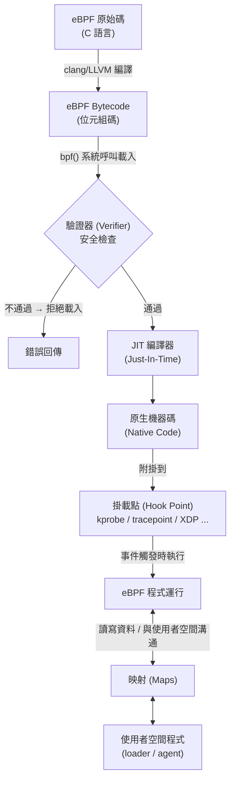
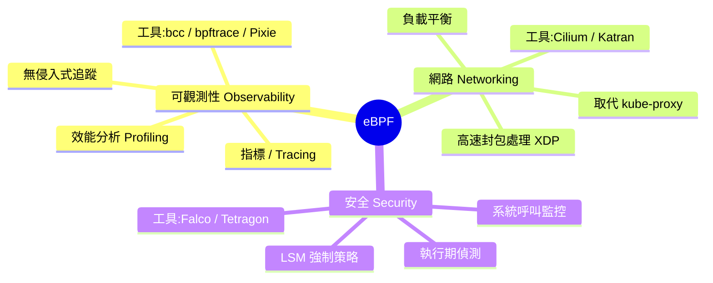
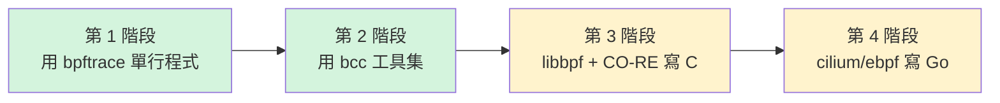
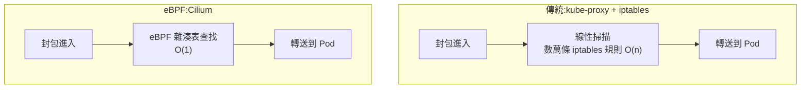

# 03 - eBPF:核心可程式化的雲原生基石

> 這是整個學習計畫**最進階**的章節。閱讀本章前,請確認你已具備:
> - **Linux** 基礎(行程 (Process)、系統呼叫 (System Call)、檔案描述符 (File Descriptor))
> - **容器 (Container)** 基礎(命名空間 (Namespace)、控制群組 (cgroup))
> - **Kubernetes (K8s)** 基礎(Pod、Service、網路策略 (NetworkPolicy)、CNI)
>
> 本章以**建立觀念**為主軸,但同時提供清晰的**實作路徑**,讓你能從「會用工具」一路走到「會寫程式」。

---

## 目錄

1. [為什麼需要 eBPF](#1-為什麼需要-ebpf)
2. [eBPF 運作原理](#2-ebpf-運作原理)
3. [eBPF 的三大應用領域](#3-ebpf-的三大應用領域)
4. [學習路徑(由淺入深)](#4-學習路徑由淺入深)
5. [eBPF 與 Kubernetes](#5-ebpf-與-kubernetes)
6. [環境需求](#6-環境需求)
7. [學習資源](#7-學習資源)
8. [本章檢核點 (Checklist)](#8-本章檢核點-checklist)

---

## 1. 為什麼需要 eBPF

### 1.1 傳統的困境:想在核心做事,代價很高

作業系統分成兩個世界:**使用者空間 (User Space)** 與 **核心空間 (Kernel Space)**。我們平常寫的程式(包含容器裡跑的應用程式)都活在使用者空間,看不到、也碰不到核心內部正在發生的事——封包怎麼轉送、行程怎麼排程、檔案怎麼開啟。

如果你想在**核心 (Kernel)** 層級做事(例如攔截每一個網路封包、監看每一次檔案開啟),傳統上你只有兩條路,而且都很痛:

| 做法 | 優點 | 致命缺點 |
| --- | --- | --- |
| **寫核心模組 (Kernel Module)** | 功能完整、效能高 | 一個 bug 就讓**整台機器當機 (Kernel Panic)**;每次核心升級可能要重編譯;難維護、難審查 |
| **改核心原始碼後重新編譯** | 完全客製 | 要說服整個 Linux 社群接受你的修改,曠日廢時(常以「年」為單位) |
| **在使用者空間用既有介面** | 安全 | 資料要在核心與使用者空間之間反覆複製,**效能差**、且只能拿到核心「願意給」的有限資訊 |

簡單說:**核心很強大,但傳統上「對外封閉」。** 想擴充它的行為,要嘛冒著當機風險,要嘛慢得令人絕望。

### 1.2 eBPF 的破局:核心裡的沙箱

**eBPF (extended Berkeley Packet Filter)** 徹底改變了這個局面。它的核心理念是:

> **讓你在「不改核心原始碼、不裝核心模組」的前提下,安全地把自己的程式「注入」到核心內部執行。**(官方定義見 [ebpf.io:What is eBPF?](https://ebpf.io/what-is-ebpf/))

### 1.3 最好的比喻:核心裡的 JavaScript

理解 eBPF 最快的方式,是拿**瀏覽器與 JavaScript** 來類比:

| 瀏覽器世界 | eBPF 世界 | 共通概念 |
| --- | --- | --- |
| 瀏覽器引擎 (Browser Engine) | Linux 核心 (Kernel) | 龐大、不能隨便改的執行環境 |
| JavaScript | eBPF 程式 | 你寫的、可動態載入的小程式 |
| 網頁事件(點擊、載入) | 核心事件(收封包、開檔案、系統呼叫) | 事件觸發 (Event-driven) |
| JS 沙箱 (Sandbox) | eBPF 驗證器 (Verifier) + 沙箱 | 保證注入的程式不會搞垮宿主 |

就像你不需要為了讓網頁互動而「重新編譯瀏覽器」,你只要寫一段 JavaScript 掛上事件即可;**eBPF 讓你不需要為了擴充核心行為而「重新編譯核心」,你只要寫一段 eBPF 程式掛上掛載點 (Hook Point) 即可。**

而且 eBPF 程式是**安全**的:在它被允許執行前,核心裡的**驗證器 (Verifier)** 會嚴格審查它(下一節詳述),確保它不會無窮迴圈、不會存取非法記憶體、不會搞垮系統。這正是 eBPF 與傳統核心模組最大的差異——**核心模組信任你,eBPF 不信任你,所以它先驗證你。**(詳見核心官方文件 [eBPF Verifier](https://docs.kernel.org/bpf/verifier.html))

### 1.4 為什麼這在雲原生 (Cloud Native) 如此重要

雲原生環境的特徵是:**高度動態、規模龐大、多租戶、強調可觀測性與零信任安全**。

- 一台節點上可能跑著數十甚至上百個 Pod,網路連線瞬息萬變——傳統 `iptables` 規則會膨脹到數萬條,效能崩潰。
- 安全團隊需要即時看到「哪個容器執行了什麼系統呼叫」,但又不能為了監控而拖垮應用程式。
- 平台團隊想要**無侵入式 (Zero-instrumentation)** 的可觀測性:不改一行應用程式碼,就能拿到 HTTP / gRPC / SQL 層級的指標。

eBPF 剛好同時滿足這三點:**它在核心內運作,所以看得到一切;它是事件驅動且 JIT 編譯,所以夠快;它有驗證器把關,所以夠安全。** 這就是為什麼 Cilium、Falco、Pixie、Tetragon 等雲原生明星專案,底層全都是 eBPF。

> **動手練習 1**:用一句話向同事解釋「為什麼不直接寫核心模組就好」。提示:從「當機風險」與「維護成本」兩個角度切入。

---

## 2. eBPF 運作原理

### 2.1 全貌:從原始碼到核心內執行


```mermaid
flowchart TD
    A["eBPF 原始碼<br/>(C 語言)"] -->|"clang/LLVM 編譯"| B["eBPF Bytecode<br/>(位元組碼)"]
    B -->|"bpf() 系統呼叫載入"| C{"驗證器 (Verifier)<br/>安全檢查"}
    C -->|"不通過 → 拒絕載入"| X["錯誤回傳"]
    C -->|"通過"| D["JIT 編譯器<br/>(Just-In-Time)"]
    D --> E["原生機器碼<br/>(Native Code)"]
    E -->|"附掛到"| F["掛載點 (Hook Point)<br/>kprobe / tracepoint / XDP ..."]
    F -->|"事件觸發時執行"| G["eBPF 程式運行"]
    G <-->|"讀寫資料 / 與使用者空間溝通"| H["映射 (Maps)"]
    H <--> I["使用者空間程式<br/>(loader / agent)"]
```

整個生命週期:**寫 C → 編成位元組碼 → 經 `bpf()` 系統呼叫載入 → 驗證器審查 → JIT 編成原生機器碼 → 掛到掛載點 → 事件發生時執行 → 透過映射與使用者空間交換資料。** 這個流程是 eBPF 子系統的官方總覽,完整定義可參見 [Linux 核心 BPF 文件首頁](https://docs.kernel.org/bpf/)。

### 2.2 程式類型 (Program Types)

eBPF 程式不是萬用的——你寫的程式必須宣告**屬於哪一種類型**,類型決定了:它能掛在哪種掛載點、能呼叫哪些**輔助函式 (Helper Functions)**、能拿到什麼樣的**上下文 (Context)**。完整的程式類型清單與其對應的掛載介面,可見 [Linux 核心文件:Program Types and ELF Sections](https://docs.kernel.org/bpf/libbpf/program_types.html) 與 [eBPF Docs 的 Program Types 索引](https://docs.ebpf.io/linux/program-type/)。

| 程式類型 | 典型用途 | 上下文 (Context) |
| --- | --- | --- |
| `BPF_PROG_TYPE_KPROBE` | 動態追蹤核心函式 | 暫存器狀態 (`pt_regs`) |
| `BPF_PROG_TYPE_TRACEPOINT` | 追蹤核心靜態追蹤點 (Tracepoint) | 追蹤點專屬結構 |
| `BPF_PROG_TYPE_XDP` | 最高速封包處理(網卡驅動層) | `xdp_md`(封包指標) |
| `BPF_PROG_TYPE_SCHED_CLS` | tc 流量控制 / 整形 | `__sk_buff`(socket buffer) |
| `BPF_PROG_TYPE_CGROUP_SKB` | cgroup 層級網路過濾 | `__sk_buff` |
| `BPF_PROG_TYPE_SOCKET_FILTER` | socket 層封包過濾 | `__sk_buff` |
| `BPF_PROG_TYPE_PERF_EVENT` | 效能事件取樣(profiling) | 效能事件資料 |

### 2.3 映射 (Maps):eBPF 的記憶體與通訊管道

eBPF 程式本身是**無狀態、短命**的——每次事件觸發、跑完就結束。那狀態存哪裡?跨次事件如何累積資料?核心內的程式如何把結果送回使用者空間?

答案是 **映射 (Maps)**。映射是核心管理的**鍵值資料結構 (Key-Value Store)**,同時被核心內的 eBPF 程式與使用者空間程式存取,扮演兩個世界之間的橋樑。

常見的映射類型(完整類型清單見 [核心文件:BPF maps](https://docs.kernel.org/bpf/maps.html)):

| 映射類型 | 用途 |
| --- | --- |
| `BPF_MAP_TYPE_HASH` | 雜湊表,任意鍵值查找(如:依 PID 累計次數)。[核心文件:HASH map](https://docs.kernel.org/bpf/map_hash.html) |
| `BPF_MAP_TYPE_ARRAY` | 陣列,索引固定 |
| `BPF_MAP_TYPE_PERCPU_HASH` / `PERCPU_ARRAY` | 每 CPU 各自一份獨立的值,讀寫不需加鎖、避免跨 CPU 競爭,效能極高。[核心文件:PERCPU_HASH](https://docs.kernel.org/bpf/map_hash.html)、[核心文件:PERCPU_ARRAY](https://docs.kernel.org/bpf/map_array.html) |
| `BPF_MAP_TYPE_PERF_EVENT_ARRAY` | 把事件串流送往使用者空間(舊式,per-CPU 緩衝,可能有跨 CPU 事件順序錯亂與記憶體使用率較差的問題) |
| `BPF_MAP_TYPE_RINGBUF` | 環形緩衝區 (Ring Buffer),核心 5.8 引入,多生產者單消費者 (MPSC),解決了 `PERF_EVENT_ARRAY` 的記憶體效率與跨 CPU 事件排序問題,是現代主流的事件串流方式。[核心文件:BPF ring buffer](https://docs.kernel.org/bpf/ringbuf.html) |
| `BPF_MAP_TYPE_LRU_HASH` | 雜湊表容量滿時自動淘汰最久未用 (Least Recently Used) 的項目。[核心文件:HASH map(含 LRU 變體)](https://docs.kernel.org/bpf/map_hash.html) |

### 2.4 驗證器 (Verifier):安全的守門員

這是 eBPF「安全」的關鍵。當你透過 `bpf()` 系統呼叫載入程式時,**驗證器 (Verifier)** 會在程式真正執行**之前**,以靜態分析窮舉所有可能的執行路徑,確保(詳細規則見[核心官方文件 eBPF Verifier](https://docs.kernel.org/bpf/verifier.html)):

1. **一定會結束**:控制流程圖 (CFG) 不能含有迴圈,確保程式必定終止;核心 **5.3** 起放寬為允許**有界迴圈 (Bounded Loops)**——驗證器會展開模擬每一輪迭代的狀態,確認迴圈一定會在有限步驟內結束([LWN:Bounded loops in BPF for the 5.3 kernel](https://lwn.net/Articles/794934/))。
2. **不會非法存取記憶體**:每次解參考指標前,必須先檢查邊界(這就是為什麼你常被迫寫 `if (ptr + 1 > data_end) return;`)。
3. **不會洩漏核心記憶體**:在非特權模式下,不允許對指標做可能外洩核心位址的指標運算。
4. **只用允許的輔助函式**:依程式類型限制可呼叫的 helper,且若 helper 被標記為 `gpl_only`,程式的 `LICENSE` 必須宣告為 GPL 相容授權,否則載入會被拒絕([核心文件:BPF licensing](https://docs.kernel.org/bpf/bpf_licensing.html))。
5. **指令數量與複雜度受限**:避免拖垮核心。核心 **5.2** 之前硬上限是 **4096 條指令**且複雜度上限 128K;5.2 之後的變更**只放寬了特權 (root) 程式**——複雜度上限改為單純的 `BPF_COMPLEXITY_LIMIT_INSNS`,約 **100 萬條指令**等級,此時純粹看驗證器能否在合理時間內窮舉完所有路徑。但**非特權程式的 4096 條指令上限至今仍然存在**,並未被移除(見 [Linux 核心文件:BPF Design Q&A](https://docs.kernel.org/bpf/bpf_design_QA.html) 中「BPF_MAXINSNS (4096)... the maximum number of instructions that the unprivileged bpf program can have」;變更歷史見 [Linux 核心 commit:bpf: increase complexity limit and maximum program size](https://github.com/torvalds/linux/commit/c04c0d2b968ac45d6ef020316808ef6c82325a82))。

> 心法:**驗證器不是你的敵人,是你的安全帶。** 初學時被它擋下會很挫折,但它擋下的每一個錯誤,在傳統核心模組裡都可能是一次 Kernel Panic。
>
> **但安全帶也會有瑕疵**:驗證器本身是複雜的靜態分析程式碼,一樣可能出錯。例如 **CVE-2026-31413** 就是驗證器對 `BPF_OR` 常數運算元的純量分析錯誤(`maybe_fork_scalars()` 誤用了 `BPF_AND` 的推導邏輯),導致驗證器認定的值與執行期實際值不一致,可被利用做越界的 map 存取(CVSS 7.8;[CVE 官方記錄(NVD)](https://nvd.nist.gov/vuln/detail/CVE-2026-31413)、[核心修補 commit](https://git.kernel.org/stable/c/342aa1ee995ef5bbf876096dc3a5e51218d76fa4))。這類問題通常需要載入非特權 eBPF 程式的能力才能觸發,也是許多 K8s 節點預設**停用非特權 BPF**(`kernel.unprivileged_bpf_disabled=1`,見 [核心文件:BPF Design Q&A](https://docs.kernel.org/bpf/bpf_design_QA.html))或限制 `CAP_BPF` 授予對象的原因。

### 2.5 JIT 編譯:跑得跟原生一樣快

通過驗證後,**JIT (Just-In-Time) 編譯器** 會把與架構無關的 eBPF 位元組碼,翻譯成當下 CPU 的**原生機器碼 (Native Machine Code)**。eBPF 的暫存器與指令格式刻意設計成與現代 CPU(x86-64、ARM64 等)的暫存器/呼叫慣例相近,讓 JIT 多半能做到指令一對一映射,目前官方支援 x86-64/x86-32、arm64、arm32、ppc64/ppc32、s390x、mips64/mips32、sparc64、riscv64/riscv32、loongarch64、parisc(32/64 位元,核心 **6.6** 起新增)、arc(ARCv2)等架構——ppc32 與 mips32 也各自擁有獨立的 eBPF JIT 實作(而非僅有較舊的 classic BPF JIT),分別可見核心原始碼 [`arch/powerpc/net/bpf_jit_comp32.c`](https://github.com/torvalds/linux/blob/master/arch/powerpc/net/bpf_jit_comp32.c)、[`arch/mips/net/bpf_jit_comp32.c`](https://github.com/torvalds/linux/blob/master/arch/mips/net/bpf_jit_comp32.c)、[`arch/parisc/net/`](https://github.com/torvalds/linux/tree/master/arch/parisc/net);arc 的 eBPF JIT 支援可見 [`arch/arc/net/`](https://github.com/torvalds/linux/tree/master/arch/arc/net) 及 Kconfig 中 `select HAVE_EBPF_JIT if ISA_ARCV2`,官方架構支援表見核心原始碼 [`Documentation/features/core/eBPF-JIT/arch-support.txt`](https://github.com/torvalds/linux/blob/master/Documentation/features/core/eBPF-JIT/arch-support.txt);相對地 sparc32 至今仍只有 classic BPF JIT、未支援 eBPF,故未列入。核心原始碼各架構下的 `bpf_jit_comp*.c` 為權威來源;概念說明見[核心文件:Classic BPF vs eBPF](https://docs.kernel.org/bpf/classic_vs_extended.html)。所以 eBPF 程式雖然是「動態載入的腳本」,執行效能卻**接近原生編譯的核心程式碼**,沒有直譯器的開銷。

### 2.6 掛載點 (Hook Points):程式掛在哪裡

eBPF 程式要「綁」到某個事件來源才能被觸發。常見掛載點:

| 掛載點 | 觸發時機 | 領域 |
| --- | --- | --- |
| **kprobe / kretprobe** | 進入 / 離開任一**核心函式**時 | 追蹤(動態) |
| **uprobe / uretprobe** | 進入 / 離開**使用者空間函式**時(如追 libc、追 Go 函式) | 追蹤(動態) |
| **tracepoint** | 核心預先埋好的**靜態追蹤點**(穩定、跨版本) | 追蹤(靜態) |
| **XDP (eXpress Data Path)** | 封包經 DMA 進記憶體後、**核心配置 `sk_buff` 與進入網路堆疊之前**;只處理 ingress(進站)方向 | 網路(最高速) |
| **tc (Traffic Control)** | 核心網路堆疊的流量控制層,此時封包已有完整 `sk_buff`,可看到更豐富的協定中介資訊;支援 ingress 與 **egress(出站)**雙向 | 網路 |
| **cgroup hooks** | 某個 cgroup 的行程做網路 / socket 操作時 | 網路 / 安全 |
| **LSM (Linux Security Module)** | 核心安全決策點,程式回傳值可直接決定該操作被允許還是以 `-EPERM` 拒絕(核心 5.7 引入,需 `CONFIG_BPF_LSM=y`) | 安全 |

> **kprobe vs tracepoint 怎麼選?** kprobe 能掛**任何**核心函式,彈性最大,但函式名稱可能隨核心版本改變(不穩定);tracepoint 是核心刻意提供的穩定介面,跨版本可靠,**優先用 tracepoint,沒有合適的再退而用 kprobe。**
>
> **XDP vs tc 怎麼選?** XDP 掛在驅動層、早於 `sk_buff` 配置,延遲最低、最適合「越早丟棄惡意/不需要的封包越好」的場景(如 DDoS 防護),但只能處理 ingress;tc 掛在網路堆疊內,雖然延遲略高,卻能看到完整封包中介資訊、可串接多個分類器、支援 egress,適合更複雜的策略控制。
>
> **tc 的現代附掛方式:tcx。** 傳統 tc BPF 程式要透過 netlink 掛在 `clsact` qdisc 上,多個程式共存時的執行順序與卸載時機不易管理。核心 **6.6** 引入的 **tcx**,提供以 `bpf_link` 為基礎的輕量多程式附掛機制:支援用 `BPF_F_BEFORE`/`BPF_F_AFTER` 明確指定執行順序、行程結束或 fd 關閉時自動卸載,不必再操作 qdisc。傳統 `tc`/`classifier`/`action` 附掛型態已被標示為過時,tcx 是目前建議的做法,Cilium 等專案已預設偵測核心支援後改用 tcx。詳見 [eBPF Docs:BPF_PROG_TYPE_SCHED_CLS](https://docs.ebpf.io/linux/program-type/BPF_PROG_TYPE_SCHED_CLS/)。

> **動手練習 2**:畫出「一個封包從網卡到應用程式」的路徑,並標出 XDP 與 tc 分別攔截在哪一段。思考:為什麼 DDoS 防護要用 XDP 而不是 tc?(提示:越早丟棄惡意封包,浪費的 CPU 越少。)

---

## 3. eBPF 的三大應用領域

eBPF 的應用千變萬化,但收斂起來就是三大支柱(這個分類方式也是 [ebpf.io 官方對 eBPF 應用領域的劃分](https://ebpf.io/what-is-ebpf/)):


```mermaid
mindmap
  root((eBPF))
    可觀測性 Observability
      無侵入式追蹤
      效能分析 Profiling
      指標 / Tracing
      工具:bcc / bpftrace / Pixie
    網路 Networking
      高速封包處理 XDP
      負載平衡
      取代 kube-proxy
      工具:Cilium / Katran
    安全 Security
      系統呼叫監控
      執行期偵測
      LSM 強制策略
      工具:Falco / Tetragon
```

### 3.1 可觀測性 (Observability)

eBPF 最成熟、最容易上手的領域。因為程式直接跑在核心內,它能**無侵入 (Zero-instrumentation)** 地看到一切:每一次系統呼叫、每一個封包、每一次函式呼叫——**完全不需要改應用程式碼**。

- 抓出「誰在 fork 一堆短命行程」、「誰在狂開檔案」、「哪個連線延遲爆高」。
- 持續效能剖析 (Continuous Profiling):用極低開銷取樣 CPU 堆疊,找出熱點。

### 3.2 網路 (Networking)

eBPF 在網路領域是顛覆性的。透過 **XDP** 與 **tc** 掛載點,可以在封包處理的最早期就做轉送、過濾、負載平衡——速度遠超傳統 `iptables`。Cilium、Facebook 的 Katran(L4 負載平衡器)都建立在此之上(詳見第 5 節)。

### 3.3 安全 (Security)

eBPF 能即時觀察核心層的安全事件(誰執行了什麼程式、開了什麼檔、發了什麼連線),甚至透過 **LSM hook** 直接**允許或拒絕**某個操作。相較傳統稽核 (auditd),eBPF 的開銷低、可程式化、上下文更豐富。Falco、Tetragon 是代表作。

---

## 4. 學習路徑(由淺入深)

學 eBPF 最忌諱一開始就埋頭寫 C。正確的順序是:**先當「使用者」用工具建立直覺 → 再當「開發者」寫程式。**


```mermaid
flowchart LR
    A["第 1 階段<br/>用 bpftrace 單行程式"] --> B["第 2 階段<br/>用 bcc 工具集"]
    B --> C["第 3 階段<br/>libbpf + CO-RE 寫 C"]
    C --> D["第 4 階段<br/>cilium/ebpf 寫 Go"]
    style A fill:#d4f4dd
    style B fill:#d4f4dd
    style C fill:#fff3cd
    style D fill:#fff3cd
```

### 4.1 第 1 階段:用 bpftrace 建立直覺

**[bpftrace](https://github.com/bpftrace/bpftrace)** 是一套高階追蹤語言(語法像 awk),讓你用**一行**就完成原本要寫一大段 C 的追蹤工作,內部以 LLVM 把腳本編譯成 eBPF 位元組碼。最適合探索與建立直覺。

```bash
# 安裝(以 Ubuntu/Debian 為例)
sudo apt-get update && sudo apt-get install -y bpftrace

# 範例 1:列出所有 tracepoint 與 kprobe(看看有哪些掛載點可用)
sudo bpftrace -l 'tracepoint:syscalls:*' | head

# 範例 2:統計每個行程觸發了幾次 execve(誰在狂開新程式?)
sudo bpftrace -e 'tracepoint:syscalls:sys_enter_execve { @[comm] = count(); }'

# 範例 3:每秒印出系統呼叫總數(觀察系統負載)
sudo bpftrace -e 'tracepoint:raw_syscalls:sys_enter { @ = count(); }
                  interval:s:1 { print(@); clear(@); }'

# 範例 4:畫出 read() 回傳大小的直方圖(資料分佈一目了然)
sudo bpftrace -e 'tracepoint:syscalls:sys_exit_read { @bytes = hist(args->ret); }'
```

> **動手練習 3**:用 bpftrace 寫一行程式,統計**每個指令名稱 (comm)** 各自開啟了幾次檔案(提示:掛 `tracepoint:syscalls:sys_enter_openat`,用 `@[comm] = count()`)。

### 4.2 第 2 階段:用 bcc 工具集

**[bcc (BPF Compiler Collection)](https://github.com/iovisor/bcc)** 內附數十支「即裝即用」的生產級工具。每支都是一個 eBPF 程式的完整範例,**用法本身就是最好的教材**。

```bash
# 安裝
sudo apt-get install -y bpfcc-tools linux-headers-$(uname -r)

# 工具通常以 -bpfcc 結尾(Ubuntu 套件命名)
sudo execsnoop-bpfcc      # 即時顯示每一個被執行的新程式(含完整指令列)
sudo opensnoop-bpfcc      # 即時顯示每一次檔案開啟(誰開了什麼檔)
sudo tcpconnect-bpfcc     # 即時顯示每一個 TCP 主動連線(連到哪去了?)
sudo tcpaccept-bpfcc      # 即時顯示每一個 TCP 被動接受的連線
sudo biolatency-bpfcc     # 區塊裝置 I/O 延遲直方圖
sudo runqlat-bpfcc        # 排程器執行佇列延遲(CPU 爭用程度)
```

這些工具的對應關係,正好涵蓋三大領域:

| 工具 | 看到什麼 | 領域 |
| --- | --- | --- |
| `execsnoop` | 誰執行了什麼程式 | 安全 / 觀測 |
| `opensnoop` | 誰開了什麼檔 | 安全 / 觀測 |
| `tcpconnect` | 誰連到哪裡 | 網路 / 安全 |
| `biolatency` | 磁碟慢不慢 | 觀測 / 效能 |

> **動手練習 4**:開兩個終端機。一個跑 `sudo execsnoop-bpfcc`,另一個隨意執行幾個指令(如 `ls`、`date`)。觀察 execsnoop 即時捕捉到的輸出,理解「核心事件即時可見」的威力。

### 4.3 第 3 階段:寫程式 — libbpf + CO-RE(現代主流)

當工具滿足不了需求,就得自己寫。現代寫法的關鍵字是 **CO-RE (Compile Once - Run Everywhere,一次編譯、到處執行)**。

**為什麼需要 CO-RE?** 早期 bcc 的做法是在**目標機器上即時編譯**(把 C 原始碼字串內嵌進工具、執行期呼叫 Clang/LLVM)——所以每台機器都要裝完整編譯器工具鏈與核心標頭檔,部署笨重、編譯期耗資源、且編譯錯誤要到執行期才會發現。CO-RE 改變了這點([參考:Andrii Nakryiko, BPF CO-RE reference guide](https://nakryiko.com/posts/bpf-portability-and-co-re/)):

- 編譯時 Clang 會把「我要存取 `task_struct` 的 `pid` 欄位」這類意圖記錄成 **BTF (BPF Type Format)** 重定位資訊,而非寫死欄位偏移量。BTF 本身由核心 **4.18** 引入([核心文件:BPF Type Format](https://docs.kernel.org/bpf/btf.html))。
- 載入時 **libbpf** 讀取目標機器當前核心的 BTF(`/sys/kernel/btf/vmlinux`),比對並重新計算實際欄位偏移,在載入前動態調整存取位址——即使目標核心的結構體佈局與編譯時不同也能正確運作。
- 結果:**一個編譯好的 `.o` 檔,可以搬到不同核心版本的機器上直接跑**,目標機器不需要編譯器、不需要核心標頭檔。

這就是今天 Cilium、Tetragon、Pixie 等主流專案採用的方式。

下面是一個**最小可運行的 libbpf + CO-RE 骨架**,功能:追蹤每一次 `execve` 並印出 PID 與指令名稱。

**核心側程式 `minimal.bpf.c`(在核心內執行):**

```c
// minimal.bpf.c — 在核心空間執行的 eBPF 程式
#include "vmlinux.h"            // 由 BTF 產生,含所有核心型別定義
#include <bpf/bpf_helpers.h>

char LICENSE[] SEC("license") = "GPL";  // 必須宣告授權,否則無法用 GPL helper

// 定義一個環形緩衝區 (Ring Buffer) 映射,用來把事件送回使用者空間
struct {
    __uint(type, BPF_MAP_TYPE_RINGBUF);
    __uint(max_entries, 256 * 1024);    // 緩衝區大小:256 KB
} events SEC(".maps");

// 事件資料結構
struct event {
    int pid;
    char comm[16];
};

// 掛到 execve 系統呼叫的進入點 (tracepoint)
SEC("tracepoint/syscalls/sys_enter_execve")
int handle_execve(void *ctx)
{
    // 從環形緩衝區預留一塊空間
    struct event *e = bpf_ringbuf_reserve(&events, sizeof(*e), 0);
    if (!e)
        return 0;                       // 預留失敗就放棄(緩衝區滿了)

    // bpf_get_current_pid_tgid() 回傳 64 位元值:高 32 位是 TGID(即一般認知的 PID),低 32 位是個別執行緒 ID
    // 參考:https://docs.ebpf.io/linux/helper-function/bpf_get_current_pid_tgid/
    e->pid = bpf_get_current_pid_tgid() >> 32;
    bpf_get_current_comm(&e->comm, sizeof(e->comm));

    bpf_ringbuf_submit(e, 0);           // 提交事件給使用者空間
    return 0;
}
```

**使用者側載入器(概念流程,以 libbpf 為例):**

```c
// minimal.c — 使用者空間載入器(關鍵步驟)
// 1. minimal_bpf__open()      開啟編譯好的 eBPF 物件
// 2. minimal_bpf__load()      載入核心(此時驗證器會審查)
// 3. minimal_bpf__attach()    附掛到 tracepoint
// 4. ring_buffer__poll()      輪詢環形緩衝區、處理事件
// (實務上 .bpf.c 會用 bpftool 產生 skeleton 標頭檔,大幅簡化以上樣板)
```

**典型建置流程**(完整流程說明見 [核心文件:libbpf Overview](https://docs.kernel.org/bpf/libbpf/libbpf_overview.html)):

```bash
# 1. 產生 vmlinux.h(從當前核心的 BTF 萃取所有型別)
bpftool btf dump file /sys/kernel/btf/vmlinux format c > vmlinux.h

# 2. 用 clang 把 .bpf.c 編成 eBPF 物件檔(注意 -target bpf)
clang -O2 -g -target bpf -c minimal.bpf.c -o minimal.bpf.o

# 3. 產生 skeleton 標頭(讓使用者側程式好寫)
bpftool gen skeleton minimal.bpf.o > minimal.skel.h

# 4. 編譯使用者側並連結 libbpf,即可執行
```

> 強烈建議直接從官方範本起步:[libbpf/libbpf-bootstrap](https://github.com/libbpf/libbpf-bootstrap) 把上面所有樣板都準備好了。

### 4.4 第 4 階段:用 Go 寫 — cilium/ebpf

如果你的世界是雲原生(K8s 控制器、Operator、agent 多半用 Go),那麼 **[cilium/ebpf](https://github.com/cilium/ebpf)**(官方文件站 [ebpf-go.dev](https://ebpf-go.dev/))是純 Go 實作、無 CGO 依賴的主流函式庫,由 Cilium 與 Cloudflare 共同維護,Cilium 本身的 Go 程式碼也使用它來載入與附掛 eBPF 程式。

```go
// main.go — 用 cilium/ebpf 載入並附掛 eBPF 程式(精簡骨架)
package main

import (
	"log"
	"os"
	"os/signal"

	"github.com/cilium/ebpf/link"
	"github.com/cilium/ebpf/ringbuf"
	"github.com/cilium/ebpf/rlimit"
)

// 用 go:generate 搭配 bpf2go,把 minimal.bpf.c 編譯並產生 Go 綁定
//go:generate go run github.com/cilium/ebpf/cmd/bpf2go bpf minimal.bpf.c

func main() {
	// 移除 MEMLOCK 上限(舊核心 < 5.11 需要;5.11+ 已改用 cgroup 記憶體核算,此呼叫會是 no-op)
	// 參考:https://ebpf-go.dev/concepts/rlimit/
	if err := rlimit.RemoveMemlock(); err != nil {
		log.Fatal(err)
	}

	// 載入 bpf2go 產生的 eBPF 物件(objs 含 program 與 map)
	objs := bpfObjects{}
	if err := loadBpfObjects(&objs, nil); err != nil {
		log.Fatalf("載入 eBPF 物件失敗: %v", err)
	}
	defer objs.Close()

	// 把 eBPF 程式附掛到 execve tracepoint
	tp, err := link.Tracepoint("syscalls", "sys_enter_execve", objs.HandleExecve, nil)
	if err != nil {
		log.Fatalf("附掛 tracepoint 失敗: %v", err)
	}
	defer tp.Close()

	// 開啟環形緩衝區讀取器,從核心讀回事件
	rd, err := ringbuf.NewReader(objs.Events)
	if err != nil {
		log.Fatalf("開啟 ringbuf 失敗: %v", err)
	}
	defer rd.Close()

	// 收到 Ctrl-C 時優雅結束
	stop := make(chan os.Signal, 1)
	signal.Notify(stop, os.Interrupt)

	log.Println("開始監聽 execve 事件... (按 Ctrl-C 結束)")
	go func() {
		for {
			record, err := rd.Read() // 阻塞讀取下一筆事件
			if err != nil {
				return
			}
			log.Printf("收到事件,長度 %d bytes", len(record.RawSample))
			// 實務上會把 record.RawSample 解析成事件結構
		}
	}()

	<-stop
	log.Println("收到結束訊號,清理中...")
}
```

> **動手練習 5**:clone [`libbpf/libbpf-bootstrap`](https://github.com/libbpf/libbpf-bootstrap),建置並執行其中的 `minimal` 範例。觀察它如何只用幾十行就完成載入、附掛、讀取事件。接著嘗試把追蹤目標從 `execve` 改成 `openat`。

---

## 5. eBPF 與 Kubernetes

這是本章與你雲原生學習主線最關鍵的交會點。

### 5.1 核心痛點:iptables 撐不住雲原生規模

傳統 K8s 預設用 **kube-proxy + iptables** 模式來實作 Service 的負載平衡與轉送。問題在於:

- iptables 規則是**線性比對**的鏈結,封包路由的複雜度是 `O(N)`(N 為規則數)。每新增一個 Service / Endpoint,規則就增加。
- 大型叢集動輒**數千個 Service、數萬條規則**——實務上規模來到約 5000 個 Service(對應數萬條規則)時效能就會明顯惡化,封包每次轉送都要從頭掃這串長鏈,延遲與 CPU 隨規模**線性惡化**。
- 規則更新需要**整批重載 (atomic replace)**,在高變動環境下成本高昂。

> **現況補充**:K8s 社群也意識到此問題。
>
> - `kube-proxy` 的 **nftables 模式**已於 **1.33** 版 GA,用近似 `O(1)` 的映射結構解決了同樣的效能問題([Kubernetes 官方部落格:NFTables mode for kube-proxy](https://kubernetes.io/blog/2025/02/28/nftables-kube-proxy/));不過 iptables 目前仍是上游預設模式。
> - IPVS 模式的棄用走**多版本漸進式**時程,依照官方 [KEP-5495](https://github.com/kubernetes/enhancements/tree/master/keps/sig-network/5495-deprecate-ipvs-mode-in-kube-proxy):**1.35** 起印出棄用警告(功能仍完整可用)、**1.37** 引入 `KubeProxyIPVS` feature gate(預設 `true`)、**1.40** 預設翻成 `false`、**1.43** 才真正移除程式碼(`pkg/proxy/ipvs`)、**1.46** 清掉 feature gate。社群建議及早改用 nftables 以避免屆時被迫遷移。**Kubernetes v1.37(代號 Garhwal)已於 2026-08-26 正式發布**([官方發布公告](https://kubernetes.io/blog/2026/08/26/kubernetes-v1-37-release/)),上述 `KubeProxyIPVS` feature gate 現已隨此版本實際生效,而非僅是規劃中的時程。留意 AWS 的 [EKS 1.35 版本說明](https://docs.aws.amazon.com/eks/latest/userguide/kubernetes-versions-standard.html#kubernetes-1-35)截至目前(2026-07)仍寫著「will be removed in Kubernetes 1.36」,而 1.36 已於 2026-04 發布且並未移除 IPVS,此說法已被實際發布時程證偽,與上游 KEP-5495(程式碼要到 1.43 才移除)也不一致——實際時程請一律以上游 KEP-5495 追蹤進度為準,而非 AWS 文件的這句敘述。
> - 但 nftables/IPVS 都只解決了「Service 轉送」這一項問題,並未涵蓋 eBPF 在身分型網路策略、L7 可視性、無侵入式可觀測性上的能力——這正是 Cilium 等 eBPF 方案除了取代 kube-proxy 之外仍有價值的原因。


```mermaid
flowchart TD
    subgraph 傳統["傳統:kube-proxy + iptables"]
        P1["封包進入"] --> R["線性掃描<br/>數萬條 iptables 規則 O(n)"] --> T1["轉送到 Pod"]
    end
    subgraph eBPF["eBPF:Cilium"]
        P2["封包進入"] --> H["eBPF 雜湊表查找<br/>O(1)"] --> T2["轉送到 Pod"]
    end
```

eBPF 用**雜湊表 (Hash Map)** 做查找,複雜度從 `O(n)` 降到接近 `O(1)`,且更新單一條目不需重載整體。這就是 eBPF 取代 iptables 的根本優勢。

### 5.2 Cilium:eBPF 在 K8s 的旗艦專案

**Cilium** 已於 2023 年 10 月畢業成為 CNCF Graduated 專案,用 eBPF 全面重寫了 Kubernetes 的網路、安全與可觀測性層。CNCF 官方公告當時稱其為「僅次於 Kubernetes、CNCF commit 數第二活躍的專案」([CNCF 公告](https://www.cncf.io/announcements/2023/10/11/cloud-native-computing-foundation-announces-cilium-graduation/))——這是畢業當下(2023 年)的排名快照,非持續更新的即時數據:

| Cilium 能力 | eBPF 怎麼做到 | 取代了什麼 |
| --- | --- | --- |
| **CNI(容器網路)** | 用 eBPF 在核心內處理 Pod 間封包轉送 | 傳統 bridge/overlay |
| **取代 kube-proxy** | 用 eBPF cgroup hook 在 socket 層(`connect`/`sendmsg` 等)做服務轉譯,搭配 tc 層的封包級負載平衡 | kube-proxy + iptables。詳見 [Cilium 官方文件:Kubernetes Without kube-proxy](https://docs.cilium.io/en/stable/network/kubernetes/kubeproxy-free/) |
| **網路策略 (NetworkPolicy)** | 在 eBPF 層依**身分 (Identity)**(由 label 推導出的數值 ID)而非 IP 強制策略,查表方式做策略判斷 | iptables 規則。詳見 [Cilium 官方文件:eBPF Datapath 介紹](https://docs.cilium.io/en/stable/network/ebpf/intro/) |
| **L7 感知策略** | eBPF 解析 HTTP / gRPC / Kafka,做應用層管控 | 須額外 sidecar |
| **可觀測性 (Hubble)** | eBPF 觀測所有網路流並彙整 | 須額外監控堆疊 |

**Hubble** 是 Cilium 的可觀測性元件,讓你即時看到「哪個 Pod 跟哪個 Pod 講話、用什麼協定、有沒有被策略擋下」——服務地圖一目了然。

> **版本現況**:[Cilium 1.20.0](https://github.com/cilium/cilium/releases/tag/v1.20.0) 已於 2026 年 7 月發布(超過 2,660 個 commit),Gateway API 支援由 v1.4 提升到 **v1.6.1**(對應本教材第 1 章 5.3 節談到的 TCPRoute/UDPRoute GA),並支援 Kubernetes v1.36。升級前請注意官方列出的重大變更項目(legacy Mutual Authentication、Envoy Go extensions、`cilium.io/v2alpha1 CiliumNodeConfig` 等)。目前最新修補版為 [Cilium 1.20.2](https://github.com/cilium/cilium/releases/tag/v1.20.2)(2026-09-15 發布,前一個修補版 1.20.1 以 bug fix 與文件修訂為主),本次除了 BPF/網路、ENI IPAM、cluster-mesh、identity/policy 等多項修正外,還新增一項 Gateway API 小功能:啟用 `hostNetwork` 模式時可用節點標籤選擇器 (label selector) 限制 Envoy listener 只部署到符合標籤的節點,而非預設部署到所有節點;整體 Gateway API 規格支援範圍(v1.6.1)與 Kubernetes 版本支援範圍未變。

```bash
# 用 Helm 安裝 Cilium 並啟用「取代 kube-proxy」模式(概念示意)
helm install cilium cilium/cilium --namespace kube-system \
  --set kubeProxyReplacement=true \
  --set hubble.relay.enabled=true \
  --set hubble.ui.enabled=true

# 檢查 Cilium 狀態
cilium status

# 觀察即時網路流(需先 cilium hubble enable)
hubble observe --follow
```

### 5.3 其他重要的雲原生 eBPF 專案

| 專案 | 領域 | 一句話說明 |
| --- | --- | --- |
| **Cilium** | 網路 / 安全 / 觀測 | eBPF 版的 CNI 與服務網格,kube-proxy 替代品 |
| **Tetragon** | 安全 | Cilium 旗下,執行期安全觀測與**強制執行 (Enforcement)** |
| **Falco** | 安全 | CNCF 執行期威脅偵測,可用 eBPF 作為事件來源 |
| **Pixie** | 可觀測性 | 用 eBPF **自動**抓 K8s 應用層遙測,免改程式碼 |
| **Parca / Pyroscope** | 可觀測性 | eBPF 持續效能剖析 (Continuous Profiling) |

> **動手練習 6**:用 `kind` 或 `minikube` 建一個本地叢集,安裝 Cilium 並啟用 Hubble UI。部署兩個有互相通訊的 Pod,在 Hubble UI 觀察它們之間的網路流。接著套用一條 `CiliumNetworkPolicy` 阻擋其中一個方向,觀察流被擋下的事件。

---

## 6. 環境需求

### 6.1 核心版本

eBPF 的功能與核心版本**強相關**。各功能登場的大致里程碑(詳見各功能對應的核心官方文件):

| 核心版本 | 重要里程碑 |
| --- | --- |
| 3.18 (2014) | eBPF 首次併入主線 |
| 4.x 系列 | kprobe、tracepoint、XDP、Maps 等陸續成熟 |
| **4.18** | [BTF](https://docs.kernel.org/bpf/btf.html) 引入,CO-RE 的基礎 |
| **5.2** | 特權程式的指令/複雜度上限放寬至約 100 萬條等級;非特權程式維持 4096 條上限(詳見 2.4 節驗證器規則 5) |
| **5.3** | [有界迴圈 (Bounded Loops)](https://lwn.net/Articles/794934/) 開放 |
| **5.7** | [BPF LSM](https://docs.kernel.org/bpf/prog_lsm.html) 引入 |
| **5.8** | `CAP_BPF` / `CAP_PERFMON` 權限拆分、[Ring Buffer 映射](https://docs.kernel.org/bpf/ringbuf.html) 引入 |

**實務建議:做 CO-RE 與現代開發,以核心 **5.4+**(理想 5.8+)且**啟用 BTF**(`CONFIG_DEBUG_INFO_BTF=y`)為基準。**(截至 2026 年 8 月,主線核心已進入 **7.x** 系列——[Linux 7.0 於 2026 年 4 月發布](https://kernelnewbies.org/Linux_7.0),其後 7.1 接續,**7.2**(代號 "Baby Opossum Posse")已於 **2026-08-16** 發布([Phoronix 報導](https://www.phoronix.com/news/Linux-7.2-Released));上述 5.4+/5.8+ 只是「CO-RE 可用」的**最低**基準,新專案沒有理由不用更新的 LTS 核心。)

> **近期已知的 eBPF 相關核心安全公告**(提醒:eBPF 的攻擊面包含驗證器、maps、helper 三處,以下各對應一處):
> - **[CVE-2026-63830](https://ubuntu.com/security/CVE-2026-63830)**(CVSS 9.4,Critical,2026-07-19 揭露):`sk_msg` 的 `sg.copy` bitmap 是 scatterlist entry 的「所有權狀態」標記,但 sockmap/TLS 的 transform 路徑在 move、copy、split、compact `msg->sg.data[]` entries 時,沒有同步搬動對應的 `sg.copy` bit,導致外部(page cache)所擁有的記憶體頁被誤判為可由 BPF 修改,可寫入原本唯讀的 page cache 內容。屬於本節分類中的 **maps/helper** 攻擊面,是目前這份 CVE 清單中嚴重度最高的一筆;修補見核心 commit [`406e8a651a7b`](https://git.kernel.org/linus/406e8a651a7b854c41fecd5117bb282b3a6c2c6b)。
> - **[CVE-2026-63926](https://ubuntu.com/security/CVE-2026-63926)**(CVSS 8.4,Ubuntu priority High,2026-07-20 揭露):同屬 sockmap 攻擊面,錯誤發生在 `bpf_msg_push_data()` 把插入點落在 scatterlist 某個 entry「中間」時的分割 (split) 邏輯——插入點會把原本的 entry 拆成左右兩段,右段(`rsge`)的 `offset` 欄位語意是「page-local」偏移量,但程式碼卻用訊息全域(message-global)的插入位置 `start` 直接加總(`rsge.offset += start`),而非只加上該 entry 內的局部差值(`start - offset`)。當插入點落在**非第一個** SG entry(`offset != 0`)時,這個誤用會讓右段的 page offset 被多加了一截,使分割後的 scatterlist 版面錯位,後續以此欄位走訪、複製資料時可能存取到錯誤的 page 位置,造成記憶體毀損或資訊外洩。修補把 `rsge.offset += start` 改成 `rsge.offset += start - offset`。修補見核心 commit [`f72eed9b84fb`](https://github.com/torvalds/linux/commit/f72eed9b84fb771019a955908132410a9ba9ea3f)("bpf: sockmap: fix tail fragment offset in bpf_msg_push_data")。與下面 CVE-2026-64548 同屬 `bpf_msg_push_data()` 這個 helper 出錯的案例,只是這次錯在分割後偏移量算錯了基準值(message-global vs fragment-local),而非整數溢位;也與上面 CVE-2026-63830 同屬 sockmap **scatterlist** 處理機制出錯的類型。
> - **[CVE-2026-64548](https://ubuntu.com/security/CVE-2026-64548)**(CVSS 8.4,2026-07-27 揭露):同樣是 sockmap 攻擊面,`bpf_msg_push_data()` 在 scatterlist ring 空間不足、走進 copy-fallback 配置路徑時,以 `copy + len` 計算配置大小——但 `len` 是 BPF 程式可完全控制的 `ARG_ANYTHING` 參數,且兩者皆為 u32,未做溢位檢查就相加,可構造 `len` 使總和整數溢位成一個很小的值,造成配置的緩衝區過小,後續 `memcpy` 寫入超出邊界,導致 heap 記憶體毀損。修補是在配置前加一行溢位檢查 `if (unlikely(copy + len < copy)) return -EINVAL;`(核心 commit [`0c0a8ed85349`](https://github.com/torvalds/linux/commit/0c0a8ed85349dae298712d79cb276acfeb794d82),"bpf, sockmap: reject overflowing copy + len in bpf_msg_push_data()")。與上面 CVE-2026-63830 同屬 sockmap/scatterlist 機制出錯的案例,只是這次錯在整數溢位而非 bit 同步。
> - **[CVE-2025-39913](https://ubuntu.com/security/CVE-2025-39913)**(CVSS 7.8,2025-10 揭露):同屬 sockmap 攻擊面,比上面兩筆 2026 年案例早了約九個月。`tcp_bpf_send_verdict()` 在為訊息「corking」(透過 `bpf_msg_cork_bytes()` 觸發)配置 `psock->cork` 失敗時(例如以 fault injection 模擬記憶體不足),沒有呼叫 `sk_msg_free()` 回復先前 `sk_msg_alloc()` 對 `sk->sk_forward_alloc` 所做的變更,導致該 `sk_msg` 物件的參照計數與記憶體追蹤狀態不一致,形成 Use-After-Free,可能被本地攻擊者用於權限提升或核心資訊洩漏。與上面 CVE-2026-63830、CVE-2026-64548 同屬 sockmap/cork 生命週期管理出錯的類型,只是這次錯在配置失敗後的清理路徑,而非 scatterlist 的搬移或溢位計算。
> - **[CVE-2026-23359](https://ubuntu.com/security/CVE-2026-23359)**(CVSS 7.8,2026-03-25 揭露):`BPF_MAP_TYPE_DEVMAP` 的 XDP 廣播轉送路徑中,`get_upper_ifindexes()` 在收集裝置的「上層 (upper)」介面索引時未做邊界檢查,呼叫端原本假設上層裝置數量不超過 `MAX_NEST_DEV`(8)並依此配置陣列空間——但當一張裝置疊了超過 8 個上層裝置(例如疊了大量 macvlan 介面)、且掛上帶 `BPF_F_BROADCAST | BPF_F_EXCLUDE_INGRESS` flag 的 XDP 程式時,收到封包觸發轉送就會寫出堆疊陣列邊界,造成 stack out-of-bounds write。修補為 `get_upper_ifindexes()` 加上 `max` 容量參數,超出時回傳 `-EOVERFLOW` 並中止轉送。與下面 CVE-2026-64545 同屬 **XDP 導向 (redirect) 路徑**出錯的案例,只是這次錯在邊界檢查而非 NULL 檢查(且觸發需要 `CAP_BPF` + `CAP_NET_ADMIN`,一般僅 root 可達,風險相對較低)。
> - **[CVE-2026-31525](https://ubuntu.com/security/CVE-2026-31525)**(CVSS 7.8,2026-04-22 揭露):BPF 直譯器 (interpreter) 處理有號 32 位元除法/取餘 (`sdiv`/`smod`) 指令時,對運算元呼叫 `abs()` 巨集——但當運算元為 `S32_MIN`(`0x80000000`)時,`abs()` 的行為屬於未定義行為 (undefined behavior),導致直譯器實際算出的結果,與驗證器 `scalar32_min_max_sdiv()` 靜態推導出的範圍不一致,可構造出讓驗證器誤判為安全、實際卻越界的 map value 存取。修補新增 `abs_s32()`,先轉型為 `u32` 再取負以避免有號溢位。與 2.4 節的 CVE-2026-31413 同屬「驗證器推導與執行期實際行為不一致」的類型,只是這次錯在直譯器對 `abs()` 的誤用,而非純量推導邏輯本身。
> - **[CVE-2026-43030](https://ubuntu.com/security/CVE-2026-43030)**(CVSS 7.8,2026-05-01 揭露):驗證器的 `regsafe()` 在比對指向封包 (packet) 的指標狀態時,當舊狀態 `rold->reg->range == BEYOND_PKT_END` 而目前狀態 `rcur->reg->range == N` 時可能誤判為安全,導致某些其實帶有有效封包範圍、理應被探索的狀態被跳過驗證。屬於**驗證器**的狀態剪枝 (state pruning) 邏輯出錯。
> - **[CVE-2026-43009](https://ubuntu.com/security/CVE-2026-43009)**(CVSS 7.8,Ubuntu priority High,2026-05-01 揭露,與上面 CVE-2026-43030 同批公告):`backtrack_insn()` 在回溯精確度追蹤 (precision tracking) 時,遇到帶 `BPF_ATOMIC | BPF_FETCH` 的 `BPF_STX` 指令(例如 `BPF_CMPXCHG`)未特殊處理——這類指令的 `src` 暫存器(`BPF_CMPXCHG` 則是 `r0`)其實同時也是「目的」,會被寫入記憶體讀出的舊值,但既有邏輯仍把它當成一般 store、只當作輸入處理,導致精確度沒有正確回傳給對應的堆疊 (stack) 位置、該位置未被標記為 precise。後續驗證器的路徑剪枝 (path pruning) 可能因此誤判兩條實際堆疊狀態不同的分支為等價而剪掉不該剪的分支。修補讓 `backtrack_insn()` 的 `BPF_LDX` 處理邏輯透過新增的 `is_atomic_fetch_insn()` 判斷式,一併涵蓋 atomic fetch 指令。屬於**驗證器**的狀態剪枝邏輯出錯,與上面 CVE-2026-43030 同屬一類但錯在不同的暫存器精確度追蹤路徑。
> - **[CVE-2026-43070](https://ubuntu.com/security/CVE-2026-43070)**(CVSS 7.8,2026-05-05 揭露):`BPF_END`(位元組序轉換)指令會就地改變暫存器的純量值,但驗證器沒有同步重置該暫存器的 `id`,導致後續以 ID 為基礎的邊界追蹤 (range tracking) 誤把兩個暫存器視為同源,可能被利用構造越界記憶體存取。屬於**驗證器**純量追蹤出錯的案例。
> - **[CVE-2026-43321](https://ubuntu.com/security/CVE-2026-43321)**(CVSS 7.8,2026-05-08 揭露):`compute_insn_live_regs()` 在計算 live register 時,漏掉標記 `gotox rX`(間接跳躍)指令實際用到的暫存器 `rX`,導致驗證器對該暫存器的存活分析不完整。屬於**驗證器**的存活分析 (liveness analysis) 出錯。
> - **[CVE-2026-45838](https://ubuntu.com/security/CVE-2026-45838)**(CVSS 5.5,2026-05-27 揭露):`cgroup_storage_get_next_key()` 用 `list_next_entry()` 判斷是否走到 list 尾端,但該巨集在最後一個元素時並不會回傳 `NULL`,而是透過 `container_of()` 繞回 list head,導致原本的 `NULL` 檢查永遠不會命中,使函式把 list head 誤當成合法的 map entry 讀取,將核心內部的 `struct` 欄位(而非真正的 `storage->key`)外洩給使用者空間。屬於本節分類中的 **maps/helper** 攻擊面。
> - **[CVE-2026-52910](https://ubuntu.com/security/CVE-2026-52910)**(CVSS 6.4,2026-06-19 揭露):`SO_REUSEPORT` 的 classic BPF(cBPF)選核程式與 eBPF 選核程式,在移除路徑上被同一份程式碼處理,但兩者生命週期管理方式不同——eBPF prog 透過 `bpf_prog_put()` 走參照計數、於 RCU grace period 後才真正釋放,cBPF prog 卻在 `sk_reuseport_prog_free()` 中被立即釋放。當另一顆 CPU 正在 `reuseport_select_sock()` 內、於 RCU read section 中讀取同一份 cBPF 程式做封包選核時,程式已被釋放,形成 Use-After-Free(fuzzing 以 KASAN 抓到 vmalloc-out-of-bounds 讀取)。修補改為 cBPF prog 比照 eBPF 走法,等 RCU grace period 後才釋放。屬於本節分類中的 **maps/helper** 生命週期管理類型,與上面 CVE-2025-39913 同屬 reuseport/cork 物件釋放時機出錯的案例。
> - **[CVE-2026-53031](https://ubuntu.com/security/CVE-2026-53031)**(CVSS 7.8,2026-06-24 揭露):**BPF arena**(`BPF_MAP_TYPE_ARENA`,核心 6.9 引入的一種 BPF 程式與使用者空間共享的稀疏記憶體區域,可 mmap 給雙方以指標直接互通,常用於零複製建構鏈結串列、樹狀結構等複雜資料型態;參考核心 commit [`317460317a02`](https://github.com/torvalds/linux/commit/317460317a02a1af512697e6e964298dedd8a163)("bpf: Introduce bpf_arena"))的 `arena_alloc_pages()` 直接收下一個未經檢查的純 `int node_id`,並沿整條記憶體配置鏈往下傳遞,完全沒有邊界檢查。屬於本節分類中的 **maps/helper** 攻擊面。
> - **[CVE-2026-53033](https://ubuntu.com/security/CVE-2026-53033)**(CVSS 6.4,Ubuntu priority High,2026-06-24 揭露):`unix_stream_bpf_update_proto()` 中,sockmap 附掛在 AF_UNIX socket 上的 iterator 程式所讀取的 `peer` 指標,在該 socket 從 `TCP_ESTABLISHED` 轉換到 `TCP_CLOSE` 的過程中可能變成過期指標,形成 Use-After-Free。屬於 **maps/helper** 攻擊面,與前述 sockmap 系列問題(CVE-2026-63830、CVE-2026-64548)同屬 sockmap 生命週期管理類型。
> - **[CVE-2026-53034](https://ubuntu.com/security/CVE-2026-53034)**(CVSS 5.5,Ubuntu priority Medium,2026-06-24 揭露):與上一筆 CVE-2026-53033 是同一個函式 `unix_stream_bpf_update_proto()`、同一段程式碼競態的姊妹漏洞,但發生的時間點更早、後果也不同。`unix_stream_connect()` 會先用 `WRITE_ONCE(sk->sk_state, TCP_ESTABLISHED)` 把狀態改成已連線,**之後**才指派 `unix_peer(sk) = newsk`;而 `sock_map_sk_state_allowed()` 只檢查 `sk_state == TCP_ESTABLISHED` 就認定這個 socket 已經設置完整(隱含 peer 也已就緒)。若 sockmap 更新剛好落在這兩個步驟之間的窗口,`unix_stream_bpf_update_proto()` 讀到的 `unix_peer(sk)` 便仍是 `NULL`,直接解參考造成 NULL pointer dereference(核心崩潰、阻斷服務)。修補在讀出 `sk_pair` 後立即檢查:`if (unlikely(!sk_pair)) return -EINVAL;`。修補見核心 commit [`041eb6348d73`](https://github.com/torvalds/linux/commit/041eb6348d73ee5e15fc8161f1eac5a6e8289ca0)("bpf, sockmap: Fix af_unix null-ptr-deref in proto update")——該 commit message 也明白指出,這個 NULL 檢查雖然擋下了 connect() 競態,但**不足以**防禦另一種「`close()` 競態」下的 use-after-free,那正是上一筆 CVE-2026-53033 所修補的問題。屬於 **maps/helper** 攻擊面,與 CVE-2026-53033 同屬 AF_UNIX sockmap 生命週期管理系列的一體兩面:53034 是連線建立初期的 NULL 競態,53033 是連線關閉時的 UAF 競態。
> - **[CVE-2026-53035](https://ubuntu.com/security/CVE-2026-53035)**(CVSS 5.5,Ubuntu priority Low,2026-06-24 揭露):同樣是 AF_UNIX 版本 sockmap iterator 的問題,但錯在鎖而非指標生命週期——`bpf_iter_unix_seq_show()` 走訪 socket 時若 `lock_sock_fast()` 走進 fast path 取得了 socket 鎖,此時若 iterator 程式接著呼叫 `bpf_sock_map_update()` 更新 sockmap,`sock_map_update_elem()` 內部會對同一顆 socket 再呼叫一次 `bh_lock_sock()`,形成同一把鎖(`slock-AF_UNIX`)的遞迴鎖定 (recursive locking),導致執行緒自旋死鎖(阻斷服務)。觸發需要 `CAP_PERFMON` 或 init user namespace 下的 `CAP_SYS_ADMIN`(用於載入 iterator 所需的 `BPF_PROG_TYPE_TRACING` 程式),故 Ubuntu 將其標為 Low priority。屬於 **maps/helper**(iterator)攻擊面,與上面 CVE-2026-53033、CVE-2026-53034 同屬 af_unix sockmap 併發/生命週期管理出錯的系列問題,只是這次錯在鎖的遞迴取用而非參照或 NULL 檢查。
> - **[CVE-2026-53036](https://ubuntu.com/security/CVE-2026-53036)**(CVSS 7.8,2026-06-24 揭露):arm64 平台的 BPF JIT 編譯器,`check_imm` 巨集用來驗證分支位移 (branch displacement) 是否落在合法的有號 N 位元範圍內時有差一 (off-by-one) 錯誤,可能讓超出範圍的值通過檢查,經由位元遮罩效應把原本的前向分支 (forward branch) 變成後向分支 (backward branch),影響 `B.cond`、`CBZ`/`CBNZ` 等指令的編碼正確性。屬於 **JIT 編譯器**層級的邊界檢查出錯,不同於前述多屬驗證器或 maps/helper 的案例。
> - **[CVE-2026-53081](https://ubuntu.com/security/CVE-2026-53081)**(CVSS 6.4,Ubuntu priority High,2026-06-24 揭露):驗證器的狀態剪枝機制在比對兩個帶有 `BPF_ADD_CONST` 標記的純量暫存器時,沒有確認雙方的 base id 是否一致——例如舊狀態的 `R3 = R2 + 10`(base id A)與目前狀態的 `R3 = R4 + 10`(base id C)彼此無關,卻可能被誤判為等價狀態而剪枝放行。屬於**驗證器**狀態剪枝出錯,與前述 CVE-2026-43030 同屬此類但錯在不同暫存器追蹤機制。
> - **[CVE-2026-53085](https://ubuntu.com/security/CVE-2026-53085)**(CVSS 6.4,Ubuntu priority High,2026-06-24 揭露):開放編碼 (open-coded) 的 `task_vma` iterator 在讀取任務的記憶體映射前,沒有正確取得 `mm_struct` 的參照計數(該結構未標記 `SLAB_TYPESAFE_BY_RCU`),當任務並發結束 (exit) 時可能被提前釋放,形成 Use-After-Free。屬於 **maps/helper**(iterator)攻擊面。
> - **[CVE-2026-53090](https://ubuntu.com/security/CVE-2026-53090)**(CVSS 6.4,Ubuntu priority High,2026-06-24 揭露):驗證器對 subprogram 內的 `ld_abs`/`ld_ind`(直接讀取封包資料)指令,只模擬了成功路徑,沒有同時模擬封包資料讀取失敗時、程式會直接回傳 0 給呼叫端的失敗路徑,導致該路徑的狀態分析不完整。屬於**驗證器**路徑分析出錯。
>
> 上述 **CVE-2026-53031/53033/53034/53035/53036/53081/53085/53090** 與下面的 **CVE-2026-53095** 同屬 2026-06-24 同一批公告的核心 BPF 修補,建議一併留意。
> - **[CVE-2026-53215](https://ubuntu.com/security/CVE-2026-53215)**(CVSS 9.8 Critical,Ubuntu priority Critical,2026-06-25 揭露):Marvell `mvpp2` 網卡驅動的 RX error path 發生錯誤時,會把目前描述符的緩衝區歸還給硬體 BM(Buffer Manager)pool——但這個動作只有在驅動仍持有該緩衝區時才合法。若 `mvpp2_rx_refill()` 在緩衝區已交給 XDP(可能已被 `mvpp2_run_xdp()` recycle、redirect 或送入 `XDP_TX`)或已附掛到 skb 之後才失敗,驅動仍會把這個「已經不屬於自己」的緩衝區送回 BM pool,讓硬體 DMA 寫入一段已轉交給 XDP/網路堆疊、驅動已不再擁有的記憶體。修補改為在把目前緩衝區交給 XDP 或 skb 之前,先重新填補 BM pool;若重新填補失敗則直接丟棄封包並保留目前緩衝區歸還,避免緩衝池計數失衡。修補見核心 commit [`5e8e2a9624df`](https://github.com/torvalds/linux/commit/5e8e2a9624df72fca7c736b2966b2cbf6c9c3ff6)("net: mvpp2: refill RX buffers before XDP or skb use")。屬於**網卡驅動層與 XDP 資料路徑整合出錯**的案例,與上面 CVE-2026-74317(ixgbe XPS/XDP 佇列)、CVE-2026-74476(veth XDP frag)同屬「驅動層對 XDP 緩衝區生命週期管理出錯」的類型;此則直到 2026-09-02 才隨 Ubuntu 核心安全公告 [USN-8661-4](https://ubuntu.com/security/notices/USN-8661-4) 補上 CVSS 評分與優先度資訊,是這份清單目前 CVSS 分數最高(9.8 Critical)的案例之一。
> - **[CVE-2026-53184](https://ubuntu.com/security/CVE-2026-53184)**(CVSS 7.5,Ubuntu priority Medium,2026-06-25 揭露,與上面 CVE-2026-53215 同日公告):UDP socket 被接上帶 `SK_SKB` verdict 程式的 sockmap 後,核心在 UDP 收包路徑上會把 `skb->dev` 欄位挪作內部快取用途(`dev_scratch`,一段整數值而非真正的裝置指標);此時若 verdict 程式呼叫 `bpf_sk_lookup_tcp()`/`bpf_skc_lookup_tcp()` 等 socket 查找 helper,這些 helper 內部的 `bpf_skc_lookup()` 只檢查 `skb->dev` 是否非空,便直接把它當 `struct net_device *` 解參考,對著這段偽裝成指標的整數值做記憶體存取,在 softirq context 中觸發 general protection fault(非規範位址)。修補改為在執行 sockmap verdict 之前先清空 `skb->dev`,讓 helper 改回退到 `sock_net(skb->sk)` 取得正確的 network namespace。修補見核心 commit [`1b585673a224`](https://github.com/torvalds/linux/commit/1b585673a2249f13678e7ac443ac683ba767e0b6)("udp: clear skb->dev before running a sockmap verdict")。屬於 **maps/helper**(sockmap UDP 收包路徑)攻擊面,與下面的 CVE-2026-68386(UDP sockmap 參照計數洩漏)同屬 sockmap 對 UDP socket 特殊欄位處理不當的系列問題,只是這次錯在 `skb->dev` 欄位重用而非參照計數。
> - **[CVE-2026-64036](https://nvd.nist.gov/vuln/detail/CVE-2026-64036)**(CVSS 7.8):`css_rstat_updated()` 這個 BPF kfunc 沒有驗證呼叫端傳入的 CPU 編號合法性,持有 `CAP_BPF` + `CAP_PERFMON` 即可觸發越界的 per-CPU 記憶體存取;已在 6.18.34 / 7.0.11 / 7.1 等版本修補。這正是 6.2 節「`CAP_BPF` 拆分權限」立意雖好,但拆出的能力組合仍可能被濫用的實例。
> - **[CVE-2026-64192](https://nvd.nist.gov/vuln/detail/CVE-2026-64192)**:在 `CONFIG_BPF_LSM=y` 但 BPF LSM 未於開機時初始化的系統上,建立 `BPF_MAP_TYPE_INODE_STORAGE` map 會讓 inode 安全 blob 的偏移量停留在錯誤的預設值,導致記憶體別名進而破壞 RCU 回呼指標,清理階段觸發 Kernel Panic;修補後改為在建立當下直接拒絕該 map 類型(影響 5.10 至 7.1.4,修補見 7.2-rc2 起)。
> - **[CVE-2026-63809](https://ubuntu.com/security/CVE-2026-63809)**(CVSS 7.8,Ubuntu priority High,2026-07-19 揭露):這筆錯誤不在驗證器或 sockmap,而在 **cgroup sysctl 過濾(`BPF_CGROUP_SYSCTL`)hook 的宿主端記憶體管理**。`proc_sys_call_handler()`(一般 `/proc/sys` 寫入路徑)以 `kvzalloc()` 配置暫存的 sysctl 寫入緩衝區——這個配置器在請求容量夠大時會退回使用 `vmalloc()`——再把這段緩衝區傳給 `__cgroup_bpf_run_filter_sysctl()`,讓附掛的 BPF 程式檢視、甚至替換其內容。當 BPF 程式選擇替換緩衝區內容時,舊緩衝區會被釋放,但釋放時呼叫的是 `kfree()` 而非對應 `kvzalloc()` 語意的 `kvfree()`;一旦當初的配置確實落到 `vmalloc()` 分支,`kfree()` 對這種記憶體的處理方式是未定義的,會直接毀損核心記憶體(fault injection 重現得到 `kfree()` 內的 page fault)。修補把該處的 `kfree()` 換成 `kvfree()`。修補見核心 commit [`4c21b5927d43`](https://github.com/torvalds/linux/commit/4c21b5927d4364bfe7365f2700da5fea0ed0d004)("bpf: use kvfree() for replaced sysctl write buffer")。屬於本節分類中的 **maps/helper** 攻擊面,與 2026-06-19 揭露的 CVE-2026-52910(cBPF/eBPF reuseport 程式釋放路徑生命週期不一致)同屬「BPF hook 前後,兩段程式碼對同一塊記憶體的管理慣例(配置器種類或釋放時機)沒有對齊」的類型,只是這次錯在配置器種類(該用 `kvfree()` 卻用了 `kfree()`),而非 RCU 釋放時機。
> - **[CVE-2026-64545](https://ubuntu.com/security/CVE-2026-64545)**(CVSS 7.5,2026-07-27 揭露):XDP 導向函式 `xdp_master_redirect()`(`net/core/filter.c`)在接收裝置沒有 upper-master adjacency 時缺少 NULL 檢查,當 bond slave 裝置在釋放過程中收到 `XDP_TX` 流量,就可能觸發 NULL pointer dereference 造成 Kernel Panic(阻斷服務);與 2.6 節、3.2 節討論的 XDP 高速封包處理路徑直接相關。修補見核心 commit [`e82d8cc4321c`](https://git.kernel.org/stable/c/e82d8cc4321c373dc46e741cd2dfdaa7921fddb7)。
> - **[CVE-2026-63864](https://ubuntu.com/security/CVE-2026-63864)**(CVSS 8.4,2026-07-20 揭露):驗證器的 `visit_tailcall_insn()` 忽略了自己的錯誤回傳值,導致 tail call 指令的堆疊存活性(stack liveness)分析可能出錯,讓驗證器誤判為安全而放行本應拒絕的程式;持有 `CAP_BPF`(或系統允許非特權 BPF)即可觸發。修補見核心 commit [`6bd96e40f31d`](https://git.kernel.org/stable/c/6bd96e40f31d) 與 [`945816e63c86`](https://git.kernel.org/stable/c/945816e63c86)。與上面 CVE-2026-31413(見 2.4 節)同屬「驗證器邏輯本身出錯」的類型,只是這次錯在 tail call 而非純量運算。
> - **[CVE-2026-53095](https://ubuntu.com/security/CVE-2026-53095)**(CVSS 5.5,2026-06-24 揭露):`uprobe` 類型的程式被允許修改 `struct pt_regs`,但 `uprobe` 底層實際的程式類型其實與 `kprobe` 共用(都是 `BPF_PROG_TYPE_KPROBE`),導致 `freplace` 程式可以附掛到監控核心函式的 `kprobe` 程式上,間接繼承本該只屬於 `uprobe` 的 `pt_regs` 寫入權限,在核心函式執行期間竄改其參數。修補方式是在 `freplace` 附掛時比對雙方的 `kprobe_write_ctx` 是否一致,不一致就拒絕附掛(核心 commit [`611fe4b79af7`](https://github.com/torvalds/linux/commit/611fe4b79af7),"bpf: Fix abuse of kprobe_write_ctx via freplace")。屬於**驗證器/附掛檢查邏輯**出錯的另一個案例,與 CVE-2026-31413、CVE-2026-63864 同屬一類,只是這次錯在「附掛檢查」而非純量分析或堆疊分析。
> - **[CVE-2026-68386](https://ubuntu.com/security/CVE-2026-68386)**(CVSS 未公布,Ubuntu priority Medium,2026-08-10 揭露):UDP socket 一旦被(自動)綁定,核心就會為它設上 `SOCK_RCU_FREE`,使其參照計數語意從「一般 refcount、`sk_is_refcounted()` 為真」切換成「交由 RCU 管理、`sk_is_refcounted()` 為假」;但先前一次改動(commit `0c48eefae712`,"sock_map: Lift socket state restriction for datagram sockets")讓 sockmap 可以接受**尚未綁定**的 UDP socket。BPF 程式對這個仍是「一般 refcount」狀態的 socket 做 sockmap 查詢時會取得一次參照;若該 socket 之後才完成綁定、切換成 RCU 管理模式,BPF 程式後續呼叫 `bpf_sk_release()` 釋放時,釋放路徑是依 socket**當下**(已綁定)的參照計數模式判斷是否要遞減,於是原本在「未綁定」階段取得的那次參照就再也沒被遞減,形成永久的參照計數洩漏(KASAN unreferenced-object 可重現)。修補改為在 sockmap update 當下直接拒絕**未雜湊(unhashed,即尚未綁定)**的 UDP socket,BPF 程式因此無法在一個「參照計數語意可能中途改變」的 socket 上取得查詢用的參照。修補見核心 commit [`66efd3368ae1`](https://github.com/torvalds/linux/commit/66efd3368ae10d05e08fbe6425b50fdec7186ac7)("bpf, sockmap: Reject unhashed UDP sockets on sockmap update")。屬於本節分類中的 **maps/helper**(sockmap socket 參照計數生命週期)攻擊面,與 CVE-2025-39913、CVE-2026-52910 同屬「BPF 相關 socket 物件的參照計數或釋放語意,在不同執行狀態間切換時未保持一致」的類型,但方向相反:39913/52910 錯在物件被**提前釋放**形成 UAF,68386 則是參照**永遠沒被釋放**形成資源洩漏;也與上面 CVE-2026-53033/53034(AF_UNIX peer 生命週期問題)同屬 sockmap 對不同協定家族(AF_UNIX vs UDP)socket 狀態假設與實際生命週期不一致的系列問題。
> - **[CVE-2026-68284](https://ubuntu.com/security/CVE-2026-68284)**(CVSS 7.8 High(v3.1)/7.1(v4.0),Ubuntu priority High,2026-08-10 揭露,與上面 CVE-2026-68386 同日公告):`tcp_bpf_sendmsg()` 在等待 socket 傳送緩衝區(呼叫 `sk_stream_wait_memory()`)期間會釋放又重新取得 socket 鎖,但函式把當下的 `msg_tx`(指向 `psock->cork`,即正在 corking 累積中的訊息)存成區域變數繼續沿用;若另一執行緒在這段鎖釋放的空窗期,也對**同一個** socket 送出資料並釋放了同一個 cork 訊息,原本那個 `msg_tx` 就變成懸空指標,後續程式碼卻誤把它當成僅供本次呼叫使用的區域訊息 (local message) 而再釋放一次,形成 double-free 型的 Use-After-Free(KASAN 可重現)。修補見核心 commit [`2d66a033864e`](https://github.com/torvalds/linux/commit/2d66a033864e27ab8d5e44cb36f31d9d2413bee4)("bpf, sockmap: Fix cork use-after-free in tcp_bpf_sendmsg()")。屬於 **maps/helper** 攻擊面,與上面已列的 CVE-2026-63830、CVE-2026-64548、CVE-2025-39913 同屬 sockmap cork/生命週期管理出錯的系列問題,只是這次錯在鎖釋放期間 cork 指標未重新確認,而非 scatterlist 搬移或整數溢位。
> - **[CVE-2026-74364](https://ubuntu.com/security/CVE-2026-74364)**(CVSS 7.1,2026-08-15 揭露):BPF 的「獨佔 (exclusive) map」機制原本保證某些 map 只能被單一程式存取,但這類 map 可以被當成 inner map 塞進一個**非**獨佔的 map-in-map 外層 map,執行期經由外層 map 存取時,原本的相容性/獨佔性檢查完全沒被檢查到,形同繞過。修補見核心 commit [`9a3c3c49c333`](https://git.kernel.org/linus/9a3c3c49c333760c8944dadacbe114c1884546ef)。屬於本節分類中的 **maps/helper** 攻擊面,與下一筆 CVE-2026-74360 同屬「map 獨佔保證被繞過」的同類問題,只是繞過的入口不同(map-in-map vs. iterator)。
> - **[CVE-2026-74360](https://ubuntu.com/security/CVE-2026-74360)**(CVSS 未公布,Ubuntu priority Medium,2026-08-15 揭露):`bpf_map_elem` iterator 在 `bpf_iter_attach_map()` 「附掛當下」就直接綁定目標 map,而非透過程式本身去參照,導致上一筆提到的獨佔性檢查完全沒有機會被執行——且此 iterator 還把 map value 以可寫緩衝區的形式暴露給使用者。修補見核心 commit [`3c56ee343f94`](https://git.kernel.org/linus/3c56ee343f9412d81918635c3e25e22a5dd6d87e)。與上一筆同屬 maps/helper 的獨佔保證繞過類型。
> - **[CVE-2026-74371](https://ubuntu.com/security/CVE-2026-74371)**(CVSS 7.8,2026-08-15 揭露):`BPF_PROG_QUERY`(含 cgroup BPF query)在處理較舊、較小的 `bpf_attr` 結構(相容舊版 userspace)時,核心仍**無條件**把 `query.revision` 寫回使用者提供的緩衝區,若呼叫端傳入的緩衝區不夠大,就會造成越界寫入。修補見核心 commit [`21c4b99b27f3`](https://git.kernel.org/linus/21c4b99b27f3f85b89256e81b3e997dec0a460d0)。屬於本節分類中的 **maps/helper**(BPF syscall query 介面)攻擊面。
> - **[CVE-2026-74363](https://ubuntu.com/security/CVE-2026-74363)**(CVSS 7.8,2026-08-15 揭露):bpffs(BPF 檔案系統)的 use-after-free——併發的 `unlinkat()` 釋放掉一個 inode 的最後一個參照後,`destroy_inode()` 立即釋放該 inode,但另一個 task 可能仍在 RCU read mode 下走訪同一條路徑,形成 UAF(此問題源自先前為了避免 RCU context 警告所做的修改)。修補把清理邏輯拆成兩段:`bpf_destroy_inode()` 保留可阻塞的操作,新增 `bpf_free_inode()` 專門做 RCU-safe 的延遲釋放。修補見核心 commit [`b93c55b4932d`](https://git.kernel.org/linus/b93c55b4932dd7e32dca8cf34a3443cc87a02906)。是這份清單中少數涉及 **bpffs 檔案系統層**(而非驗證器/maps/helper 三分類本身)的案例。
> - **[CVE-2026-74400](https://ubuntu.com/security/CVE-2026-74400)**(CVSS 未公布,Ubuntu priority Medium,2026-08-15 揭露):`bpf_set_dentry_xattr()` / `bpf_remove_dentry_xattr()` 這兩個 helper 在收到 negative dentry(例如來自 `security_inode_create()` 的呼叫路徑)時,`d_inode(dentry)` 會回傳 `NULL`,但程式碼沒檢查就直接 `inode_lock(inode)`,造成 NULL pointer dereference;相關權限檢查函式中原本用 `WARN_ON` 處理同一情況,在啟用 `panic_on_warn` 的系統上等於也能被觸發成阻斷服務。修補改為對 NULL inode 直接回傳 `-EINVAL`。修補見核心 commit [`07410646f6ff`](https://git.kernel.org/linus/07410646f6ff1d23222f105ccab778957d401bbe)。
> - **[CVE-2026-74258](https://ubuntu.com/security/CVE-2026-74258)**(CVSS 7.8 High,Ubuntu priority Medium,2026-08-15 揭露):`uprobe_multi`(`BPF_LINK_TYPE_UPROBE_MULTI`,一次附掛大量 uprobe 的機制)的建立路徑,負責把使用者空間傳入的 `uoffsets`/`uref_ctr_offsets`/`ucookies` 陣列複製進核心時,一樣是用 `__get_user()` 逐一讀取陣列元素,卻沒有在讀取前對整段使用者指標陣列先呼叫 `access_ok()` 驗證其可存取性,形成對未經檢查的使用者空間指標直接解參考的漏洞。修補見核心 commit [`4d87a251d45b`](https://github.com/torvalds/linux/commit/4d87a251d45b4a95eb4c0abcfab809c9f231258a)("bpf: Guard \_\_get\_user access with access_ok for uprobe_multi data")。與下面 6.3 節的 CVE-2026-80865(`kprobe_multi` 版本、晚約三週於 2026-09-04 才揭露)幾乎是同一類漏洞的姊妹案例——兩者都是「附掛時 (attach-time) 系統呼叫參數缺少 `access_ok()` 檢查」,只差在 `uprobe_multi` 與 `kprobe_multi` 各自的建立路徑。
> - **[CVE-2026-74382](https://ubuntu.com/security/CVE-2026-74382)**(CVSS 未公布,Ubuntu priority Medium,2026-08-15 揭露):這筆不在驗證器/maps/helper 三分類內,而是 TC(traffic control)子系統的 `cls_bpf`——`cls_bpf_offload_cmd()` 在 offload rollback 失敗時,會用相同參數遞迴呼叫自己;若 rollback 本身持續失敗(不限 netdevsim 測試驅動,任何 `tc_setup_cb_replace()` 連續失敗兩次的網卡驅動都可能觸發),就會無窮遞迴耗盡核心堆疊,造成 stack overflow / 阻斷服務。修補改為只允許一次 rollback,失敗就直接回傳原始錯誤,不再遞迴。修補見核心 commit [`27db54b90bcc`](https://git.kernel.org/linus/27db54b90bcc7c37867fe664107fa25ea6a116e4)。提醒:這說明 eBPF 的攻擊面不只驗證器/maps/helper 三處,`tc`(`cls_bpf`)這類與 eBPF 整合的核心子系統本身的控制流程,也可能是問題來源。
> - **[CVE-2026-72111](https://ubuntu.com/security/CVE-2026-72111)**(CVSS 8.4 High(v3.1,Scope Changed)/8.8(v4.0),Ubuntu priority High,2026-08-15 揭露,同批公告):驗證器 `check_mem_access()` 在讀取 **LSM hook 回傳值**這類 context 欄位時,會呼叫 `__mark_reg_s32_range()` 依 hook 的合法範圍收斂暫存器邊界——但該函式是把新範圍與暫存器**既有**邊界做交集(`max_t()`/`min_t()`),而非直接取代。若暫存器帶有前一條指令殘留的邊界(例如剛被 `BPF_MOV64_IMM` 設過值),交集結果會比實際情況更窄,造成驗證器推導與執行期不一致,可被利用繞過 BPF 記憶體安全檢查。修補讓此路徑改用既有 `else` 分支已在用的 `mark_reg_unknown()` 直接重置。屬於**驗證器**純量追蹤出錯,與 2.4 節的 CVE-2026-31413、上面的 CVE-2026-63864 同屬一類。修補見核心 commit [`5e0b273e0a62`](https://github.com/torvalds/linux/commit/5e0b273e0a62cc04ec338c7b502797c66c2ed42a)。
> - **[CVE-2026-68462](https://ubuntu.com/security/CVE-2026-68462)**(CVSS 7.8,Ubuntu priority Low,2026-08-15 揭露):較早一次改動把指標的常數偏移量從 `reg->off` 改記錄到 `reg->var_off`,但 buffer access 的邊界檢查函式(涉及可寫入的 raw tracepoint 存取路徑)仍只檢查 `reg->off`(instruction offset),導致驗證器可能誤放行帶有**負值**常數偏移量的 buffer 指標存取,造成越界記憶體存取;觸發需要 `CAP_BPF` 與 `CAP_PERFMON`,故 Ubuntu 將其標為 Low priority。修補見核心 commit [`fd4cfa8c8f9a`](https://git.kernel.org/linus/fd4cfa8c8f9a17cdec0539334d28754bc1d8a5d9)(問題最初由 commit [`022ac0750883`](https://git.kernel.org/linus/022ac075088366b62e130da5e1b200bc93a47191) 引入)。屬於**驗證器**指標偏移追蹤出錯的案例,與上面的 CVE-2026-72111、下面的 CVE-2026-74338 同屬「驗證器該擋卻沒擋」的類型。
> - **[CVE-2026-72423](https://ubuntu.com/security/CVE-2026-72423)**(CVSS 8.8 High,2026-08-15 揭露,同批公告):BPF conntrack 的 `__bpf_nf_ct_lookup()` / `__bpf_nf_ct_alloc_entry()` 這類 kfunc 收下呼叫端提供的 `opts` 結構與其大小 `opts__sz`,驗證器只檢查 `opts__sz` 範圍內的記憶體是否合法——但底層 wrapper 函式在查詢或配置失敗時,會**無條件**寫入 `opts->error` 欄位,若呼叫端傳入的 `opts__sz` 小到不含 `error` 欄位偏移量,這次寫入就落在驗證器沒檢查過的範圍外,造成越界寫入。修補見核心 commit [`6f6183a39533`](https://git.kernel.org/stable/c/6f6183a39533d727deaa5061cadae6dd9e6744d0)。屬於本節分類中的 **maps/helper**(conntrack kfunc)攻擊面,與下面 2026-08-22 批次的 CVE-2026-74715 同屬 conntrack kfunc 對 `opts` 結構處理不夠嚴謹的同類問題,只是這次錯在越界寫入而非參照計數失衡。
> - **[CVE-2026-74338](https://ubuntu.com/security/CVE-2026-74338)**(CVSS 7.8 High,2026-08-15 揭露):`BPF_LSM_CGROUP` 這類附掛在 cgroup shim 上的 LSM 程式,執行環境是 `rcu_read_lock_dont_migrate()`——這個環境不允許阻塞,因此帶有 `BPF_F_SLEEPABLE` 旗標的可睡眠 (sleepable) 程式理論上不該被允許附掛到這個 hook,但驗證器先前並未在**載入時**擋下這個組合,直到程式執行期呼叫可能睡眠的操作(例如存取 extended attribute)才會觸發核心崩潰。修補讓驗證器在載入階段就直接拒絕這個組合。修補見核心 commit [`5b038319be44`](https://github.com/torvalds/linux/commit/5b038319be442c620f774e6fc9e9283deeca1c75)。屬於**驗證器**附掛檢查邏輯出錯的案例,與 2.4 節 CVE-2026-31413、上面 CVE-2026-72111、CVE-2026-63864 同屬「驗證器該擋卻沒擋」的類型。
> - **[CVE-2026-72400](https://ubuntu.com/security/CVE-2026-72400)**(CVSS 7.8 High,Ubuntu priority Medium,2026-08-15 揭露):IPv6 Segment Routing Header 的 `seg6_validate_srh()` 在檢查長度是否足以涵蓋 `struct ipv6_sr_hdr` **之前**,就先讀取 `srh->type`、`srh->hdrlen` 等固定欄位;而 `bpf_lwt_push_encap()`、`bpf_push_seg6_encap()`(SEG6-local 的 `END_B6`/`END_B6_ENCAP` action)會把 BPF 程式提供的指標與長度一路傳進來,未設最小長度下限——只給 2 bytes 的 SEG6 header 就會讓驗證函式讀到 offset 2 處的欄位,造成越界讀取。修補改為先驗證長度、再讀欄位。屬於本節分類中的 **maps/helper**(BPF helper 呼叫路徑)攻擊面。修補見核心 commit [`a75d99f46bf2`](https://github.com/torvalds/linux/commit/a75d99f46bf21b45965ce39c5cfb3b8bb5ffb1aa)。
> - **[CVE-2026-74256](https://ubuntu.com/security/CVE-2026-74256)**(CVSS 8.4 High,Ubuntu priority Medium,2026-08-15 揭露):sockmap 的 `bpf_msg_pop_data()` 邊界檢查 `start + len` 以 `u32` 相加後才轉型為 `u64` 判斷,相加本身已在 32 位元下溢位,讓原本應被拒絕的越界 `start`/`len` 組合通過檢查;後續 pop 迴圈因此跑出 scatterlist 尾端,`sk_msg_shift_left()` 對空 slot 呼叫 `put_page()`,造成 GPF/記憶體毀損。修補把加法運算的其中一個運算元先轉型為 `u64` 再相加,避免 32 位元溢位。屬於 **maps/helper** 攻擊面,與 6.1 節已列的 CVE-2026-63830、CVE-2026-64548 同屬 sockmap 系列問題,只是這次錯在整數寬度而非 scatterlist 搬移或 cork 生命週期。修補見核心 commit [`a48802fb2cd2`](https://github.com/torvalds/linux/commit/a48802fb2cd2d1e23651989f8ff4d15e9d5dad54)。
> - **[CVE-2026-74257](https://ubuntu.com/security/CVE-2026-74257)**(CVSS 7.8 High,Ubuntu priority Medium,2026-08-15 揭露):`sk_msg_recvmsg()` 從 `psock->ingress_msg` 取出 `sk_msg` 時是在鎖保護下窺視 (peek),但後續處理卻是無鎖的,需要呼叫端自行序列化(TCP 路徑用 `lock_sock()`、AF_UNIX 用 `iolock`)。`udp_bpf_recvmsg()` 先前的一個修改移除了它原本持有的 `lock_sock()`,導致併發存取形成 Use-After-Free(syzbot 發現)。修補是把該鎖加回來。屬於 **maps/helper** 攻擊面,與上面 CVE-2026-74256 同屬 2026-08-15 這批公告中的 sockmap 問題,只是這次錯在缺乏鎖保護而非邊界計算。修補見核心 commit [`c010995b29c8`](https://github.com/torvalds/linux/commit/c010995b29c8939c6aa69e3cb26f8dbee163d156)。
> - **[CVE-2026-74317](https://ubuntu.com/security/CVE-2026-74317)**(CVSS 7.8 High(v3.1)/7.1(v4.0),Ubuntu priority **High**,2026-08-15 揭露):Intel `ixgbe` 驅動(涵蓋 E610 晶片)對 XDP Tx 佇列誤呼叫了 `netif_set_xps_queue()`——但 XDP 專用佇列並未對 netdev 曝露,不該被設定 XPS。在 CPU 數 ≥ 64 的機器上,MSI-X 限制讓最大佇列對數被限制在 63,但 XDP 設定路徑仍會產生 64 條 XDP 佇列,對最後一條佇列呼叫 XPS 設定時觸發 WARNING 與 KASAN 回報的記憶體毀損。此問題源頭可追溯到 2017 年 ixgbe 最初加入 `XDP_TX` 支援的實作([`33fdc82f0883`](https://github.com/torvalds/linux/commit/33fdc82f08835de4c39a00657742f5b11db00d32)),直到現代高核心數機器搭配 E610 晶片才浮現。屬於**網卡驅動層**與 XDP 佇列設定整合出錯的案例,觸發時機是**載入 XDP 程式**而非執行期封包處理。修補見核心 commit [`7bd4355272de`](https://github.com/torvalds/linux/commit/7bd4355272de34c2e90e34b72c5613736d03c32b)。
> - **[CVE-2026-74335](https://ubuntu.com/security/CVE-2026-74335)**(CVSS 未公布,Ubuntu priority Medium,2026-08-15 揭露):`bpf_task_from_vpid()` 呼叫鏈 `find_task_by_vpid()` → `find_task_by_pid_ns(vpid, task_active_pid_ns(current))` → `find_pid_ns()`。`cgroup_skb` 類程式在 softirq 中執行,可能中斷正在 `do_exit()` 途中的任務;一旦該任務走過 `exit_notify()` → `release_task()` → `__unhash_process()`,其 `thread_pid` 會被清空,導致 `task_active_pid_ns(current)` 回傳 `NULL`,`find_pid_ns()` 對 `NULL->idr` 解參考,造成 NULL pointer dereference。修補是在 `current` 沒有 pid namespace 時直接提前返回。屬於本節分類中的 **maps/helper**(kfunc)攻擊面。修補見核心 commit [`50dff0061552`](https://github.com/torvalds/linux/commit/50dff00615522f3ec03449680ca23beb4cfc549c)。
> - **[CVE-2026-74476](https://ubuntu.com/security/CVE-2026-74476)**(CVSS 9.1 Critical(v3.1)/6.8(v4.0),Ubuntu priority Medium,2026-08-15 揭露):`veth` 驅動收到 `data_len` 非零但 `nr_frags` 為零的 frag_list skb 時,`veth_convert_skb_to_xdp_buff()` 沒有先把它轉換成一般分片 (frags) 形式,卻仍用 `skb_is_nonlinear()` 判斷是否要對外宣告 `XDP_FLAGS_HAS_FRAGS`/`xdp_frags_size`——等於告訴 XDP 程式「資料在 `frags[]` 裡」,但實際 `frags[]` 是空的。AF_XDP 的 copy 模式相信這份錯誤中介資訊,在 `__xsk_rcv()` 內 `memcpy()` 時就會越界崩潰。修補改為先用 `skb_pp_cow_data()` 把非線性 skb 攤平再轉換。屬於**網路驅動(veth)/ XDP 資料路徑**整合出錯,與 2.6 節討論的 XDP 高速封包處理路徑直接相關。修補見核心 commit [`d0d641596304`](https://github.com/torvalds/linux/commit/d0d6415963040c401e7a7e4e482a698ba52448cb)。
> - **[CVE-2026-74558](https://ubuntu.com/security/CVE-2026-74558)**(CVSS 未公布,Ubuntu priority Medium,2026-08-15 揭露):AF_XDP 零複製 (zero-copy) 批次解析在遇到無效描述符時中止解析,若前面已有 continuation 描述符,Tx consumer 會直接跳過這些片段,既沒送進驅動、也沒歸還到 completion ring(封包片段數超過 `xdp_zc_max_segs` 時同樣有此問題)。修補改為按「封包」為單位解析批次,把有效封包的描述符送進驅動、其餘僅需歸還的描述符送回 completion queue。與下面 CVE-2026-74559、CVE-2026-74560 同屬 2026-08-15 同批修補的 **AF_XDP 多緩衝 (multi-buffer) 路徑**緩衝區生命週期問題。修補見核心 commit [`72f2b4516faf`](https://github.com/torvalds/linux/commit/72f2b4516faf55d4dfac2414649d3cffa5fd2c5e)。
> - **[CVE-2026-74559](https://ubuntu.com/security/CVE-2026-74559)**(CVSS 未公布,Ubuntu priority Medium,2026-08-15 揭露):一般 (generic) xmit 路徑的 AF_XDP 多緩衝邏輯在描述符數超過 `MAX_SKB_FRAGS`,或片段中途出現無效描述符時,`xsk_build_skb()` 沒有把後續已配置但未使用的 continuation 描述符歸還,造成緩衝區遺失。修補新增 `xdp_sock::drain_cont` 旗標,確保後續描述符被歸還到 completion queue。與上面 CVE-2026-74558 同屬 AF_XDP 多緩衝路徑問題。修補見核心 commit [`bd44a6dcd424`](https://github.com/torvalds/linux/commit/bd44a6dcd4248883de90f5dad53ae80066e27096)。
> - **[CVE-2026-74560](https://ubuntu.com/security/CVE-2026-74560)**(CVSS 未公布,Ubuntu priority Medium,2026-08-15 揭露):`xsk_build_skb()` 的 `-EOVERFLOW` 路徑、`__xsk_generic_xmit()` 迴圈後清理、`xsk_release()` 三處在丟棄部分完成的多緩衝 skb 時呼叫 `xsk_drop_skb()`,其內部經 `xsk_consume_skb()` 透過 `xsk_cq_cancel_locked()` 取消 completion queue 的預留——但此時對應的 Tx 描述符其實已被消耗、completion queue 位置也已預留,取消動作讓緩衝區位址永遠送不回 completion queue,使用者空間因此永久遺失這些緩衝區。修補改走既有的 `xsk_destruct_skb` 解構子路徑歸還。與上面 CVE-2026-74558、CVE-2026-74559 同屬同一天修補的 AF_XDP 多緩衝路徑問題,建議一併留意升級。修補見核心 commit [`a3c8382ebce4`](https://github.com/torvalds/linux/commit/a3c8382ebce4780c6b3ace2c09bc342313ac0186)。
> - **[CVE-2026-74612](https://ubuntu.com/security/CVE-2026-74612)**(CVSS 10.0 Critical,2026-08-22 揭露,本節目前最高分的一筆):`veth` 驅動處理 XDP 對非線性 skb 做 fragment 調整時,只更新了 `skb->data_len`,卻沒有同步更新 `skb->len`,造成 `skb_headlen()` 回傳的「線性區大小」比實際線性區還大。後續(例如 UDP 收包路徑)把資料複製到使用者空間時,就會把 `skb_shared_info` 結構與其後的核心指標、記憶體中繼資料,當成一般封包資料一併外洩給使用者空間——實測顯示每次外洩約 1024 bytes 的核心資訊。修補同步 `skb->len`/`skb->data_len`,並把 `__skb_put()` 換成正確處理非線性 skb 的 `skb_set_tail_pointer()`。屬於**網路驅動(veth)/XDP 資料路徑**整合出錯的案例,與 2.6 節、3.2 節的 XDP 高速封包處理路徑直接相關,也與下面 CVE-2026-74665 同屬同一類 skb 長度欄位失同步的問題。修補見核心 commit [`cb6379feaaff`](https://git.kernel.org/stable/c/cb6379feaaff11c4e1e79c26c745ffa23182768a)。
> - **[CVE-2026-74665](https://ubuntu.com/security/CVE-2026-74665)**(CVSS 9.1 Critical,2026-08-22 揭露):與上面 CVE-2026-74612 同一類問題,只是發生在**通用 (generic) XDP** 路徑而非 veth 驅動——XDP 程式調整非線性 skb 的分片後,同樣只更新 `skb->data_len` 未同步 `skb->len`,造成線性區大小失真,後續讀取觸發越界讀取,外洩 `skb_shared_info` 與核心指標等內部結構給使用者空間。修補見核心 commit [`33f2b2eb33d6`](https://git.kernel.org/stable/c/33f2b2eb33d666ecac68031e0f31424fb70528db)。屬於 **maps/helper**(XDP 資料路徑)攻擊面。
> - **[CVE-2026-74616](https://ubuntu.com/security/CVE-2026-74616)**(CVSS 9.8 Critical,2026-08-22 揭露):`xdpf_clone()` 在把一個 XDP frame 廣播複製 (broadcast clone) 到同一個 page 上的多份副本時,只檢查來源 frame 本身的大小是否合法,沒有確認複製後的每一份副本是否仍有足夠的 tailroom 容納 `skb_shared_info` 結構——當來源 frame 背後的配置空間較大時,即使通過既有檢查,複製出的副本仍可能一路延伸進本該留給 `skb_shared_info` 的區域。轉回 skb 時 `build_skb_around()` 因此把 metadata 結構直接蓋在還在使用中的封包資料上,可能竄改 XDP 的 return metadata。修補見核心 commit [`e48e8edbef2e`](https://git.kernel.org/stable/c/e48e8edbef2eb824201495daa5234560f632b23c)。屬於本節分類中的 **maps/helper**(XDP 廣播轉送路徑)攻擊面,與 3.2 節已列的 CVE-2026-23359 同屬 XDP 廣播轉送(`BPF_MAP_TYPE_DEVMAP`)路徑出錯的案例。
> - **[CVE-2026-74710](https://ubuntu.com/security/CVE-2026-74710)**(CVSS 7.8 High,2026-08-22 揭露):AF_XDP 允許使用者空間附上一段 TX metadata,但核心原本只檢查 metadata 存在、沒有規定最小長度——只要開啟了 flag,任何請求的 metadata 欄位組合至少都需要 8 bytes,若使用者空間提供的緩衝區小於這個組合所需的最小長度,核心就會讀到註冊記憶體區域之外。修補把最小長度提高到 16 bytes。修補見核心 commit [`1bb30b181d9f`](https://git.kernel.org/stable/c/1bb30b181d9f0484e141f8411e15ed906d5c6780)。屬於 **maps/helper**(AF_XDP)攻擊面,與上面 CVE-2026-74558/74559/74560 同屬 AF_XDP 子系統,但這次錯在 TX metadata 長度下限而非緩衝區生命週期。
> - **[CVE-2026-74589](https://ubuntu.com/security/CVE-2026-74589)**(CVSS 8.4 High,2026-08-22 揭露):sockmap 的 `tcp_bpf_send_verdict()` 在處理 redirect 判決時,把目標 socket 指標(`sk_redir`)複製出來使用,但複製當下**沒有先取得參照**就釋放了來源 socket 的鎖——若另一執行緒此時也在處理同一個 redirect 並釋放了它手上的參照,原本那個未受保護的指標就可能指向已釋放的記憶體,形成 Use-After-Free。修補改為在來源鎖仍保護 redirect 指標時,先取一個暫時參照,操作完成後才釋放。修補見核心 commit [`a76624733730`](https://git.kernel.org/stable/c/a76624733730e541e4955fdecf506af2f6b20558)。屬於 **maps/helper** 攻擊面,與上面已列的 CVE-2026-63830、CVE-2026-64548、CVE-2025-39913 同屬 sockmap 系列生命週期管理出錯的案例。
> - **[CVE-2026-74714](https://ubuntu.com/security/CVE-2026-74714)**(CVSS 7.8 High,2026-08-22 揭露):`bpf_iter_tcp_established_batch()` 走訪 TCP 連線時,對 `TCP_NEW_SYN_RECV` 狀態的 request socket 直接呼叫 `sock_hold()` 累加參照計數——但這類 socket 在被公開到 ehash chain、釋放 bucket lock 之後,要再過一段時間才會把 `rsk_refcnt` 設成正式值(3),iterator 若剛好在這段空窗期讀到它,等於對一個參照計數還沒穩定(甚至可能已歸零)的物件加參照,可能導致該物件被提前釋放而 iterator 仍持有懸空指標,形成 Use-After-Free。修補見核心 commit [`e5fd3f514e27`](https://git.kernel.org/stable/c/e5fd3f514e27db1f05fbd72ba615d74941e23c51)。屬於 **maps/helper**(iterator)攻擊面,與上面 CVE-2026-53085(`task_vma` iterator UAF)同屬 iterator 類型的生命週期管理出錯。
> - **[CVE-2026-74715](https://ubuntu.com/security/CVE-2026-74715)**(CVSS 7.8 High,2026-08-22 揭露):BPF conntrack kfunc `__bpf_nf_ct_lookup()`/`__bpf_nf_ct_alloc_entry()` 在取得與歸還 network namespace 參照時,分別各自讀了一次呼叫端傳入的 `opts->netns_id`——若這個 `opts` 指向的是可被併發修改的共享 map value,兩次讀到的值可能不一致,導致「取用」與「歸還」對應到不同的 netns,參照計數因此失衡,可能造成使用中的 netns 被提前銷毀,引發核心崩潰。修補改用 `READ_ONCE()` 在進入函式時就把所有輸入欄位快照下來,確保 get/put 用的是同一份數值。修補見核心 commit [`fdeba03fea78`](https://git.kernel.org/stable/c/fdeba03fea78407a8c52faa99177c9f7f29f90eb)。屬於 **maps/helper**(conntrack kfunc)攻擊面,與上面 2026-08-15 批次的 CVE-2026-72423 同屬「conntrack kfunc 對 `opts` 結構處理不夠嚴謹」的同類問題,只是這次錯在參照計數失衡而非越界寫入。
> - **[CVE-2026-74720](https://ubuntu.com/security/CVE-2026-74720)**(CVSS 7.8 High,2026-08-22 揭露):驗證器處理 `scalar += pointer`(純量與指標相加,結果仍是指標)這類運算時,`adjust_ptr_min_max_vals()` 只挑著複製部分暫存器狀態欄位到目的暫存器,而非完整複製指標狀態——這種選擇性複製遺漏了棧指標所需的 frame number、以及以 ID 追蹤的 parent 一致性等欄位,導致驗證器對指標來源 (provenance) 的追蹤出現落差,可能被利用構造出驗證器誤判為安全的越界存取。修補改用呼叫端既有的暫時 offset 暫存器,完整保留指標狀態而非選擇性複製欄位。修補見核心 commit [`a4c6f804b44c`](https://git.kernel.org/linus/a4c6f804b44c5c790269b25e0e61cf4e9f117c86)。屬於**驗證器**指標追蹤出錯的案例,與 CVE-2026-43070(暫存器 `id` 未同步重置)同屬指標/純量狀態追蹤不完整的類型。
> - **[CVE-2026-74700](https://ubuntu.com/security/CVE-2026-74700)**(CVSS 7.8 High,2026-08-22 揭露):這筆嚴格來說不是 eBPF 專屬漏洞,而是 TC(traffic control)子系統 `cls_api` 的通用競態問題:當兩個執行緒在同一條 chain 上同時建立**不同類型**的分類器(例如 `u32` 與 `flower`)時,`tcf_proto_destroy()` 沒有全程持有 `rtnl_lock`,可能讓一個分類器提前釋放另一個分類器仍在使用的資源,形成 Use-After-Free(KASAN 回報 `slab-use-after-free in u32_init`)。修補改為在銷毀路徑上補齊 `rtnl_lock` 保護。收錄這筆的原因與上面 CVE-2026-74382 相同:`cls_bpf` 是受影響的分類器類型之一(核心目前有 8 種分類器在銷毀路徑上未遵守 `rtnl_held`),但此次觸發場景是 `u32`/`flower` 競態,並非 `cls_bpf` 專屬——再次提醒 eBPF 的攻擊面延伸至與它共用框架的核心子系統控制流程。修補見核心 commit [`a347304b2ca1`](https://git.kernel.org/stable/c/a347304b2ca1a5377d5bd2d8a72e4b4f12afe648)。
> - **[CVE-2026-74590](https://ubuntu.com/security/CVE-2026-74590)**(CVSS 7.8 High,2026-08-22 揭露):BPF helper `bpf_get_fsverity_digest()`(透過 dynptr 讀取檔案 fsverity 摘要值)原本假設呼叫端傳入的 `arg->digest_size` 在函式執行期間不會改變——但若這個大小值實際指向可被併發修改的共享記憶體(例如 map value),中途變動的長度會讓函式依錯誤大小存取雜湊演算法回傳的緩衝區,可能造成記憶體毀損。修補改用雜湊演算法本身固定的 `hash_alg->digest_size` 取代呼叫端可控的 `arg->digest_size`,並把相關變數從 `u32` 加寬為 `u64` 以符合 `__bpf_dynptr_size()` 的回傳型別。修補見核心 commit [`3e8ec7c03872`](https://github.com/torvalds/linux/commit/3e8ec7c0387273329374f5c7bd61f5f38af71fe1)("fsverity: Fix bpf_get_fsverity_digest() dynptr assumptions")。屬於本節分類中的 **maps/helper**(fsverity digest helper)攻擊面,是這批(2026-08-22)公告中唯一涉及 fsverity 整合的案例。
>
> 上述 **CVE-2026-74612/74616/74665/74589/74710/74714/74715/74720/74700/74590** 為 2026-08-22 公告的同一批修補,加上上面 2026-08-15 那批,兩批合計已超過 25 筆——反映 sockmap、XDP/AF_XDP 資料路徑、conntrack kfunc、驗證器指標追蹤仍是目前這條攻擊面被最頻繁回報問題的幾個區塊。
> - **[CVE-2026-80612](https://ubuntu.com/security/CVE-2026-80612)**(CVSS 9.8 Critical,2026-08-28 揭露,本節目前最高分之一):被轉送、帶有 XDP metadata 的封包若進入 LWT(Lightweight Tunnel)封裝路徑,核心在封裝前沒有先清除這段 metadata——非 BPF 的 LWT 封裝(MPLS、Seg6、IOAM6)會在 push/pull skb headroom 時,直接把還留在原處的 metadata 悄悄覆寫掉;而 BPF LWT xmit(即 `bpf_skb_change_head()` 等 helper 所在的路徑)則因為 IP output 路徑是先執行 LWT xmit、之後才由 neighbour output 建立外層 L2 header,兩者對 metadata 該放哪裡的假設不一致,觸發警告並清空 metadata。修補在進入 LWT 封裝前統一清除 skb 上的 XDP metadata。與 2.6 節、3.2 節討論的 XDP 高速封包處理路徑、以及上面 CVE-2026-74710(AF_XDP TX metadata 長度檢查)同屬「XDP metadata 在核心不同子系統間傳遞時處理不一致」的類型,只是這次錯在 LWT 封裝路徑忘記清除,而非長度檢查不足。修補見核心 commit [`c00320b0e355`](https://git.kernel.org/linus/c00320b0e355c4bf0ae4743a53b4180fea237546)。
> - **[CVE-2026-80675](https://ubuntu.com/security/CVE-2026-80675)**(CVSS 7.1 High,Ubuntu priority Medium,2026-08-28 揭露):libbpf 的 signed loader(簽章載入器)機制會在載入時比對 `map->sha`——也就是對已 freeze 的 map 呼叫 `BPF_OBJ_GET_INFO_BY_FD` 算出的雜湊值,是否與載入器指令中內嵌的 metadata 雜湊一致。但 signed loader 本身在做這項比對前,沒有確認該 map 是否具備獨佔 (exclusive) 屬性——若主機省略了獨佔設定,另一個持有 map 存取權的 BPF 程式就能在雜湊算出之後、比對完成之前竄改 map 內容,使檢查通過的其實是已被動過手腳的資料。修補讓 signed loader 在繼續 SHA 驗證前,先強制檢查 map 獨佔性設定是否正確。屬於本節分類中的 **maps/helper** 攻擊面,與上面 CVE-2026-74364、CVE-2026-74360 同屬「map 獨佔保證被繞過」的同類問題,只是這次繞過的是使用者空間 signed loader 的驗證時序,而非核心內的 map-in-map 或 iterator 路徑。修補見核心 commit [`0fb6c9ed6493`](https://git.kernel.org/linus/0fb6c9ed6493b4af01be8bb0a384574eba7df636)。
> - **[CVE-2026-80669](https://ubuntu.com/security/CVE-2026-80669)**(CVSS 未公布,Ubuntu priority Medium,2026-08-28 揭露):BPF LSM 程式原本可以附掛到 `xfrm_decode_session()` 這個 hook 上,該 hook 設計上可以回傳錯誤值——但呼叫端 `security_skb_classify_flow()` 是從一條 `void` 傳回型別的路徑呼叫它,一旦收到非零錯誤就會觸發 `BUG_ON()`,等於讓一個惡意或有 bug 的 BPF LSM 程式,把原本單純的封包分類 (packet classification) 操作變成核心整個 panic。修補直接停用 BPF 附掛到這個 hook 的能力。屬於**驗證器/附掛檢查邏輯**出錯的另一案例,與上面 CVE-2026-74338(`BPF_LSM_CGROUP` 允許附掛不相容的 sleepable 程式)、CVE-2026-53095(`freplace` 繞過 `kprobe_write_ctx` 檢查)同屬「驗證器該擋卻沒擋」的類型,只是這次錯在完全沒有限制某個 hook 的可附掛性,而非附掛時的相容性比對不完整。修補見核心 commit [`12091470c6b4`](https://git.kernel.org/linus/12091470c6b4c1c14b2de12dcbae2ada6cb6d20b)。
>
> 上述 **CVE-2026-80612/80675/80669** 為 2026-08-28 公告的同一批修補。
> - **[CVE-2026-80738](https://ubuntu.com/security/CVE-2026-80738)**(CVSS 7.3 High(v3.1),Ubuntu priority Medium,2026-09-03 揭露):BPF TCP syncookie 輔助函式 `bpf_tcp_gen_syncookie()`/`bpf_tcp_check_syncookie()`(常見於 XDP/tc 層做 SYN flood 防禦,讓 BPF 程式直接產生或驗證 TCP SYN cookie)接受的引數型別是 `ARG_PTR_TO_BTF_ID_SOCK_COMMON`——只保證傳入的是廣義的 `sock_common` 指標,可能是完整 socket,也可能是 `request_sock`/timewait 這類只共用 `sock_common` 前段版面配置的「迷你 socket (mini-socket)」。但這兩個 helper 內部卻直接存取 `sk->sk_protocol`,而這個欄位只存在完整 socket 的結構定義裡——對 mini-socket 讀取等於讀到結構外的記憶體,形成越界讀取。修補在存取 `sk->sk_protocol` 前先檢查 `sk->sk_state != TCP_LISTEN`(mini-socket 永遠不會處於 `TCP_LISTEN` 狀態,以此區分兩種指標)。屬於本節分類中的 **helper** 攻擊面,是「helper 引數的型別檢查不夠精確,把窄型別當成寬型別存取」的案例。修補見核心 commit [`31a420a822ff`](https://git.kernel.org/stable/c/31a420a822ff92e2090bd5d65efe8e34e2d6d9b8)。
> - **[CVE-2026-80865](https://ubuntu.com/security/CVE-2026-80865)**(CVSS 未公布,Ubuntu priority Medium,2026-09-04 揭露):`kprobe_multi`(`BPF_LINK_TYPE_KPROBE_MULTI`,一次附掛大量 kprobe 的機制)的建立路徑中,負責把使用者空間傳入的符號名稱陣列複製進核心的 `copy_user_syms()`(位於 `kernel/trace/bpf_trace.c`)用 `__get_user()` 逐一讀取陣列元素,卻沒有在讀取前對整段使用者指標陣列先呼叫 `access_ok()` 驗證其可存取性,形成對未經檢查的使用者空間指標直接解參考的漏洞。修補補上這段陣列範圍的 `access_ok()` 檢查,並簡化了原本失敗路徑的錯誤處理(配置失敗時直接回傳 `-ENOMEM`)。這筆與本節談的執行期 verifier/maps/helper 攻擊面不同,問題出在**載入/附掛時(attach-time)的系統呼叫參數驗證**——建立 kprobe-multi link 通常需要較高權限(`CAP_PERFMON`/`CAP_SYS_ADMIN`),但也再次提醒:eBPF 的攻擊面不只在程式執行邏輯本身,連「使用者空間怎麼把設定傳進核心」這類資料搬移路徑,一樣可能漏掉基本的指標驗證。修補見核心 commit [`d5dc200c3a3f`](https://github.com/torvalds/linux/commit/d5dc200c3a3f217de072af269dd90adddf90e48d)("bpf: Add missing access_ok call to copy_user_syms",Fixes: `0236fec` "bpf: Resolve symbols with ftrace_lookup_symbols for kprobe multi link")。上面 6.1 節的 CVE-2026-74258 是同一類漏洞早三週(2026-08-15)被揭露的姊妹案例(`uprobe_multi` 版本)。
> - **[CVE-2026-80735](https://ubuntu.com/security/CVE-2026-80735)**(CVSS 7.3 High,Ubuntu priority Medium,2026-09-03 揭露,與上面 CVE-2026-80738 同批公告):核心 `ovpn`(OpenVPN in-kernel)子系統在解參考 `sk->sk_user_data` 前,沒有先確認該 socket 的所有權——問題在於其他子系統(公告原文明確點名 **BPF SOCKMAP**)也會把自己的資料指標寫進同一個 `sk_user_data` 欄位,但**不會**同時設定 `ovpn` 期待的 `encap_type` 標記。當一個 socket 已被 BPF sockmap 接管、其 `sk_user_data` 實際指向 sockmap 自己的結構時,若 `ovpn` 路徑仍把它當成自己的資料解參考,就會把 sockmap 的資料錯讀成 `ovpn` 的結構,造成越界讀取。與上面 CVE-2026-63830、CVE-2026-64548、CVE-2025-39913、CVE-2026-74589 同屬 **sockmap** 攻擊面,但這次的根因是 socket 所有權標記在多個子系統間共用欄位卻互不相容,而非 sockmap 自身的邊界或生命週期管理。修補見核心 commit [`59aed1eb60d7`](https://github.com/torvalds/linux/commit/59aed1eb60d70678a53acccb0cb337a26ce6680e)(問題由 [`f6226ae7a0cd`](https://github.com/torvalds/linux/commit/f6226ae7a0cd47aaa9175aca6a1e19600f884cbf) 引入)。
>
> 上述 **CVE-2026-80738/80735/80865** 為 2026-09-03~04 公告(其中 80738 與 80735 同批)。
> - **[CVE-2026-89564](https://ubuntu.com/security/CVE-2026-89564)**(CVSS 7.8 High,2026-09-11 揭露):IPv4/IPv6 對非本機遞送的 multicast 封包做轉送前,沒有先解除由 `bpf_sk_assign()`(常見於 XDP/tc 層的連線導向負載平衡,把封包直接指派給特定 socket 處理)所建立的 `skb->sk` 關聯(orphan)。當這個被預取 (prefetch) 的 socket 在轉送過程中被釋放後,`ip_mr_input()`/IPv6 對應的 multicast 轉送路徑仍持有對它的參照,後續釋放 skb 時解參考到已釋放的 socket,形成 Use-After-Free。修補在進入非本機 multicast 轉送路徑前,先呼叫既有的 orphan 機制解除 skb 上的 socket 關聯。修補見核心 commit [`e36ce6e78fe3`](https://github.com/torvalds/linux/commit/e36ce6e78fe3fc3c071a26750783b7ba081ce10d)("ip: orphan prefetched skbs before multicast forwarding")。屬於本節分類中的 **maps/helper**(`bpf_sk_assign()` 相關的 IP multicast 轉送路徑)攻擊面。
> - **[CVE-2026-89516](https://ubuntu.com/security/CVE-2026-89516)**(CVSS 未公布,Ubuntu priority Medium,2026-09-11 揭露,與上面一筆同日公告):`sched_ext` dispatch 路徑上的 `process_deferred_reenq_users()` 在處理延遲重新排入佇列(deferred reenqueue)請求時,若對應的 DSQ(Dispatch Sequence Queue)在 `scx_bpf_dsq_reenq()` 佇列請求送出後、`run_deferred()` 真正執行前就已被銷毀,函式會直接對這個已銷毀的 DSQ 執行 `BUG_ON()` 斷言,造成核心崩潰(阻斷服務)。修補改用 `READ_ONCE()` 讀取 DSQ 狀態,發現已銷毀就跳過該筆延遲請求,而不是斷言崩潰。修補見核心 commit [`8d8dd8ae89ea`](https://github.com/torvalds/linux/commit/8d8dd8ae89eaa78b37fc85528e926029f5facbdf)("sched_ext: Don't BUG_ON a destroyed DSQ in process_deferred_reenq_users")。屬於本節分類中的 **maps/helper**(sched_ext kfunc)攻擊面,與下面 2026-09-14 批次的 CVE-2026-89518 同屬 `sched_ext`/`BPF_PROG_TYPE_STRUCT_OPS` 可插拔排程器 dispatch 路徑出錯的姊妹案例——本篇早三天揭露,錯在 DSQ 銷毀時機競態,而非 rq 誤判;主流 Ubuntu LTS 版本目前均標示「Not affected」。
>
> 上述 **CVE-2026-89564/89516** 為 2026-09-11 公告的同一批修補。
> - **[CVE-2026-89579](https://ubuntu.com/security/CVE-2026-89579)**(CVSS 7.8 High,Ubuntu priority Medium,2026-09-14 揭露):BPF bloom filter map(`BPF_MAP_TYPE_BLOOM_FILTER`)在**32 位元**核心上的 `bloom_map_alloc()`,計算所需 bitset 大小時呼叫 `BITS_TO_BYTES(U32_MAX)`——這段用的是 32 位元運算,`DIV_ROUND_UP` 內部的加法在數值逼近 `U32_MAX` 時發生整數溢位而回捲,實際配置到的記憶體只有一個固定大小的 bloom filter 物件,但用來檢查存取範圍的 `bitset_mask` 欄位卻仍被設成溢位前的 `U32_MAX`,兩者完全對不上。更麻煩的是雜湊值算出來是 `u32`,但核心的 `set_bit()` 接受的是**帶正負號**的 `long` 偏移量——在 32 位元系統上,只要雜湊值落在 `0x80000000` 到 `U32_MAX` 之間就會被當成負偏移量,直接對配置範圍外的記憶體讀寫。持有 `CAP_BPF` 的本機使用者可藉由觸發這個「配置不足 + 負偏移量」的組合,在 32 位元 x86 核心上做到本機權限提升。修補改為把雜湊值拆成「字組指標」與「字組內位元編號」兩部分後再分別呼叫 bit 操作函式,確保偏移量永遠落在合法範圍內。修補見核心 commit [`11c1e83`](https://git.kernel.org/stable/c/11c1e836710dcba03e50454a4eedfdbaf8d3050e)。屬於本節分類中的 **maps/helper**(bloom filter map,僅影響 32 位元核心)攻擊面,是少見的「架構特定 (32-bit only)」本機權限提升案例。
> - **[CVE-2026-89580](https://ubuntu.com/security/CVE-2026-89580)**(CVSS 7.8 High,Ubuntu priority Medium,2026-09-14 揭露):`get_perf_callchain()`(供 `bpf_get_stack()`/`bpf_get_stackid()` 等 helper 使用)會回傳一段 per-CPU 的 `perf_callchain_entry` 緩衝區,並在回傳**之前**就先透過 `put_callchain_entry()` 釋放它的遞迴保護槽——等於在 `__bpf_get_stack()` 真正把資料複製出來之前,已經沒有任何機制保住這段緩衝區不被其他執行緒搶走。在**可搶佔 (preemptible)** 的核心組態下(例如掛在非睡眠 raw tracepoint 上、僅靠 `migrate_disable()` 而非 `preempt_disable()` 保護的 BPF 程式),「取得緩衝區」與「複製資料」之間的空窗可能被搶佔,同一顆 CPU 上另一個任務重用同一塊 per-CPU 緩衝區並覆寫 `trace->nr`,造成後續 `memcpy()` 依這個失真的長度值寫出緩衝區邊界(out-of-bounds write)。修補改為在取得緩衝區、複製資料的整段期間關閉搶佔,可能觸發 page fault 的 build-id 解析則延後到重新開啟搶佔之後、只對私有副本操作。問題可追溯至 2018 年引入 `bpf_get_stack` helper 的 commit `c195651e565a`,修補見核心 commit [`15f1bd857466`](https://github.com/torvalds/linux/commit/15f1bd8574662f1b7b26aaa2e23ebf4066f0117d)("bpf: Disable preemption in bpf_get_stackid")。屬於本節分類中的 **maps/helper**(棧回溯 stack-unwinding helper)攻擊面。
> - **[CVE-2026-89581](https://ubuntu.com/security/CVE-2026-89581)**(CVSS 7.8 High,Ubuntu priority Medium,2026-09-14 揭露):x86 BPF JIT 編譯器在組譯存取 per-CPU 變數位址的指令時,目的暫存器是編碼在 `ModRM.reg`、需要 `REX.R` 位元才能定址到擴充暫存器(R8-R15),但組譯 REX prefix 時誤用了 `add_1mod()`(只會設定 `REX.B`,用於定址 `ModRM.rm`/`SIB.base`)而非正確的 `add_2mod()`;由於這段指令定址模式是「`disp32` 且無 base 暫存器」,`REX.B` 在此完全不起作用,導致高位暫存器位元直接遺失。實際效應是所有 `is_ereg()` 判定為擴充暫存器的目的位址,都會解析成「共用相同低三位元」的錯誤暫存器(例如 R5→RAX、R7→RBP、R8→RSI、R9→RDI),使 BPF 程式讀寫 per-CPU 變數時,實際存取到完全不相干的暫存器內容,可能造成記憶體毀損或核心 Panic。此問題自 **6.10** 引入(commit `7bdbf7446305`)後長期潛伏——用 Clang 編譯的 BPF 程式因為每次存取前都會重新載入位址,不會踩到這個路徑,直到 GCC 編譯的 BPF 程式(會讓多個 per-CPU 位址同時存活於暫存器中)在 `test_progs-bpf_gcc` 測試中促發才被發現。修補把 `add_1mod()` 改為 `add_2mod()`,已於穩定版 **6.12.109 / 6.18.50 / 7.2.4 / 7.3-rc1** 修補,此處連結為 6.12 穩定分支的對應修補 commit [`638bc3aada8e`](https://github.com/torvalds/linux/commit/638bc3aada8ecdece184d5c15b100d489c9cccd7)。屬於 **JIT 編譯器**層級的指令編碼出錯,與上面 6.1 節 arm64 的 CVE-2026-53036(分支位移邊界檢查出錯)同屬 JIT 編譯器出錯的案例,但這次錯在暫存器編碼而非邊界檢查。
> - **[CVE-2026-89518](https://ubuntu.com/security/CVE-2026-89518)**(CVSS 未公布,Ubuntu priority Medium,2026-09-14 揭露,與上面三筆同批公告):`sched_ext`(以 `BPF_PROG_TYPE_STRUCT_OPS` 實作、可用 BPF 程式客製化排程邏輯的可插拔排程器類別)dispatch 路徑上的多個 kfunc——`scx_dsq_move()`、`scx_bpf_sub_dispatch()`、`finish_dispatch()`、`scx_bpf_dsq_reenq()`、`scx_bpf_dsq_nr_queued()`——原本都假設「目前執行的 CPU」與「被 dispatch 目標的 run queue (rq)」永遠相同;但在核心排程 (core scheduling) 下,dispatch 可能於 core-wide pick 過程中對兄弟 (sibling) rq 執行,使 `this_rq()` 與實際 dispatch 目標不一致——`scx_dsq_move()` 可能因此誤判鎖狀態,對已持有鎖的目標 rq 重複上鎖而死鎖;`finish_dispatch()`/`scx_bpf_dsq_reenq()`/`scx_bpf_dsq_nr_queued()` 則可能把 `SCX_DSQ_LOCAL` 解析成執行緒目前所在 CPU 的本地 DSQ,而非真正被 dispatch 的 rq 所屬 DSQ。修補改為統一使用 `scx_locked_rq()`(在 ops 呼叫期間指向真正被 dispatch 的 rq,非持鎖情境下為 `NULL`)取代 `this_rq()`。修補見核心 commit [`3dd52416e44a`](https://git.kernel.org/linus/3dd52416e44a70bc993adb96d2e0d71b9ea21359)。屬於本節分類中的 **maps/helper**(sched_ext kfunc)攻擊面,是本節收錄清單中少見的、與 `BPF_PROG_TYPE_STRUCT_OPS`/`sched_ext` 可插拔排程器相關而非傳統網路/追蹤路徑的案例,提醒 BPF 的攻擊面也涵蓋以 struct_ops 形式暴露給 BPF 程式的核心子系統;與上面 2026-09-11 揭露的 CVE-2026-89516 同屬 `sched_ext` dispatch 路徑出錯的姊妹案例,只是這次錯在 rq 誤判而非 DSQ 銷毀時機競態。
>
> 上述 **CVE-2026-89579/89580/89581/89518** 為 2026-09-14 公告的同一批修補。
> - **[CVE-2026-90001](https://ubuntu.com/security/CVE-2026-90001)**(CVSS 7.8 High,2026-09-17 揭露):**HID-BPF**(讓 BPF 程式客製化 HID(Human Interface Device,如滑鼠、鍵盤、觸控板)裝置行為的框架,自核心 6.10 起改以 `BPF_PROG_TYPE_STRUCT_OPS` 實作,見 commit `ebc0d80`「HID: bpf: implement HID-BPF through bpf_struct_ops」)的 struct_ops 銷毀路徑中,裝置移除路徑 `__hid_bpf_ops_destroy_device()` 與 BPF link 釋放路徑 `hid_bpf_unreg()` 分別在不同的鎖定範圍下,各自用「`ops->hdev` 是否為 NULL」判斷該不該由自己釋放裝置參照——但 `hid_bpf_unreg()` 可能先讀到 `ops->hdev` 非 NULL、卡在鎖上等待時,銷毀路徑已先把它清空並釋放參照,導致兩條路徑對同一筆裝置參照各自 double-put,提前釋放 `struct hid_device` 造成 Use-After-Free。修補統一在 `prog_list_lock` 底下做「該不該清空/釋放」的判斷:銷毀路徑改為持鎖期間先計數、鬆鎖後才真正釋放參照;unreg 路徑則在鎖內重新檢查 `ops->hdev`,若已被清空就直接提早返回。修補見核心 commit [`9cdc7e6`](https://github.com/torvalds/linux/commit/9cdc7e6dc7a99ad7311ad5e7c145f2b9ce4e24b0)("HID: bpf: serialize device reference release in struct_ops destroy path")。屬於本節分類中的 **maps/helper**(`BPF_PROG_TYPE_STRUCT_OPS`)攻擊面,與上面 2026-09-14 揭露的 CVE-2026-89518、2026-09-11 揭露的 CVE-2026-89516 同屬 struct_ops 生命週期/併發管理出錯的同類問題,只是這次錯在 HID-BPF 裝置銷毀路徑的參照計數競態,而非 sched_ext 排程 dispatch 路徑。
>
> 上述 **CVE-2026-90001** 是截至本文撰寫時(2026-09-18)最新公開的一筆 BPF 相關 CVE;CVE-2026-74612(CVSS 10.0)至今仍是本節收錄清單中嚴重度最高的一筆。
>
> 這幾個案例的教育意義:**eBPF 的「安全」是核心持續攻防的動態結果,不是一次性保證**——生產環境務必訂閱 [Linux 核心官方 CVE 公告(linux-cve-announce 郵件論壇)](https://docs.kernel.org/process/cve.html) 或發行版的安全公告,並優先選用仍在收到安全更新的 LTS 核心。

```bash
# 檢查核心版本
uname -r

# 檢查是否啟用 BTF(CO-RE 的前提);存在此檔代表有 BTF
ls -l /sys/kernel/btf/vmlinux

# 檢查核心設定中與 eBPF 相關的選項
grep -E 'CONFIG_BPF|CONFIG_DEBUG_INFO_BTF' /boot/config-$(uname -r)
```

### 6.2 權限:從 root 走向 CAP_BPF

早期載入 eBPF 程式幾乎都需要 **root**(或 `CAP_SYS_ADMIN`)——權限太大,不符合最小權限原則。

核心 **5.8** 起引入了專屬能力 **`CAP_BPF`**,把原本綁在 `CAP_SYS_ADMIN` 上的 eBPF 權限拆出來,可搭配([參考:Linux `capabilities(7)` man page](https://man7.org/linux/man-pages/man7/capabilities.7.html)):

- `CAP_BPF`:基本的 eBPF 操作(建立 map、做大部分 `bpf()` 系統呼叫)。注意單獨持有 `CAP_BPF` 仍無法載入大多數類型的程式。
- `CAP_PERFMON`:載入追蹤類程式(kprobe、tracepoint、perf event)所需,需與 `CAP_BPF` 搭配使用。
- `CAP_NET_ADMIN`:載入網路類(XDP / tc)程式所需,同樣需與 `CAP_BPF` 搭配。

這讓你能給一個 agent **剛好夠用**的權限組合,而不是整個 root。

### 6.3 在容器 / Kubernetes 裡跑 eBPF 的注意事項

在 K8s 中部署 eBPF agent(如 Cilium、Falco、Tetragon),通常以 **DaemonSet**(每個節點一份)形式運行,並需注意:

- **特權或精細能力**:Pod 通常需要 `CAP_BPF` / `CAP_PERFMON` / `CAP_NET_ADMIN`,或在受控下使用 `privileged: true`。以 Cilium agent 為例,其預設能力清單包含 `NET_ADMIN`、`SYS_ADMIN`、`SYS_RESOURCE`、`IPC_LOCK` 等多項能力(完整清單見 Cilium 原始碼 [`install/kubernetes/cilium/values.yaml`](https://github.com/cilium/cilium/blob/main/install/kubernetes/cilium/values.yaml) 中 `securityContext.capabilities.ciliumAgent` 段落所列出的預設值,額外還包含 `NET_RAW`、`SYS_MODULE`、`DAC_OVERRIDE`、`FOWNER`、`SETGID`、`SETUID`、`SYSLOG`、`CHOWN`、`KILL`)。
- **掛載核心檔案系統**:常需把宿主的 `/sys/kernel/debug`(debugfs)、`/sys/fs/bpf`(bpffs)掛進容器——eBPF 程式與 map 可以「釘選 (Pin)」到 bpffs 路徑,讓多個行程或重啟後仍能找到、複用同一份物件([eBPF Docs:Pinning](https://docs.ebpf.io/linux/concepts/pinning/))。
- **eBPF 是節點層級、非命名空間化的**:容器的隔離靠的是命名空間 (Namespace)、cgroup 等核心機制,但所有容器**共用同一個核心**;eBPF 程式作用於**整個核心**,而非單一容器的命名空間。意即一個節點上的 eBPF agent **看得到該節點上所有容器**——這是它強大(全域可觀測)也需謹慎(權限邊界、最小權限原則更重要)之處。
- **託管叢集 (EKS/GKE/AKS) 的核心限制**:你**無法自選節點核心版本**,得確認雲商提供的核心已啟用 BTF 並支援你需要的功能。這對前一章 `02-eks` 學到的 AWS 環境尤其相關——選用節點 AMI 時要留意核心版本。

> **動手練習 7**:檢視 Cilium 或 Falco 的官方 DaemonSet manifest,找出它宣告了哪些 `securityContext.capabilities` 與 `volumeMounts`(尤其是 `bpf-maps`、`sys-kernel-debug`),對照本節說明,理解「為什麼它需要這些」。

---

## 7. 學習資源

| 資源 | 類型 | 說明 |
| --- | --- | --- |
| **[ebpf.io](https://ebpf.io/)** | 官方入口 | eBPF 基金會官網,概念、生態系、文件總匯,**最佳起點** |
| **[《Learning eBPF》— Liz Rice](https://www.oreilly.com/library/view/learning-ebpf/9781098135119/)** | 書籍 | 由淺入深的入門經典,O'Reilly 出版(2023 年 3 月) |
| **[Cilium 官方文件](https://docs.cilium.io/)** | 文件 | K8s 上實戰 eBPF 網路 / 安全 / Hubble 的權威來源 |
| **[libbpf-bootstrap](https://github.com/libbpf/libbpf-bootstrap)** | 範本 | libbpf + CO-RE 的官方起手範本,寫 C 必看 |
| **[cilium/ebpf](https://github.com/cilium/ebpf)** | 函式庫 | Go 開發者寫 eBPF 的主流函式庫,含豐富範例 |
| **[bcc](https://github.com/iovisor/bcc) / [bpftrace](https://github.com/bpftrace/bpftrace)** | 工具 | 觀測階段的必備工具集與單行追蹤語言 |
| **Brendan Gregg 的網站與著作** | 進階 | 效能分析與 eBPF 追蹤的大師級資源 |

**建議學習順序**:`ebpf.io` 建立全貌 → 《Learning eBPF》系統性打底 → bpftrace/bcc 動手玩 → libbpf-bootstrap 或 cilium/ebpf 寫第一支程式 → Cilium 文件落地到 K8s。

---

## 8. 本章檢核點 (Checklist)

完成本章後,你應該能勾選以下每一項:

**觀念理解**
- [ ] 能說明「為什麼不直接寫核心模組」,並從當機風險與維護成本說明 eBPF 的優勢
- [ ] 能用「核心裡的 JavaScript」比喻向他人解釋 eBPF
- [ ] 能說明驗證器 (Verifier) 的角色,以及它如何保證 eBPF 程式的安全
- [ ] 能解釋 JIT 編譯為何讓 eBPF 兼具「動態載入」與「原生效能」
- [ ] 能說出映射 (Maps) 的用途,以及它如何連接核心與使用者空間

**掛載點與類型**
- [ ] 能區分 kprobe、uprobe、tracepoint、XDP、tc、cgroup、LSM 各自的觸發時機
- [ ] 知道何時該優先選 tracepoint 而非 kprobe(穩定性)
- [ ] 能說明 eBPF 三大應用領域:可觀測性、網路、安全

**動手實作**
- [ ] 已用 bpftrace 跑過至少 3 個單行程式
- [ ] 已用 bcc 工具(execsnoop / opensnoop / tcpconnect)實際觀測過系統
- [ ] 理解 CO-RE (Compile Once - Run Everywhere) 解決了什麼問題,以及 BTF 的角色
- [ ] 已建置並執行 libbpf-bootstrap 的 minimal 範例(或 cilium/ebpf 範例)

**Kubernetes 整合**
- [ ] 能說明為什麼 iptables 在大規模叢集會成為瓶頸,以及 eBPF 如何改善
- [ ] 知道 Cilium 用 eBPF 實作了哪些能力(CNI、取代 kube-proxy、NetworkPolicy、Hubble)
- [ ] 認識 Tetragon、Falco、Pixie 各屬於哪個應用領域
- [ ] (進階)已在本地叢集安裝 Cilium 並用 Hubble 觀察過網路流

**環境與部署**
- [ ] 能檢查自己機器的核心版本與 BTF 是否啟用
- [ ] 知道 CAP_BPF 相較於 root 的意義(最小權限)
- [ ] 理解在容器 / K8s 裡跑 eBPF 的注意事項(DaemonSet、能力、掛載 bpffs/debugfs、非命名空間化、託管叢集核心限制)

---

> **下一步**:把本章學到的 eBPF 觀念,連回 `01-kubernetes` 的網路策略與 `02-eks` 的節點選型——當你在 EKS 上選擇 Cilium 作為 CNI 時,你會清楚知道**底層每一個封包,正由一段你能理解的 eBPF 程式在核心內處理**。這就是雲原生最深的一層。
